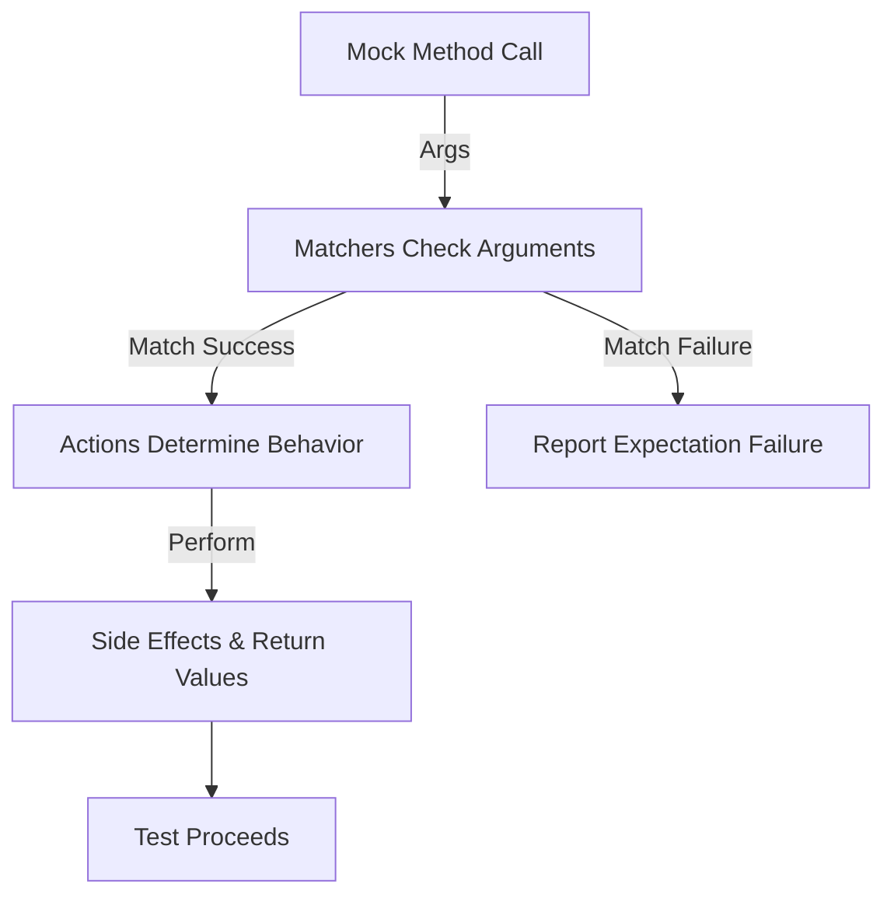

# Matcher and Action Framework

The Matcher and Action Framework within GoogleMock empowers you to expressively verify the arguments passed to mock methods and precisely control what those methods do when invoked. This system provides a rich set of built-in matchers and actions, as well as extensibility points for defining user-specific behaviors, enabling you to write tests with high confidence and maintainability.

---

## Understanding Matchers: Specifying Expected Arguments

When you use mock methods, you often want to specify *what kind* of arguments are expected in particular calls. Matchers enable this by acting like predicates on arguments, verifying if values meet your criteria.

### What Is a Matcher?

A matcher is essentially a function-like object that returns `true` if an argument satisfies certain conditions and `false` otherwise. They stand as more powerful and expressive replacements for simple equality checks.

Examples include:

- `_` : A wildcard matcher that accepts any value.
- `Eq(value)` : Matches if the argument equals the specified value.
- `Ge(n)` : Matches if the argument is greater than or equal to `n`.
- `Pointee(m)` : Matches if a pointer argument's pointed-to value satisfies matcher `m`.

#### Simple Use Case

```cpp
using ::testing::_;
using ::testing::Lt;
EXPECT_CALL(mock_object, Func(Lt(10), _));
```

This expects `Func` to be called with the first argument less than `10`, and any second argument.

### Composing Matchers

Matchers can be combined logically with combinations like `AllOf`, `AnyOf`, and negations `Not` to express complex constraints easily.

```cpp
using ::testing::AllOf;
using ::testing::Gt;
using ::testing::Ne;
EXPECT_CALL(mock, Foo(AllOf(Gt(5), Ne(10))));
```

### Matching Multiple Arguments As a Tuple

The `.With()` clause lets you apply a matcher to all arguments as a tuple — allowing conditions considering multiple parameters jointly.

```cpp
EXPECT_CALL(mock, SetPosition(_, _)).With(Lt());  // Ensures first arg < second arg
```

### Custom Matchers

You can define your own matcher classes or use the `MATCHER` macros for quick, readable definitions. Custom matchers enhance the expressiveness and intent of your tests.

```cpp
MATCHER(IsDivisibleBy7, "") { return (arg % 7) == 0; }
EXPECT_CALL(mock, Bar(IsDivisibleBy7()));
```

For advanced scenarios, polymorphic matchers allow matching multiple types flexibly.

### Matchers in Practice

Match results and expectation failures are accompanied by human-readable descriptions generated by matchers — providing clear guidance on what failed and why.


---

## Exploring Actions: Defining Mock Method Behavior

While matchers decide *which* calls match expectations, *actions* specify *what* a mock method does when called.

### Built-in Actions

GoogleMock ships with many built-in actions for common behaviors:

| Action                      | Description                                            |
|-----------------------------|--------------------------------------------------------|
| `Return(value)`             | Returns the given value. Conversion to return type happens when the action is set, not when called. |
| `ReturnRef(variable)`       | Returns a reference to an existing variable.
| `ReturnNull()`              | Returns a null pointer.
| `DoDefault()`               | Uses the default action set by `ON_CALL()` or built-in for the return type.
| `SetArgPointee<N>(value)`  | Sets the value pointed to by the N-th argument to `value`.
| `DoAll(a1, a2, ..., an)`   | Performs all specified actions sequentially, returning the last action’s result.
| `Invoke(f)`                | Invokes a callable `f` with the mock function arguments.

### Example: Returning and Setting Output Parameters

```cpp
EXPECT_CALL(mock, Mutate(true, _))
    .WillOnce(DoAll(SetArgPointee<1>(5), Return(true)));
```

This assigns `5` to the second parameter’s pointee and returns `true`.

### Using Lambdas and Functors as Actions

You can specify custom behaviors inline using lambdas or functors which are callable objects.

```cpp
EXPECT_CALL(mock, Compute(_))
    .WillOnce([](int x) { return x * 2; });
```

This doubles the input argument.

### Controlling Calls with `WillOnce` and `WillRepeatedly`

- `WillOnce(action)`: Specifies the action for *one* occurrence of the call.
- `WillRepeatedly(action)`: Specifies the action for all *subsequent* calls.

Example:

```cpp
EXPECT_CALL(mock, GetValue())
    .WillOnce(Return(1))
    .WillRepeatedly(Return(2));
```

### Composite Actions

You can combine actions to perform multiple effects per call.

- `DoAll(a1, a2, ..., an)`: Executes all actions in order; only the last action’s return value is used.
- `IgnoreResult(a)`: Performs action `a` but discards its return value, useful when you need a `void` action.
- `WithArg<N>(a)`: Passes the N-th argument to inner action `a`.
- `WithArgs<N1, N2, ...>(a)`: Passes selected arguments.
- `WithoutArgs(a)`: Executes action `a` without passing any arguments.

### Actions Returning Move-Only Types

GoogleMock supports move-only return types (like `std::unique_ptr`) with `WillOnce` but not `WillRepeatedly`. For example:

```cpp
EXPECT_CALL(mock, MakeBuzz())
    .WillOnce(Return(std::make_unique<Buzz>()));
```

### Defining User Custom Actions

For specialized behavior beyond built-ins or lambdas, implement the `ActionInterface<F>` interface where `F` is the mock function signature. Alternatively, use existing utilities like `MakePolymorphicAction()` for polymorphic actions.

### Legacy Macro-based Actions

The `ACTION` family of macros allows defining custom actions easily at namespace scope with a syntax like:

```cpp
ACTION(IncrementArg1) { return ++(*arg1); }
EXPECT_CALL(mock, Foo).WillOnce(IncrementArg1());
```

Macros also exist for parameterized actions: `ACTION_P`, `ACTION_P2`, etc., up to 10 parameters.

---

## Essential Supporting Concepts

### Default Values for Return Types

GoogleMock uses default return values for mock methods without explicitly specified return actions, including:

- 0 for numeric types
- `nullptr` for pointers
- `false` for bool
- Default constructed objects when available

You can override these per type with `DefaultValue<T>::Set()` or `SetFactory()` if needed.

### Exception Handling in Actions

If exceptions are enabled, GoogleMock allows actions that can throw exceptions using `Throw(exception)` and `Rethrow(exception_ptr)` actions.

### Managing Lifetimes and Copies of Actions

Actions are lightweight, copyable objects internally managing shared ownership of their state. Care should be taken when sharing actions with internal state to avoid unexpected side effects.

### Filtering Arguments Using Actions Adapters

Actions like `WithArg<N>`, `WithArgs<N1, N2, ...>`, and `WithoutArgs()` help adapt actions to different argument expectations by selecting or ignoring arguments passed on to the inner action.

---

## Practical Tips & Best Practices

- **Use built-in actions where possible** for readability and simplicity.
- **Compose actions with `DoAll` and argument selectors** to combine side effects and returns cleanly.
- **Use `ReturnRef()` carefully** to avoid dangling references; prefer `ReturnRefOfCopy()` if longevity is needed.
- **Be cautious with move-only types**: use `WillOnce` and avoid sharing move-only actions.
- **Define custom actions for complex behaviors** using the interfaces or macros as appropriate.
- **Use `IgnoreResult()` to discard the return value** when chaining actions that expect void return.
- `DoDefault()` should never be used inside composite actions; trying so results in runtime errors.

---

## Summary

The matcher and action system forms the expressive core of GoogleMock, allowing you to verify expected arguments precisely and define specific behaviors upon method calls. With rich built-in matchers and actions, plus easy extensibility, it equips you to write maintainable, clear, and robust tests.

For advanced usage, explore defining custom polymorphic matchers and actions, leveraging the provided interfaces and macros.

---

## References and Further Reading

- [Actions Reference](../docs/reference/actions.md) for detailed built-in actions.
- [Mocking Reference](../docs/reference/mocking.md) outlining the whole mocking API.
- [gMock Cookbook: Advanced Mocking](../guides/mocking-best-practices/advanced-mocking-actions.mdx) covers custom actions and advanced techniques.
- [Matchers](../api-reference/core-apis/matchers.mdx) for comprehensive matcher details.

---

## Visual Guide: How Matchers and Actions Work Together



This flow illustrates that on each mock call, arguments are checked against matchers first. If all matchers pass, the defined action is performed, producing side effects or return values as specified. If not, test failure diagnostics are generated.

---

## Practical Usage Example

```cpp
using ::testing::_;
using ::testing::Return;
using ::testing::SetArgPointee;
using ::testing::DoAll;

class MockCalculator {
 public:
  MOCK_METHOD(bool, Compute, (int input, int* output), ());
};

TEST(CalcTest, ComputeSetsOutputAndReturnsTrue) {
  MockCalculator mock;
  EXPECT_CALL(mock, Compute(5, _))
      .WillOnce(DoAll(SetArgPointee<1>(10), Return(true)));

  int output = 0;
  bool result = mock.Compute(5, &output);

  EXPECT_TRUE(result);
  EXPECT_EQ(10, output);
}
```

In this test, the action combined with `DoAll` first sets the integer pointed to by the second argument to `10`, then returns `true`. This shows a common pattern of verifying side effects alongside return values.

---

<Tip>
Remember that matchers are pure predicates without side effects—they won't cause your mock objects to change state. Use actions to model behaviors and side effects.
</Tip>

<Warning>
Using `DoDefault()` within a composite action will cause a runtime error—avoid using it except alone.
</Warning>

<Note>
Actions are evaluated once during `EXPECT_CALL()` setup, so any side effects in action constructors occur once; the action itself is repeated as many times as called.
</Note>
