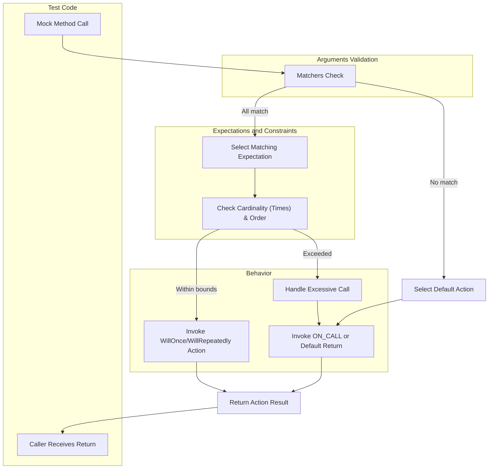

# Matchers, Actions, and Expectations

GoogleMock’s power comes from three core abstractions that enable precise and expressive verification of program behavior in tests: **Matchers**, **Actions**, and **Expectations**. Together, they form the foundation that lets users specify what arguments a mock method should expect, what it should do when called, and how many times and in what order it should be called.

---

## 1. Matchers

### What Are Matchers?
Matchers define the criteria for matching function arguments passed to mock methods. They act like predicates that determine whether the actual arguments of a function call meet the user-defined requirements.

### How Matchers Work
When a mock method is called, GoogleMock checks each argument against the corresponding matcher. To pass the match, all matchers must be satisfied by their respective arguments.

### Using Matchers
- The simplest matcher is the wildcard `_`, which matches any argument.
- Users can specify exact values, e.g., `EXPECT_CALL(mock, Func(5))` means the argument must be equal to `5`.
- Complex matchers can combine criteria using combinators like `AllOf()`, `AnyOf()`, and negation `Not()`.

### Examples:
```cpp
using ::testing::_;
using ::testing::Gt;

EXPECT_CALL(mock_object, Foo(5));            // Argument must be exactly 5.
EXPECT_CALL(mock_object, Bar(Gt(10)));       // Argument must be greater than 10.
EXPECT_CALL(mock_object, Baz(_, _));         // Both arguments can be anything.
EXPECT_CALL(mock_object, Qux(AllOf(Gt(5), Lt(20)))); // Arg is between 6 and 19.
```

### Multi-Argument Matchers
Matchers can operate on all arguments as a tuple, for example with the `.With()` clause which takes a matcher on the entire argument tuple:

```cpp
EXPECT_CALL(mock, Func(_, _))
    .With(Lt());  // Expects first argument < second argument
```

### Best Practices
- Specify only what is essential in matchers to avoid brittle tests.
- Use wildcards where argument values aren’t important to the test.

---

## 2. Actions

### What Are Actions?
Actions define the behavior of mocked functions when called matching the specified expectations. They tell the mock method what to do: return a value, invoke a callback, set an output parameter, throw an exception, etc.

### Default Actions
- If no user-specified action is set, GoogleMock returns a default value:
  - Void functions just return.
  - Functions returning built-in or default-constructible types return zero-equivalent or default-constructed objects.

### Specifying Actions
You specify the actual action to perform with `.WillOnce(action)` or `.WillRepeatedly(action)` clauses on expectations.

### Examples:
```cpp
using ::testing::Return;
using ::testing::Invoke;

EXPECT_CALL(mock, GetValue())
    .WillOnce(Return(42));           // Returns 42 once.

EXPECT_CALL(mock, Compute(_, _))
    .WillRepeatedly(Invoke(&RealFunction)); // Calls real function every time.

EXPECT_CALL(mock, ModifyPtr(_))
    .WillOnce(SetArgPointee<0>(10));  // Sets first pointer argument to 10.
```

### Combining Actions
To perform multiple actions on a call, use `DoAll()`:

```cpp
EXPECT_CALL(mock, Foo(_))
    .WillOnce(DoAll(SetArgPointee<0>(5), Return(true)));
```

### Using Lambdas and Callables
Any callable compatible with the mocked signature can be used as an action, including lambdas and function pointers, providing great flexibility.

### Actions and Move-Only Types
GoogleMock supports using move-only types in actions, especially with `WillOnce()`, allowing realistic mocking scenarios with C++11 features like `std::unique_ptr`.

---

## 3. Expectations

### What Are Expectations?
Expectations express the user’s intent about how mock methods should be called — how many times, in what order, and with what arguments.

### Setting Expectations
Use the `EXPECT_CALL(object, method(matchers))` macro to set expectations before exercising code under test.

### Chaining Clauses
Expectations support rich, chainable clauses to refine behavior:

```cpp
EXPECT_CALL(mock, Func(matchers...))
    .With(tuple_matcher)        // Optional, at most one
    .Times(cardinality)         // Optional, inferred if omitted
    .InSequence(sequences...)   // Optional, any number
    .After(expectations...)     // Optional, any number
    .WillOnce(action)           // Optional, any number
    .WillRepeatedly(action)     // Optional, at most one
    .RetiresOnSaturation();     // Optional, at most one, last clause
```

### Cardinalities
Control how many calls are expected:
- `Times(Exactly(n))` – exactly n calls
- `Times(AtLeast(n))` – at least n calls
- `Times(AnyNumber())` – zero or more calls
- Default is usually one call unless actions imply otherwise.

### Call Order Expectations
- `.InSequence(s1, s2, ...)` places the expectation in one or more sequences enforcing ordering.
- `.After(e1, e2, ...)` requires all specified expectations to be satisfied before this one is matched.

### Retiring Expectations
Use `.RetiresOnSaturation()` to make an expectation inactive after its upper call limit is reached, allowing other expectations to match subsequently.

### Examples:
```cpp
using ::testing::_;  
using ::testing::AtLeast;
using ::testing::Sequence;

Sequence s1, s2;

EXPECT_CALL(mock, Foo(5))
    .Times(AtLeast(1))
    .InSequence(s1);

EXPECT_CALL(mock, Bar(_))
    .After(foo_expectation)
    .WillOnce(Return(true));

EXPECT_CALL(mock, Baz(_, _))
    .Times(AnyNumber());
```

### Behavior with Multiple Expectations
GoogleMock chooses the last matching expectation added (newest overrides older). This allows setting default broad expectations and overriding with more specific rules as tests declare more expectations.

### Verifying Expectations
Expectations are automatically verified when the mock object is destructed. Additionally, `Mock::VerifyAndClearExpectations()` can be called manually to verify early.

### Best Practices
- Set expectations before the code using mocks runs.
- Avoid setting expectations after exercising the mock to prevent undefined behavior.
- Use `.Times(0)` to explicitly forbid calls.
- Use `NiceMock`, `NaggyMock`, or `StrictMock` wrappers to control behavior on uninteresting calls.

---

## 4. User Workflow Overview

1. **Define Mock Methods:**
   Use `MOCK_METHOD` to declare mock methods on your mock class.

2. **Set Default Behavior:**
   Use `ON_CALL(mock, Method(matchers))` with `.WillByDefault(action)` to set behavior when the method is called but has no strict expectation.

3. **Set Expectations:**
   Use `EXPECT_CALL(mock, Method(matchers))` with chaining clauses to define what calls the test expects.

4. **Exercise Test Code:**
   Run the code under test, which interacts with the mocks.

5. **Verify and Tear Down:**
   When mocks go out of scope, expectations are verified automatically or call `Mock::VerifyAndClearExpectations()` manually.

---

## 5. Troubleshooting and Common Pitfalls

- **Uninteresting Calls:** Occur when a mock method is called without any matching `EXPECT_CALL`; use `NiceMock` or explicit catch-all expectations to avoid unwanted warnings.
- **Unexpected Calls:** Calls to mock methods that don't match any expectation cause failures.
- **Order Violations:** If using sequences or `.After()`, calls out of order cause errors.
- **Missed Expectations:** Tests fail if expected calls do not occur as specified.
- **Sticky Expectations:** Expectations remain active even if saturated unless `.RetiresOnSaturation()` is used, so multiple calls may cause failures if not handled.

Always define expectations before exercising the mock, and use the verbose logging flag (`--gmock_verbose=info`) to diagnose matching and call order issues.

---

## 6. Additional Resources

- **Matchers Reference:** Deep-dive into matchers and their usage.
- **Actions Reference:** Detailed guide on defining and using actions.
- **Cardinalities Reference:** Definitive reference on call count expectations.
- **gMock Cookbook:** Step-by-step recipes for practical use cases.
- **Mocking Reference:** Detailed API documentation.

---

## 7. Diagram: Interaction of Matchers, Actions, and Expectations



---