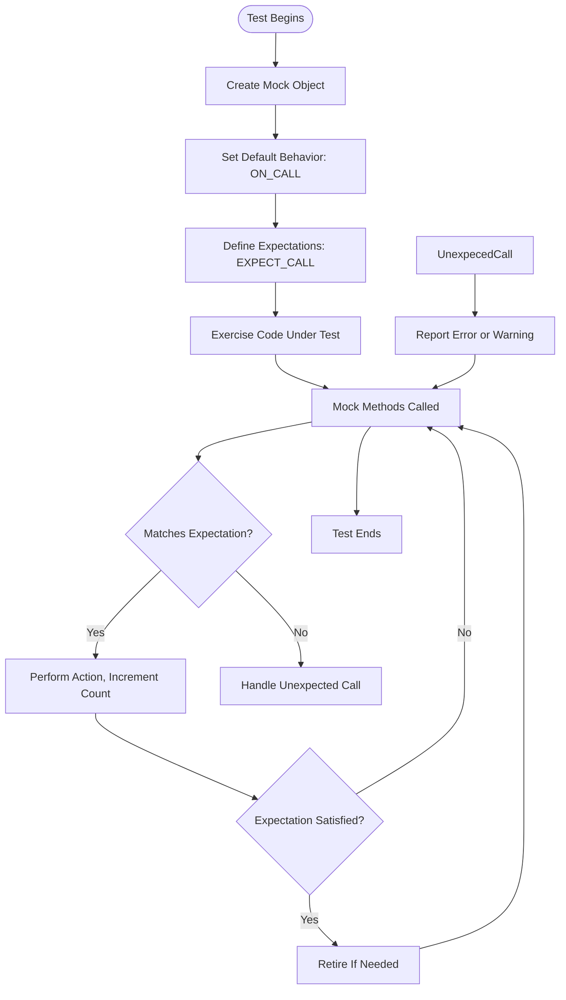

# Mocking Model & Behavior Specification

Understand the core concepts that govern mocking behavior in GoogleMock, including how mock classes are defined, how expectations are set and sequenced, and how call verification ensures that tests accurately simulate and validate interactions with dependencies.

---

## Introduction to Mocking

Mocking is the process of creating objects that simulate the behavior of real dependencies in your C++ tests. GoogleMock facilitates this by allowing you to define mock classes whose methods can be programmed with expectations on how they are called during tests. This model lets you verify interactions precisely and control return values or side effects.

### What is a Mock Object?

A **mock object**:
- Implements the interface of a real object.
- Records method calls and arguments.
- Verifies if expected calls occur in the correct order and frequency.
- Specifies actions (such as return values or side effects) for method calls.

By coding to interfaces and using mocks, you isolate the unit under test, enabling fast, reliable, and maintainable tests.

---

## Defining Mock Classes and Mock Methods

GoogleMock uses the `MOCK_METHOD` macro to define mocked methods inside mock classes. Each mocked method corresponds to a virtual method in the original interface.

### Using `MOCK_METHOD`

```cpp
class MockFoo : public Foo {
 public:
  MOCK_METHOD(int, GetSize, (), (const, override));
  MOCK_METHOD(std::string, Describe, (int type), (override));
};
```

- The macro takes the return type, method name, argument types (inside parentheses), and optional qualifiers like `const` and `override`.
- You must define mock methods in the `public` section, regardless of the base method's visibility.
- For methods with arguments containing commas, wrap argument types in additional parentheses or use type aliases to avoid parsing errors.

### Mocking Overloaded Methods

Overloads are mocked by defining all variants explicitly with appropriate qualifiers:

```cpp
MOCK_METHOD(int, Add, (int x), (override));
MOCK_METHOD(int, Add, (int times, int x), (override));
```

To prevent hiding base class methods, use `using` statements when not mocking all overloads.

---

## Setting Expectations with `EXPECT_CALL`

Expectations define which calls you expect your mock objects to receive during a test. They specify the method, expected arguments, how many times it will be called, call order, and behaviors.

### Basic Syntax

```cpp
EXPECT_CALL(mock_object, MethodName(matchers...))
    .Times(cardinality)
    .InSequence(sequences...)
    .After(expectations...)
    .WillOnce(action)
    .WillRepeatedly(action)
    .RetiresOnSaturation();
```

- `mock_object` is the instance of your mock class.
- `MethodName` is the mocked method.
- `matchers` specify argument expectations, e.g., literals or matchers like `_` (wildcard).

### Matchers

Matchers like `_` match any argument:

```cpp
EXPECT_CALL(mock, Foo(_, 42));
```

You can use built-in matchers (e.g., `Eq()`, `Ge()`, `NotNull()`) or compose custom matchers.

### Cardinalities (`Times` Clause)

Express how many times a call is expected:

| Cardinality        | Meaning                                 |
|--------------------|-----------------------------------------|
| `Exactly(n)` or `n`| Exactly n times; `0` means never called |
| `AtLeast(n)`       | At least n times                        |
| `AtMost(n)`        | At most n times                         |
| `Between(m, n)`    | Between m and n times inclusive        |
| `AnyNumber()`      | Any number of calls allowed             |

If omitted, GoogleMock infers cardinality based on `WillOnce` and `WillRepeatedly` clauses.

### Actions (`WillOnce` and `WillRepeatedly`)

Specify return values or side effects when the mock method is invoked:

```cpp
EXPECT_CALL(mock, GetValue())
    .WillOnce(Return(10))
    .WillRepeatedly(Return(20));
```

- `WillOnce(action)` specifies behavior for one call; can be chained.
- `WillRepeatedly(action)` specifies behavior after all `WillOnce`s.

### Ordering Calls

Use `InSequence` or `After` to specify call order:

- `InSequence` enforces calls happen sequentially in the order defined.
- `After` allows partial ordering, specifying dependencies between expectations.

```cpp
Sequence s1, s2;
EXPECT_CALL(mock, Init()).InSequence(s1);
EXPECT_CALL(mock, Run()).After(init_expectation);
```

---

## Setting Default Behaviors with `ON_CALL`

`ON_CALL` defines default behaviors for mock methods when no specific expectation is set:

```cpp
ON_CALL(mock_object, MethodName(matchers...))
    .With(multi_argument_matcher) // optional
    .WillByDefault(action);
```

- These do **not** set expectations that the method will be called.
- The `.With()` clause filters calls based on combined argument tuples.
- Default actions provide fallback behavior enabling tests to run smoothly without errors on uninteresting calls.

---

## Mock Strictness Controls

You control how uninteresting calls (calls with no matching `EXPECT_CALL`) are treated:

| Mock Type        | Behavior on uninteresting calls                   |
|------------------|--------------------------------------------------|
| `NiceMock<T>`    | Silences warnings on uninteresting calls         |
| `NaggyMock<T>`   | Prints warnings on uninteresting calls (default) |
| `StrictMock<T>`  | Treats uninteresting calls as test failures      |

Example:

```cpp
NiceMock<MockFoo> nice_mock;
StrictMock<MockFoo> strict_mock;
```

Use strict mocks sparingly, as they can make tests brittle.

---

## Expectation Lifecycle and Verification

- Expectations are active and matched until satisfied according to their cardinality.
- Calls exceeding the expected number produce failures.
- Sticky expectations remain active after saturation unless `RetiresOnSaturation()` is used.
- GoogleMock automatically verifies all expectations when mock objects are destroyed.
- You can invoke `Mock::VerifyAndClearExpectations(&mock_object)` manually if needed.

---

## Practical Example

```cpp
class MockFoo {
 public:
  MOCK_METHOD(int, Bar, (int x), (override));
};

TEST(FooTest, Example) {
  MockFoo mock;

  // Default behavior: returns 0.
  ON_CALL(mock, Bar(_)).WillByDefault(Return(0));

  // Expect Bar(5) to be called exactly once, returning 10.
  EXPECT_CALL(mock, Bar(5)).WillOnce(Return(10));

  // Allow any number of calls to Bar with any other argument.
  EXPECT_CALL(mock, Bar(_)).Times(AnyNumber());

  EXPECT_EQ(10, mock.Bar(5));  // Matches the specific expectation.
  EXPECT_EQ(0, mock.Bar(3));  // Uses default action.
}
```

---

## Best Practices

- **Use `ON_CALL` to set default behaviors** shared for many tests.
- **Use `EXPECT_CALL` to specify what calls a test validates.**
- **Avoid over-specifying** matching arguments; use matchers like `_` where appropriate.
- **Use sequences (`InSequence`) only when order matters.**
- **Use `RetiresOnSaturation()` to disable sticky expectations.**
- **Use `NiceMock` by default, reserving `StrictMock` for critical precise interaction tests.**
- **Avoid mocking classes you do not own.** Instead, mock interfaces or abstractions.

---

## Troubleshooting

- If you see warnings about uninteresting calls, consider adding appropriate `EXPECT_CALL` or using `NiceMock`.
- If your test unexpectedly fails due to call count, verify `Times` clauses and check for unexpected calls.
- Use the `--gmock_verbose=info` flag to trace calls and how they match expectations.
- Ensure mocked methods are **virtual** for proper interception.
- If mocking overloaded methods, specify full argument matcher lists to avoid ambiguity.

---

## Additional Concepts

### Delegation Patterns

Mocks can delegate behavior to real objects (delegating-to-real), fakes, or parent classes to combine behavior and verification flexibility.

### Move-Only Types

GoogleMock supports mocking methods accepting or returning move-only types (e.g. `std::unique_ptr`) with `MOCK_METHOD` and lambdas.

### Custom Actions and Matchers

Define behaviors beyond built-in actions and matchers by creating custom matchers or functors explaining their matching logic and failure messages.

---

## Visual Overview



---

## References

- [GoogleMock `MOCK_METHOD` Macro](https://github.com/google/googletest/blob/main/docs/reference/mocking.md#mock_method)
- [gMock for Dummies](https://google.github.io/googletest/gmock_for_dummies.html)
- [gMock Cookbook](https://google.github.io/googletest/gmock_cook_book.html)
- [Matchers Reference](https://google.github.io/googletest/reference/matchers.html)
- [Actions Reference](https://google.github.io/googletest/reference/actions.html)
- [Mock Strictness Controls](https://github.com/google/googletest/blob/main/docs/reference/mocking.md#nice-strict-naggy)

---

For further mastery, explore detailed guides on:

- Using sequences and partial ordering with `Sequence` and `.After()`
- Creating custom matchers for complex argument validation
- Advanced actions including side effects and delegation patterns
- Mocking methods with move-only arguments

---