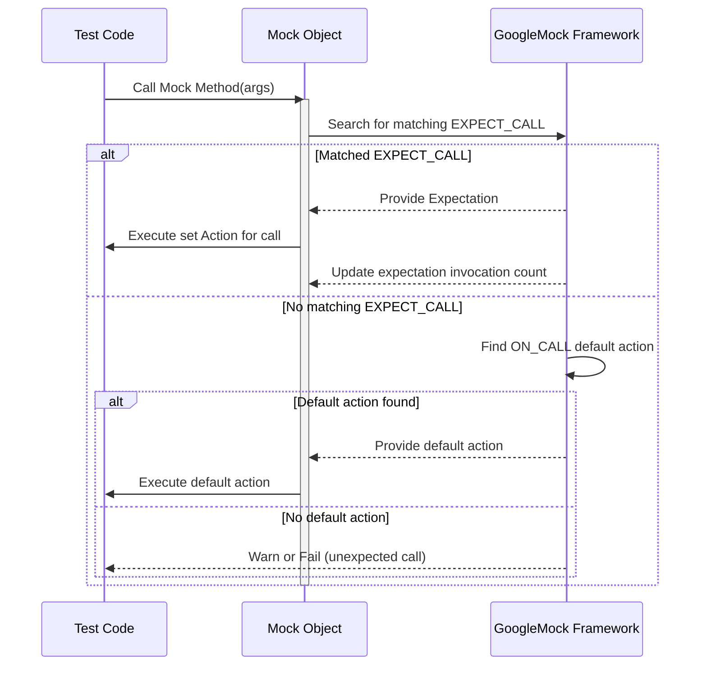

# Mocking Framework Architecture

This guide explores the foundational concepts behind GoogleMock's architecture, focusing on the mechanisms through which it models, verifies, and executes mock objects, expectations, and actions. You will gain a comprehensive understanding of how the key constructs like `MOCK_METHOD`, `EXPECT_CALL`, and `ON_CALL` interplay to deliver powerful mocking behavior in C++ tests.

---

## Introduction to Mocking in GoogleMock

GoogleMock (gMock) empowers you to create mock classes and objects effortlessly that simulate the behavior of real classes for testing purposes. Rather than relying on concrete implementations, mocks let you predefine expected interactions (calls), argument patterns, return behaviors, and invocation sequence constraints.

At its core, the mocking framework represents interactions using three primary components:

- **Mock Objects:** Instantiated mocks generated via macros such as `MOCK_METHOD` within mock classes.
- **Expectations:** Defined by `EXPECT_CALL`, specifying how a mock method is expected to be invoked, with what arguments, and how many times.
- **Actions & Default Actions:** Defined by `EXPECT_CALL` (for expectations) or `ON_CALL` (for default behaviors), specifying what the mock method does when called.

Understanding how these components relate and function is essential for mastering gMock.

---

## Mock Objects and Mock Methods

### Defining Mock Methods

The `MOCK_METHOD` macro is the starting point for modeling mock behavior. It syntactically mirrors method declarations in your real interface or base class and auto-generates the mock method implementation to:

- Capture method calls.
- Validate call arguments against expectations.
- Invoke designated actions or default behaviors.

The macro syntax is:

```cpp
MOCK_METHOD(ReturnType, MethodName, (Args...), (Qualifiers));
```

**Key points:**

- Mock methods must be declared in the `public:` section of the mock class for accessibility by `EXPECT_CALL` and `ON_CALL`.
- The optional qualifiers parameter supports `const`, `override`, `noexcept`, reference qualifiers, and custom calling conventions.
- For complex argument or return types containing commas, parentheses or aliases must protect them to avoid macro parsing issues.

Example:

```cpp
class MockTurtle : public Turtle {
 public:
  MOCK_METHOD(void, PenUp, (), (override));
  MOCK_METHOD(int, GetX, (), (const, override));
};
```

### Mock Objects

A mock object is an instance of a mock class containing mock methods. When a mock method is called on this object during a test, GoogleMock records the call, attempts to match it to expectations, and executes corresponding actions.

### Strictness Wrappers

Mock objects can be enhanced with wrappers `NiceMock<T>`, `NaggyMock<T>`, and `StrictMock<T>` that control how uninteresting calls (calls to mock methods without matching expectations) are handled:

- **NaggyMock:** Default behavior — warns on uninteresting calls.
- **NiceMock:** Suppresses warnings about uninteresting calls.
- **StrictMock:** Treats uninteresting calls as errors causing test failures.

These can be applied transparently to any mock class:

```cpp
NiceMock<MockTurtle> nice_turtle;
StrictMock<MockTurtle> strict_turtle;
```

---

## Expectations: Specifying What To Expect

### EXPECT_CALL Macro

`EXPECT_CALL` establishes *expectations* on mock methods — defining the scenarios under which a method is expected to be called, how often, with what arguments, and what actions should follow.

Basic syntax:

```cpp
EXPECT_CALL(mock_object, MethodName(matchers...))
    .With(multi_argument_matcher)
    .Times(cardinality)
    .InSequence(sequences...)
    .After(expectations...)
    .WillOnce(action)
    .WillRepeatedly(action)
    .RetiresOnSaturation();
```

#### Argument Matching

- You specify criteria on method arguments using [matchers](reference/matchers.md).
- For example, `_` matches any value; `Eq(x)` matches a value equal to `x`.
- The number and types of matchers must correspond to the method's parameters.
- If omitted for non-overloaded methods, it implies matching any arguments.

#### Expectation Modifiers

- `.With()` — matches all arguments as one tuple against a single matcher, enabling cross-argument conditions (e.g., first argument less than second).
- `.Times()` — sets how many times the call is expected; supports exact, at least, at most, between, or any number.
- `.InSequence()` — places the expectation in one or more sequence objects, enforcing call order.
- `.After()` — specifies prerequisite expectations that must be fulfilled before this one matches.
- `.WillOnce()` and `.WillRepeatedly()` — specify actions to perform for matched calls.
- `.RetiresOnSaturation()` — disables the expectation after it has been fully satisfied, preventing over-matching.

#### Invocation Behavior

- If multiple expectations match a call, the **most recent matching expectation** is used.
- Expectations are “sticky” by default, remaining active even after hitting the upper bound.
- Use `.RetiresOnSaturation()` or sequences to retire expectations automatically.

### Example

```cpp
EXPECT_CALL(turtle, GetX())
    .Times(3)
    .WillOnce(Return(10))
    .WillOnce(Return(20))
    .WillRepeatedly(Return(30));
```

This expects `GetX()` to be called three times; it returns 10 on the first call, 20 on the second, and 30 on all subsequent calls.

### Handling Unexpected and Excessive Calls

If a call does not match any expectation or exceeds the stipulated `Times`, gMock considers it:

- **Unexpected Call:** An error occurs if arguments don't match any expectation.
- **Excessive Call:** An error is raised if calls exceed the expected number.

By default:

- Unexpected calls cause test failure.
- Excessive calls cause failure unless a default action is specified by `ON_CALL`.

---

## Default Actions: Defining Behavior When Calls Occur

### ON_CALL Macro

`ON_CALL` sets default behavior for mock methods without establishing expectations that they must be called. This allows your tests to specify fallback actions while flexibly controlling which calls are required.

Syntax:

```cpp
ON_CALL(mock_object, MethodName(matchers...))
    .With(multi_argument_matcher)
    .WillByDefault(action);
```

- The `.WillByDefault()` clause is required.
- `.With()` is optional but can only appear once per ON_CALL.
- Default actions serve as backstops for calls that don't match any `EXPECT_CALL`.

Example:

```cpp
ON_CALL(turtle, GoTo(_, _))
    .WillByDefault(Return(true));
```

### Interaction Between EXPECT_CALL and ON_CALL

- Actions defined in `EXPECT_CALL` take precedence over those defined in `ON_CALL`.
- If no matching `EXPECT_CALL` is found for a call, attached `ON_CALL` default action runs.

### Specifying Return Values and Side Effects

Both `EXPECT_CALL` and `ON_CALL` can specify complex actions:

- Returning values (`Return`, `ReturnRef`, `ReturnPointee`).
- Invoking callbacks or custom functions.
- Combining multiple actions via `DoAll()`.

---

## Call Sequencing and Ordering

Order of mock calls can be critical to test correctness, especially when simulating workflows.

GoogleMock provides two main mechanisms:

### 1. `InSequence` Scope

Encapsulating expectations within an `InSequence` object groups them into an anonymous sequence where calls must occur strictly in declaration order.

Example:

```cpp
{
  InSequence seq;
  EXPECT_CALL(mock, First());
  EXPECT_CALL(mock, Second());
}
```

`First()` must be called before `Second()`.

### 2. Using `Sequence` Objects

Explicit `Sequence` objects allow finer control and partly ordered call graphs by associating expectations with one or more sequences.

Example:

```cpp
Sequence s1, s2;
EXPECT_CALL(mock, A()).InSequence(s1, s2);
EXPECT_CALL(mock, B()).InSequence(s1);
EXPECT_CALL(mock, C()).InSequence(s2);
```

Call graph enforced:

```
A --> B
|
+--> C
```

You can also control dependencies using `.After()` clause to specify expectations that must precede.

---

## Expectation Life Cycle

### Activation and Saturation

- Expectations start as *active*.
- Calls matching an expectation count against its cardinality.
- An expectation saturates when it reaches its upper bound.
- Saturated expectations remain *active* by default (sticky), so further matching calls cause failure unless `.RetiresOnSaturation()` is used.

### Retirement

- `.RetiresOnSaturation()` makes an expectation inactive when saturated.
- Expectations in sequences retire automatically when subsequent expectations execute.

### Verifying Expectations

- GoogleMock verifies that all expectations are met upon mock object destruction.
- You can also manually verify and clear expectations using:

```cpp
Mock::VerifyAndClearExpectations(&mock_obj);
Mock::VerifyAndClear(&mock_obj);  // clears defaults, too
```

- `Mock::AllowLeak()` suppresses verification for deliberately leaked mocks.

---

## Troubleshooting and Best Practices

### Setting Expectations Before Calls

Always set expectations (`EXPECT_CALL`) before invoking the mock methods. Calling them first causes undefined behavior and unreliable test results.

### Managing Uninteresting Calls

If you want to ignore calls that you don't care about:

- Use `NiceMock` to suppress warnings.
- Or set a catch-all expectation with `.Times(AnyNumber())`.

Avoid adding `EXPECT_CALL` unnecessarily just to silence warnings.

### Precise Argument Matching

Avoid over-specifying expectations. Match only the necessary arguments using appropriate matchers like `_`, `Eq()`, or custom predicates.

### Using `ON_CALL` for Default Behavior

Use `ON_CALL` to define common responses for mock methods, reducing repetitive `.WillRepeatedly()` declarations in multiple tests.

### Handling Overloaded Methods

Use the `Const()` wrapper or explicit matcher casts to disambiguate overloaded method expectations.

### Using Sequences for Ordering

Use `InSequence` or explicit `Sequence` to control order where strict or partial ordering matters. Avoid unnecessary strict ordering to keep tests resilient.

---

## Diagram: Mocking Interaction Flow



---

## Example Summary: Defining a Mock, Setting Expectations, and Exercising

```cpp
class MockFoo {
 public:
  MOCK_METHOD(int, Bar, (int x, int y), (override));
};

// Test
MockFoo foo;
ON_CALL(foo, Bar(_, _))
    .WillByDefault(Return(0));  // Default return 0
EXPECT_CALL(foo, Bar(10, _))
    .Times(2)
    .WillRepeatedly(Return(42));

// Exercise
int result1 = foo.Bar(10, 5);  // Returns 42 (expected call)
int result2 = foo.Bar(20, 5);  // Returns 0 (default action)
int result3 = foo.Bar(10, 6);  // Returns 42 (expected call)

// Verifies expectations at mock destruction.
```

---

## Additional Resources

- [gMock for Dummies](https://google.github.io/googletest/gmock_for_dummies.html) for beginner-friendly walkthroughs.
- [Mocking Reference](reference/mocking.md) covers macros, classes, and detailed mock usage.
- [gMock Cookbook](gmock_cook_book.md) for advanced recipes including delegation and composition.
- [NiceMock, NaggyMock and StrictMock](reference/mock-behavior-extensions/nice-naggy-strict-mocks.mdx) controls for uninteresting calls.
- [Matchers Reference](reference/matchers.md) to understand argument validation.
- [Actions Reference](reference/actions.md) for specifying mock behavior.

---