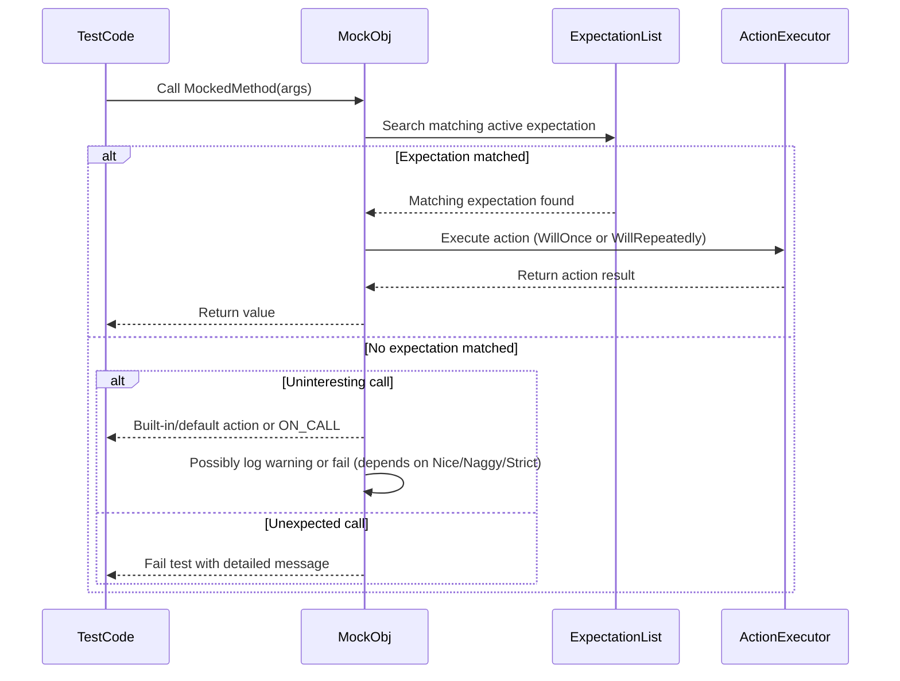

# Mock Object Architecture

Understanding the core architecture of GoogleMock's mocking capabilities is key to leveraging its power for robust, flexible, and maintainable unit testing in C++. This guide walks you through the fundamental concepts, mechanisms, and user-facing components that form GoogleMock's approach to mocking, illustrating how mock classes, expectation builders, and matchers collaborate to create effective test doubles.

---

## Mock Classes: The Backbone of Mocking

At the heart of mocking in GoogleMock are **mock classes**—user-defined C++ classes that simulate the behavior of real components. These classes contain mocked methods defined using the `MOCK_METHOD` macro, which automatically generates method implementations for you.

### Defining Mock Methods

To mock a method, you write a declaration like:

```cpp
class MockExample {
 public:
  MOCK_METHOD(ReturnType, MethodName, (Args...), (Specs...));
};
```

- `ReturnType` is the method's return type.
- `MethodName` is the mocked method's name.
- `(Args...)` are the method's arguments, wrapped in parentheses.
- `(Specs...)` are optional qualifiers, such as `(const, override)`.

**Important:**
- Methods to be mocked must be virtual in the base class.
- `MOCK_METHOD` declarations must always be in the public section of the mock class, regardless of the access level of the original method. This allows the testing framework to intercept calls appropriately.

### Handling Complex Signatures

If your method types involve commas within template parameters (e.g., `std::pair<int, int>`), wrap the types in an extra pair of parentheses or use a type alias to avoid parsing issues with the macro.

Example:

```cpp
using PairType = std::pair<int, int>;
class MockFoo {
 public:
  MOCK_METHOD((PairType), GetPair, ());
};
```

### Mocking Overloads and Qualifiers

GoogleMock allows mocking of overloaded methods and methods with qualifiers like `const`, `noexcept`, or reference qualifiers. For example:

```cpp
MOCK_METHOD(int, GetValue, (), (const, override));
MOCK_METHOD(bool, Execute, (int), (noexcept, override));
```

If a method is overloaded, use the `Const()` wrapper or explicit matcher casting to disambiguate which overload your expectation applies to.

---

## Setting Expectations: The Core Workflow

Mocking is about specifying how a mock object should behave and verifying that your code interacts with it correctly. GoogleMock achieves this through **expectations**, which are set up using the `EXPECT_CALL` macro.

### Basic Syntax of EXPECT_CALL

```cpp
EXPECT_CALL(mock_object, MethodName(matchers...))
    .Times(cardinality)
    .WillOnce(action)
    .WillRepeatedly(action);
```

- `mock_object`: the instance of your mock.
- `MethodName(matchers...)`: the method and argument matchers defining which calls to match.
- **Modifiers** like `.Times()`, `.WillOnce()`, `.WillRepeatedly()` tune the expectation behavior.

If you omit `.Times()`, GoogleMock infers the number of expected calls based on `.WillOnce()` and `.WillRepeatedly()` clauses.

#### Example:

```cpp
using ::testing::Return;
EXPECT_CALL(turtle, GetX())
    .Times(3)
    .WillOnce(Return(100))
    .WillOnce(Return(150))
    .WillRepeatedly(Return(200));
```
This expectation specifies that `GetX` will be called three times; it returns 100 on the first call, 150 on the second, and 200 thereafter.

### Matchers: Flexible Argument Matching

Matchers allow you to specify constraints on method arguments.

- Use `_` as a wildcard matcher when you don't care about the argument value.
- Use built-in matchers like `Eq()`, `Ge()`, or custom ones.
- Combine matchers to compose complex matching logic.
- Use `.With()` to match multiple arguments as a whole tuple.

Example:

```cpp
EXPECT_CALL(foo, SetPosition(_, _))
    .With(Lt());  // First argument less than second argument
```

### Cardinalities: Controlling Call Count

Cardinalities specify how many times an expectation is valid:

| Cardinality   | Meaning                         |
|---------------|--------------------------------|
| `AnyNumber()` | Any calls allowed               |
| `AtLeast(n)`  | At least n calls expected      |
| `AtMost(n)`   | At most n calls allowed        |
| `Between(m,n)`| Between m and n calls expected |
| `Exactly(n)`  | Exactly n calls expected       |

Use `.Times()` to set cardinalities.

### Ordering: Sequencing Call Expectations

By default, calls can happen in any order. To specify order:

- Use the `InSequence` class to require strict ordering of expectations in its scope.
- Use the `.InSequence(sequence1, sequence2, ...)` clause to specify partial orders.
- Use the `.After()` clause to specify that an expectation should only occur after some other expectations.

Example:

```cpp
{
  InSequence s;
  EXPECT_CALL(mock, FirstCall());
  EXPECT_CALL(mock, SecondCall());
}
```
For partial order:

```cpp
Sequence s1, s2;
EXPECT_CALL(mock, CallA()).InSequence(s1);
EXPECT_CALL(mock, CallB()).InSequence(s1, s2);
EXPECT_CALL(mock, CallC()).InSequence(s2);
```

### Actions: Defining Call Behavior

Expectations can be given actions that define what happens when the mock method is invoked.

- `.WillOnce()` specifies behavior for specific calls.
- `.WillRepeatedly()` specifies behavior for all subsequent calls after the `.WillOnce()` actions are exhausted.
- Actions can return values, set output arguments, invoke callbacks, or do anything callable objects can do.

Example:

```cpp
EXPECT_CALL(mock, GetValue())
    .WillOnce(Return(42))
    .WillRepeatedly(Return(7));
```

---

## Default Behavior: ON_CALL

While `EXPECT_CALL` sets expectations (constraints on when/how often methods must be called), `ON_CALL` sets **default behaviors** for mock methods without asserting that they must be called.

```cpp
ON_CALL(mock_object, MethodName(matchers...))
    .WillByDefault(action);
```

- Default actions defined by `ON_CALL` apply to all matching calls unless overridden by `EXPECT_CALL`.
- Omitting an `ON_CALL` causes gMock to use built-in defaults (e.g., return zero for integers, false for booleans).

Example:

```cpp
ON_CALL(foo, GetName()).WillByDefault(Return("anonymous"));
EXPECT_CALL(foo, GetName("John"));
```

---

## Mock Strictness: Nice, Naggy, and Strict Mocks

GoogleMock provides wrappers to control how uninteresting calls (calls to mock methods without any `EXPECT_CALL`) are handled:

| Wrapper              | Behavior on Uninteresting Calls                                           |
|----------------------|---------------------------------------------------------------------------|
| `NiceMock<T>`        | Suppresses warnings; uninteresting calls silently accepted.              |
| `NaggyMock<T>`       | (Default) Warns on uninteresting calls, but test continues.              |
| `StrictMock<T>`      | Fails the test on uninteresting calls.                                  |

Example:

```cpp
NiceMock<MockFoo> nice_mock;
StrictMock<MockFoo> strict_mock;
```

**Usage Notes:**

- These wrappers inherit constructors, so you can pass constructor arguments like `NiceMock<MockFoo>(arg1, arg2)`.
- Only mock methods declared directly in the mock class (not inherited) are affected by these wrappers.
- Using `StrictMock` helps catch unexpected calls early, but can make tests brittle.

---

## Expectation Lifetime and Verification

GoogleMock automatically verifies that all expectations set by `EXPECT_CALL` have been satisfied when mock objects are destructed. You may also:

- Force early verification with `Mock::VerifyAndClearExpectations(&mock_obj);`
- Allow leaks for a mock object to avoid verification with `Mock::AllowLeak(&mock_obj);`

Failing to meet expectations results in test failures with detailed messages.

---

## Troubleshooting Common Mocking Scenarios

- Always set expectations *before* the code that uses the mock is executed.
- If you encounter unexpected behavior, increase mock verbosity with the `--gmock_verbose=info` flag to see detailed tracing.
- Use `.RetiresOnSaturation()` on expectations which should become inactive after they have been fulfilled, preventing over-saturation errors.
- When dealing with const overloads, use `Const(mock_obj)` to disambiguate.

---

## Visualizing Mock Call Handling Flow



This diagram outlines the flow from a test's mock method call through expectation matching, action execution, and result delivery, including handling of uninteresting and unexpected calls.

---

## Summary

This architecture empowers developers to create mocks that:
- Represent interfaces and classes flexibly.
- Specify behavior and expectations clearly.
- Verify interactions precisely.
- Customize handling of unexpected and uninteresting calls.

The synergy of `MOCK_METHOD`, `EXPECT_CALL`, `ON_CALL`, and strictness wrappers enables writing expressive and maintainable tests that improve code quality.

---

## Further Reading & Related Topics

- [Mocking Reference](reference/mocking.md): The definitive source for macros and classes.
- [gMock Cheat Sheet](guides/gmock_cheat_sheet.md): Quick syntax and usage reference.
- [gMock for Dummies](guides/gmock_for_dummies.md): Beginner-friendly introduction and examples.
- [Actions and Expectations](guides/mocking-with-gmock/actions-and-expectations.mdx): Deep dive on specifying mock behaviors.
- [Strictness and Mock Behavior](api-reference/advanced-mocking-apis/strictness-and-mock-behavior.mdx): Handling uninteresting calls and mock strictness.

---

For practical onboarding, consider starting with "gMock for Dummies" to grasp the user workflow, then progress to detailed references on expectations, actions, and matchers.