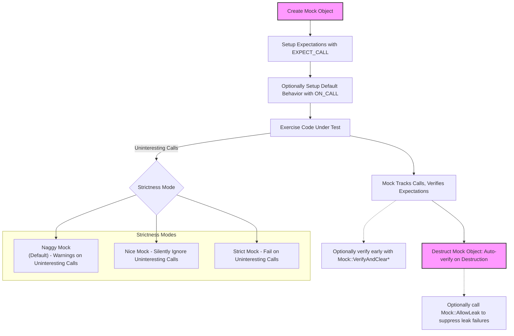

# Mock Object Lifecycle and Behaviors

This page explains the fundamental lifecycle and behavioral aspects of mock objects within the GoogleMock framework. It covers how mock objects are created, how expectations and behaviors are configured, and what happens when tests complete, including cleanup and verification. Additionally, this guide clarifies the strictness modes available in GoogleMock (Nice, Naggy, Strict) and how uninteresting calls are handled in each.

---

## 1. Lifecycle of a Mock Object

The lifecycle of a mock object in GoogleMock is designed to guide users through a clear, user-facing workflow that ensures tests are robust, predictable, and easy to maintain. Understanding this lifecycle helps users write effective tests and avoid common pitfalls.

### Creation

- A mock class is defined by inheriting from an interface and using the `MOCK_METHOD` macro to declare its mocked methods.
- Users instantiate mock objects as needed in their tests, either on the stack or heap.

### Expectation Setup

- Before exercising the code under test, users set expectations on mock object methods using `EXPECT_CALL`.
- Expectations specify:
  - Which methods will be called.
  - How many times (cardinality).
  - With what arguments (via matchers).
  - The behavior when the method is called (via actions).
- Users can also specify default behaviors using `ON_CALL` without implying mandatory expectations.

### Behavior Configuration

- `EXPECT_CALL` and `ON_CALL` together define how the mock will respond to method calls.
- `EXPECT_CALL` defines expectations and corresponding actions.
- `ON_CALL` sets default actions for method calls without expectations.
- If no action is specified, GoogleMock provides sensible default actions based on return types.

### Exercising Code Under Test

- The system under test calls methods on mock objects.
- GoogleMock monitors each call:
  - Verifies it matches an expectation (if one exists).
  - Executes the specified action.
  - Tracks call counts and order if sequences are specified.

### Verification and Cleanup

- On mock object destruction, GoogleMock automatically verifies that all expectations have been satisfied.
- Verification failures are reported immediately as test failures.
- Users can also manually verify and clear expectations earlier with `Mock::VerifyAndClearExpectations()` or `Mock::VerifyAndClear()`.
- To suppress leak reports or skip verification, `Mock::AllowLeak()` can be used.

---

## 2. Strictness Modes of Mock Objects

GoogleMock provides three strictness levels for mock objects, which control how uninteresting calls (calls without matching expectations) are handled. These modes influence the test’s feedback when unanticipated invocations occur.

### Naggy Mock (Default Behavior)

- The default behavior of mock objects.
- **Uninteresting calls** generate warnings but do not fail the test.
- Useful for development and debugging when exploring test behaviors.
- Ensures users are aware of unexpected method calls without breaking the test.

### Nice Mock

- Created using `NiceMock<T>` (where `T` is a mock class).
- Suppresses warnings on uninteresting calls entirely.
- Allows any call to methods without expectations to proceed silently using default actions.
- Encouraged for tests where uninteresting calls are expected and not relevant.

### Strict Mock

- Created using `StrictMock<T>`.
- Treats **all** uninteresting calls as test failures.
- Enforces strict verification that only expected mock methods are called.
- Useful when complete control over the mock's interactions is required.

### Summary Table

| Mode          | Uninteresting Calls | Result                       |
|---------------|---------------------|------------------------------|
| **NaggyMock** (default) | Warning             | Test continues, warning logged |
| **NiceMock**             | Ignored             | No warning, test continues     |
| **StrictMock**           | Failure             | Test fails immediately         |

<Note>
When using strictness wrappers like `NiceMock`, `NaggyMock`, or `StrictMock`, note that they only affect **uninteresting** calls — those without any expectations. They do **not** affect **unexpected** calls (calls with expectations that don’t match arguments or call order), which always fail.
</Note>

<Info>
For best maintainability, favor `NiceMock` in most tests for simplicity, `NaggyMock` when developing or debugging, and use `StrictMock` only when you want to enforce a rigorous interface contract.
</Info>

---

## 3. Handling of Uninteresting Calls

Uninteresting calls are calls to mock methods for which there are **no** matching `EXPECT_CALL` expectations defined.

### Behavior

- Such calls are allowed by default to help the test run and avoid false failures.
- GoogleMock will:
  - Perform the method’s default action (e.g., return 0 for integers, false for bools, default-constructed value if available).
  - Print a warning message in the Naggy mode to alert the user.

### Impact of Strictness Mode

- **In Naggy mode (default):** a warning is printed.
- **In Nice mode:** calls proceed silently (no warnings).
- **In Strict mode:** calls cause test failures immediately.

### Using Default Actions

- Use the `ON_CALL` macro to specify default behavior for uninteresting calls.
- Default actions provide control over what uninteresting calls return or do.

### Example:

```cpp
NiceMock<MockFoo> nice_foo;
ON_CALL(nice_foo, GetValue())
    .WillByDefault(Return(42));

// No EXPECT_CALL on GetValue(), so this call:
int v = nice_foo.GetValue();  // returns 42 silently
```

<Warning>
Avoid suppressing uninteresting call warnings by adding blanket `EXPECT_CALL(...).Times(AnyNumber())` unless you truly want to allow all calls. Overusing expectations can lead to brittle tests.
</Warning>

---

## 4. Common Mock Object Operations

### Allowing Mock Object Leaks

- Call `Mock::AllowLeak(mock_object)` to tell GoogleMock to ignore leaks for this mock.
- Useful when ownership is transferred in tested code and the mock may never be destroyed within test scope.

### Verifying and Resetting Expectations

- To verify that all expectations are met before the mock is destroyed, use:

  ```cpp
  Mock::VerifyAndClearExpectations(&mock_object);  // Verifies and clears expectations
  Mock::VerifyAndClear(&mock_object);              // Verifies, clears expectations and default actions
  ```

- Do **not** set new expectations after calling these functions.

---

## 5. Mock Object Interaction Summary



---

## 6. Best Practices & Tips

- **Set expectations before exercising code.** Setting `EXPECT_CALL` after method invocations causes undefined behavior.
- **Use `ON_CALL` for default behaviors.** It lets your mock respond to calls without enforcing strict expectations.
- **Use strictness wrappers wisely.** Prefer `NiceMock` for general tests, reserve `StrictMock` for critical interface verifications.
- **Avoid over-specifying expectations.** Keep `EXPECT_CALL` usage to actual test interests to prevent brittle tests.
- **Leverage `RetiresOnSaturation()`** when you want expectations to retire after they are saturated, especially for overlapping expectations.

---

## 7. Troubleshooting Common Issues

<AccordionGroup title="Common Mock Object Lifecycle & Behavior Issues">
<Accordion title="Unexpected Uninteresting Call Warnings">
If your test logs many warnings about uninteresting calls unexpectedly, consider:

- Using `NiceMock` wrapper to suppress them if the calls are expected but unimportant.
- Adding explicit catch-all `EXPECT_CALL(mock, Method(_)).Times(AnyNumber());` to silence warnings selectively.
- Revisiting your test design to ensure you are only verifying meaningful method calls.
</Accordion>
<Accordion title="Failure due to Unsatisfied Expectations on Object Destruction">
This occurs when:

- The code under test does not call all expected methods as per your `EXPECT_CALL`s.
- Some expected interactions happen conditionally and your specified cardinalities need adjustment.

Solutions:
- Adjust call count expectations with `Times()`, e.g., `AtLeast()`, `AtMost()`, or `AnyNumber()`.
- Manually verify and clear expectations earlier to catch errors closer to cause.
- Use `InSequence` or `After` clauses if order matters.
</Accordion>
<Accordion title="Mock Object Leak Errors at Program Exit">
If tests report leaked mocks:

- Ensure that mock objects are properly deleted or their lifetimes managed.
- Use `Mock::AllowLeak()` if the leak is intentional or unavoidable.
- Check test teardown to ensure all mocks are destructed.
</Accordion>
</AccordionGroup>