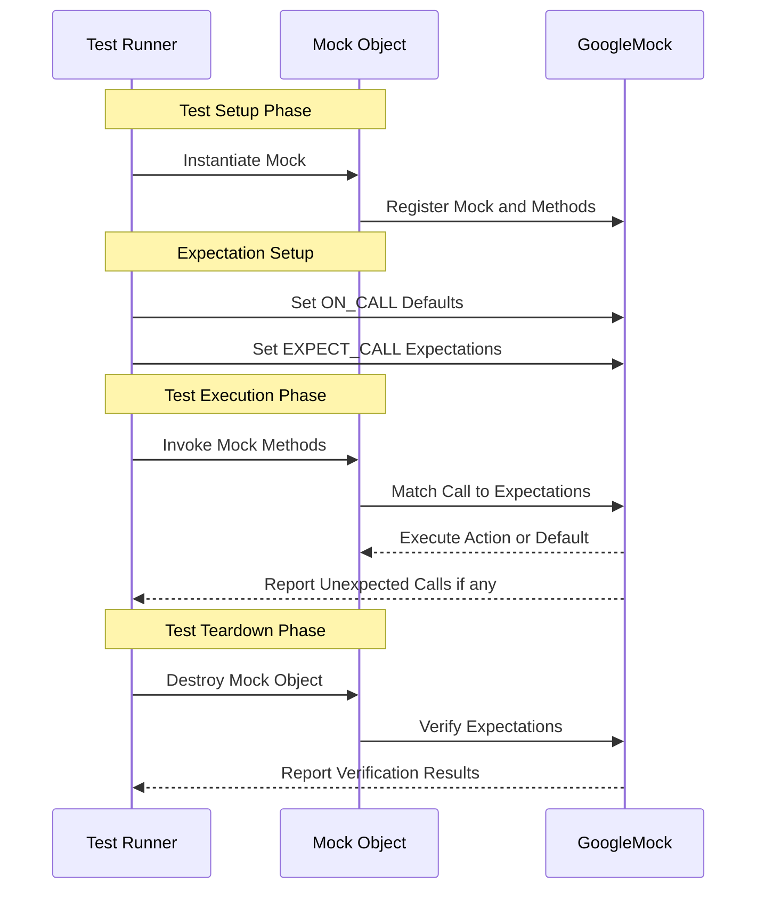

# Mock Object Lifecycle

Delve into the lifecycle of mock objects in GoogleMock, focusing on how they are constructed, configured, executed, and torn down. This guide explains the mechanics behind setting up default actions, expectations, call tracking during test execution, and the cleanup process. Understanding this lifecycle empowers you to write effective tests and troubleshoot common mock-related issues.

---

## Overview of Mock Object Construction

When you create a mock object in GoogleMock, the underlying system initializes data structures necessary to track method calls, expectations, and default behaviors.

### Key Steps:

1. **Mock Class Instantiation**: Your mock class—defined using the `MOCK_METHOD` macros—creates mock methods which are wired to internal registries managing expectations and call counts.

2. **Registration with Framework**: Each mock method registers itself and the owning mock object with GoogleMock’s global registry. This enables centralized verification and leak detection.

3. **Default Behavior Setup**: If you use wrappers like `NiceMock`, `NaggyMock`, or `StrictMock`, these configure the mock’s response to uninteresting (unexpected) calls, setting the strictness level.

<Info>
While mock objects are typically naggy by default (warning on uninteresting calls), you can use `NiceMock` to silence these warnings or `StrictMock` to treat them as errors.
</Info>

---

## Setting Expectations and Default Actions

Before exercising the code under test, you configure how your mock behaves:

### Expectations with `EXPECT_CALL`

- Define **expected calls**, including the number of invocations (`Times()`), the arguments they should receive (via matchers), and their behaviors (`WillOnce()`, `WillRepeatedly()`).
- Expectations are **sticky** by default; they remain active even after reaching the specified call count unless instructed otherwise (e.g., with `RetiresOnSaturation()`).
- The order of expectations determines precedence — later expectations override earlier ones.

### Default Behavior with `ON_CALL`

- Specify what the mock should do when its methods are called without matching an explicit expectation.
- `ON_CALL` statements establish default actions that apply broadly and don’t impose call count constraints.

### Interaction Between `EXPECT_CALL` and `ON_CALL`

- `EXPECT_CALL` has precedence over `ON_CALL` for matching calls.
- Use `ON_CALL` to reduce test brittleness by specifying default behaviors and reserve `EXPECT_CALL` for calls you explicitly want to verify.

<Note>
Setting expectations via `EXPECT_CALL` must happen *before* the mock’s methods are called. Violating this leads to undefined behavior.
</Note>

---

## Call Tracking During Test Execution

GoogleMock internally tracks each call to mocked methods, determining if the call:

- Matches any existing **expectations** (checking arguments and call count constraints).
- Matches any **default actions** defined by `ON_CALL` if no expectation matches.
- Falls under **uninteresting or unexpected calls**, triggering warnings or failures depending on mock strictness.

### Handling Calls:

1. **Matching Order**: GoogleMock searches expectations **in reverse order** of their declaration, enabling last-declared matching rules to override earlier ones.

2. **Order Enforcement**: Using `InSequence` or `After` clauses restricts the order of calls and affects when expectations become active or retire.

3. **Call Outcomes**:
   - If the call matches an active expectation and is within cardinality limits, the associated action executes.
   - If the call is unexpected or violates cardinality, GoogleMock reports a failure.
   - Uninteresting calls trigger log messages or failures based on strictness mode.

<Tip>
Always structure your expectations from general to specific, placing more specific rules after generic ones for correct matching precedence.
</Tip>

---

## Default Actions and Built-in Return Values

- Mock methods returning `void`, `bool`, numeric types, or pointers have built-in default actions returning `void`, `false`, `0`, or `nullptr` respectively if no action is specified.
- In C++11 and higher, mock methods with default-constructible return types return a default-constructed value by default.
- You can customize these default return values globally for a type with `DefaultValue<T>::Set()` or for individual methods with `ON_CALL`.

Example:
```cpp
DefaultValue<std::unique_ptr<Buzz>>::SetFactory(
    [] { return std::make_unique<Buzz>(AccessLevel::kInternal); });
``` 

---

## Call Recording and Verification

- Every call to a mock method increments the call count within the matching expectation.
- Upon mock object destruction, GoogleMock automatically verifies that all expectations were met (all required calls were made and not exceeded).
- You can manually verify expectations earlier with `Mock::VerifyAndClearExpectations(&mock_obj);`.

<Warning>
Do not set new expectations after verifying or clearing a mock’s expectations. This causes undefined behavior.
</Warning>

---

## Teardown and Mock Destruction

During destruction:

- GoogleMock unregisters the mock object from its global registry.
- Expectations are verified for completeness.
- Registered call reactions about uninteresting calls are removed.

Sometimes, a mock object might be leaked (never deleted). By default, GoogleMock reports an error at program exit if leaks are detected unless you explicitly mark the mock as leakable using `Mock::AllowLeak(&mock_obj);`.

<Note>
Leaked mocks skip verification, potentially hiding unverified failures. Use `AllowLeak` only when intentional.
</Note>

---

## Strictness Modes: Nice, Naggy, and Strict

GoogleMock lets you wrap a mock class with templates that adjust how uninteresting calls are handled: 

| Mode      | Behavior on Uninteresting Calls                 |
|-----------|-------------------------------------------------|
| NaggyMock (Default) | Logs a warning but does not fail the test         |
| NiceMock  | Silences warnings on uninteresting calls        |
| StrictMock| Fails the test immediately on uninteresting calls|


Example Usage:
```cpp
using ::testing::NiceMock;
NiceMock<MockFoo> nice_mock;
EXPECT_CALL(nice_mock, UsefulCall());

using ::testing::StrictMock;
StrictMock<MockFoo> strict_mock;
EXPECT_CALL(strict_mock, UsefulCall());
```

---

## Common Pitfalls and Troubleshooting

### Setting Expectations After Calls

Expectations must be set before any calls to mocked methods that they govern. Violating this causes undefined behavior and unexpected test failures.

### Leaked Mock Objects

If you see errors related to leaked mock objects at program exit, ensure all mocks are deleted or explicitly allowed to leak.

### Over-specified Expectations

Avoid overly specific expectations that make tests fragile. Use `ON_CALL` to provide default behavior and `EXPECT_CALL` only where interaction validation is essential.

### Understanding Mock Strictness

If tests unexpectedly fail due to unimportant (uninteresting) calls, consider using `NiceMock` to suppress warnings or carefully add `EXPECT_CALL` statements for those calls.

---

## Diagram: Simplified Mock Object Lifecycle


```

---

## Summary

The mock object lifecycle in GoogleMock encompasses instantiation, expectation setup, call matching and tracking during test execution, and verification plus teardown. Understanding default behaviors, strictness modes, and internal call resolution helps you write robust tests and interpret errors effectively.

By mastering this lifecycle, you can harness GoogleMock's full power to validate intricate interactions in your C++ code.

---

## Additional Resources

- [gMock Cheat Sheet](https://google.github.io/googletest/gmock_cheat_sheet.html): Quick reference on mock class definitions and usage.
- [gMock for Dummies](https://google.github.io/googletest/gmock_for_dummies.html): Beginner-friendly guide to mocking concepts.
- [Mocking Reference](https://google.github.io/googletest/reference/mocking.html): In-depth detail on macros, classes, and expectations.
- [Strict, Naggy, and Nice Mocks](https://google.github.io/googletest/reference/mocking-framework/strict-naggy-nice-mocks.html): Detailed explanation of strictness modes.
- [Mocking Best Practices Guide](https://github.com/google/googletest/blob/main/docs/gmock_cook_book.md#mocking-best-practices): How to write maintainable tests with mocks.


<AccordionGroup title="Frequently Asked Questions">
<Accordion title="What happens if I don't specify EXPECT_CALL for a mock method?">
By default, uninteresting calls (those without `EXPECT_CALL`) trigger a warning but do not fail the test unless using `StrictMock`. The method returns a default value or performs the default action.
</Accordion>
<Accordion title="Can I verify expectations before mock destruction?">
Yes. Use `Mock::VerifyAndClearExpectations(&mock)` to verify and clear expectations without deleting the mock object, but do not set new expectations afterwards.
</Accordion>
<Accordion title="Why does GoogleMock search expectations in reverse order?">
This allows more recent, specific expectations to override more general, earlier ones. It supports common patterns where defaults are set up first and specialized ones later.
</Accordion>
</AccordionGroup>

---