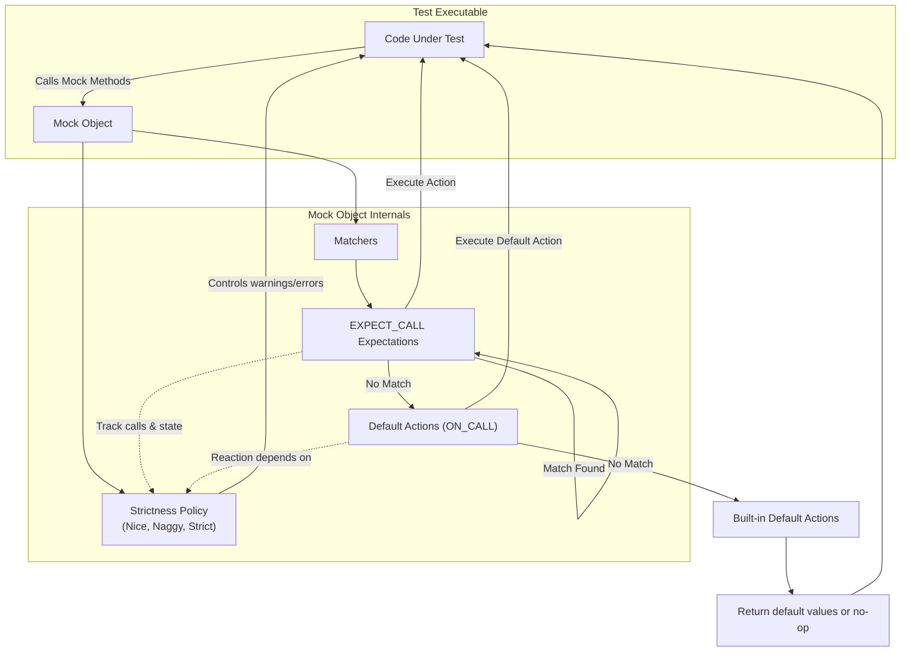

# Mocking Architecture Overview

GoogleMock (gMock) empowers C++ developers to define and control mock objects facilitating interaction testing.

This guide distills the core mocking primitives that underpin gMock's capabilities, explaining how mock classes, matchers, actions, and strictness policies interoperate during test execution. Understanding these concepts enables writing expressive, maintainable, and robust tests using gMock.

---

## Mock Classes: The Cornerstone of gMock

Mock classes represent user-defined types that mimic real interfaces or classes. By inheriting from an existing interface or class and applying the `MOCK_METHOD` macro, users create mock methods mirroring virtual or non-virtual functions.

```cpp
class MockFoo {
 public:
  MOCK_METHOD(ReturnType, MethodName, (Args...), (Specifiers));
};
```

- **Location:** Mock methods must always be declared in the `public:` section of the mock class, even if mocking protected or private methods from the base.

- **Overloads & Templates:** gMock fully supports mocking overloaded functions and class templates with their variations, allowing intuitive mocking of complex APIs.

- **Calling Conventions & Qualifiers:** The 4th parameter in `MOCK_METHOD` lets you specify C++ qualifiers (`const`, `override`, `noexcept`) and calling conventions (such as `Calltype(STDMETHODCALLTYPE)` for Windows), ensuring accurate method signatures.

**Common Pitfalls:**

- Commas within argument types require special handling: either wrap those types in extra parentheses or use type aliases to avoid macro parsing errors.

- Mocking of non-virtual methods can be done by defining an unrelated mock class with matching signatures and using dependency injection techniques.

**Example:**

```cpp
class MockFoo : public Foo {  // Assume Foo has virtual methods.
 public:
  MOCK_METHOD(int, Add, (int a, int b), (override));
  MOCK_METHOD(void, Reset, (), (override));
};
```

---

## Matchers: Defining Expectations on Arguments

Matchers specify how arguments to mock methods are evaluated for acceptance.

- **Exact Matching:** You can expect exact argument values.

- **Wildcard Matching:** The `_` matcher allows any argument value.

- **Predicate Matching:** Use built-in matchers like `Ge()`, `NotNull()`, or combine them with `AllOf()`, `AnyOf()`, etc.

- **Custom Matchers:** Define your own matcher classes or use matcher macros for advanced criteria.

- **Combining Arguments:** `.With()` allows matching all arguments as a tuple for cross-parameter constraints.

**Usage Example:**

```cpp
EXPECT_CALL(mock, Process(Ge(10), _));  // Matches if first arg >= 10
EXPECT_CALL(mock, Save(_)).With(Lt());  // Arguments tuple satisfy lt comparator
```

---

## Actions: Controlling Mock Behavior at Call Time

Actions specify what happens when a mock method is called matching an expectation.

- **Return Values:** Return fixed or computed values (`Return()`, `ReturnRef()`, or `ReturnPointee()` for pointers).

- **Lambda & Functors:** You can implement fully custom behaviors with lambdas or function objects invoked on call.

- **Side Effects:** Manipulate out-parameters or global state with built-in actions like `SetArgPointee<N>()` or `SetArrayArgument<N>()`. Combine multiple actions with `DoAll()`.

- **Delegation:** Delegate method calls to real or fake objects for partial mocking.

**Example:**

```cpp
EXPECT_CALL(mock, GetValue())
    .WillOnce(Return(42));
EXPECT_CALL(mock, Mutate(_, _))
    .WillOnce(DoAll(SetArgPointee<1>(5), Return(true)));
```

---

## Setting Expectations: Defining What Should Happen

Using `EXPECT_CALL`, you describe the expected interactions:

```cpp
EXPECT_CALL(mock_object, Method(matchers))
    .Times(cardinality)
    .InSequence(sequences...)
    .After(other_expectations...)
    .WillOnce(action)
    .WillRepeatedly(action)
    .RetiresOnSaturation();
```

- **Times:** Specifies how many times the method is expected to be called. Omission defaults to:
  - `Times(1)` if no actions given,
  - Or inferred from number of `WillOnce`/`WillRepeatedly`.

- **Ordering:** Use `InSequence` or `After` clauses to enforce strict or partial order among calls.

- **Retiring Expectations:** `.RetiresOnSaturation()` makes an expectation inactive once fulfilled, allowing for more refined call matching.

- **Uninteresting vs Unexpected Calls:**
  - *Uninteresting*: calls to mock methods without any `EXPECT_CALL` defined.
  - *Unexpected*: calls that don't match any active expectation.

---

## Strictness Policies: Controlling Uninteresting Calls

gMock provides wrappers to tune the strictness of mock objects towards uninteresting calls:

| Style        | Behavior on Calls Without Expectations                                  |
|--------------|------------------------------------------------------------------------|
| `NiceMock<T>`   | Suppresses warnings; uninteresting calls are allowed silently.          |
| `NaggyMock<T>`  | Default mock behavior; prints warnings on uninteresting calls.          |
| `StrictMock<T>` | Treats uninteresting calls as errors, making tests stricter.            |

All are subclasses of the mock class `T` and accept the same constructor arguments.

**Example Usage:**

```cpp
NiceMock<MockFoo> nice_foo;      // Ignores uninteresting call warnings
StrictMock<MockFoo> strict_foo;  // Fails the test on uninteresting calls
```

**Caveats:**

- Only works reliably for mock methods defined directly by `MOCK_METHOD` in the mock class.
- Nesting strictness wrappers (e.g., `NiceMock<StrictMock<MockFoo>>`) is not supported.

---

## Mock Execution Flow: How Components Interact

When a mock method is called:

1. gMock searches **expectations** in reverse declaration order to find a matching one that is still active.
2. If found, the matched expectation's action(s) are executed, incrementing call counts and adjusting state.
3. If no expectation matches, gMock consults **default behavior specs** (`ON_CALL`) for a default action.
4. If no default action is found, gMock applies the built-in default action, often returning a default-constructed value.
5. Depending on mock strictness, uninteresting or unexpected calls trigger warnings, failures, or no reaction.

---

## Practical Tips & Best Practices

- **Define expectations before exercise:** Always set expectations (`EXPECT_CALL`) before the code calls the mock methods.
- **Use `ON_CALL` for defaults:** Set common default behaviors with `ON_CALL` to avoid cluttering tests with excessive expectations.
- **Prefer `NiceMock` for most tests:** To reduce brittle tests and spurious warnings, prefer `NiceMock` unless strictness is mandatory.
- **Sequence management:** Use `InSequence` or `Sequence` objects to enforce specific call orders where necessary.
- **Be cautious with over-specification:** Avoid setting more expectations than necessary to allow flexible and maintainable tests.
- **Use `RetiresOnSaturation` for sticky expectations:** To prevent an expectation from matching after its upper bound is reached, use this clause.

---

## Summary Mermaid Diagram of Mocking Architecture



---

## Troubleshooting Common Issues

- **Mock methods called but base methods execute:** Ensure methods are `virtual` unless mocking non-virtual methods with special techniques.
- **Uninteresting calls warnings:** Use `NiceMock` or add generic `EXPECT_CALL` with `Times(AnyNumber())` to suppress as needed.
- **Over-specified tests:** If tests fail on code refactor with no behavior changes, loosen `EXPECT_CALL` constraints.
- **Ambiguous overloads:** Use `using BaseClass::Method;` or specify full signature in mock class to disambiguate.
- **Slow compilation:** Move mock class constructors and destructors to `.cc` files.

---

This overview brings clarity to how GoogleMock's essential primitives function cohesively, ensures informed use of mock classes and strictness policies, and supports writing robust interaction-based tests to validate your C++ code effectively.

For detailed coding recipes and extended examples, please visit the [gMock Cookbook](https://google.github.io/googletest/gmock_cook_book.html) and explore related API references and guides.
