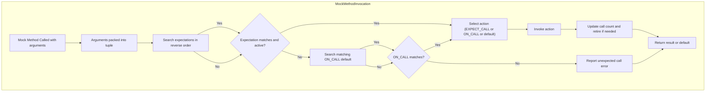

# Mocking System Architecture

GoogleMock (gMock) is a powerful and flexible C++ mocking framework built on top of GoogleTest. At its core, gMock architecturally structures mocking around *mock methods*, *expectations*, and *actions* to give users precise control over behavior and verification in unit tests. This guide illuminates the principles enabling gMock’s mocking system—how mock methods are constructed, how expectations are tracked and matched, and how actions dictate mock behavior—allowing for controlled simulation of dependencies and focused, isolated testing of C++ code.

---

## Introduction to gMock’s Mocking Architecture

At its core, mocking in gMock revolves around three pillars:

- **Mock Methods:** Special methods created by the `MOCK_METHOD` macro to override virtual or non-virtual functions, receiving call inputs and returning controlled outputs.
- **Expectations:** Declarations using `EXPECT_CALL` that specify *when* and *how* these mock methods are invoked, including argument constraints, call counts, and call order.
- **Actions:** Responses specified by `WillOnce()`, `WillRepeatedly()`, or `ON_CALL()` to determine the behavior when mock methods are invoked.

The architecture ensures that all expectations are checked at runtime automatically, with immediate reporting if any expectation is violated.


## Mock Methods: Defining Mocked Interfaces

A mock class in gMock is defined by:

- Deriving from the interface or base class.
- Using the `MOCK_METHOD` macro to declare each mock method.

```cpp
class MockFoo : public FooInterface {
 public:
  MOCK_METHOD(int, Bar, (int x, std::string y), (override));
  MOCK_METHOD(void, Baz, (), (const, override));
};
```

Key details:

- **Argument Parsing:** To support complex argument types containing commas (e.g. template types), wrap them in parentheses or use type aliases.
- **Access Specifier:** `MOCK_METHOD` must appear in the `public:` section irrespective of the original method’s accessibility.
- **Qualifiers:** Method qualifiers such as `const`, `override`, `noexcept`, and reference qualifiers (`ref(&)`) are supported as a 4th macro parameter.

Mock methods automatically hook into internal gMock machinery (the *FunctionMocker*) that manages invocation tracking and expectation matching.


## Expectations: How gMock Tracks Method Calls

Expectations define the contract for mock method calls. When you write:

```cpp
EXPECT_CALL(mock_obj, Bar(42))
    .Times(3)
    .WillOnce(Return(100));
```

You declare that:

- `mock_obj.Bar()` with argument `42` is expected exactly 3 times.
- The first matching call should execute the specified action (`Return(100)`).

### Workflow

1. **Registration:** Calling `EXPECT_CALL` registers a new `TypedExpectation` object internally, describing argument matchers, cardinality, ordering constraints, and actions.
2. **Matching:** When the mock method is invoked, gMock scans *in reverse order* through the expectations until it finds an active one whose matchers fit the call arguments.
3. **Invocation and Verification:** The matched expectation's state is updated, call counts tracked, and the corresponding action performed.

### Expectation Properties

- **Cardinalities:** Control how many times the call is expected (e.g., `Exactly(n)`, `AtLeast(n)`, `AnyNumber()`). If omitted, inferred from action clauses.
- **Argument Matching:** Each argument is matched individually with specified matchers; additionally, a `.With()` clause can impose constraints over the tuple of all arguments.
- **Ordering:** Use `.InSequence()`, `.After()` clauses or `InSequence` blocks to express call ordering (strict or partial).
- **Retiring:** Expectations may retire (become inactive) after saturation or call of dependent expectations, to avoid conflicts.

### Sticky Expectations

By default, expectations remain *sticky* after saturation, meaning calls beyond the upper bound cause immediate failures unless `.RetiresOnSaturation()` is used.


## Actions: Specifying Mock Behavior

Actions define what happens when a mock method call matches an expectation or default rule:

- `WillOnce(action)`: Execute the action for the next matching call; multiple `WillOnce`s can be chained.
- `WillRepeatedly(action)`: Execute this action for all subsequent calls after `WillOnce`s are exhausted.
- `ON_CALL(mock, Method(matchers))`: Defines a *default* action but does not set an expectation; used for calls you don't want to verify but want controlled behavior.

Common actions include:

- `Return(value)`: Return a specified value.
- `ReturnRef(variable)`: Return a reference.
- `Invoke(function_or_lambda)`: Call user-defined function/lambda.
- `SetArgPointee<N>(value)`: For side effects via pointer arguments.

The architecture ensures correct handling of *once-only* actions, *repeated* actions, and default actions, selecting appropriate action for each call respecting the invocation count.


## Internal Data Flow & Control

When a mock method is called: 

1. The call arguments are packed into a tuple and passed to the internal `FunctionMocker`.
2. The mock searches expectations in *reverse registration order* to find one that matches and is active.
3. If no expectation matches but `ON_CALL` default actions exist, the last matching `OnCallSpec` is selected.
4. The selected action is invoked. If none is specified, default return values are used.
5. Call counts are updated; if saturated, expectations may retire.
6. If the call is unexpected (no matching expectation or uninteresting call in strict mode), gMock reports a failure or warning.

This process is thread-safe where necessary but generally expects test code to configure mocks on a single thread before test execution.


## Managing Uninteresting, Unexpected, and Excessive Calls

- **Uninteresting Call:** Method invoked without matching EXPECT_CALL. By default, gMock warns about these but allows them. Use `NiceMock` to suppress warnings or `StrictMock` to make them failures.
- **Unexpected Call:** Method call with matching EXPECT_CALL(s) but arguments do not match any expectation or order.
- **Excessive Call:** Method call exceeds the expected call count per the specified cardinality.

Understanding these categories helps diagnose common test failures.


## Handling Overloaded and Template Methods

- Mock overloaded methods by mocking each overload explicitly.
- Use `using Base::Method;` in the mock class to avoid hiding base overloads accidentally.
- Support for class templates through templated mock classes.


## Delegation and Advanced Techniques

- **Delegating to a Fake or Real Object:** A mock can delegate default actions to a real or fake object by binding those methods using lambda callbacks.
- **Mocking Non-Virtual Methods:** Achieved with class templates and static dispatch techniques.


## Best Practices in Using the Mocking System

- Prefer defining default behaviors with `ON_CALL` and reserve `EXPECT_CALL` for essential behavioral verifications.
- Order your `EXPECT_CALL`s from general to more specific to control overriding.
- Use sequences for testing call orders.
- Avoid excessive strictness to reduce brittle tests.


---

## Mermaid Diagram: Simplified Mocking Workflow



---

## Summary
- gMock’s mocking system is built around mock method definitions, expectation management, and defining actions for controlled mock behaviors.
- Expectations capture detailed call constraints including argument matchers, call count cardinalities, and call ordering dependencies.
- Actions dictate runtime mock method responses, with clear precedence between `EXPECT_CALL` and `ON_CALL` behaviors.
- The system carefully differentiates uninteresting, unexpected, and excessive calls with tooling to help diagnostics.
- Advanced features include delegation to fakes or real objects, managing overloaded methods, and thread-safe invocations.


## Additional Resources
- [gMock Cookbook](https://google.github.io/googletest/gmock_cook_book.html): Practical recipes for using gMock mocks, expectations, and actions.
- [Mock Object Construction Reference](../api-reference/gmock-api/mock-object-construction.md): Details on `MOCK_METHOD` macro and mock classes.
- [Defining Expectations and Actions Reference](../api-reference/gmock-api/defining-expectations-actions.md): In-depth on `EXPECT_CALL`, `ON_CALL`, matchers, and action clauses.
- [Matchers Reference](../api-reference/matchers-and-utilities/builtin-matchers.md): How to specify argument matchers.
- [GoogleTest Core Concepts](../overview/architecture-core-concepts/core-concepts-terminology.md): Foundational concepts around test structure that complements mocking.

This page fits into the overall documentation by providing critical architectural understanding of how GoogleMock implements mocking at a conceptual level, complementing the more practical guides on writing expectations, custom matchers, and extending GoogleTest.


---

