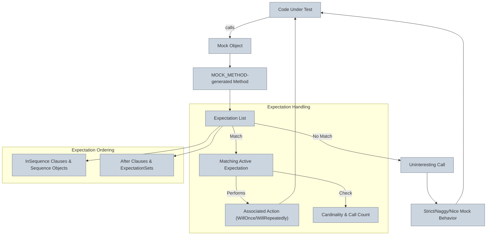

# Mocking Architecture

GoogleMock extends the foundational GoogleTest framework to enable robust, declarative mocking of C++ interfaces and classes. This empowers developers to precisely specify and verify interactions between components, enhancing the quality and reliability of unit tests through expressive expectations and customizable behaviors.

---

## Introduction to Mocking

At its core, mocking allows you to replace complex or unavailable dependencies with configurable stand-ins called **mock objects**. GoogleMock achieves this by generating mock classes from interfaces or abstract classes, letting you:

- Declare mock methods using the `MOCK_METHOD` macro
- Specify default behaviors using `ON_CALL`
- Set precise expectations on method invocation using `EXPECT_CALL`

Mocking in GoogleMock tightly integrates with the assertion and test lifecycle of GoogleTest, providing automatic verification of call order, frequency, and arguments when mock objects are destructed.

---

## Key Macros in Mocking Architecture

### `MOCK_METHOD`

This macro defines a mock method inside a mock class. It mirrors the real method's signature and return type, optionally with qualifiers such as `const`, `override`, and `noexcept`:

```cpp
MOCK_METHOD(return_type, MethodName, (args...), (qualifiers));
```

**Example:**

```cpp
class MockFoo : public Foo {
 public:
  MOCK_METHOD(int, GetSize, (), (const, override));
  MOCK_METHOD(void, DoSomething, (int x), (override));
};
```

This macro enables the mocking of virtual (and even some non-virtual) methods with a convenient declaration that generates all needed plumbing for call interception and verification.

> **Tip:** If your method has complex argument types with commas (e.g., `std::pair<int, int>`), wrap those types in parentheses or use `using` aliases to avoid parsing errors.

### `EXPECT_CALL`

Defines an expectation that a mock method will be called with arguments matching specified matchers. It also allows extensive control over invocation count, ordering, and behavior through chainable clauses:

```cpp
EXPECT_CALL(mock_object, Method(matchers...))
    .With(multi_arg_matcher)?
    .Times(cardinality)?
    .InSequence(sequences...)*
    .After(expectations...)*
    .WillOnce(action)*
    .WillRepeatedly(action)?
    .RetiresOnSaturation()?;
```

- **`Times(cardinality)`** controls how many times the call is expected.
- **`InSequence`** and **`After`** specify call order dependencies.
- **`WillOnce`** and **`WillRepeatedly`** define specific actions on call.
- **`RetiresOnSaturation`** retires the expectation once its call count is reached.

**Example:**

```cpp
EXPECT_CALL(foo, Process(_))
    .Times(3)
    .WillOnce(Return(true))
    .WillRepeatedly(Return(false));
```

This expectation means `Process` should be called exactly 3 times; the first call returns `true`, and subsequent calls return `false`.

### `ON_CALL`

Specifies **default behavior** for a mock method without requiring it to be called.

Syntax:

```cpp
ON_CALL(mock_object, Method(matchers...))
    .With(multi_arg_matcher)?
    .WillByDefault(action);
```

Unlike `EXPECT_CALL`, `ON_CALL` doesn't set expectations on call count or ordering—it only sets how the mock behaves when called.

> **Best Practice:** Use `ON_CALL` to configure common stub behavior in your test setup, and `EXPECT_CALL` to verify interactions you care about.

---

## Expectation and Action Model

GoogleMock integrates verification of method calls with flexible mocking actions. Each mock method maintains a list of expectations:

- When a mock method is called, GoogleMock attempts to find the **last matching active expectation**.
- If found, it performs the next specified action in the sequence (`WillOnce`s in order, then the `WillRepeatedly` action).
- If no matching expectation exists, behavior depends on the mock object's strictness level (see **Nice**, **Naggy**, and **Strict** mocks).

The **action** associated with an expectation defines what happens on the call: returning a value, invoking a callback, setting output arguments, or delegating to a real or fake implementation.

### Callbacks and Lambdas as Actions

You can specify any callable compatible with the method signature as an action, including:

- Functions
- Lambdas
- Functors
- Member function pointers via `Invoke`

**Example:**

```cpp
EXPECT_CALL(foo, Compute(_))
    .WillOnce([](int x) { return x * 2; });
```

This flexibility allows you to integrate sophisticated behavior simulations directly in tests.

### Cardinalities

Cardinalities define how many times an expectation should be met:

| Cardinality          | Description                                |
|----------------------|--------------------------------------------|
| `Times(1)` or omitted| Expect exactly one call                     |
| `AnyNumber()`        | Expect zero or more calls                   |
| `AtLeast(n)`         | Expect at least *n* calls                   |
| `AtMost(n)`          | Expect no more than *n* calls               |
| `Between(m, n)`      | Expect between *m* and *n* calls inclusive |
| `Exactly(n)`         | Expect exactly *n* calls                     |

If `Times` is omitted, GoogleMock infers the cardinality based on `WillOnce` and `WillRepeatedly` clauses.

---

## Integration of Mock Objects with Value Assertions and Call Verifications

### Behavior During Test Execution

Once expectations are declared with `EXPECT_CALL`, exercising code calls the mock object's methods. GoogleMock:

- Matches each call to an expectation (in reverse order of declaration).
- Verifies argument matchers for each call.
- Checks call order constraints if sequences or `After` clauses are used.
- Performs the associated action or default behavior.

Meanwhile, failed matches or violation of call count result in immediate test failures with detailed diagnostic messages.

### Default Actions for Uninteresting Calls

When a mock method is called without a matching `EXPECT_CALL`, it is an *uninteresting call*. GoogleMock's default behavior:

- Logs a warning for naggy mocks (default behavior).
- Suppresses warnings for nice mocks.
- Fails the test for strict mocks.

Use `NiceMock`, `NaggyMock`, or `StrictMock` wrappers to control this behavior.

```cpp
NiceMock<MockFoo> nice_mock;   // suppress uninteresting warnings
NaggyMock<MockFoo> naggy_mock; // default warning behavior
StrictMock<MockFoo> strict_mock; // treat uninteresting calls as errors
```

> **Hint:** Rely on `NiceMock` for most tests to reduce noise but verify critical calls with `EXPECT_CALL`.

### Call Ordering and Partial Ordering

GoogleMock supports strict ordering through:

- **`InSequence`**: ensures expectations specified under an `InSequence` object occur in order.
- **`After` clause**: allows expressing partial ordering, where certain calls must happen after specified expectations.

This flexibility supports complex interaction patterns without forced linearization.

### Retiring Expectations

By default, an expectation remains *active* even after it is satisfied, which can cause upper-bound violations on repetitive calls.

Using `.RetiresOnSaturation()` instructs GoogleMock to retire an expectation once it reaches its upper bound, allowing subsequent calls to a fallback expectation.

**Example:**

```cpp
EXPECT_CALL(mock, Foo(7))
    .Times(2)
    .RetiresOnSaturation();
EXPECT_CALL(mock, Foo(_)).Times(AnyNumber());
```

Calls with argument 7 will match the first expectation twice, then match the second.

---

## User Flow: How Mocking Fits into Your Testing Workflow

1. **Define Mock Class:**

   Use `MOCK_METHOD` macros within a class derived from your interface or base class.

2. **Create Mock Object:**

   Instantiate a mock object in your test context.

3. **Set Default Behaviors:**

   Use `ON_CALL` to specify default method behaviors that are common to tests or needed to prevent unintended warnings.

4. **Declare Expectations:**

   Use `EXPECT_CALL` to specify the exact calls your test verifies, including argument matchers, call counts, ordering, and actions.

5. **Exercise Code:**

   Run the code under test, passing mocks where dependencies are needed.

6. **Verify Interactions:**

   GoogleMock automatically verifies expectations when mocks go out of scope.

7. **Troubleshoot and Refine:**

   Adjust expectations, matchers, and mock behaviors based on test outcomes and diagnostic feedback.

---

## Practical Tips and Common Pitfalls

- **Set Expectations Before Calls:**
  Always call `EXPECT_CALL` before the code under test triggers mock method calls to avoid undefined behavior.

- **Beware of Sticky Expectations:**
  Expectations remain active even after being saturated unless `RetiresOnSaturation()` is used.

- **Use Matchers Judiciously:**
  Overly restrictive matchers lead to brittle tests; use `_` or other flexible matchers where possible.

- **Avoid Excessive Strictness:**
  Use `StrictMock` only when you want uninteresting calls to cause test failures.

- **Mock Non-virtual Methods Carefully:**
  GoogleMock supports mocking non-virtual methods via templates, but recommended design is to mock interfaces.

- **Wrapping Mocks for Behavior Control:**
  Use `NiceMock`, `NaggyMock`, or `StrictMock` wrappers to control how uninteresting calls are handled.

- **Wrap Complex Types:**
  Parentheses or type aliases are necessary for argument or return types containing commas.

- **Overloading:**
  Mock each overloaded method signature separately, and use `using` declarations if required to bring base class overloads into scope.

---

## Diagram: Mocking Architecture Overview



---

## Summary

GoogleMock's mocking architecture offers a declarative, powerful model for mocking in C++, enabling precise control over method expectations and customizable behaviors while integrating seamlessly with GoogleTest. Key constructs include `MOCK_METHOD` for defining mocks, `EXPECT_CALL` for establishing expectations, and `ON_CALL` for setting default behaviors. The system supports flexible call ordering, cardinalities, and mock object strictness to craft maintainable and expressive tests.

---

## See Also

- [GoogleMock Cheat Sheet](https://google.github.io/googletest/gmock_cheat_sheet.html)
- [gMock for Dummies](https://google.github.io/googletest/gmock_for_dummies.html)
- [GoogleMock Cookbook](https://google.github.io/googletest/gmock_cook_book.html)
- [Matchers Reference](/concepts/data-models-mocking-strategies/matcher-action-models)
- [Defining Mock Methods (MOCK_METHOD)](/api-reference/mocking-framework/mock-methods)
- [EXPECT_CALL Reference](/api-reference/mocking-framework/expectations-and-cardinality)
- [Nice, Naggy, and Strict Mocks](/api-reference/mocking-framework/nice-strict-mocks)


---

## Troubleshooting

<AccordionGroup title="Common Issues with Mocking">
<Accordion title="MOCK_METHOD Fails to Compile Due to Commas in Types">
Wrap the complex argument or return types with parentheses or use type aliases to help the parser.
</Accordion>
<Accordion title="Unexpected Mock Function Calls Fail Tests">
Check your `EXPECT_CALL` declarations and ensure calls happen with matching arguments and cardinality.
Consider adding catch-all `EXPECT_CALL` or `ON_CALL` for unexpected arguments.
</Accordion>
<Accordion title="Uninteresting Calls Flooding Logs">
Switch to `NiceMock` to suppress warnings or explicitly specify expected calls with `.Times(AnyNumber())`.
</Accordion>
<Accordion title="Call Ordering Violations Detected">
Use `InSequence` or `After` clauses to define order constraints explicitly.
</Accordion>
</AccordionGroup>

---

## Best Practices

- Use `ON_CALL` to set default stub behaviors and `EXPECT_CALL` to assert calls you want your tests to verify.
- Prefer `NiceMock` in most cases to reduce noise and maintain flexible, maintainable tests.
- Use sequences and `After` clauses to model real interaction order without making tests overly brittle.
- Avoid mocking non-virtual methods unless absolutely necessary.
- Verify mocks by ensuring they go out of scope or by manually calling `Mock::VerifyAndClearExpectations` if needed.

---

This documentation equips you with a clear understanding of GoogleMock's mocking architecture, enabling you to write precise, readable, and robust interaction-based tests.