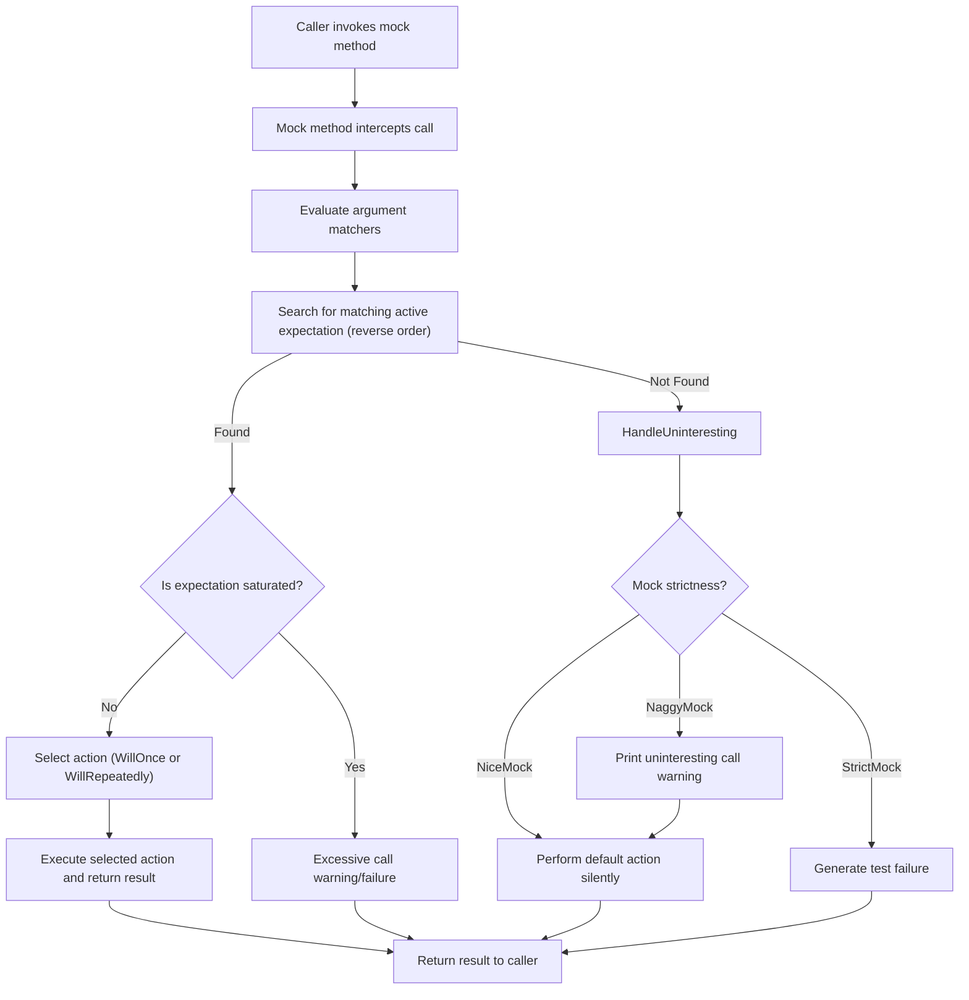

# Mocking Architecture

Explore the foundational design of GoogleMock (gMock), diving into how mock classes, expectations, actions, and matchers interplay to enable fine-grained behavioral testing in C++. This guide breaks down the components and mechanisms that let developers create controlled, verifiable mocks to precisely specify and monitor interactions within their tests.

---

## Overview of gMock's Mocking Architecture

GoogleMock empowers users to create mock classes that simulate interfaces or classes for unit testing. At its core, gMock provides an intuitive and declarative syntax to define mocks and link expectations about method calls with precise behaviors.

### Key Components

- **Mock Classes**: User-defined classes inheriting from interfaces or base classes, employing macros like `MOCK_METHOD` to generate mock method implementations.
- **Expectations**: Conditions set on mock methods indicating how, when, and with what arguments they should be called using `EXPECT_CALL`.
- **Default Actions**: Typical behaviors provided by `ON_CALL` or built-in defaults when there’s no specific expectation.
- **Matchers**: Predicates that validate method arguments, including simple (e.g., `_`, `Eq()`) and composite or custom matchers.
- **Actions**: Define the behavior of mock methods when called, specifying return values, side effects, or invoking real code.

These components together create a powerful framework for specifying interaction-based tests.

## Mock Classes and Their Variants

Creating mock classes using the `MOCK_METHOD` macro declares mock methods with signatures compatible with the original interface. gMock generates these methods to intercept calls, check expectations, and delegate to actions.

To control how uninteresting (unexpected but allowed) calls are treated, gMock offers strictness variants:

- **NiceMock**: Suppresses warnings for uninteresting calls, making tests less verbose.
- **NaggyMock**: (Default mode) Prints warnings on uninteresting calls.
- **StrictMock**: Treats uninteresting calls as errors, enforcing precise call expectations.

Each variant inherits from the mock class and adjusts runtime behavior accordingly, encouraging progressively strict test enforcement.

### Example: Using NiceMock, NaggyMock, and StrictMock

```cpp
using ::testing::NiceMock;
using ::testing::NaggyMock;
using ::testing::StrictMock;

class MockFoo {
 public:
  MOCK_METHOD(void, DoThis, (), ());
  MOCK_METHOD(int, Calculate, (int a, int b), ());
};

// Nice mock: silent on uninteresting calls
NiceMock<MockFoo> nice_mock;  // alerts suppressed

// Naggy mock: default, warns on uninteresting calls
NaggyMock<MockFoo> naggy_mock;  // warns

// Strict mock: errors on uninteresting calls
StrictMock<MockFoo> strict_mock;  // errors
```

### Constructor Forwarding

These wrapper variants forward constructors of the base mock class transparently, enabling easy usage with mock classes that require arguments.

Example:

```cpp
NiceMock<MockBar> nice_bar("argument");
StrictMock<MockBar> strict_bar(1, 2, "example");
```

### Caveats

- Works only for mock methods defined directly using `MOCK_METHOD` in the mock class.
- Nested strictness modifiers (e.g., `NiceMock<StrictMock<MockFoo>>`) are unsupported.
- Mock class destructors should be virtual for proper behavior.

## Expectations and Their Management

Expectations specify which mock method calls are important and how they should behave or be validated.

### Setting Expectations

- Use `EXPECT_CALL(mock, Method(args))` to declare an expectation.
- Expectations can include clauses such as `.Times()`, `.WillOnce()`, `.WillRepeatedly()`, `.InSequence()`, and `.After()` to fine-tune behavior and ordering.
- Multiple expectations can exist per method; gMock matches calls against expectations from most recent to oldest, enabling layered behavior.

### Lifecycle of Expectations

- Expectations begin active.
- They can *retire* when saturated or when sequencing dictates.
- Unmet or violated expectations generate test failures, reported immediately or at mock destruction.
- When multiple expectations exist, gMock checks each in reverse order and picks the first that matches active criteria.

## Actions and Default Behaviors

Actions define the code executed when a mock method is invoked under matching expectations.

- **Default Action**: Returned for uninteresting calls or when expectations have no specific action via `ON_CALL` or built-in defaults.
- **WillOnce**: Defines a one-time action performed for a matched call.
- **WillRepeatedly**: Defines an action performed for every subsequent matched call after all `WillOnce` actions.

Custom actions can be provided with callables (functions, lambdas, functors), enabling flexible responses.

## Matchers: Precise Argument Validation

Matchers evaluate mock method call arguments to confirm if an expectation applies to a call.

- Simple matchers: `_` (wildcard), `Eq(value)`, `Ge(value)`.
- Complex matchers: via `With()` to match argument tuples as a whole.
- Custom matchers can be implemented for domain-specific needs.

Matchers support rich composition, enabling precise filtering of calls.

## Mock Method Call Flow

1. **Call Interception**: The generated mock method intercepts calls.
2. **Matcher Evaluation**: gMock evaluates argument matchers against the call.
3. **Expectation Lookup**: GMock scans expectations backwards to find a suitable match.
4. **Action Selection**: If matched, selects the corresponding action (`WillOnce` or `WillRepeatedly`), else chooses the default action.
5. **Action Execution**: Executes the selected action, returning the result.
6. **Uninteresting Calls Handling**: If no expectation matches, behavior depends on mock strictness:
   - `NiceMock`: silently proceeds.
   - `NaggyMock`: prints a warning.
   - `StrictMock`: generates a failure.

## Common User Flows

### Creating a Mock and Setting Expectations

1. Define a mock class with `MOCK_METHOD` for the interface.
2. Optionally instantiate a mock variant (`NiceMock`, `StrictMock`, or default).
3. Use `ON_CALL` to specify default behavior.
4. Use `EXPECT_CALL` to set expectations with matchers and actions.
5. Run tests exercising the mocks.
6. On mock destruction, expectations verified automatically.

### Handling Uninteresting Calls

- Use `NiceMock` to suppress warnings if other calls are irrelevant.
- Use `StrictMock` to fail on unexpected calls to tighten test precision.

### Advanced Sequence Control

- Use `.InSequence()` or explicit `Sequence` objects to specify call order.
- Use `.After()` to build complex partial orders.

## Practical Tips

- Define expectations before exercising code to prevent undefined behavior.
- For mocks with complex constructors, use constructor forwarding in mock variants.
- Avoid nesting strictness wrappers.
- Use `Mock::AllowLeak()` if mocks must outlive test scope intentionally.
- Regularly run tests with `--gmock_verbose=info` for insights into expectation matching.

## Troubleshooting

- **Unexpected Calls**: Use verbosity flags or `EXPECT_CALL(...).Times(0)` to diagnose and disallow.
- **Uninteresting Call Warnings**: Use `NiceMock` or add broad `EXPECT_CALL(...).Times(AnyNumber())`.
- **Destructor Calls on Mocks**: If mocking destructors, create a mock method called in the destructor (e.g., `Die()`), and set expectations on it.

---

## Mermaid Diagram: Mock Interaction Flow



---

## Additional References

- [Defining Mock Classes](gmock_cook_book.md#creating-mock-classes)
- [Expectations and Actions](api_reference/mocking_and_matchers/expectations_and_actions.md)
- [Argument Matching](api_reference/mocking_and_matchers/argument_matching.md)
- [Strict, Nice, and Naggy Mocks](api_reference/mocking_and_matchers/strictness_and_nice_mocks.md)
- [gMock Cookbook: The Nice, the Strict, and the Naggy](gmock_cook_book.md#NiceStrictNaggy)

For example code demonstrating usage and tests verifying behavior, see the source files such as `gmock-nice-strict.h` and `gmock-nice-strict_test.cc` within the gMock repository.

---

## Summary

GoogleMock’s mocking architecture is designed for precise interaction verification in unit tests. It provides a flexible and powerful system of mock classes, strictness modes, detailed expectations, matchers, and actions, enabling tests to express intent clearly and fail fast on violations. The system manages consistency, ordering, and lifecycle of expectations, while offering practical mechanisms for default behaviors and call handling.

Using the strictness wrappers `NiceMock`, `NaggyMock`, and `StrictMock` allows users to tailor the verbosity and strictness of their tests for gradual hardness and maintainability. Through chainable expectation clauses (`Times`, `WillOnce`, `InSequence`, `After`), complex behaviours and sequences can be tested with confidence.

This architecture forms the backbone that empowers users to write expressive, maintainable, and reliable mock-based tests in C++.
