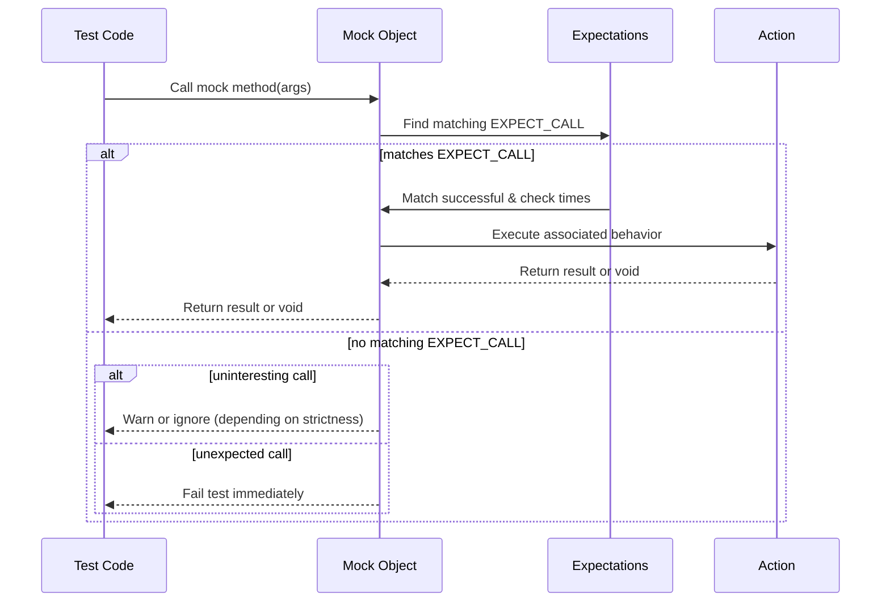

# Mocking with GoogleMock

Dive deep into the concepts that power GoogleMock, the powerful C++ mocking framework. This guide explains how mocks are defined, how expectations and behaviors are specified with the key macros `MOCK_METHOD`, `EXPECT_CALL`, and `ON_CALL`, and how GoogleMock intercepts calls at runtime to verify your code.

---

## What Is a Mock?

Imagine you are testing a component that relies on a collaborator class, but you want to control or observe how that collaborator is used without depending on its real, possibly complex, implementation. A **mock object** stands in for the real collaborator, allowing you to specify which methods are expected to be called, with what arguments, how often, and what they should return or do.

Mocks let you isolate code units by simulating interactions, enabling precise, readable, and powerful unit tests.

## Defining Mocks with `MOCK_METHOD`

At the heart of GoogleMock is the `MOCK_METHOD` macro, used inside a mock class to define mocked methods that simulate virtual functions of your interfaces or classes under test.

### Syntax

```cpp
MOCK_METHOD(ReturnType, MethodName, (Args...), (Specs...));
```

- **ReturnType** – The function’s return type.
- **MethodName** – The method’s identifier.
- **(Args...)** – The argument list in parentheses. Note: if the argument list contains types with commas (e.g., `std::pair<int, int>`), wrap types in extra parentheses or use type aliases.
- **(Specs...)** – Optional qualifiers such as `const`, `override`, `noexcept`, calling conventions, or reference qualifiers.

### Example

```cpp
class Foo {
 public:
  virtual ~Foo() {}
  virtual int GetSize() const = 0;
  virtual std::string Describe(const char* name) = 0;
  virtual bool Process(int elem, int count) = 0;
};

class MockFoo : public Foo {
 public:
  MOCK_METHOD(int, GetSize, (), (const, override));
  MOCK_METHOD(std::string, Describe, (const char* name), (override));
  MOCK_METHOD(bool, Process, (int elem, int count), (override));
};
```

**Tip:** Always declare mocks in the `public:` section, even if the original method is `protected` or `private`. This enables `EXPECT_CALL` and `ON_CALL` to access the mock methods.

### Mocking Non-Virtual Methods

While `MOCK_METHOD` requires methods to be virtual, GoogleMock permits mocking non-virtual functions for scenarios like high-performance dependency injection by defining an unrelated mock class with matching methods.

See the [gMock Cookbook section on Mocking Non-Virtual Methods](gmock_cook_book.md#MockingNonVirtualMethods) for details.

---

## Specifying Expectations with `EXPECT_CALL`

`EXPECT_CALL` is how you tell GoogleMock which mock method calls you expect, their arguments, how often they should be invoked, and what behaviors they should perform.

### Basic Syntax

```cpp
EXPECT_CALL(mock_object, MethodName(matchers...))
    .With(multi_arg_matcher)        // Optional
    .Times(cardinality)             // Optional
    .InSequence(sequences...)       // Optional
    .After(expectations...)         // Optional
    .WillOnce(action)               // Optional, can appear multiple times
    .WillRepeatedly(action)         // Optional
    .RetiresOnSaturation();         // Optional
```

- **`mock_object`**: The instance of your mock.
- **`MethodName`**: The method to expect a call on.
- **`matchers...`**: Matchers corresponding to each method argument to specify argument constraints.

### What Does It Do?

`EXPECT_CALL` sets an expectation that at runtime, the specified method will be called with arguments matching specified matchers. If the actual calls don't meet expectations (wrong arguments, wrong number of calls, out-of-order invocation, etc.), GoogleMock reports failures immediately.

### Matchers

Matchers let you specify flexible or exact argument constraints (see [Matchers Reference](reference/matchers.md)). For example:

```cpp
EXPECT_CALL(foo, Bar(5));            // Argument must equal 5
EXPECT_CALL(foo, Bar(testing::_));   // Any argument is accepted
EXPECT_CALL(foo, Bar(testing::Gt(0))); // Argument greater than 0
```

### Chaining Clauses

- **`.With(multi_arg_matcher)`**: Matches arguments collectively as a tuple for complex relations like "first arg less than second".
- **`.Times(cardinality)`**: Specifies how many times this call is expected. Use cardinalities like `AnyNumber()`, `Exactly(n)`, `AtLeast(n)`, etc.
- **`.InSequence(sequences...)`**: Assigns calls to sequences to enforce call order.
- **`.After(expectations...)`**: Specifies dependencies so that the call only makes sense after other expectations are met.
- **`.WillOnce(action)`**: Defines the behavior for the next matching call. Multiple `WillOnce` clauses can specify behaviors for consecutive calls.
- **`.WillRepeatedly(action)`**: Defines the behavior for all subsequent matching calls after the `WillOnce`s are consumed.
- **`.RetiresOnSaturation()`**: As soon as the expectation is fulfilled the expected number of times, it is retired (ignored for subsequent calls).

### Example

```cpp
using ::testing::Return;
using ::testing::_; // wildcard matcher

EXPECT_CALL(mock_foo, GetData(42))
    .Times(3)
    .WillOnce(Return(10))
    .WillOnce(Return(20))
    .WillRepeatedly(Return(30));

// The first call with 42 returns 10, second returns 20, all others return 30.

EXPECT_CALL(mock_foo, Process(_))
    .Times(AnyNumber());  // Accept any number of Process calls with any argument.
```

### Matching Overloaded Methods

For overloaded methods, specify the signature as usual with `MOCK_METHOD`. Use `Const()` wrapper to specify const-qualified methods in `EXPECT_CALL`. See [Selecting Overload](reference/mocking.md#SelectOverload) for disambiguation techniques.

### When to Use `EXPECT_CALL`

- Use when you want to verify that a method is called.
- Setting strict constraints (arguments, order, counts).
- Expressing precise behavior (via actions).

---

## Setting Default Behaviors with `ON_CALL`

`ON_CALL` defines what happens when a mock method is called with matching arguments but does *not* establish an expectation that the call will occur. This is useful for specifying default behavior without causing test failures if the call is not made.

```cpp
ON_CALL(mock_object, MethodName(matchers...))
    .With(multi_arg_matcher)   // Optional
    .WillByDefault(action);    // Required
```

`ON_CALL` helps avoid over-specifying behavior, enabling a more resilient and maintainable test suite.

### Example

```cpp
using ::testing::Return;
using ::testing::_;

ON_CALL(mock_foo, GetSize())
    .WillByDefault(Return(5));

// No expectation that GetSize() will be called here.
```

### How `ON_CALL` and `EXPECT_CALL` Interact

- Expectation clauses (`EXPECT_CALL`) override `ON_CALL` behavior when a matching expectation is present.
- You can combine `ON_CALL` to customize default behaviors and `EXPECT_CALL` to verify important calls.

---

## How Calls Are Intercepted and Matched

When your code under test calls a method on a mock object, GoogleMock intercepts the call and performs the following steps:

1. **Search Expectations:** It searches expectations (`EXPECT_CALL`s) in reverse order of declaration (newer override older), selecting the last matching expectation that is still active.
2. **Check Cardinality & Active State:** Verifies if the expectation can still accept calls (not saturated or retired).
3. **Check Argument Match:** The arguments are checked against the specified matchers.
4. **Execute Action:** If matched and allowed, the corresponding action is executed - this might return a value, modify arguments, invoke callbacks, or do nothing.
5. **Verify Calls:** When the mock object is destructed (or verified manually), gMock checks that all expectations were satisfied.

If no matching `EXPECT_CALL` is found:
- **If at least one `EXPECT_CALL` exists for the method but none match arguments:** This is an unexpected call and is an error.
- **If no `EXPECT_CALL` is defined for the method:** This is an uninteresting call.

Depending on mock strictness mode, uninteresting calls may generate warnings, errors, or be silently ignored.

---

## Mock Object Strictness: Nice, Naggy, and Strict Mocks

GoogleMock supports three modes of handling uninteresting calls to mocks.

| Mock Type  | Uninteresting Calls Behavior                               | Use Case                               |
|------------|------------------------------------------------------------|--------------------------------------|
| NiceMock   | Silently ignores uninteresting calls                       | Tests where unexpected calls are OK  |
| NaggyMock  | Prints warnings on uninteresting calls (default behavior)  | Useful during test creation/debugging|
| StrictMock | Treats uninteresting calls as errors, failing the test     | Enforces strict expectations         |

Each is a class template wrapper around your mock class:

```cpp
using ::testing::NiceMock;
using ::testing::NaggyMock;
using ::testing::StrictMock;

NiceMock<MockFoo> nice_mock;  // suppresses uninteresting call warnings
NaggyMock<MockFoo> naggy_mock;  // defaults to warnings
StrictMock<MockFoo> strict_mock;  // fails on uninteresting calls
```

Strictness modifiers only affect uninteresting calls — calls to methods with no `EXPECT_CALL`. Unexpected calls always cause errors regardless of strictness.

### When to Use Each

- Use **NiceMock** for tests where you don't care about irrelevant interactions.
- Use **NaggyMock** when you want to be warned about stray calls.
- Use **StrictMock** to enforce precise control and detect unexpected interactions.

---

## Workflow Summary

1. **Define Mock Classes:** Use `MOCK_METHOD` in derived mock classes to mock the virtual interface.
2. **Set Default Behaviors:** Use `ON_CALL` in test setup or mock constructor to set default return values or side effects.
3. **Set Expectations:** Use `EXPECT_CALL` before exercising your tested code to define which calls must happen.
4. **Exercise Code:** Run your code under test; interactions with mocks are intercepted and verified.
5. **Verify Expectations:** Upon mock destruction (or explicit verification), expectations are checked and violations reported.

---

## Practical Example

```cpp
#include <gmock/gmock.h>
using ::testing::Return;
using ::testing::_;

// Interface to be mocked.
class Database {
 public:
  virtual ~Database() {}
  virtual bool Connect(const std::string& url) = 0;
  virtual int GetData(int id) = 0;
};

// Mock class.
class MockDatabase : public Database {
 public:
  MOCK_METHOD(bool, Connect, (const std::string& url), (override));
  MOCK_METHOD(int, GetData, (int id), (override));
};

TEST(MyTestSuite, TestFetchData) {
  MockDatabase mock_db;

  // Set default action: GetData returns -1 by default.
  ON_CALL(mock_db, GetData(_)).WillByDefault(Return(-1));

  // Expect Connect called once with "db_url".
  EXPECT_CALL(mock_db, Connect("db_url")).Times(1).WillOnce(Return(true));

  // Expect GetData called twice with any integer, returning specific values.
  EXPECT_CALL(mock_db, GetData(_))
      .WillOnce(Return(42))
      .WillOnce(Return(43));

  // Call code under test that uses mock_db...
  EXPECT_TRUE(mock_db.Connect("db_url"));
  EXPECT_EQ(42, mock_db.GetData(10));
  EXPECT_EQ(43, mock_db.GetData(11));
}
```

---

## Common Pitfalls & Tips

- **Virtual Methods Only:** Only virtual methods can be mocked with defaults using `MOCK_METHOD` unless you use special high-performance techniques.
- **Mock Destructor:** Make sure your interfaces have virtual destructors; missing virtual destructors can cause leaks and undefined behavior.
- **Call Order Considerations:** Use sequences (`InSequence` or `Sequence`) and `After` to precisely control call order.
- **Overriding Expectations:** Remember the "last expectation wins" rule - newer `EXPECT_CALL`s shadow older ones.
- **Suppressing Uninteresting Calls Warnings:** Use `NiceMock` or explicitly expect calls with `.Times(AnyNumber())` to suppress warnings.
- **Explicit `Times(0)` disallows calls:** Use `EXPECT_CALL(...).Times(0)` to assert a method must never be called.
- **Handling Move-Only Types:** You can mock methods taking or returning move-only types using `MOCK_METHOD` and `WillOnce` with lambdas.

---

## Further Learning

- [Mocking Reference](reference/mocking.md) — detailed API for `MOCK_METHOD`, `EXPECT_CALL`, and `ON_CALL`
- [gMock Cheat Sheet](docs/gmock_cheat_sheet.md) — quick recipes and examples
- [gMock Cookbook](docs/gmock_cook_book.md) — recipes for advanced mocking techniques
- [Matchers Reference](reference/matchers.md) — building argument matchers
- [Actions Reference](api-reference/mocking-apis/actions-and-side-effects.md) — specifying mock call behaviors
- [Mock Object Strictness Modes](api-reference/mocking-apis/strictness-modes.md) — understanding Nice/Naggy/Strict mocks

---

## Visual Overview of Mock Call Flow



---