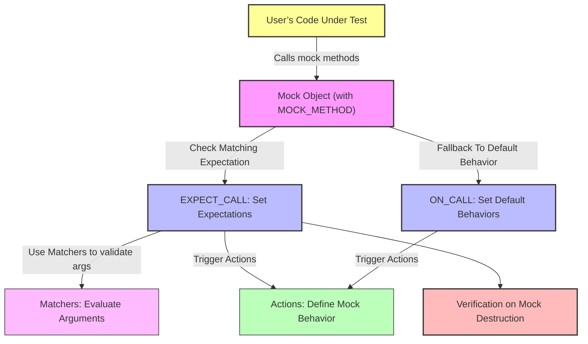

# Mocking Architecture: GoogleMock's Approach

Explore the core mechanism GoogleMock uses to create and manage test doubles within C++ testing. This guide walks through how mock objects, expectations, actions, and matchers work together to simulate and verify behaviors, highlighting their composability and extensibility.

---

## Understanding GoogleMock’s Mocking Architecture

GoogleMock introduces an elegant system to create *mock objects*—stand-ins for real objects in tests. This simulation enables you to verify interactions, control behaviors, and capture call details without invoking actual implementations.

### Why Use Mocks?

Imagine testing a component that depends on a database or network service. Interacting with these external resources in your tests can be slow, unreliable, or complex to setup. Mock objects remove these dependencies by:

- Mimicking interfaces of real collaborators.
- Enabling you to define precise behavioral expectations.
- Verifying that your code interacts with its dependencies correctly.

This leads to tests that are fast, stable, and more expressive about how components collaborate.

---

## Core Elements of GoogleMock’s Architecture

### 1. Mock Objects

Mock objects are classes derived from your interfaces or abstract base classes with mock methods created via the `MOCK_METHOD` macro. These mock methods replace the original method implementations and underpin all mocking behavior.

- **Defining Mocks:** Use `MOCK_METHOD` to declare mock methods in the public section regardless of the original access specifier.
- **Mock Types:** GoogleMock provides modifiers to control mock strictness — `NiceMock` (silences warnings for uninteresting calls), `NaggyMock` (default, warns on uninteresting calls), and `StrictMock` (fails tests on uninteresting calls).

### 2. Expectations (`EXPECT_CALL`)

Expectations specify how mock methods should be called during the test. You define:

- **Which methods are expected to be called.**
- **With what arguments.**
- **How many times (`Times`).**
- **In which order (`InSequence` or `After`).**
- **What actions they perform (`WillOnce`, `WillRepeatedly`).**

Example:

```cpp
EXPECT_CALL(mock, MethodName(Matcher1(), Matcher2()))
    .Times(3)
    .WillRepeatedly(Return(42));
```

This expects `MethodName` to be called three times with arguments matching the provided matchers, returning `42` each time.

### 3. Default Behaviors (`ON_CALL`)

`ON_CALL` defines the default behavior of mock methods when no specific expectation matches a call. Unlike `EXPECT_CALL`, it does ***not*** enforce that the method must be called.

Example:

```cpp
ON_CALL(mock, MethodName(_))
    .WillByDefault(Return(true));
```

Use `ON_CALL` to set fallback behaviors shared by many tests.

### 4. Matchers

Matchers express the criteria for argument values in expectations. They can:

- Match exact values (`Eq(value)`).
- Match any value (`_`).
- Match based on properties (`Gt(5)`, `NotNull()`).
- Combine other matchers (`AllOf(...)`, `AnyOf(...)`).

They let you focus tests on relevant argument properties without over-specifying.

### 5. Actions

Actions control what mock methods *do* when invoked, including:

- Returning values (`Return()`, `ReturnRef()`).
- Invoking callbacks (`Invoke()`).
- Modifying arguments (`SetArgPointee()`).
- Executing multiple actions sequentially (`DoAll()`).

You chain actions in expectations to simulate complex behaviors.

---

## User Workflow: How GoogleMock Components Collaborate

1. **Write a mock class using `MOCK_METHOD` macros** that mirror the interface you want to simulate.
2. **Create mock object instances** in your test and optionally set default behaviors with `ON_CALL`.
3. **Define precise expectations with `EXPECT_CALL`,** specifying when and how methods should be called.
4. **Execute your code-under-test,** which uses mock objects instead of real collaborators.
5. **GoogleMock automatically verifies expectations at mock destruction,** detecting violations such as incorrect call counts or argument mismatches.

This flow centers on user intent—focusing on verifying behavioral contracts and isolating dependencies.

---

## Extensibility and Composability

### Combining Actions and Expectations

GoogleMock supports composing sophisticated test doubles by chaining multiple `WillOnce` actions, or combining side-effects and return values with `DoAll`. For example:

```cpp
EXPECT_CALL(mock, Foo(_))
    .WillOnce(DoAll(SetArgPointee<0>(10), Return(true)));
```

This command sets the first output argument to 10 and returns `true` when `Foo` is called.

### Ordering and Partial Ordering

GoogleMock allows strict call ordering with `InSequence`, or complex partial orders with `After` clauses and multiple sequences. This supports testing behaviors that depend on call ordering while allowing flexibility.

### Custom Matchers and Actions

If built-in options are insufficient, you can define:

- **Custom Matchers** using `MATCHER` macros or implementing matcher classes. This lets you verify domain-specific constraints elegantly.
- **Custom Actions** either via lambdas, functors, or implementing action interfaces, enabling complex behaviors beyond simple returns.

---

## Best Practices and Common Pitfalls

- **Set expectations *before* exercising the mocks.** Setting them after calls leads to undefined behavior.
- **Avoid over-specifying expectations.** Focus on interactions you *care* to verify.
- **Use `NiceMock` to suppress uninteresting call warnings** when you don't want to track every method.
- **Use `StrictMock` to catch unexpected calls** early in tests where precise behavior is crucial.
- **Chain actions thoughtfully,** remembering that the last action’s return value is used.
- **When mocking overloaded methods,** help the compiler by specifying the overload explicitly.

---

## Troubleshooting

- **Unexpected calls:** Usually caused by missing or incorrect `EXPECT_CALL` statements.
- **Uninteresting call warnings:** Use `NiceMock` or add a catch-all `EXPECT_CALL` with `Times(AnyNumber())`.
- **Action ran out warnings:** Indicate you declared fewer `WillOnce()` actions than call cardinality; either add `WillRepeatedly()` or adjust `Times`.
- **Order violations:** Review `InSequence` or `After` dependencies for correctness.

---

## Architecture Diagram of GoogleMock Mocking Mechanism



---

## Summary

GoogleMock’s mocking architecture comprises mock objects with mocked methods, where `EXPECT_CALL` declarations set precise call expectations and `ON_CALL` sets default behaviors. Matchers evaluate argument patterns, and actions define the method's response. This architecture supports extensibility through custom matchers and actions and allows users to compose expectations with ordering and cardinality control to accurately verify interaction behavior. By focusing on the user’s perspective, GoogleMock helps make C++ tests robust, maintainable, and fast.

---

## Additional Tips

- Always prefer `ON_CALL` for default behavior to avoid unnecessary test fragility.
- Use `RetiresOnSaturation()` on expectations to prevent them from matching calls beyond their intended cardinality.
- Consider delegating to fakes or real objects for behavior retention alongside mocking.
- Leverage `Mock::VerifyAndClearExpectations()` if you need to explicitly verify mock behavior before destruction.

---

## See Also

- [Defining Mock Methods and Classes](/api-reference/core-mocking-api/mock-methods-and-classes)
- [Setting Call Expectations and Cardinalities](/api-reference/core-mocking-api/call-expectations-and-cardinalities)
- [Configuring Mock Behavior with Actions](/api-reference/core-mocking-api/mock-behavior-actions)
- [Using Built-in Matchers](/api-reference/matchers-and-assertions/using-built-in-matchers)
- [Creating Custom Matchers](/api-reference/matchers-and-assertions/creating-custom-matchers)
- [Mocking Basics](/guides/getting-started-workflows/mocking-basics)
- [gMock Cookbook](https://google.github.io/googletest/gmock_cook_book.html)
- [gMock for Dummies](https://google.github.io/googletest/gmock_for_dummies.html)

---

Refer back to the core [About GoogleTest](/overview/product-intro-core-concepts/about-googletest) and [Key Concepts & Terminology](/overview/product-intro-core-concepts/key-concepts-terminology) guides to understand how mocking fits into the broader testing framework.

