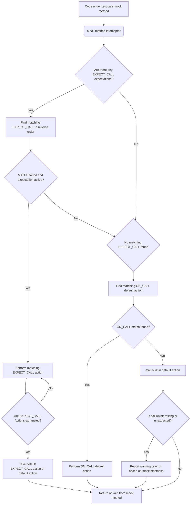

# Mocking Architecture and Behavior Control

Dive into the core mechanisms that power the mocking capabilities of GoogleMock. This guide explains how mock classes are constructed, how expectations and actions are specified, and how GoogleMock manages call verification and default behaviors to empower precise and flexible mocking in C++ tests.

---

## Overview of Mocking in GoogleMock

GoogleMock automates the creation of mock classes and provides a rich, expressive syntax to specify how these mock objects behave and verify interactions with tested code. At its core, GoogleMock manages two central concepts:

- **Expectations:** Statements about which mock method calls are expected, how many times, with what arguments, and what they should do.
- **Default Actions:** The behavior of mock methods when no explicit expectation matches a call.

GoogleMock’s mock objects intercept method calls, match them against specified expectations or default actions, execute predefined behaviors, and report unexpected or unmet calls.


## Constructing Mock Classes

Mock classes are written by inheriting from abstract interfaces and defining mock methods using the `MOCK_METHOD` macro. This macro declares mock methods that:

- Replace virtual functions of the base class.
- Support specifying constness, calling conventions, and other qualifiers.
- Support overloaded methods through explicit signatures and disambiguation utilities.

**Example:**
```cpp
class MockFoo : public Foo {
 public:
  MOCK_METHOD(int, GetSize, (), (const, override));
  MOCK_METHOD(string, Describe, (const char* name), (override));
};
```

Mock methods become the interception points where GoogleMock takes control to enforce behaviors and verify calls.


## Specifying Behavior: Expectations and Default Actions

GoogleMock provides two macros that form the declarative syntax for specifying mock behavior:

### ON_CALL

Use `ON_CALL(mock, Method(matchers))` to specify the **default behavior** of a mock method when it is called with arguments matching the matchers. This does *not* set an expectation that the call must happen — it only defines how the call behaves if it does happen.

Chainable modifiers:
- `.With(multi_arg_matcher)` — restricts to calls whose argument tuple matches the specified matcher.
- `.WillByDefault(action)` — defines the action to perform when the default behavior is invoked.


### EXPECT_CALL

Use `EXPECT_CALL(mock, Method(matchers))` to set an **expectation** that a mock method will be called with arguments matching the matchers. This macro helps verify *if, how many times*, and *in what order* the call occurs.

Chainable modifiers:
- `.With(multi_arg_matcher)` — refines argument matching.
- `.Times(cardinality)` — specifies how many times the call is expected (e.g., `Exact(n)`, `AtLeast(n)`, `AnyNumber()`).
- `.InSequence(sequence...)` — defines partial order sequences of calls.
- `.After(expectations...)` — restricts calls to happen only after specified expectations.
- `.WillOnce(action)` — defines behavior for the first matching call(s).
- `.WillRepeatedly(action)` — defines behavior after all `.WillOnce()`s are exhausted.
- `.RetiresOnSaturation()` — retires the expectation once it is saturated.


## Matching Incoming Calls to Expectations and Default Actions

When a mock method is called, GoogleMock searches its expectations in reverse order (newest first) for an active expectation that matches the call arguments and whose pre-requisites are satisfied.

- If a matching expectation is found and not saturated, its next action is performed.
- If an expectation is saturated or retired, GoogleMock skips it and looks for a suitable one.
- If no expectation matches, GoogleMock looks for a matching default action (from `ON_CALL`) and performs that.
- If no match is found and the call is uninteresting, GoogleMock follows the configured reaction (allow, warn, or fail).


## Sequencing Calls and Managing Call Order

### Sequences with `InSequence` object

You can enclose a set of expectations within an `InSequence` block to declare that the calls must occur in the order declared:

```cpp
{
  InSequence s;
  EXPECT_CALL(mock, A());
  EXPECT_CALL(mock, B());
}
```

This ensures that `A()` must be called before `B()`.

### Partial order with `InSequence` clause

To express more complex partial orders, create `Sequence` objects and specify which expectations belong to which sequences:

```cpp
Sequence s1, s2;
EXPECT_CALL(mock, Foo()).InSequence(s1, s2);
EXPECT_CALL(mock, Bar()).InSequence(s1);
EXPECT_CALL(mock, Baz()).InSequence(s2);
```

This builds a DAG of ordering constraints.

### `After` clause

You can also specify explicit prerequisite expectations which must be satisfied before another call can occur:

```cpp
Expectation e1 = EXPECT_CALL(mock, Init1());
ExpectationSet init_set;
init_set += EXPECT_CALL(mock, Init2());
EXPECT_CALL(mock, Use()).After(e1, init_set);
```


## Handling Call Violations

GoogleMock detects and reports several call violations:

- **Unexpected calls:** Calls that do not match any active expectation, unlike uninteresting calls which have no expectation at all.
- **Excessive calls:** Calls that exceed the upper limit specified by the expectation's cardinality.
- **Unsatisfied expectations:** Expectations that were expected but not met by test end.

Violation reporting includes argument mismatches, call count state, and helpful diagnostic messages.


## Default Behavior for Uninteresting and Unexpected Calls

By default, uninteresting calls (calls to methods with no expectations) generate warnings but proceed with the default action (usually a default value for the return type or doing nothing for `void` functions).

Unexpected calls (calls with no matching expectations) trigger errors or failures depending on mock strictness.

The verbosity of such messages and reactions can be controlled globally or on a per-mock-object basis using `NiceMock`, `NaggyMock` (default), or `StrictMock` wrappers.


## Expectation Lifetime and Retiring

Expectations remain **sticky** by default — they stay active even after saturation unless explicitly told to retire via `.RetiresOnSaturation()`. Expectations belonging to sequences automatically retire to maintain order.

Retirement simplifies partial order verification and avoids matching saturated expectations.


## Lifecycle Operations on Mocks

- **Verification on Destruction:** When a mock object is destroyed, GoogleMock verifies that all its expectations are satisfied and reports any violations.
- **Manual Verification:** Call `Mock::VerifyAndClearExpectations(&mock_obj)` to verify and clear expectations before destruction.
- **Clear Default Actions:** Call `Mock::VerifyAndClear(&mock_obj)` to also clear any default actions set by `ON_CALL`.
- **Allowing Leaks:** Use `Mock::AllowLeak(&mock_obj)` to suppress leak detection warnings for a mock object.


## Under-the-Hood Concurrency Control

GoogleMock synchronizes all mock method calls and expectation checking with a global mutex to protect internal state, guaranteeing thread-safe behavior when accessing mocks concurrently (assuming test setup and teardown are done single-threaded).


## Summary Example

```cpp
class MockFoo : public Foo {
 public:
  MOCK_METHOD(int, Compute, (int x), (override));
};

TEST(FooTest, Example) {
  MockFoo mock;

  ON_CALL(mock, Compute(_)).WillByDefault(Return(0));

  EXPECT_CALL(mock, Compute(10))
      .Times(2)
      .WillOnce(Return(5))
      .WillRepeatedly(Return(7))
      .RetiresOnSaturation();

  EXPECT_EQ(mock.Compute(10), 5);
  EXPECT_EQ(mock.Compute(10), 7);
  EXPECT_EQ(mock.Compute(15), 0);  // Uses ON_CALL default
}
```


## Practical Tips and Pitfalls

- **Order of Expectations:** For multiple expectations on the same method, place more specific expectations after more general ones because GoogleMock matches in reverse order.
- **Use `ON_CALL` for defaults:** Reserve `EXPECT_CALL` for calls you want to verify; use `ON_CALL` for behavior defaults.
- **RetiresOnSaturation:** Use when you want an expectation to deactivate after reaching its call limit, preventing upper-bound violations on repeated calls.
- **Sequences:** Use `InSequence` or `After` to express call order constraints clearly.
- **Verbose Output:** Increase verbosity with `--gmock_verbose=info` to trace call matching when debugging.
- **Don't set expectations after calls:** Always set mocks’ expectations before the code using them is exercised.


## Diagram: Mocking Architecture and Behavior Flow



*This diagram illustrates how GoogleMock intercepts calls, attempts to match expectations, executes associated actions, and handles calls with default behaviors or violations.*


## Troubleshooting Common Issues

- **Uninteresting Call Warnings:** Seeing "Uninteresting mock function call" means a mock method was called without a matching `EXPECT_CALL`. Consider adding an `EXPECT_CALL(...).Times(AnyNumber())` if the call is expected, or use a `NiceMock` wrapper.
- **Unexpected Call Failures:** Occur when a mock method is called with arguments not matching any `EXPECT_CALL`. Verify your matchers and ensure the test sets appropriate expectations.
- **Call Count Mismatch:** Happens if `EXPECT_CALL` cardinalities are not met. Use the GoogleMock verbose output and stack traces to identify missing or excessive calls.
- **Order Violations:** When using sequences, calls out of order cause failures. Make sure that call order matches expectations.


## Further Reading and Related Documentation

- [gMock for Dummies](https://google.github.io/googletest/gmock_for_dummies.html): User-friendly beginner guide to mocking.
- [gMock Cheat Sheet](https://google.github.io/googletest/gmock_cheat_sheet.html): Quick reference for mocking and expectations.
- [Mocking Reference](../api-reference/mocking-framework/mock-objects-and-methods.md): Detailed API documentation.
- [Actions, Matchers, and Extensions](../api-reference/actions-matchers-extensions/action-templates-and-custom-actions.md): How to customize mock behavior.
- [Mock Strictness Guide](../guides/practical-testing-patterns/mock-strictness.md): Managing behaviour on uninteresting calls.


---

This page provides a detailed yet accessible explanation to empower users to understand and master GoogleMock’s core mocking architecture and behavior control mechanisms, leading to more effective unit testing and robust software designs.
