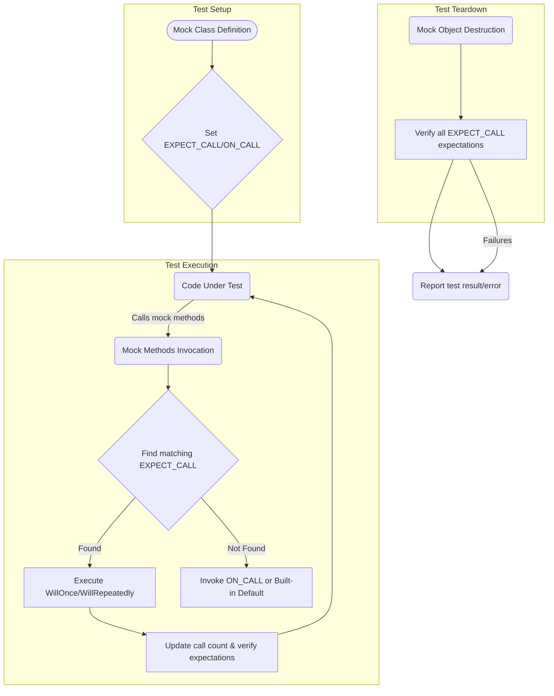

# Mocking Architecture & Integration

GoogleMock extends GoogleTest with a powerful and expressive mocking subsystem that enables developers to validate interactions between objects in C++ tests. This page explains how mocking integrates deeply into the core test execution lifecycle, detailing the user-centric workflow from mock class definition to expectation verification.

---

## Overview of Mocking in GoogleTest

Mocking is a technique to replace real objects with *mock* objects that simulate behavior and allow inspection of interactions. GoogleMock provides macros and classes to simplify this process for C++ developers, enabling:

- Automatic generation of mock classes and methods
- Specification of expected calls with precise argument matching
- Control over call counts, order, and behavior
- Verifications enforced at runtime with clear diagnostics

This integration significantly improves test reliability, speed, and clarity by isolating components and verifying their collaboration.

<Info>
Mocking is entirely user-driven. Expectations and default behaviors must be explicitly specified in tests to guide mock behavior and validation.
</Info>

---

## Mock Class Specification

The core of mocking in GoogleMock revolves around defining mock classes that inherit from interfaces or abstract classes. These mocks:

- Implement the same methods as the real class/interface, using the `MOCK_METHOD` macro
- Are generated with internal machinery registering expectations and default behaviors

### Defining Mock Methods

Mock methods are defined in the `public:` section of a mock class with the `MOCK_METHOD` macro in the following format:

```cpp
MOCK_METHOD(ReturnType, MethodName, (Args...), (Qualifiers));
```

Qualifiers can include `const`, `override`, `noexcept`, calling conventions, and reference qualifiers.

#### Example:

```cpp
class MockTurtle : public Turtle {
 public:
  MOCK_METHOD(void, PenUp, (), (override));
  MOCK_METHOD(void, Forward, (int distance), (override));
  MOCK_METHOD(int, GetX, (), (const, override));
};
```

<Note>
All pure virtual methods must be mocked or overridden to avoid abstractness.
</Note>

---

## Setting Expectations and Default Actions

Once mock classes are defined, developers specify how mocks should behave during tests with two primary macros:

### 1. `EXPECT_CALL` — Setting Call Expectations

`EXPECT_CALL(mock_object, Method(matchers))` specifies expectations on when and how often mock methods are called, with what arguments, and what actions they should perform.

```cpp
EXPECT_CALL(turtle, Forward(100))
    .Times(AtLeast(1))
    .WillOnce(Return());
```

Key aspects:

- **Matchers** specify which calls to expect (argument predicates, wildcards, or specific values).
- **Cardinalities** (`Times()`) define how many times the call should occur.
- **Actions** (`WillOnce()`, `WillRepeatedly()`) define what the mock method does when called.
- Expected call order can be controlled with `.InSequence()` and `.After()`.

<Warning>
Expectations must be set **before** the mock method is called; otherwise behavior is undefined.
</Warning>

### 2. `ON_CALL` — Defining Default Behaviors Without Expectations

`ON_CALL(mock_object, Method(matchers))` sets default actions for mock methods without enforcing call counts. These default actions are invoked when no matching `EXPECT_CALL` applies.

```cpp
ON_CALL(turtle, Forward(_))
    .WillByDefault(Return());
```

Use `ON_CALL` for common default responses, and `EXPECT_CALL` to enforce behavior and verify test correctness.

---

## Call Matching and Invocation Flow

When your code under test invokes a mock method:

1. GoogleMock finds the most recent matching expectation (`EXPECT_CALL`) that is active and whose arguments match.
2. If none is found, it falls back to the default action defined by the appropriate `ON_CALL` spec.
3. If no default action exists, a built-in default action is used (e.g., returning zero, false, or default constructor).
4. GoogleMock increments call counts and verifies cardinalities to detect violations immediately.

This process happens atomically and thread-safely to prevent race conditions.

---

## Expectation Management and Verification

Expectations and default actions are tracked internally per mock object. When an expectation is saturated or an ordering prerequisite is met, expectations may retire to prevent further matching.

Verification is performed automatically when a mock object is destructed. If any expectations are unmet or violated:

- GoogleMock emits detailed non-fatal failures with source locations and call histories.
- Tests fail with informative messages to aid debugging.

You can also force verification explicitly using:

```cpp
Mock::VerifyAndClearExpectations(&mock_object);
```

---

## Controlling Mock Strictness

GoogleMock supports different mock strictness levels:

- **NaggyMock (default):** Warns on uninteresting calls.
- **NiceMock:** Suppresses warnings on uninteresting calls.
- **StrictMock:** Treats uninteresting calls as fatal failures.

You can easily wrap your mock types with these templates:

```cpp
NiceMock<MockFoo> nice_mock;
StrictMock<MockFoo> strict_mock;
```

This controls how GoogleMock treats calls to mock methods without explicit expectations.

---

## Ordering Mock Calls

GoogleMock enables specifying call order to verify interaction sequences:

- Use `InSequence` (RAII scoped object) to enforce strict order on expectations created in its context.
- Use `.InSequence()` clause on individual expectations to include them in one or more sequences.
- Use `.After()` clauses to specify that a call must happen after one or more other expectations.

These tools allow precise modeling of complex partial orders in test scenarios.

---

## Integration with GoogleTest Lifecycle

Mock objects partake fully in the GoogleTest test case lifecycle:

1. **Setup Phase:** Define mocks, set default behaviors (`ON_CALL()`), and expectations (`EXPECT_CALL()`).
2. **Test Execution Phase:** Code under test calls mock methods. GoogleMock intercepts calls, verifies expectations immediately, and performs specified actions.
3. **Teardown Phase:** Mock objects are destructed, triggering verification of any remaining expectations.

Failures detected in verification become part of the test's result and report with stack traces and locations.

<Note>
GoogleMock and GoogleTest coordinate synchronization internally to ensure thread safety and integrity during concurrent test runs.
</Note>

---

## Common Workflow Example

```cpp
#include <gmock/gmock.h>
#include <gtest/gtest.h>

using ::testing::_;
using ::testing::Return;
using ::testing::AtLeast;

// Interface
class Turtle {
 public:
  virtual ~Turtle() {}
  virtual void PenDown() = 0;
  virtual void Forward(int) = 0;
};

// Mock
class MockTurtle : public Turtle {
 public:
  MOCK_METHOD(void, PenDown, (), (override));
  MOCK_METHOD(void, Forward, (int), (override));
};

// Code under test
class Painter {
 public:
  explicit Painter(Turtle* t) : turtle_(t) {}
  bool DrawCircle(int x, int y, int radius) {
    turtle_->PenDown();
    turtle_->Forward(radius);
    //... other drawing logic ...
    return true;
  }

 private:
  Turtle* turtle_;
};

// Test
TEST(PainterTest, DrawsSomething) {
  MockTurtle turtle;
  EXPECT_CALL(turtle, PenDown()).Times(AtLeast(1));
  EXPECT_CALL(turtle, Forward(_)).Times(1);

  Painter painter(&turtle);
  EXPECT_TRUE(painter.DrawCircle(0, 0, 10));
}
```

---

## Troubleshooting Mock Integration Issues

- **Uninteresting Calls Warning:** Occurs when a mock method without expectations is called. Address by adding `EXPECT_CALL(...).Times(AnyNumber())` or using `NiceMock`.

- **Unexpected Calls Error:** Happens when a call does not match any active expectation. Verify your matchers and call sequences.

- **Leaked Mock Objects:** GoogleMock detects mocks that are never deleted and reports errors. Use `Mock::AllowLeak()` to suppress warnings if intentional.

- **Ordering Violations:** Use sequences and `.After()` to fix call order mismatches.

- **Multiple Conflicting Expectations:** Remember that GoogleMock picks expectations in reverse declaration order. More specific expectations should be declared after general catch-alls.

<Check>
Verify that mock classes have virtual destructors to avoid memory errors and heap leaks.
</Check>

---

## Visualizing Mocking Architecture



---

## Summary

GoogleMock tightly integrates mocking constructs into the GoogleTest framework, streamlining creation, execution, and verification of mock interactions in C++ test workflows. This architecture empowers developers to craft resilient, fast, and readable unit tests emphasizing inter-object behaviors.

---

## Further Reading & References

- [gMock for Dummies](https://google.github.io/googletest/gmock_for_dummies.html): Beginner-friendly introduction and usage patterns.
- [Mocking Reference](../reference/mocking.md): Overview of macros, classes, and usage.
- [Setting Expectations](../api-reference/googlemock-api/setting-expectations.md): Detailed patterns and clauses for `EXPECT_CALL` and `ON_CALL`.
- [Creating & Using Mocks](../api-reference/googlemock-api/creating-and-using-mocks.md): Guidance on defining mock classes.
- [Nice, Naggy & Strict Mocks](../api-reference/googlemock-api/nice-strict-mocks.md): Controlling uninteresting call behavior.
- [Effective Mocking with GoogleMock](../../guides/advanced-features-and-patterns/effective-mocking.md): In-depth guide on best practices.
- [Test Case Lifecycle & Execution Flow](./test-lifecycle.md): Understanding GoogleTest integration.

---

For hands-on integration guidance, see **Building and Running Tests in Real Projects** and **Continuous Integration (CI) Setup** in the Integration & Optimization guides.


