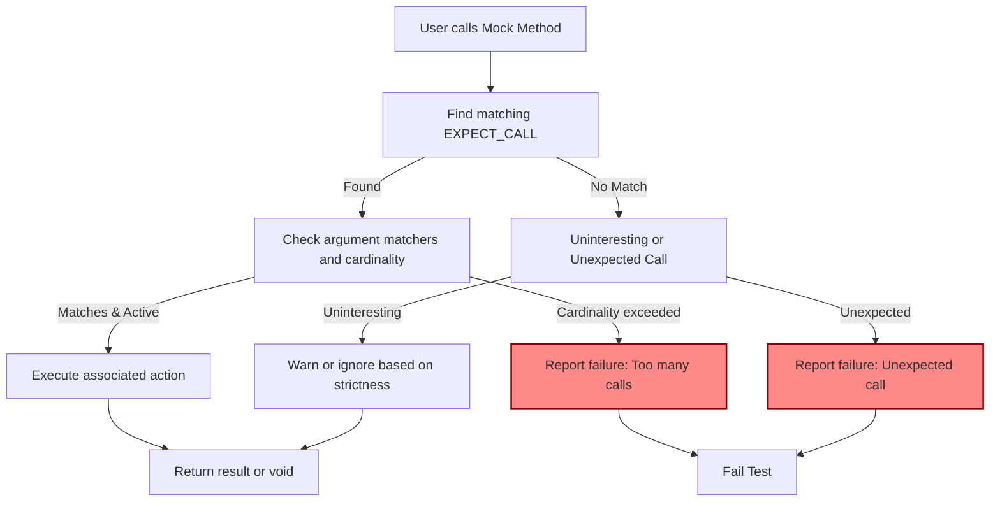

# Mocking Architecture: GoogleMock Internals

GoogleMock (gMock) provides a powerful mechanism for generating mock objects dynamically and intercepting calls at runtime within C++ tests. This document unveils the core architecture behind gMock's ability to simulate interfaces and manage expectations, cardinalities, and actions with precision and flexibility.

## Overview of GoogleMock's Dynamic Mocking

At its core, GoogleMock transforms abstract or virtual interfaces into mock classes that can verify behavior via *expectations* and *actions*. The fundamental pieces that enable this functionality include:

- **Mock Class Generation** — Automatically produced mock classes using macros like `MOCK_METHOD` that define mock methods simulating the real interface.
- **Call Interception** — Mechanisms that capture calls to mock methods and route them through GoogleMock’s expectation and action matching system.
- **Expectation Matching and Cardinality Control** — Infrastructure to match incoming calls against predefined expectations, track call counts, and enforce constraints.
- **Action Invocation** — Executing user-specified behaviors or default actions when method calls occur.
- **Mock Strictness Policies** — Wrappers such as `NiceMock`, `NaggyMock`, and `StrictMock` control how uninteresting calls are handled (ignored, warned, or treated as failures).

Each of these components collaborates seamlessly to offer a rich DSL for mocking while ensuring tests remain readable, maintainable, and precise.

---

## Core Components and Their Roles

### 1. Mock Class Generation

GoogleMock uses the `MOCK_METHOD` macro to generate mock method implementations for virtual functions. When you write:

```cpp
class MockFoo : public Foo {
 public:
  MOCK_METHOD(int, GetSize, (), (const, override));
  MOCK_METHOD(std::string, Describe, (const char* name), (override));
};
```

this macro expands to generate boilerplate code that:

- Overrides the base virtual method.
- Interfaces with GoogleMock’s runtime to check expectations, record calls, and trigger behaviors.

This automated generation vastly reduces user effort and improves consistency.

**Important details:**

- Mock methods must be defined in the public section, even if mocking protected or private methods.
- Mocking class templates and overloaded methods is fully supported.

For more about mock class creation, see the [gMock Cheat Sheet](https://google.github.io/googletest/gmock_cheat_sheet.html#MockClass) and [gMock Cookbook - Creating Mock Classes](https://google.github.io/googletest/gmock_cook_book.html#CreatingMockClasses).

### 2. Call Interception and Routing

When a mock method is invoked during a test, the generated mock method passes control to the internal mocking framework. This involves:

- Looking up the registered expectations for the mock object and method.
- Determining which, if any, expectations match the call (based on argument matchers and state).
- Executing the corresponding action defined for that expectation.

This dynamic dispatch enables:

- Validation of call counts and argument correctness.
- Customizable behavior through actions like `Return()`, `Invoke()`, or user-defined lambdas.

This interception layer ensures immediate feedback and fine-grained control during test runs.

### 3. Expectation Matching and Cardinalities

Each expectation defined via `EXPECT_CALL` comprises:

- **Matchers:** Criteria specifying expected method arguments.
- **Cardinality:** Number of expected calls (e.g., exactly once, any number, at least N).
- **Ordering Constraints:** Sequences and prerequisites controlling call order (`InSequence`, `After`).

The matcher infrastructure evaluates runtime calls against these constraints. The matching follows these rules:

- Expectations are checked in reverse declaration order (“newer rules override older”).
- Calls that satisfy an expectation perform its associated action.
- Calls that violate expectations produce immediate failure reports.

Cardinalities are carefully tracked to detect too few or too many calls. Expectations can retire after saturation if requested, allowing for complex call sequences.

(See [Mocking Reference - EXPECT_CALL](https://google.github.io/googletest/reference/mocking.html#EXPECT_CALL) and [Advanced Mocking Features - Cardinalities](https://google.github.io/googletest/api/gmock_cardinalities_8md.html) for details.)

### 4. User-Defined Actions

An expectation not only specifies which calls are expected but also what should happen when matched. Actions define behaviors like:

- Returning values (`Return()`, `ReturnRef()`)
- Setting output arguments (`SetArgPointee()`)
- Calling user functions or lambdas (`Invoke()`)
- Performing side effects or combining multiple actions (`DoAll()`)

Users can chain `WillOnce()` and `WillRepeatedly()` to define sequences of behaviors. When explicit actions run out, default or fallback actions apply.

Custom actions can be implemented as lambdas or functors, giving maximum flexibility.

(Learn more from the [Actions Reference](https://google.github.io/googletest/reference/actions.html) and [gMock Cookbook - Using Actions](https://google.github.io/googletest/gmock_cook_book.html#UsingActions).)

### 5. Mock Strictness Policies

Mock objects can be wrapped in strictness wrappers to control handling of *uninteresting calls* (calls without explicit expectations):

- **NaggyMock**: Default mode, warns on uninteresting calls.
- **NiceMock**: Suppresses warnings on uninteresting calls.
- **StrictMock**: Treats all uninteresting calls as test failures.

These wrappers inherit from the original mock class and adjust behavior via internal registration with the mocking framework. Usage looks like:

```cpp
using ::testing::NiceMock;
NiceMock<MockFoo> nice_foo;
```

This mechanism balances flexibility and strictness in verifying interactions.

See the [Behavior Strictness Reference](https://google.github.io/googletest/reference/advanced_mocking_features/behavior_strictness.html) and the [gMock Nice, Strict, Naggy recipe](https://google.github.io/googletest/gmock_cook_book.html#NiceStrictNaggy) for details.

---

## Interaction Flow Diagram

The following flowchart illustrates the runtime interaction when a mock method is called:



---

## Key Headers and Macros

GoogleMock’s core functionality is organized into key headers and macros:

- **`gmock/gmock.h`**: The main include that brings in all mocking features.
- **`MOCK_METHOD` macro**: Defines mock methods dynamically replicating virtual methods.
- **`EXPECT_CALL` macro**: Sets expectations on mock methods with matchers and actions.
- **`ON_CALL` macro**: Defines default behavior without expectations.
- **Strictness wrappers**: `NiceMock`, `NaggyMock`, and `StrictMock` templates.

The macros help generate code that interacts with the internal mocking engine, which maintains expectation sets, call counts, and dispatches actions.

---

## Practical Tips and Best Practices

- **Define mocks for virtual methods only**: Only virtual or interface methods can be mocked via `MOCK_METHOD`.
- **Always specify expected calls before invoking code** to avoid undefined behavior.
- **Use `ON_CALL` to define common default behaviors** and `EXPECT_CALL` to assert strict expectations.
- **Leverage strictness wrappers** according to your test needs: prefer `NiceMock` to suppress unnecessary warnings, use `StrictMock` to enforce strict call verification.
- **Use sequences and `After` clauses** to assert call ordering precisely.
- **Retire expectations on saturation** to handle repeated calls cleanly.
- **For overloaded functions, disambiguate using `Const()` or more specific matchers.**

---

## Troubleshooting Common Issues

- **Uninteresting function call warnings:** Use `NiceMock` or add a catch-all `EXPECT_CALL` with `Times(AnyNumber())`.
- **Unexpected call failures:** Verify that `EXPECT_CALL` matches the call arguments correctly and consider ordering.
- **Too many/few calls errors:** Check cardinalities and the usage of `WillOnce` / `WillRepeatedly`.
- **Mocking non-virtual or static functions:** Refactor to interfaces or use alternative approaches (e.g., `MockFunction`).

---

## References and Further Reading

- [gMock Cheat Sheet](https://google.github.io/googletest/gmock_cheat_sheet.html): Quick reference for mock class definitions.
- [gMock for Dummies](https://google.github.io/googletest/gmock_for_dummies.html): Beginner-friendly guide.
- [gMock Cookbook](https://google.github.io/googletest/gmock_cook_book.html): Deep dive into using actions, matchers, and advanced features.
- [Mocking Reference](https://google.github.io/googletest/reference/mocking.html): API reference for mocking macros and classes.
- [Behavior Strictness](https://google.github.io/googletest/reference/advanced_mocking_features/behavior_strictness.html): Guide to `NiceMock`, `NaggyMock`, and `StrictMock`.

---

This page fits into the broader GoogleTest documentation as a technical concept guide revealing how GoogleMock dynamically generates mocks and controls call behavior to empower effective, interaction-based testing in C++.


<Source url="https://github.com/google/googletest" branch="main" paths={[{"path": "googlemock/gmock.h", "range": "1-200"},{"path": "googlemock/gmock-nice-strict.h", "range": "1-180"},{"path": "googlemock/gmock-spec-builders.h", "range": "1-500"}]} />
