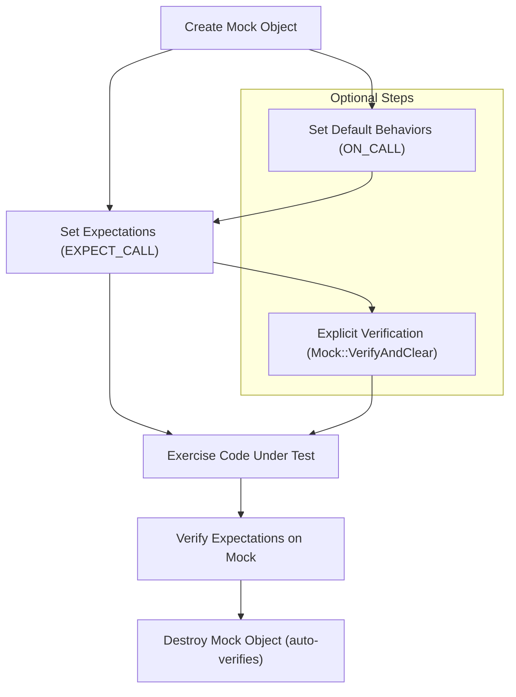

# Mocking Model and Expectations

Dive into the foundational model of mocking in GoogleMock. This guide will help you understand how expectation setting, cardinality, and verification collaborate to simulate and assert complex interactions in your C++ tests. You'll also learn how mock classes are generated and how the behavior of mocks changes with nice, strict, and naggy wrappers.

---

## Understanding the GoogleMock Mocking Model

GoogleMock extends GoogleTest by providing a powerful way to simulate and verify interactions between your code and its dependencies. Mocking is about defining **expectations** for method calls on mock objects and **verifying** that these expectations are met during test execution.

### What User Wants to Achieve

- **Mock class creation:** Automatically generate mock classes from interfaces.
- **Set expectations:** Specify how many times methods should be called, with what arguments.
- **Specify behaviors:** Define what mock methods return or do when called.
- **Verify interactions:** Ensure the code under test interacts with its dependencies correctly.
- **Control strictness:** Adjust the strictness level to make tests flexible or rigorous.

---

## Mock Class Generation

Mock classes in GoogleMock are generated via the `MOCK_METHOD` macro. Given an interface with virtual methods, `MOCK_METHOD` expands to provide a method override that tracks invocations and arguments, enabling fine-grained control and verification.

```cpp
class Foo {
 public:
  virtual ~Foo() = default;
  virtual int GetSize() const = 0;
  virtual std::string Describe(const char* name) = 0;
  virtual bool Process(int elem, int count) = 0;
};

class MockFoo : public Foo {
 public:
  MOCK_METHOD(int, GetSize, (), (const, override));
  MOCK_METHOD(std::string, Describe, (const char* name), (override));
  MOCK_METHOD(bool, Process, (int elem, int count), (override));
};
```

### Tips for Mock Class Creation

- The base class methods to be mocked **must be virtual** (including the destructor).
- Place `MOCK_METHOD` calls in the `public:` section of your mock class.
- Overloaded methods must be mocked individually.
- For methods with complex argument types containing commas, wrap types in extra parentheses or use type aliases.

---

## Setting Expectations with `EXPECT_CALL`

### Basic Workflow

1. Create your mock object(s).
2. Set expectations that specify the expected calls:
   - Which methods will be called.
   - With what arguments (using matchers).
   - How many times (cardinality).
   - What they should do (actions).
3. Run your test code that interacts with the mocks.
4. GoogleMock verifies expectations automatically when mocks are destroyed.

#### Example

```cpp
using ::testing::Return;

MockFoo mock_foo;

EXPECT_CALL(mock_foo, GetSize())
    .Times(3)
    .WillRepeatedly(Return(42));

// Code that uses mock_foo...
```

GoogleMock will check that `GetSize` was called exactly 3 times and will return 42 each time.

### Arguments Matching

You can specify argument matchers for each parameter of an expected call, such as:

- Exact values: `EXPECT_CALL(mock_foo, Process(5, 10));`
- Wildcards: using `_` to accept any value
- Predicates and built-in matchers: e.g., `Gt(5)`, `NotNull()`, `StartsWith("abc")`.
- Custom matchers: defined via `MATCHER` and `MATCHER_P` macros.

To ignore argument matching, omit parameters or explicitly use wildcards.

### Cardinalities (Call Count Expectations)

`Times()` specifies how many times a call is expected:

| Cardinality       | Meaning                                  |
|-------------------|------------------------------------------|
| `Exactly(n)` or `n` | Called exactly `n` times
| `AtLeast(n)`      | Called at least `n` times                 |
| `AtMost(n)`       | Called at most `n` times                  |
| `Between(m,n)`    | Called between `m` and `n` times (inclusive) |
| `AnyNumber()`     | Called any number of times                 |

By default, if no `Times()` is specified:
- If no action clauses, assumed `Times(1)`.
- If `WillOnce()` clauses given, inferred cardinality equals number of `WillOnce()` calls.
- If `WillRepeatedly()` given, cardinality inferred as `AtLeast(n)` where `n` is number of `WillOnce()`.

---

## Mock Strictness: Nice, Naggy, and Strict

Depending on how you want to handle uninteresting calls (calls with no explicit expectation), GoogleMock provides three wrappers:

| Wrapper               | Behavior on Uninteresting Calls                              | Usage Example               |
|-----------------------|-------------------------------------------------------------|-----------------------------|
| **NaggyMock** (default) | Prints warnings for uninteresting calls                      | `NaggyMock<MockFoo> naggy_foo;` |
| **NiceMock**           | Silences warnings for uninteresting calls                    | `NiceMock<MockFoo> nice_foo;`   |
| **StrictMock**         | Treats uninteresting calls as test failures                  | `StrictMock<MockFoo> strict_foo;` |

### How to Use

Simply declare your mock instance wrapped by any of these templates:

```cpp
using ::testing::NiceMock;
using ::testing::NaggyMock;
using ::testing::StrictMock;

NiceMock<MockFoo> nice_mock;
NaggyMock<MockFoo> naggy_mock;
StrictMock<MockFoo> strict_mock;
```

These wrappers inherit constructors from the underlying mock class, so you can pass constructor arguments as needed.

### Important Considerations

- The wrapper affects only methods defined in `MockFoo` itself, not in base classes.
- Destructors should be virtual for these wrappers to work correctly.
- Nesting such wrappers (e.g., `NiceMock<StrictMock<MockFoo>>`) is not supported.

### When to Use

- Use **NiceMock** for less noisy tests when uninteresting calls are common and safe to ignore.
- Use **NaggyMock** (default) for moderation with warnings on uninteresting calls.
- Use **StrictMock** for rigorous verification where unanticipated calls indicate test failures.

---

## Verification and Resetting

GoogleMock automatically verifies that all expectations on a mock are satisfied when the mock object is destroyed.

For earlier verification or to clear expectations:

```cpp
using ::testing::Mock;

// Verify expectations and clear them on mock_obj
bool success = Mock::VerifyAndClearExpectations(&mock_obj);

// Verify expectations and clear along with default actions
bool success = Mock::VerifyAndClear(&mock_obj);
```

**Note:** Do **not** set new expectations after verifying and clearing a mock, as it leads to undefined behavior.

---

## Expectation Ordering and Sequences

By default, expectations can be matched in any order. To enforce call order, use:

- **InSequence**:

```cpp
using ::testing::InSequence;
{
  InSequence s;
  EXPECT_CALL(mock, Foo());
  EXPECT_CALL(mock, Bar());
}
```

This expects `Foo()` to be called before `Bar()`.

- **Sequences**:

```cpp
using ::testing::Sequence;
Sequence s1, s2;

EXPECT_CALL(mock, A()).InSequence(s1, s2);
EXPECT_CALL(mock, B()).InSequence(s1);
EXPECT_CALL(mock, C()).InSequence(s2);
```

You can specify complex partial orderings.

- **After** clause:

Set one call to happen after others:

```cpp
Expectation e1 = EXPECT_CALL(mock, InitX());
Expectation e2 = EXPECT_CALL(mock, InitY());
EXPECT_CALL(mock, Describe()).After(e1, e2);
```

---

## Practical Examples

### Creating a Mock and Setting Expectations

```cpp
#include <gmock/gmock.h>

class Foo {
 public:
  virtual ~Foo() {}
  virtual int Compute(int x) = 0;
};

class MockFoo : public Foo {
 public:
  MOCK_METHOD(int, Compute, (int x), (override));
};

using ::testing::Return;

TEST(MyTest, UsesMock) {
  MockFoo mock;

  EXPECT_CALL(mock, Compute(5))
      .Times(2)
      .WillRepeatedly(Return(10));

  EXPECT_EQ(mock.Compute(5), 10);
  EXPECT_EQ(mock.Compute(5), 10);
}
```

### Using NiceMock to Suppress Warnings

```cpp
using ::testing::NiceMock;

NiceMock<MockFoo> mock;
EXPECT_CALL(mock, Compute(5)).WillOnce(Return(10));

mock.Compute(5);
mock.Compute(7);  // No warning printed even though no expectation set for 7
```

### StrictMock to Fail on Unexpected Calls

```cpp
using ::testing::StrictMock;

StrictMock<MockFoo> mock;
EXPECT_CALL(mock, Compute(5)).WillOnce(Return(10));

mock.Compute(5);  // OK
mock.Compute(7);  // Test fails: unexpected call
```

### Using `ON_CALL` for Default Behavior

```cpp
ON_CALL(mock, Compute(_))
    .WillByDefault(Return(0));

EXPECT_CALL(mock, Compute(5)).WillOnce(Return(10));

EXPECT_EQ(mock.Compute(7), 0);  // No expectation, but default behavior defined.
```

---

## Common Pitfalls and Best Practices

- **Virtual Destructors:** Always ensure the base interface has a virtual destructor to avoid resource leaks.
- **Set Expectations Before Use:** Always set `EXPECT_CALL` before exercising the mock; behavior is undefined otherwise.
- **Avoid Over-Specification:** Only specify expectations necessary for your test, avoid too many strict conditions.
- **Use NiceMock for Flexibility:** Prefer `NiceMock` in tests that call many uninteresting methods to reduce noise.
- **Use Sequences for Ordering:** Use `InSequence` or `Sequence` when the order of function calls matters.
- **Clean Up and Verify:** Use `Mock::VerifyAndClear*` to verify mocks early if required.

---

## Summary Diagram: Mocking Workflow



---

## References and Further Reading

- [gMock Cheat Sheet](https://google.github.io/googletest/gmock_cheat_sheet.html) – Quick reference for mocking usage.
- [gMock Cookbook](https://google.github.io/googletest/gmock_cook_book.html) – In-depth recipes for mocking strategies.
- [Mock Methods API](https://google.github.io/googletest/api/gmock_ref/mocking_and_matcher_api/mock_methods_api.html) – Detailed specification of MOCK_METHOD macro.
- [Nice, Naggy, and Strict Mock API](https://google.github.io/googletest/api/gmock_ref/mocking_and_matcher_api/nice__naggy__strict__mock__api.html) – Details on strictness wrappers.
- [Core Concepts and Terminology](../overview/core-concepts-architecture/core-concepts-terminology.md) – Understanding basic ideas in GoogleTest and GoogleMock.

---

*This guide focuses specifically on the modeling and expectation setting mechanisms in GoogleMock, enabling clear and maintainable mock-based testing.*