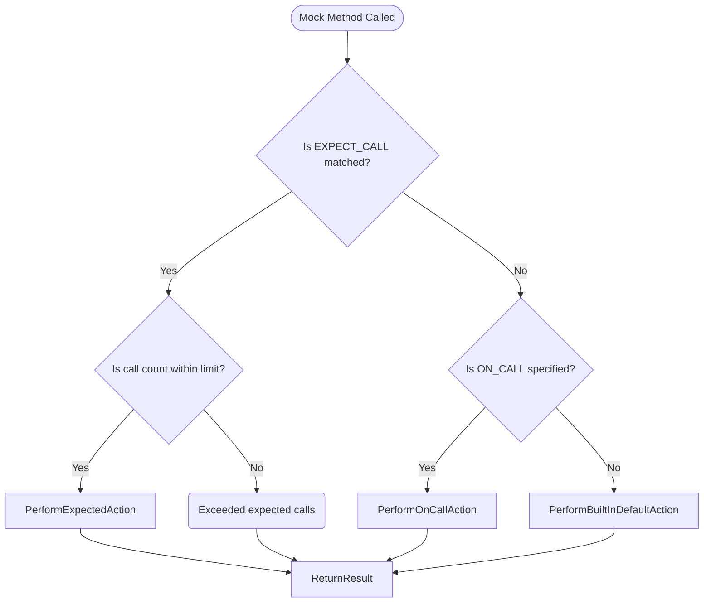

# Mocking & Mock Object Fundamentals

GoogleMock offers powerful tools to create mock classes in C++ to facilitate unit testing by isolating dependencies, verifying interactions, and controlling method behaviors. This guide introduces the core principles behind mocking with GoogleMock, focusing on mock classes, expectations, and mock objects’ role in ensuring robust, controlled test environments.

---

## Introduction to Mocking

Mock objects simulate the behavior of real objects in a controlled way, enabling developers to focus on the component under test without relying on complex or unavailable dependencies. GoogleMock is designed specifically for C++ and provides an expressive, declarative syntax to describe mock classes and specify expectations about method calls.

Mocking helps you:

- Isolate code under test from its collaborators
- Verify that the interactions between components conform to expectations
- Simulate complex or error scenarios easily
- Make tests faster by avoiding expensive external resources

## Mock Classes and Mock Methods

At the heart of GoogleMock is the mock class. You define a mock class by inheriting from an interface or base class and declaring mock methods with the `MOCK_METHOD` macro. This macro generates mock implementations for the methods you want to validate or control in tests.

### Declaring a Mock Method

Use `MOCK_METHOD` in the `public` section of your mock class to define a mocked method:

```cpp
class MockFoo : public Foo {
 public:
   MOCK_METHOD(int, GetSize, (), (const, override));
   MOCK_METHOD(std::string, Describe, (int type), (override));
};
```

Note:
- If a method is const or has qualifiers, include them as the optional 4th macro argument.
- Commas within argument types must be enclosed in parentheses or replaced with type aliases.

### Mock Objects in Use

Mock objects are instances of mock classes. When executed in tests, calls to mocked methods check expectations and execute specified behaviors or default actions.

```cpp
MockFoo mock_foo;
EXPECT_CALL(mock_foo, GetSize()).WillOnce(Return(5));
EXPECT_EQ(5, mock_foo.GetSize());
```

## Setting Expectations with EXPECT_CALL

`EXPECT_CALL` expresses an expectation that a mock method is called with particular arguments, zero or more times, and optionally defines the behavior when called.

Example:

```cpp
EXPECT_CALL(mock_obj, Method(arg_matchers...))
    .Times(cardinality)
    .InSequence(sequence)
    .After(other_expectations)
    .WillOnce(action)
    .WillRepeatedly(action);
```

### Core Clauses Explained

- **With**: Restricts calls to those whose combined arguments match a multi-argument matcher.
- **Times**: Specifies how many times the call is expected. Supports `AnyNumber()`, `AtLeast(n)`, `AtMost(n)`, `Between(m, n)`, or `Exactly(n)`.
- **InSequence**: Requires the call to happen in a specified order within sequences.
- **After**: Specifies that this call must happen after specified expectations are satisfied.
- **WillOnce**: Defines the behavior (action) the mock method performs on the next call.
- **WillRepeatedly**: Defines the behavior for all subsequent calls after `WillOnce` actions run out.
- **RetiresOnSaturation**: Retires the expectation once saturated, making it inactive for further calls.

### Managing Call Order and Cardinality

By default, expectations can be fulfilled in any order. You can enforce strict or partial ordering with `InSequence` and `After`. Cardinality controls how many times calls should occur.

```cpp
Sequence s;
EXPECT_CALL(mock, Foo(1)).InSequence(s);
EXPECT_CALL(mock, Foo(2)).InSequence(s);
```

## Defining Default Behavior with ON_CALL

`ON_CALL` specifies default behaviors for mock methods without asserting that the method must be called. It provides the fallback actions used when no matching `EXPECT_CALL` is found.

```cpp
ON_CALL(mock_obj, Method(arg_matchers...))
    .With(matcher)      // optional
    .WillByDefault(action);  // mandatory
```

This enables graceful default handling of method calls you do not explicitly expect.

## Mock Object Strictness

GoogleMock offers strictness wrappers that control how uninteresting calls (calls without expectations) are treated:

| Mock Wrapper         | Behavior on Uninteresting Calls                     |
|---------------------|----------------------------------------------------|
| `NiceMock<T>`       | Suppresses warnings. Calls proceed silently.       |
| `NaggyMock<T>`      | (Default) Prints warnings on uninteresting calls.  |
| `StrictMock<T>`     | Treats uninteresting calls as test failures.       |

Example usage:

```cpp
NiceMock<MockFoo> nice_mock;
StrictMock<MockFoo> strict_mock;
```

*Tip:* Use `NiceMock` to reduce noisy warnings, and `StrictMock` to enforce stricter test contracts.

## Real-World Example: Mocking a Simple Interface

```cpp
class Printer {
 public:
   virtual ~Printer() {};
   virtual void Print(int value) = 0;
};

class MockPrinter : public Printer {
 public:
   MOCK_METHOD(void, Print, (int value), (override));
};

TEST(PrinterTest, PrintCalledCorrectly) {
  MockPrinter mock;
  EXPECT_CALL(mock, Print(42))
    .Times(1);

  mock.Print(42);
}
```

Here `EXPECT_CALL` ensures `Print` is called once with value `42`.

## Troubleshooting Common Scenarios

- **Uninteresting call warnings:** Usually harmless. Use `NiceMock` or add a broad `EXPECT_CALL` with `Times(AnyNumber())`.
- **Unexpected call errors:** Means the call didn’t match any expectation. Review your matchers or add missing `EXPECT_CALL`s.
- **Too many calls:** Check if `Times()` or actions like `WillOnce` are correctly specified and exhausted.
- **Call order failures:** Use `InSequence` or `After` to specify call ordering as needed.

## Best Practices

- Prefer `ON_CALL` for default behavior and use `EXPECT_CALL` only when you want to verify that calls happen.
- Use cardinalities to express how many times a call is expected, reducing test brittleness.
- When matching arguments, match only what matters to avoid brittle tests.
- Sequence expectations only when call order is important.
- Use `NiceMock` for less verbose tests; switch to `StrictMock` for critical interfaces requiring rigorous validation.

---

## Conceptual Flow of Mock Method Calls



This flow illustrates how GoogleMock evaluates expectations and default actions, handling errors and successes accordingly.


---

## Additional Resources

- [gMock Cheat Sheet](../docs/gmock_cheat_sheet.md) — Quick reference for typical mocking tasks.
- [Mocking Reference](../docs/reference/mocking.md) — Detailed API syntax and usage.
- [gMock Cookbook](../docs/gmock_cook_book.md) — Recipes for common mocking patterns.
- [Mock Strictness Controls](../api-reference/mocking-and-matchers/mock-strictness-controls.md) — Usage of `NiceMock`, `NaggyMock`, `StrictMock`.
- [gMock for Dummies](../docs/gmock_for_dummies.md) — Beginner-friendly introduction.

---

## Summary

This page lays the conceptual foundation for mocking in GoogleMock, explaining how mock objects and methods are declared, how expectations and default behaviors are defined with `EXPECT_CALL` and `ON_CALL`, and how mock strictness modes manage uninteresting call behaviors. These core concepts empower developers to write precise, maintainable tests by controlling and validating interactions with mock dependencies effectively.

---