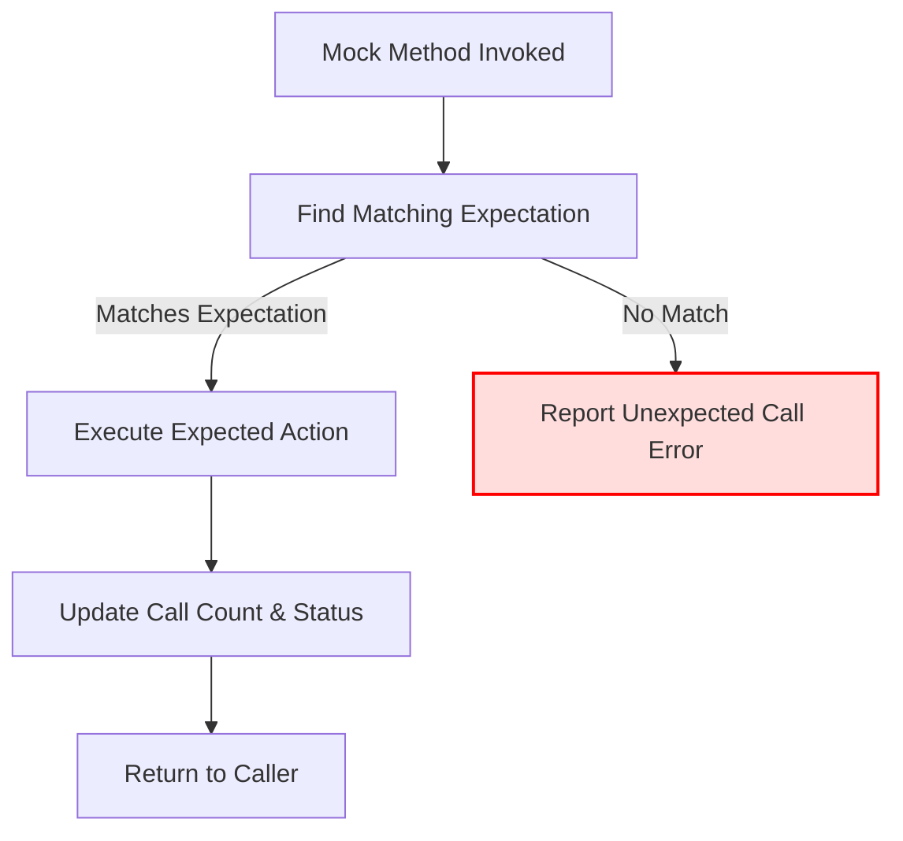

# The GoogleMock Engine: Mocks and Expectations

GoogleMock is a powerful engine designed to dynamically create mock classes for C++ interfaces and manage expectations on their function calls. This document focuses on how GoogleMock achieves dynamic mocking of C++ classes, routes function invocations to the right mock implementations, and tracks expectations during test execution.

---

## Introduction to the GoogleMock Engine

When testing complex C++ codebases, mock objects act as stand-ins for real dependencies, allowing precise control and verification of interactions. GoogleMock automates the creation of these mocks and provides a rich framework for setting expectations and behaviors on their methods.

At its core, the GoogleMock engine:

- Generates mock classes from user-supplied interfaces or abstract classes.
- Routes each method invocation on a mock object through machinery that matches calls against user-defined expectations.
- Tracks and verifies call counts, argument matchers, call ordering, and expected behaviors.

This engine builds upon the macro-based declarations like `MOCK_METHOD` to generate mock methods, and macros such as `EXPECT_CALL` and `ON_CALL` to set expectations and default behaviors.

## Mock Class Generation

GoogleMock uses the `MOCK_METHOD` macro to define mock methods within mock classes that inherit from real interfaces or base classes. Behind the scenes, this macro expands into:

- Method declarations and definitions that override the base virtual methods.
- Registration of each mock method with the internal mock engine.
- Facilities to record invocations, check argument matchers, and apply actions or default responses.

Users only need to declare these in the `public` section of their mock class; GoogleMock handles the rest.

### Example: Defining a Mock Class

```cpp
#include <gmock/gmock.h>

class Turtle {
 public:
  virtual ~Turtle() {}
  virtual void PenUp() = 0;
  virtual void PenDown() = 0;
  virtual void Forward(int distance) = 0;
  virtual int GetX() const = 0;
};

class MockTurtle : public Turtle {
 public:
  MOCK_METHOD(void, PenUp, (), (override));
  MOCK_METHOD(void, PenDown, (), (override));
  MOCK_METHOD(void, Forward, (int distance), (override));
  MOCK_METHOD(int, GetX, (), (const, override));
};
```

The macro generates plumbing so when `MockTurtle` methods are called, they actually invoke the GoogleMock engine's recording and dispatch logic.

## Invocation Routing

When a mock method is invoked, GoogleMock routes the call to a dispatcher responsible for:

- Matching the method call against the active expectations by comparing argument values using matchers.
- Selecting the most recent matching expectation (newer expectations override older ones).
- Executing the action defined by the expectation (return values, side effects, sequences, etc).
- Reporting errors immediately if no expectation matches or if calls exceed expected cardinalities.

This dynamic routing is crucial to verifying interaction correctness and providing meaningful test failure messages.

### Call Flow Overview




## Expectation Tracking and Management

An expectation in GoogleMock encapsulates how many times a function is expected to be called, with what arguments, and what should happen when the call occurs. The engine manages expectations using objects created by `EXPECT_CALL` statements.

### Key Components

- **Expectation Objects:** Each created via `EXPECT_CALL` stores matchers, cardinalities (`Times()`), action sequences, and call ordering constraints.
- **Cardinality and Call Counts:** Tracks how many times a mock method has been called and verifies it against the expected call count.
- **Sequences and Order Constraints:** Supports partial and total ordering using `InSequence` and `After` clauses to control when expectations can be matched.
- **Retirement and Saturation:** Expectations may be "retired" to avoid matching further calls once they are saturated or superseded.

### How GoogleMock Tracks Expectations

Internally, expectation objects are linked to mock methods and tracked under thread-safe locks. When calls happen, the engine:

- Checks if the call matches an active expectation and if call counts are within bounds.
- Records the call and advances the call count.
- Retires expectations if configured (`RetiresOnSaturation()`) or due to sequence fulfillment.

If a call violates expectations (too many calls, unmatched arguments, out-of-order), GoogleMock immediately fails the test and reports detailed diagnostics.

### User-Facing Example: Setting and Using Expectations

```cpp
using ::testing::Return;
using ::testing::InSequence;

MockTurtle turtle;
{
  InSequence seq;
  EXPECT_CALL(turtle, PenDown())
      .Times(1);
  EXPECT_CALL(turtle, Forward(100))
      .Times(1)
      .WillOnce(Return());
  EXPECT_CALL(turtle, PenUp())
      .Times(1);
}

// Exercise code that calls the above methods
...
```

This guarantees the methods are called in the declared order, exactly once each.

## Advanced Expectation Features

### Multiple Clauses in EXPECT_CALL

Users can chain clauses to finely specify expectations:

- `With(matcher)`: Multi-argument matcher that tests all arguments as a tuple.
- `Times(cardinality)`: Specifies how many times the call occurs.
- `InSequence(...)`: Enforces that calls happen within specified sequences.
- `After(expectation...)`: Calls expected only after other expectations occur.
- `WillOnce(action)`, `WillRepeatedly(action)`: Define mock behaviors.
- `RetiresOnSaturation()`: Makes the expectation inactive once fulfilled.

### Default Actions via ON_CALL

Use the `ON_CALL` macro to set behavior when a method is called but without requiring a call expectation. It allows setting default actions used when no matching `EXPECT_CALL` is found.

---

## Troubleshooting Common Expectation Issues

- **Too many or too few actions for an expectation:** GoogleMock warns if `.WillOnce()` actions do not match the specified `Times()` count.
- **Unmatched calls:** Calls that do not satisfy any active expectations cause immediate test failures.
- **Ordering violations:** Calls that break specified sequences or `After()` constraints report errors with detailed trace of unmet pre-requisites.
- **Sticky expectations:** Expectations do not retire by default after being saturated, which can cause repeated call failures unless `RetiresOnSaturation()` is used.

To diagnose issues, run tests with the `--gmock_verbose=info` flag, which shows detailed call and expectation matching logs.

---

## Summary

GoogleMock’s engine dynamically turns a simple `MOCK_METHOD` declaration into a rich, runtime-managed mock object capable of verifying complex interaction patterns expected during unit testing. Its architecture ensures mock methods dispatch through flexible expectation matchers, supports advanced call order controls and call count enforcement, and immediately alerts developers about discrepancies in mock usage.

This power enables precise, reliable, and maintainable testing of interactions in complex C++ systems.

---

## See Also

- [GoogleMock Reference: MOCK_METHOD, EXPECT_CALL, ON_CALL](../reference/mocking.md)
- [gMock for Dummies: Basics and Usage](../gmock_for_dummies.md)
- [Mocking Cookbook: Tips for Mocking Techniques](../gmock_cook_book.md)
- [API Reference - Structuring Test and Mock Behaviors](../../api-reference/structuring-behaviors/expectations-and-sequencing.md)

---