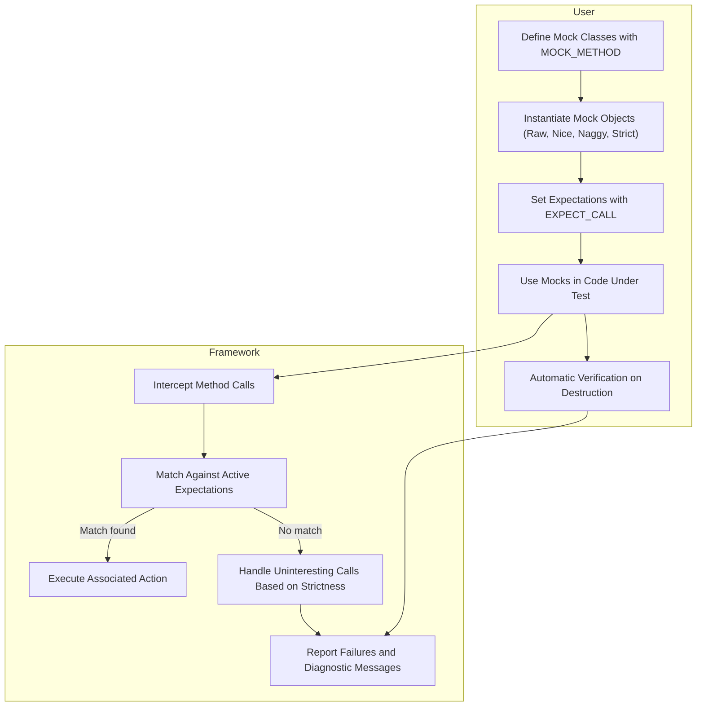

# Mocking Framework Architecture

Explore the internal structure and mechanics of the GoogleMock mocking framework. This guide demystifies how mock objects, expectations, actions, and matchers collaborate behind the scenes to empower expressive behavior verification and isolation in complex C++ systems.

---

## Introduction

GoogleMock (gMock) is a powerful framework designed to simplify writing and using mock classes in C++. At its core, gMock enables you to create mock objects that simulate the behavior of real objects. These mock objects allow you to specify at runtime exactly how the code under test should interact with its dependencies.

This page provides a conceptual walkthrough of the main components forming gMock’s architecture and their interactions, clarifying the flow from creating mocks to verifying their behavior.

---

## Key Components of GoogleMock

The mocking framework orchestrates several components working together. Understanding these components and how they relate is crucial for mastering mock-based testing in C++.

### 1. Mock Objects

A **mock object** is a user-defined class, typically derived from an interface or abstract class, whose methods are overridden with mocks generated by the `MOCK_METHOD` macros provided by gMock.

- Mock objects behave like their real counterparts but allow strict control and observation.
- Each mock method records calls, arguments, and manages expectations and actions.
- Mock objects delegate crucial verification and default behavior management to gMock's internal runtime system.

### 2. Expectations

Expectations articulate the tests’ assertions on mock method calls. They describe:

- Which mock methods should be called
- With what arguments they should be called
- How many times (cardinality)
- In what order
- What the method should return or perform when called

Expectations are set through `EXPECT_CALL` macros and interpreted using a rich domain-specific language (DSL) that supports matchers, cardinalities, sequences, and actions.

### 3. Actions

**Actions** define the behavior executed by a mock method when called. They specify what a mock should return or what side effects it should produce.

- Examples include returning values (`Return()`, `ReturnRef()`), throwing exceptions, assigning to output parameters, or invoking callbacks.
- Actions can be chained (`DoAll`), combined, or customized to suit complex scenarios.

### 4. Matchers

**Matchers** allow specifying complex argument expectations by encoding predicates over argument values.

- They support exact matches, ranges, compositions, and container contents.
- Used within `EXPECT_CALL` and `ON_CALL` to pinpoint calls of interest.
- Provide expressive power to verify that methods are called with the right parameters.

### 5. Strictness Wrappers

gMock provides specialized wrappers that control how uninteresting calls (calls to methods without expectations) are handled:

- `NiceMock`: Suppresses warnings for uninteresting calls.
- `NaggyMock`: Prints warnings for uninteresting calls (default behavior).
- `StrictMock`: Treats uninteresting calls as test failures.

These wrappers inherit from the user-defined mock class and adjust runtime behavior by registering specific call reactions in the mock framework.

---

## User Flow & Interaction Model

Understanding the user journey through gMock’s architecture clarifies the typical mock lifecycle and how these components work together.

### Step 1: Define Mocks

Users define mock classes by subclassing interfaces or classes and using the `MOCK_METHOD` macro to generate mock implementations.

For example:

```cpp
class Foo {
 public:
  virtual ~Foo() = default;
  virtual int DoSomething(int param) = 0;
};

class MockFoo : public Foo {
 public:
  MOCK_METHOD(int, DoSomething, (int param), (override));
};
```

This macro injection prepares the mock method to integrate with the expectations and invocation recording infrastructure.

### Step 2: Instantiate Mocks with Strictness Applied

Users create instances of mock classes or their strictness variants (
`NiceMock<MockFoo>`, `NaggyMock<MockFoo>`, or `StrictMock<MockFoo>`).

- The constructor of these wrappers registers reactions to uninteresting calls (allow, warn, or fail).
- They transparently inherit mock class constructors to support any arguments.

### Step 3: Set Expectations and Behaviors

Using `EXPECT_CALL`, users specify the expected interaction:

```cpp
EXPECT_CALL(mock_foo, DoSomething(5)).WillOnce(Return(10));
```

- This sets up an expectation that records calls matching the method and arguments.
- Additional clauses like `Times()`, `InSequence()`, and `After()` control cardinality and ordering.
- The `WillOnce()`, `WillRepeatedly()`, or `ON_CALL` clauses determine the behavior (action) when calls are made.

### Step 4: Use Mocks in Production Code Under Test

The mock objects replace real dependencies. Calls to mocked methods are intercepted and:

- Checked against active expectations matching the arguments.
- If a matching expectation is found and not saturated, the corresponding action is executed.
- If no matching expectation is found, the framework decides how to respond based on the mock’s strictness (silent default action, warning, or failure).

### Step 5: Verification on Destruction

When a mock object is destroyed, gMock automatically verifies that:

- All expectations have been satisfied.
- Correct call counts were met.

Failures at this stage will cause the test to fail with detailed diagnostic messages explaining unmet expectations.

Users can also explicitly verify and clear expectations during test execution using `Mock::VerifyAndClearExpectations()`.

---

## Internal Mechanics Highlighted by Tests

The [source tests](googlemock/test/gmock-nice-strict_test.cc) illustrate how the mocking framework treats various scenarios internally:

- **Raw Mocks** behave as `NaggyMock` by default, warning on uninteresting calls.
- **Nice Mocks** suppress warnings on uninteresting calls but still fail if expectations are violated.
- **Strict Mocks** treat uninteresting calls as failures.
- Tests enforce that all constructor overloads and move-only types are handled elegantly.
- Destructors calling mock methods are supported and verified.

These tests validate the correctness of strictness modifiers and demonstrate managing corner cases like object deletion in callbacks.

---

## Diagram: GoogleMock Mocking Workflow



---

## Best Practices & Tips

- **Choose strictness wisely:** Use `NiceMock` in early development to reduce noise, escalate to `StrictMock` to catch unintended calls as tests stabilize.
- **Set expectations precisely:** Avoid over-specification to keep tests maintainable and focused.
- **Use default actions (`ON_CALL`) efficiently:** To define standard behavior without forcing strict expectations.
- **Order expectations thoughtfully:** Use Sequences and `After()` clauses to enforce call order only where necessary, preventing brittle tests.
- **Leverage mocking tests to verify mock behavior:** The included tests showcase how to ensure your mocks behave as intended.

---

## Troubleshooting Common Issues

- **Unexpected uninteresting call warnings:** Use `NiceMock` or set catch-all expectations with `Times(AnyNumber())`.
- **Mock destructor calls mock method:** Use mock method pattern like `Die()` in the destructor for controlled verification.
- **Mock method with non-default-constructible return type:** Provide explicit `Return()` action to avoid runtime errors.
- **Move-only type mocking:** Use modern `MOCK_METHOD` macros with support for move semantics or delegate calls via helper methods.

---

## Further Reading

- [gMock for Dummies](../../guides/mocking-with-googlemock/introduction-to-mocking.md): Beginner-friendly tutorial on mocking basics.
- [Mocking Reference](../../api-reference/mocking-apis/declaring-mocks.md): Detailed API and macros reference.
- [Actions Reference](../../api-reference/matcher-action-references/actions-reference.md): Complete list of built-in actions.
- [Matchers Reference](../../api-reference/matcher-action-references/matchers-reference.md): Extensive matcher catalog.
- [gMock Cookbook](../../guides/mocking-with-googlemock/writing-mock-expectations.md): Practical recipes for advanced mocking techniques.

---

## Source Code Insight

GoogleMock's strictness wrappers (`NiceMock`, `NaggyMock`, `StrictMock`) are implemented as template subclasses that modify behavior for uninteresting calls by registering themselves with the `Mock` runtime before base class construction. This ensures consistent behavior during the mock’s lifetime without adding extra padding.

The test suite in `gmock-nice-strict_test.cc` meticulously verifies the behavior of these wrappers across various construction patterns and usage scenarios, highlighting robustness and nuanced handling of uninteresting call reporting.

For deeper understanding, examine the source files:

- https://github.com/google/googletest/blob/main/googlemock/include/gmock/gmock-nice-strict.h
- https://github.com/google/googletest/blob/main/googlemock/test/gmock-nice-strict_test.cc

---

## Summary

GoogleMock's architecture empowers C++ developers to precisely specify and verify interactions between components during unit tests through mock objects. The framework’s core abstractions—mock objects, expectations, actions, and matchers—work together seamlessly under strictness modifiers (Nice, Naggy, Strict) to provide flexible, robust test behavior control.

Understanding this architecture lets you effectively apply gMock’s features to write clear, maintainable, and reliable tests.

---

✅ **You have completed the Mocking Framework Architecture guide.**

---