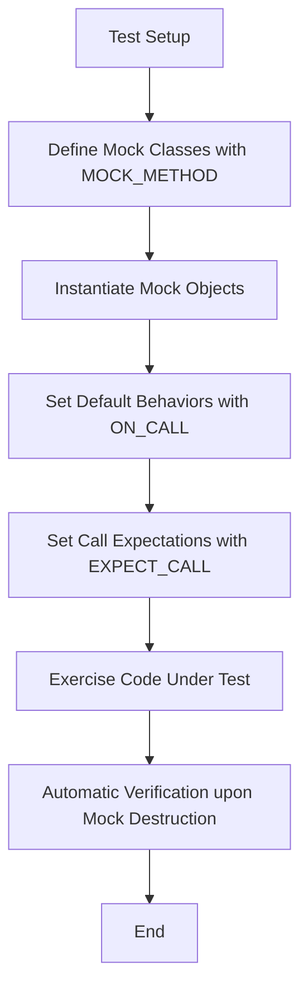

# Mocking Fundamentals

Explore the core concepts behind mocking in C++: how GoogleMock enables the creation, configuration, and usage of mock objects, including the role of actions, expectations, cardinalities, and matchers. Understand when and why to use mocks in your testing strategy.

---

## What Is Mocking in C++?

Mocking is a powerful technique in C++ unit testing that allows you to simulate and verify interactions between components by replacing real objects with controllable mock objects. GoogleMock, integrated with GoogleTest, provides a rich, expressive framework to create mocks, set expectations on their behavior, and assert that your code interacts with dependencies correctly—without requiring those dependencies to be fully implemented or available.

## Creating Mock Classes: The Foundation

To use mocking with GoogleMock, you start by creating **mock classes** that mimic the interfaces or abstract classes your code depends on. You define mock methods using the `MOCK_METHOD` macro, which generates mock implementations matching the real method signatures, including qualifiers like `const` or `override`.

### Defining Mock Methods

```cpp
class MockFoo {
 public:
  MOCK_METHOD(int, GetSize, (), (const, override));
  MOCK_METHOD(void, DoWork, (int count), (override));
};
```

- **Important:** Always place `MOCK_METHOD` declarations in the `public:` section, regardless of the original method's access level, to ensure GoogleMock can intercept calls correctly.
- Handle complex argument types or ones with commas by wrapping them in parentheses or using type aliases.

## Understanding Expectations and Default Behavior

GoogleMock distinguishes between two core aspects of mock method behavior:

- **Expectations (`EXPECT_CALL`)**: Specify that a method _should be called_ with certain arguments, how many times, and what behavior it should execute.
- **Default Actions (`ON_CALL`)**: Define how a mock method should behave _when called_, without implying that it _must_ be called.

### Setting Expectations

Expectations declare which calls are expected and allow you to specify how often and in what order those calls should occur.

```cpp
EXPECT_CALL(mock_foo, DoWork(5))
    .Times(3)
    .WillRepeatedly(Return());
```

This sets the expectation that `DoWork(5)` is called exactly three times.

### Defining Default Behavior

Sometimes you don't want to require calls to a mock method but want to define its default action if it happens:

```cpp
ON_CALL(mock_foo, GetSize())
    .WillByDefault(Return(10));
```

This means that if `GetSize()` is called but no specific expectation matches, it returns 10.

## Matchers: Specifying Argument Expectations

Matchers describe the criteria that method arguments must satisfy for a call to be considered a match. You use matchers as arguments in `EXPECT_CALL` and `ON_CALL`. They can be:

- Literal values (e.g., `5` means exact match)
- Wildcards (`_` matches anything)
- Predicate matchers (e.g., `Gt(10)` for greater than 10)
- Composite matchers (combining multiple conditions)

**Example:**

```cpp
EXPECT_CALL(mock_foo, DoWork(Gt(0)));  // Call must have argument > 0
```

GoogleMock provides a large built-in set of matchers and supports custom matcher definitions for domain-specific validations.

## Cardinalities: How Often Calls Should Occur

The `Times()` clause specifies the allowed call counts. GoogleMock provides flexible cardinalities:

| Cardinality           | Meaning                                            |
| --------------------- | --------------------------------------------------|
| `AnyNumber()`         | Method may be called any number of times           |
| `AtLeast(n)`          | Method must be called at least *n* times           |
| `AtMost(n)`           | Method may be called at most *n* times             |
| `Between(m, n)`       | Method called between *m* and *n* inclusive        |
| `Exactly(n)` or `n`   | Method called exactly *n* times                     |
| `Times(0)`            | Method must **never** be called                     |

If you omit `Times()`, GoogleMock infers it based on the number of actions specified (e.g., `WillOnce()` clauses) or defaults to 1 call.

## Actions: Defining Mock Method Behavior

Actions specify what a mock method does when it is called. Common actions include:

- **Return a value:** `Return(value)`
- **Return a reference:** `ReturnRef(variable)`
- **Invoke a function or lambda:** `Invoke(func)`
- **Set output arguments:** `SetArgPointee<N>(value)`
- **Invoke a callable argument:** `InvokeArgument<N>(args...)`
- **Combine several actions:** `DoAll(action1, action2, ...)`

For example:

```cpp
EXPECT_CALL(mock_foo, GetSize())
    .WillOnce(Return(10));
```

You can chain multiple `WillOnce()` actions to specify different behaviors for subsequent calls, and a single `WillRepeatedly()` action for all following calls.

## Sequences and Call Ordering

By default, GoogleMock allows expectations to be fulfilled in any order. To require strict ordering, use the `InSequence` construct or the `InSequence()` clause:

```cpp
{
  InSequence s;
  EXPECT_CALL(mock_foo, Step1());
  EXPECT_CALL(mock_foo, Step2());
}
```

This enforces that `Step1()` must be called before `Step2()`.

For more complex ordering like partial orders, use `Sequence` objects and clauses like `After()`, allowing flexible DAGs of expected calls.

## Nice, Naggy, and Strict Mocks: Controlling Verbosity and Behavior of Uninteresting Calls

- **NaggyMock (default):** Prints warnings when mock methods without expectations are called.
- **NiceMock:** Suppresses warnings on uninteresting calls allowing smoother tests without noise.
- **StrictMock:** Causes uninteresting calls to be treated as test failures, enforcing strict adherence to declared expectations.

```cpp
using ::testing::NiceMock;
NiceMock<MockFoo> nice_mock;
```

Use these to control the strictness level and feedback during testing.

## Using Mock Objects: A Typical Workflow

1. Define mock classes using `MOCK_METHOD` macros.
2. Instantiate mock objects (or use `NiceMock` / `StrictMock` for desired behavior).
3. Set **default behaviors** using `ON_CALL`.
4. Set **expectations** using `EXPECT_CALL`.
5. Exercise the system under test that uses the mocks.
6. Mock destruction automatically verifies expectations.

```cpp
using ::testing::Return;

class MockDatabase {
 public:
  MOCK_METHOD(bool, Connect, (const std::string&), (override));
  MOCK_METHOD(int, Query, (int), (override));
};

TEST(DatabaseClientTest, QueryTest) {
  MockDatabase mock_db;
  ON_CALL(mock_db, Connect).WillByDefault(Return(true));

  EXPECT_CALL(mock_db, Query(42)).WillOnce(Return(100));

  DatabaseClient client(&mock_db);
  client.Connect();
  EXPECT_EQ(client.Query(42), 100);
}
```

## Common Pitfalls and Best Practices

- Always put `MOCK_METHOD` declarations `public` in your mock classes.
- Use `ON_CALL` to specify default behavior without enforcing call expectations.
- Use `EXPECT_CALL` only to verify calls you care about.
- Avoid over-specification in expectations to reduce brittle tests.
- Use `NiceMock` to reduce noise in tests unless strict enforcement is necessary.
- Use `RetiresOnSaturation()` to prevent expectations from matching beyond their saturation.
- Be mindful of matchers’ purity — they should have no side-effects.
- Define virtual destructors in interfaces to avoid undefined behavior.

## Verifying and Resetting Mocks Early

By default, mock objects verify expectations on destruction, but you can force verification earlier:

```cpp
ASSERT_TRUE(::testing::Mock::VerifyAndClearExpectations(&mock_obj));
```

This function verifies and clears expectations, allowing reuse or clean teardown.

Alternatively, `::testing::Mock::VerifyAndClear(&mock_obj)` also clears default actions.

## Summary Diagram: Mocking Workflow



---

## Troubleshooting Common Issues

- **Warnings about uninteresting calls:** Use `NiceMock` or add catch-all `EXPECT_CALL` with `Times(AnyNumber())`.
- **Unexpected call failures:** Check `EXPECT_CALL` arguments and orders, consider enabling `--gmock_verbose=info` for trace output.
- **Compilation errors with `MOCK_METHOD`:** Confirm correct usage, wrap complex types in parentheses or use type aliases.
- **Memory leaks or missing destructors:** Ensure interfaces have virtual destructors.
- **Unfulfilled expectations on destruction:** Verify expectations are met before test completes or manually verify early.

---

By mastering these core mocking fundamentals, you unlock powerful tools to write expressive, maintainable, and fast C++ tests using GoogleMock.

---

## Additional Resources

- [gMock Cheat Sheet](https://google.github.io/googletest/gmock_cheat_sheet.html): Quick practical reference.
- [gMock Cookbook](https://google.github.io/googletest/gmock_cook_book.html): Step-by-step recipes for advanced mocking.
- [Mocking API Reference](reference/mocking.md): Detailed documentation of mocking macros and classes.
- [Matchers Reference](reference/matchers.md): Comprehensive list of available matchers.
- [Actions Reference](reference/actions.md): Details on built-in and custom actions.
- [Nice, Naggy, and Strict Mocks](reference/mocking-apis/nice-naggy-strict-mocks.md): Control levels of strictness.

---

## See Also

- [Creating and Using Basic Mocks](/guides/mocking-and-test-doubles/mock-basics)
- [Advanced Mocking: Actions, Matchers, and Expectations](/guides/mocking-and-test-doubles/advanced-mocking)
- [Mocking Best Practices and Anti-Patterns](/guides/mocking-and-test-doubles/mocking-best-practices)

---

*This page forms a foundational concept guide for using GoogleMock effectively within your C++ tests.*