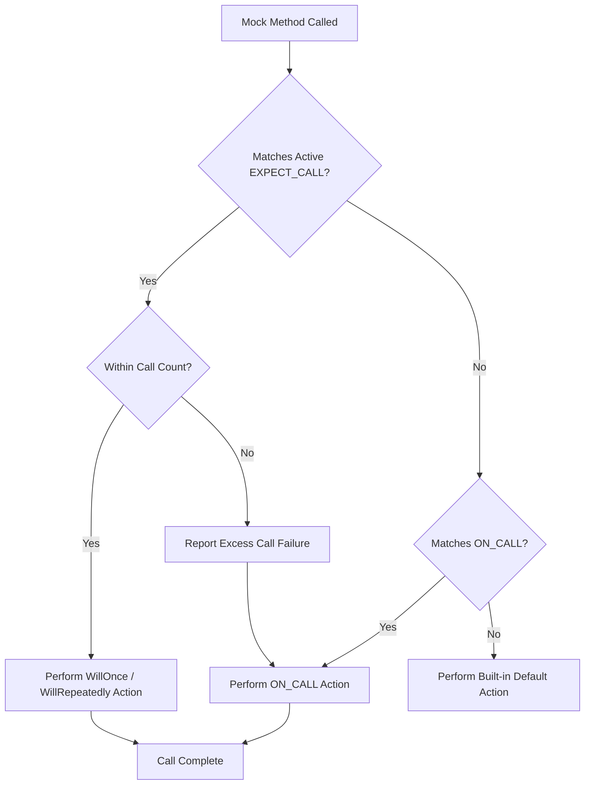

# Mocking and Expectation Model

Delve into GoogleMock's model for building test doubles: how mock methods are declared, how expectations are defined, and the flow of calls through the system. Grasp the power of `ON_CALL` and `EXPECT_CALL`, and how they enable precise, behavior-driven testing.

---

## Introduction

GoogleMock empowers C++ developers to create mock objects — test doubles that mimic real objects — enabling interaction-based tests that precisely verify the behavior of your code under test. Central to GoogleMock’s approach are:

- **Mock methods**, declared via the `MOCK_METHOD` macro.
- **Expectations**, specified with `EXPECT_CALL`, which both define the mock’s behavior and specify the expected calls.
- **Default behavior specifications**, provided with `ON_CALL`, which set mock behavior without creating call expectations.

Understanding these foundations guides you to create expressive, readable, and robust tests that check how your code interacts with dependencies.

---

## Declaring Mock Methods

At the heart of mocking is the ability to declare mock methods that replace virtual methods in your interfaces or classes. GoogleMock simplifies this with the `MOCK_METHOD` macro:

```cpp
MOCK_METHOD(return_type, MethodName, (Args...), (qualifiers));
```

- **`return_type`**: The return type of the method.
- **`MethodName`**: Name of the method being mocked.
- **`Args...`**: Parenthesized list of argument types.
- **`qualifiers`** (optional): Method qualifiers such as `const`, `override`, `noexcept`, or calling convention `Calltype`, plus reference qualifiers via `ref()`.

### Key Points

- *Always place mock method declarations in the `public:` section* of your mock class, regardless of the base method’s access level. This enables GoogleMock to properly intercept calls.
- Handle complex return or argument types involving commas by wrapping them in parentheses or defining aliases to avoid parsing issues.
- You can mock overloaded methods by defining each overload.

### Example

```cpp
class MockTurtle : public Turtle {
 public:
  MOCK_METHOD(void, PenUp, (), (override));
  MOCK_METHOD(void, Forward, (int distance), (override));
  MOCK_METHOD(int, GetX, (), (const, override));
};
```

---

## Defining Expectations

Expectations specify how you expect a mock method to be called and what it should do. They are declared via the `EXPECT_CALL` macro:

```cpp
EXPECT_CALL(mock_object, MethodName(matchers...))
    .With(multi_arg_matcher)   // optional
    .Times(cardinality)       // optional
    .InSequence(sequences...) // zero or more
    .After(expectations...)   // zero or more
    .WillOnce(action)         // zero or more
    .WillRepeatedly(action)   // zero or one
    .RetiresOnSaturation();   // zero or one
```

### Understanding `EXPECT_CALL`

- **Matchers** specify which arguments the expectation applies to.
- **`With`**, if used, must be the first clause and can only be specified once. It matches all arguments as a tuple using a multi-argument matcher.
- **`Times`** controls how many calls are expected. If omitted, GoogleMock infers it based on the presence of `WillOnce` and `WillRepeatedly`.
- **`InSequence`** and **`After`** allow specifying ordering and partial ordering between calls.
- **`WillOnce`** and **`WillRepeatedly`** specify the actions performed when the mock is called.
- **`RetiresOnSaturation`** causes the expectation to deactivate after it is saturated (reached the upper bound).

### Order and Precedence

- GoogleMock matches calls against expectations in reverse order: the *last* matching expectation is selected first.
- Expectations are "sticky": they remain active even when saturated (unless retired), causing errors for calls beyond the specified count.

### Example

```cpp
EXPECT_CALL(turtle, Forward(100))
    .Times(2)
    .WillOnce(Return())
    .WillOnce(Return())
    .RetiresOnSaturation();
```

---

## Specifying Default Behaviors with `ON_CALL`

While `EXPECT_CALL` sets expectations and actions, `ON_CALL` lets you define default behaviors for mock methods without creating call expectations. It answers: "What should this mock do when its method is called?" without imposing constraints on call counts or ordering.

The syntax is:

```cpp
ON_CALL(mock_object, MethodName(matchers...))
    .With(multi_arg_matcher)   // optional
    .WillByDefault(action);    // mandatory
```

### Behavior

- Multiple `ON_CALL` statements can be defined; the **last matching `ON_CALL` wins**.
- The default action specified here is used whenever no `EXPECT_CALL` matches a method call.

### Example

```cpp
ON_CALL(turtle, GetX())
    .WillByDefault(Return(0));
```

This sets `GetX()` to return 0 by default when called on `turtle`, unless overridden by a matched `EXPECT_CALL`.

---

## Call Flow and Matching Logic

When a mock method is invoked, GoogleMock follows this process:

1. **Searches existing `EXPECT_CALL`s in reverse order** to find the first active expectation whose matchers satisfy the call arguments.
2. If found, it checks if the call count is within cardinality.

   - If yes, applies the next action declared (`WillOnce` or `WillRepeatedly`).
   - If no (too many calls), reports an "excessive call" failure, and applies the default action.

3. If no matching `EXPECT_CALL` is found, it considers `ON_CALL`s (also matched in reverse order).

4. Uses the action from the last matching `ON_CALL` or falls back to the built-in default action (e.g. zero for numerical returns).

5. Reports an "uninteresting call" warning or error depending on mock strictness (see below).

---

## Mock Object Strictness: Nice, Naggy, Strict

GoogleMock provides three flavors of mock behaviors regarding uninteresting calls:

| Type          | Behavior on Uninteresting Call            |
|---------------|--------------------------------------------|
| `NiceMock`    | Silences uninteresting call warnings; calls proceed with default actions.|
| `NaggyMock`   | Prints warnings on uninteresting calls (default behavior currently).|
| `StrictMock`  | Treats uninteresting calls as test failures.

### Usage

Wrap your mock class with these templates to adjust strictness:

```cpp
NiceMock<MockClass> nice_mock;
NaggyMock<MockClass> naggy_mock;
StrictMock<MockClass> strict_mock;
```

They behave as subclasses of `MockClass` and provide the same interfaces.

### Caveats

- Applicable only to mock methods defined *directly* via `MOCK_METHOD`.
- Nesting strictness modifiers (e.g. `NiceMock<StrictMock<MockClass>>`) is unsupported.
- Requires virtual destructors for full correctness.

---

## Sequences and Ordering Constraints

Sometimes the order of mock calls matters. GoogleMock allows expressing strict or partial ordering via:

- **`InSequence` class**: Puts all expectations declared within its scope into a strict sequence. Calls matching expectations must occur in order.

- **`.InSequence()` clause of `EXPECT_CALL`**: Assigns an expectation to one or more `Sequence` objects. Expectations linked to the same sequence(s) must be satisfied in the order declared.

- **`.After()` clause**: Specifies explicit prerequisite expectations that must be satisfied before the current expectation matches.

These mechanisms can be combined to articulate complex partial orders of expected calls.

### Example: Strict Ordering with `InSequence`

```cpp
{
  InSequence s;
  EXPECT_CALL(mock, Step1());
  EXPECT_CALL(mock, Step2());
  EXPECT_CALL(mock, Step3());
}
```

Calls must happen in the order Step1 → Step2 → Step3.

### Example: Partial Order with `After`

```cpp
Expectation e1 = EXPECT_CALL(mock, Init());
Expectation e2 = EXPECT_CALL(mock, Work()).After(e1);
```

`Work()` is expected only after `Init()` is called.

---

## Expectation Lifecycle and Retiring

- Expectations start as active and become **saturated** when the upper call bound is reached.
- By default, saturated expectations remain active ("sticky") and cause errors on extra calls matching the expectation.
- Calling `.RetiresOnSaturation()` on an expectation makes it *retire* immediately upon saturation, so it will no longer match calls, allowing other expectations to be matched afterward.
- Expectations also retire automatically when another expectation that follows them in a sequence is satisfied.

Use retiring to avoid over-constraining tests while expressing precise behavior.

---

## Default Actions and Built-in Behavior

Every mock function has a built-in default action:

- `void` functions just return.
- Boolean functions return `false`.
- Numeric or pointer return types return zero-initialized values.
- In C++11 and later, mock functions returning default-constructible types return a default-constructed instance.

You can override built-in defaults per type with `DefaultValue<T>::Set()` or for specific mock methods with `ON_CALL`.

If no expectation matches a call and no `ON_CALL` does, the built-in default action runs.

---

## Special Considerations

### Argument Matchers

- Use `_` to match any argument (wildcard).
- Combine matchers to specify what argument values are accepted.
- Use `.With()` for multi-argument matching over tuples.

### Multiple Expectations on the Same Method

- Newer expectations override older ones.
- Place generic catch-all expectations first, and more specific ones later.

### Mocking Non-virtual Functions

- Supported via `MOCK_METHOD` in unrelated classes (see guides).

### Move-only Types

- Supported in mock methods’ parameters and return types.
- Use lambdas or custom actions in `WillOnce`/`WillRepeatedly` for actions involving move-only types.

### Verifying and Clearing Expectations

Use `Mock::VerifyAndClearExpectations(&mock_obj)` to verify all expectations on a mock and clear them, allowing early verification before destruction.

---

## Troubleshooting Common Issues

- Unexpected calls result in test failures; verify correct argument matching and call count.
- "Uninteresting mock function call" warnings indicate calls without matching `EXPECT_CALL`.
- Use `--gmock_verbose=info` for verbose call and expectation traces.
- Use `NiceMock` or carefully crafted catch-all `EXPECT_CALL`s to moderate warnings.

---

## Summary

The Mocking and Expectation Model represents the core interaction testing paradigm in GoogleMock. Users define mock methods using `MOCK_METHOD`, specify expected call patterns and behaviors with `EXPECT_CALL`, and optionally set default behaviors with `ON_CALL`. The framework matches calls against expectations in reverse order, respects call cardinalities and ordering constraints with sequences and prerequisites, and enforces behavior with strictness modes.

---

### Additional Resources

- [gMock for Dummies](https://google.github.io/googletest/gmock_for_dummies.html) — A friendly introduction to mocks and GoogleMock basics.
- [Mocking Reference](https://google.github.io/googletest/docs/reference/mocking.html) — Detailed API documentation on mocking macros and classes.
- [gMock Cookbook](https://google.github.io/googletest/gmock_cook_book.html) — Practical recipes for advanced mocking scenarios.
- [gMock Cheat Sheet](https://google.github.io/googletest/gmock_cheat_sheet.html) — Quickly reference mocking patterns and syntax.
- [System Architecture Overview](https://google.github.io/googletest/concepts/core-architecture/system-architecture) — Understand GoogleTest & GoogleMock architecture.

---

### Practical Tips

- Always specify expectations *before* exercising your mock object — `EXPECT_CALL` settings must precede calls.
- Use `ON_CALL` for default method behaviors where no expectation is needed.
- When specifying call order, prefer `InSequence` or `After` for clarity and precision.
- Leverage `RetiresOnSaturation` to relax sticky expectations when modeling sequences.
- Employ `NiceMock` to suppress warnings on uninteresting calls, or `StrictMock` to treat them as failures for rigorous testing.
- Watch out for argument matchers and cardinalities for precise and maintainable expectations.

---

## Diagram: Mock Call Matching Flow



---