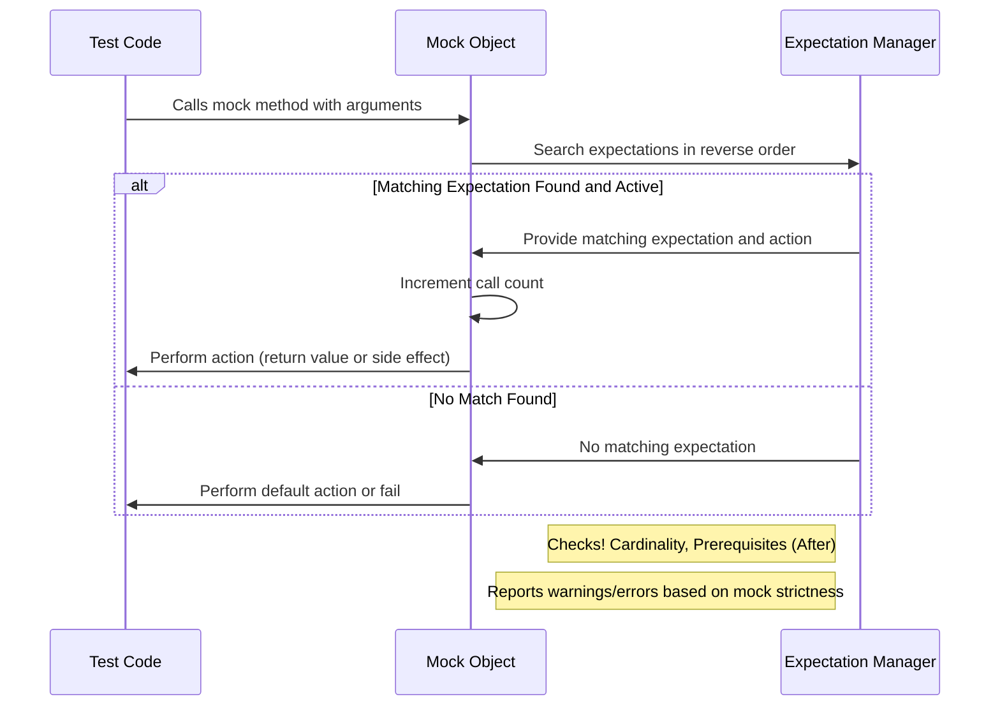

# Mocking Principles and Behavioral Modelling

This page unpacks the foundational concepts that drive how mocking works in GoogleMock, focusing on modeling object behavior, specifying expectations, managing call counts, matching arguments, and verifying call cardinalities. Additionally, it clarifies different mock strictness levels—strict, nice, and naggy—and explains how GoogleMock uses cardinalities to control and verify mock method calls.

---

## Understanding Mocking in GoogleMock

Mocking lets you simulate and control the behavior of objects in your tests, enabling precise verification of interactions without relying on full implementations. GoogleMock provides intuitive macros and constructs to define these mock objects, specify their expected usage, and verify those expectations dynamically during test execution.

At its core, mocking involves:

- **Modeling object behavior:** configuring how mock objects respond to method calls.
- **Setting expectations:** defining which method calls are expected, with what arguments, how many times, and in what order.
- **Managing call verification:** ensuring that the actual mock usage during tests matches expectations exactly.


## Mock Methods: Modeling Behavior

### Defining Mock Methods

Using the `MOCK_METHOD` macro, you declare methods inside mock classes, replicating the signature of the real methods you want to simulate. Proper mock behavior is enabled by defining these within a `public:` section, even if the original methods are protected or private.

```cpp
class MyMock {
 public:
  MOCK_METHOD(ReturnType, MethodName, (Args...));
  MOCK_METHOD(ReturnType, MethodName, (Args...), (Specs...));
};
```

**Reference:** See the [Mocking Reference](https://github.com/google/googletest/blob/main/docs/gmock_cook_book.md#creating-mock-classes) for complete details on `MOCK_METHOD` usage and qualifiers like `const`, `override`, and calling conventions.

### Modeling Call Behavior

- **Default Actions:** Each mock method has a built-in default action (like returning 0 or a default-constructed value).
- **Customizing behavior:** Use `ON_CALL` to define default responses without enforcing call counts.
- **Explicit behavior:** Use `EXPECT_CALL` to specify what happens when a certain call is made, including return values or side effects.


## Setting Expectations: How Calls Are Verified

### The `EXPECT_CALL` Syntax

The `EXPECT_CALL` macro is your primary interface for defining expectations on mock calls. It specifies the method, the argument matchers, expected call counts, call order, and the actions taken on each call.

```cpp
EXPECT_CALL(mock_object, MethodName(matchers...))
    .With(multi_argument_matcher)  // Optional: matched as a whole tuple
    .Times(cardinality)            // How many times expected
    .InSequence(sequences...)      // Put calls in order
    .After(expectations...)        // Call only after other expectations
    .WillOnce(action)              // Action for a single call
    .WillRepeatedly(action)        // Action for repeated calls
    .RetiresOnSaturation();        // Retire expectation after saturated
```


### Argument Matching

You specify argument constraints using matchers (e.g., `_` for anything, `Eq()`, `Ge()`, or custom matchers). Use `.With()` to impose additional constraints on *all* arguments combined as a tuple.

Example: Expect a call where the first argument is less than the second.

```cpp
EXPECT_CALL(my_mock, SetPosition(_, _))
    .With(Lt());
```

### Cardinalities: Controlling Call Counts

Cardinality classes control how many times a method call is expected:

| Cardinality      | Meaning                                        |
|------------------|------------------------------------------------|
| `AnyNumber()`    | Call can happen any number of times            |
| `AtLeast(n)`     | Expected at least *n* calls                     |
| `AtMost(n)`      | Expected at most *n* calls                      |
| `Between(m,n)`   | Expected between *m* and *n* calls, inclusive  |
| `Exactly(n)`/`n` | Expected exactly *n* calls (0 means never called) |

If `Times()` is omitted, gMock infers it based on presence of `WillOnce()` and `WillRepeatedly()` clauses.

### Call Ordering and Partial Orders

GoogleMock allows you to specify strict or partial ordering with these mechanisms:

- `InSequence`: associates expectations with one or more `Sequence` objects enforcing call order per sequence.
- `After`: restricts an expectation to only match calls after other expectations have been satisfied.

Example of partial order:

```cpp
Sequence s1, s2;
EXPECT_CALL(foo, A()).InSequence(s1, s2);
EXPECT_CALL(bar, B()).InSequence(s1);
EXPECT_CALL(bar, C()).InSequence(s2);
EXPECT_CALL(foo, D()).InSequence(s2);
```

This means A must happen before B and C, and C must happen before D, but B and C's relative order is unconstrained.

### Retiring Expectations

By default, expectations remain active after being saturated, allowing multiple matches if feasible (`sticky` behavior). Use `.RetiresOnSaturation()` to instruct GoogleMock to deactivate expectations as soon as their call limits are reached, ensuring subsequent calls won't be matched to them.

---

## Mock Strictness: Nice, Naggy, and Strict Mocks

### Terminology

- **Uninteresting Calls:** Calls to mock methods with *no* matching `EXPECT_CALL` expectations.
- **Unexpected Calls:** Calls to mock methods for which expectations exist but none matches the actual arguments.

### Default Behavior

By default, uninteresting calls generate warnings, but tests continue. Unexpected calls are always errors.

### Wrappers to Control Behavior

GoogleMock provides three wrappers for a mock class to tune handling of uninteresting calls:

- **NaggyMock**: Default behavior; warns on uninteresting calls.
- **NiceMock**: Suppresses warnings on uninteresting calls, yielding cleaner test output.
- **StrictMock**: Treats uninteresting calls as errors, enforcing strict test guarantees.

Example usage:

```cpp
using ::testing::NiceMock;
using ::testing::NaggyMock;
using ::testing::StrictMock;

NiceMock<MockFoo> nice_mock;     // Suppresses uninteresting warnings
NaggyMock<MockFoo> naggy_mock;   // Default
StrictMock<MockFoo> strict_mock;  // Errors on uninteresting calls
```

### Important Notes

- These wrappers only affect *uninteresting* calls, not unexpected ones.
- `NiceMock` and `StrictMock` only affect mock methods defined directly in the mock class via `MOCK_METHOD`.
- The mock class’s destructor should be virtual for these wrappers to work correctly.

### Recommendations

- Use `NiceMock` for routine test code to reduce noise.
- Use naggy mocks when actively developing or debugging tests.
- Use strict mocks sparingly to enforce behavior at strictest level.

---

## Managing Call Counts and Behavior

### Actions in Expectations

You specify what a matching call should do using `.WillOnce()` and `.WillRepeatedly()`:

- `.WillOnce(action)`: action for a single call; each call consumes one `WillOnce`.
- `.WillRepeatedly(action)`: action for all subsequent calls after all `WillOnce()` actions are used.

Example:

```cpp
EXPECT_CALL(mock, Func())
    .WillOnce(Return(1))
    .WillOnce(Return(2))
    .WillRepeatedly(Return(3));
```

Calls return `1` on first, `2` on second, and `3` thereafter.

If `.WillRepeatedly()` is omitted and calls exceed `WillOnce()` count, default returns are used with a warning.

### Default Behavior without Actions

If no action is specified, GoogleMock returns:

- Default return values for value-returning functions (e.g., 0, false, or default constructor).
- Simply returns for void functions.

You can override defaults globally with `DefaultValue<T>::Set()` or per-method with `ON_CALL()`.

### Verifying Expectations Early

GoogleMock automatically verifies expectations when mocks are destructed. Alternatively, you can manually invoke:

```cpp
Mock::VerifyAndClearExpectations(&mock_obj);
Mock::VerifyAndClear(&mock_obj);  // Clears default actions too
```

Avoid setting new expectations after verification.

---

## Common Pitfalls & Best Practices

### Expectation Setting Order

Set all `EXPECT_CALL()` expectations *before* exercising the mock methods. Interleaving these can yield undefined behavior.

### Using `_` Matcher & Catch-All Expectations

- Use `_` matcher to ignore arguments not relevant to the test.
- To allow any call with certain arguments, use something like `EXPECT_CALL(mock, Method(_)).Times(AnyNumber())` as a catch-all.

### Reasoning About Expectation Overlaps

GoogleMock searches expectations *in reverse order* to match calls, so more specific expectations should be declared *after* general ones.

### Retiring vs Sticky Expectations

Using `.RetiresOnSaturation()` is recommended when order is significant or when precise control over call allowance is needed.

### Controlling Verbosity

Use `--gmock_verbose=info|warning|error` CLI flag to adjust the verbosity of GoogleMock messages, helping during debugging or reducing noise.

### Handling Overloaded Methods

Disambiguate overloaded methods in expectations using `Const()` wrapper or explicit type casts to avoid ambiguity.

### Delegating Calls for Complex Logic

You can delegate mock method behavior to real or fake objects via lambdas in `ON_CALL()` or `EXPECT_CALL()`.

---

## Summary

Mocking in GoogleMock centers on defining mock methods, setting precise expectations including argument matching and call counts, managing call ordering and sequencing, and tuning behavior on uninteresting calls with strictness modifiers. Users achieve fine-grained control over interaction testing in C++, ensuring tests catch regressions effectively while balancing test maintenance.

---

## Visualizing Mock Call Verification Flow



---

## Practical Tips

- Always define your mock classes using `MOCK_METHOD` in `public:` sections.
- Use `ON_CALL` for default behaviors that don't require verification.
- Use `EXPECT_CALL` when you want to verify a call is made with specific args and counts.
- Choose the appropriate mock strictness (`NiceMock`, `NaggyMock`, `StrictMock`) early to control test output noise.
- Use `.RetiresOnSaturation()` when sequencing or to avoid expectation stickiness pitfalls.
- Utilize sequences and `.After()` clauses to precisely control the allowable call order.
- Leverage argument matchers liberally to avoid brittle tests.
- Regularly use `--gmock_verbose=info` during debugging to get detailed insight.

---

## References

- [GoogleMock Mocking Reference](https://github.com/google/googletest/blob/main/docs/reference/mocking.md)
- [GoogleMock gMock Cookbook](https://github.com/google/googletest/blob/main/docs/gmock_cook_book.md)
- [GoogleMock Nice, Naggy, Strict Mocks](https://github.com/google/googletest/blob/main/docs/reference/mocking.md#NiceStrictNaggy)
- [Matchers Reference](https://github.com/google/googletest/blob/main/docs/reference/matchers.md)
- [Actions Reference](https://github.com/google/googletest/blob/main/docs/reference/actions.md)

---

For further learning, visit the [Core Concepts & Terminology](../overview/core-architecture-concepts/core-concepts-terminology.md) page for a broader vocabulary context, and the [Defining and Using Mocks](../api-reference/gmock-mocking-api/mock-object-definition.md) and [Specifying Mock Expectations](../api-reference/gmock-mocking-api/expectations-specification.md) pages for practical coding details.

---