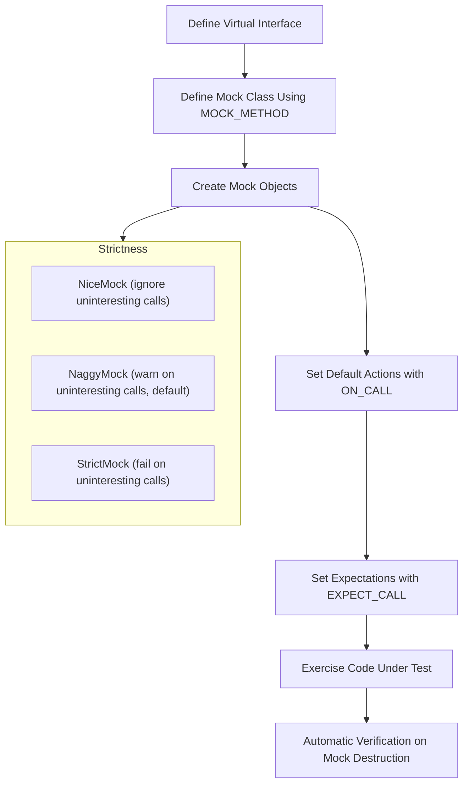

# Mocking in C++: Principles and Practices

GoogleMock (gMock) is a powerful C++ framework that enables you to create mock classes and specify their expected behaviors for unit and integration testing. This document explains the core concepts and philosophy behind gMock’s design, illustrating how interfaces are mocked, how expectations and behaviors are defined, and how C++ metaprogramming underpins flexible, type-safe mocking.

---

## 1. Understanding Mock Objects

A *mock object* is a test double that implements the same interface as a real class but allows precise control and verification of interactions at runtime. It acts as a stand-in during testing, helping you observe how your code under test communicates with its dependencies.

### Why Use Mocks?
- **Isolate Components:** Mocks replace complex or slow dependencies, reducing test flakiness and runtime.
- **Validate Interactions:** Ensure methods are called with expected arguments, number of times, and order.
- **Simulate Behaviors:** Easily simulate errors or special cases in dependencies hard to replicate with real objects.

### Key Mocking Principles
- **Code to Interfaces:** Always mock against virtual interfaces, not concrete classes.
- **Virtual Destructors:** Ensure destructors are virtual to avoid undefined behavior.
- **Expectations Set *Before* Use:** Define expectations (using `EXPECT_CALL`) prior to exercising the code under test.
- **Default Actions vs. Expectations:** `ON_CALL` defines default behavior without requiring the call. `EXPECT_CALL` sets both expectation and behavior.

<Tip>
Mock objects are Naggy by default, meaning uninteresting calls generate warnings. To suppress these, use `NiceMock`; to make uninteresting calls errors, use `StrictMock`.
</Tip>

---

## 2. Defining Mock Classes with gMock

The primary way to define mocks in GoogleMock is by subclassing the interface and using the `MOCK_METHOD` macro to generate mock method implementations.

### The `MOCK_METHOD` Macro

```cpp
MOCK_METHOD(ReturnType, MethodName, (Args...), (Qualifiers));
```

- **ReturnType:** The return type of the mocked method.
- **MethodName:** The method's name.
- **Args:** Argument list enclosed in parentheses.
- **Qualifiers:** Optional method specifiers like `const`, `override`, `noexcept`, or calling conventions.

Example:

```cpp
class Foo {
 public:
  virtual ~Foo() {}  // Must be virtual
  virtual int GetSize() const = 0;
  virtual std::string Describe(const char* name) = 0;
};

class MockFoo : public Foo {
 public:
  MOCK_METHOD(int, GetSize, (), (const, override));
  MOCK_METHOD(std::string, Describe, (const char* name), (override));
};
```

**Note:** Mock methods must be declared in the `public:` section regardless of the base class method visibility to allow `EXPECT_CALL` and `ON_CALL` access.

### Mocking Overloaded Methods

Mock all overloaded variants explicitly with correct signatures. Use `using BaseClass::MethodName;` to avoid hiding versions you don't mock.

### Mocking Templates

Templates are mocked like any other class. Each template specialization gets a mock:

```cpp
template <typename T>
class StackInterface {
 public:
  virtual ~StackInterface() {}
  virtual void Push(const T& x) = 0;
};

template <typename T>
class MockStack : public StackInterface<T> {
 public:
  MOCK_METHOD(void, Push, (const T& x), (override));
};
```

### Handling Unusual Method Qualifiers

The macro supports declaring methods with calling conventions (e.g., `Calltype(STDMETHODCALLTYPE)`), ref-qualified methods (`ref(&)`), and noexcept.

---

## 3. Specifying Mock Behavior

### Expectations with `EXPECT_CALL`

Set expectations on mock method invocations specifying:
- Which methods are expected to be called.
- Argument constraints using *matchers*.
- Expected call counts via *cardinalities*.
- Ordering constraints.
- Actions to perform when called.

```cpp
EXPECT_CALL(mock_object, Method(arg_matchers...))
    .Times(cardinality)
    .WillOnce(action)
    .WillRepeatedly(action)
    .InSequence(sequence)...;
```

**Example:**

```cpp
using ::testing::Return;

EXPECT_CALL(turtle, GetX())
    .Times(3)
    .WillOnce(Return(100))
    .WillOnce(Return(150))
    .WillRepeatedly(Return(200));
```

This expectation says:
- Expected 3 calls.
- First returns 100, second 150, and subsequent calls return 200.

### Argument Matchers

Use built-in or custom matchers to check argument values precisely or loosely:
- `_` matches any value.
- `Eq(val)` matches exact value `val`.
- Comparisons like `Ge(10)`, `Lt(20)` for relational matchers.

### Default Actions with `ON_CALL`

Define default behavior without expecting calls:

```cpp
ON_CALL(mock_object, Method(_))
    .WillByDefault(Return(default_value));
```

This lets a method respond with a default action even if no explicit expectation is set.

### Cardinalities

Specify how many times a method is expected to be invoked.
- `Times(n)` for exact n times.
- `AtLeast(n)`, `AtMost(n)` for flexible ranges.
- `AnyNumber()` allows any calls.

If omitted, gMock infers cardinality:
- No action clauses: `Times(1)`.
- `n` `WillOnce` clauses: `Times(n)`.
- `n` `WillOnce` + one `WillRepeatedly`: `Times(AtLeast(n))`.

### Ordering Calls

By default, calls matching expectations can occur in any order.
Use `InSequence` or `After` clauses to require strict or partial ordering.

```cpp
{
  InSequence seq;
  EXPECT_CALL(foo, A());
  EXPECT_CALL(foo, B());
}
```

Enforces that `A()` is called before `B()`.

---

## 4. Strictness Levels: Nice, Naggy, and Strict Mocks

gMock categorizes the handling of *uninteresting calls* (calls to mock methods without expectations) into three modes:

| Mock Kind    | Behavior on Uninteresting Calls         |
|--------------|----------------------------------------|
| **NiceMock** | Silently ignores and suppresses warnings |
| **NaggyMock** | Issues warnings (default for raw mocks) |
| **StrictMock** | Treats uninteresting calls as test failures |

### Usage

Wrap your mock class with one of these templates to control strictness:

```cpp
using ::testing::NiceMock;
using ::testing::NaggyMock;
using ::testing::StrictMock;

NiceMock<MockFoo> nice_foo;      // No warnings
NaggyMock<MockFoo> naggy_foo;    // Warnings (default)
StrictMock<MockFoo> strict_foo;  // Errors for unexpected calls
```

### Tips

- Prefer `NiceMock` in stable tests for cleaner outputs.
- Use `NaggyMock` during development to be alerted of unexpected calls.
- Reserve `StrictMock` for tests where strict call control is required.

<Tip>
`NiceMock`, `NaggyMock`, and `StrictMock` inherit constructors of the base mock, so you can construct them with the same parameters.
</Tip>

---

## 5. Leveraging C++ Metaprogramming for Type Safety and Flexibility

GoogleMock uses advanced C++ metaprogramming techniques to:

- Generate mock methods automatically from declarations using macros.
- Ensure type safety by matching method signatures strictly.
- Support overloaded methods, const and noexcept qualifiers, and template methods.
- Provide flexible syntax for matching arguments and chaining actions.

This metaprogramming foundation allows gMock to adapt seamlessly to complex interfaces, enabling developers to write mocks efficiently without sacrificing correctness.

---

## 6. Typical Mocking Workflow

1. **Define Mock Classes**
   - Subclass the interface.
   - Use `MOCK_METHOD` to mock all virtual methods you want to observe/control.

2. **Create Mock Objects**
   - Instantiate mock objects.
   - Consider wrapping them with `NiceMock` or `StrictMock` if needed.

3. **Set Default Actions**
   - Use `ON_CALL` to specify default behaviors (optional).

4. **Set Expectations**
   - Define precise expectations with `EXPECT_CALL`, including argument matchers, call counts, and ordering.

5. **Exercise Code Under Test**
   - Call the code that interacts with mocks.

6. **Automatic Verification**
   - Verification is done automatically when mocks are destructed, ensuring all expectations were met.

<Tip>
Always set expectations before exercising the mock. Otherwise, behavior is undefined and verification may fail unpredictably.
</Tip>

---

## 7. Best Practices and Tips

- **Virtual Destructors:** Interfaces to be mocked must have virtual destructors.
- **Order of Expectations:** Use `InSequence` or `Sequence` objects for ordered calls.
- **Be Judicious with Strictness:** Too strict mocks cause brittle tests; prefer `NiceMock` unless strictness is crucial.
- **Use Wildcard `_` to Avoid Over-Specification:** Only constrain arguments critical to the test.
- **Combine `ON_CALL` and `EXPECT_CALL`:** Use `ON_CALL` for common default behaviors and `EXPECT_CALL` to specify what must be verified.
- **Avoid Mocking Non-Virtual Methods Unless Using High-Perf Techniques:** Prefer interface-based design.
- **Delegate to Fakes or Real Objects:** For complex behavior reuse, delegate to a fake or the real implementation.
- **Check for Uninteresting Calls:** Warnings guide you to potentially missing expectations.

---

## 8. Troubleshooting Common Issues

### Unexpected Calls to Real Methods
- Ensure methods are virtual to be mockable.

### Overloaded Method Ambiguities
- Use explicit overload selection helpers or specify argument types clearly.

### Uninteresting Call Warnings
- Add appropriate `EXPECT_CALL` or switch to `NiceMock`.

### Memory Leaks and Missing Destructor Calls
- Confirm virtual destructors.

### Slow Mock Compilation
- Define constructors and destructors of mocks out-of-line.

### Exceptions in `NiceMock` with Unknown Return Types
- Some return types require custom actions or default value settings.

---

## 9. Further Reading

- [gMock for Dummies (beginner-friendly tutorial)](https://google.github.io/googletest/gmock_for_dummies.html)
- [gMock Cheat Sheet (quick reference)](https://google.github.io/googletest/gmock_cheat_sheet.html)
- [Mocking Reference (detailed macro and API doc)](docs/reference/mocking.md)
- [gMock Cookbook (recipes and patterns)](docs/gmock_cook_book.md)

---

## Appendix: Example Usage

```cpp
#include <gmock/gmock.h>
#include <gtest/gtest.h>

class Turtle {
 public:
  virtual ~Turtle() {}
  virtual void PenUp() = 0;
  virtual void PenDown() = 0;
  virtual void Forward(int distance) = 0;
  virtual int GetX() const = 0;
};

class MockTurtle : public Turtle {
 public:
  MOCK_METHOD(void, PenUp, (), (override));
  MOCK_METHOD(void, PenDown, (), (override));
  MOCK_METHOD(void, Forward, (int distance), (override));
  MOCK_METHOD(int, GetX, (), (const, override));
};

using ::testing::AtLeast;
using ::testing::Return;

TEST(PaintTest, DrawsLine) {
  MockTurtle turtle;

  EXPECT_CALL(turtle, PenDown()).Times(AtLeast(1));
  EXPECT_CALL(turtle, Forward(100)).Times(1);
  ON_CALL(turtle, GetX()).WillByDefault(Return(42));

  // Code under test uses mock turtle
  turtle.PenDown();
  turtle.Forward(100);
  int x = turtle.GetX();
  EXPECT_EQ(x, 42);
}
```

In this example, `MockTurtle` mocks the `Turtle` interface with `MOCK_METHOD`. Expectations and default actions are set, and the code exercise triggers mock responses, verified automatically.

---

## Summary Diagram: Mocking Workflow



This flow encapsulates how users move from defining an interface and mock, to setting behaviors, running tests, and having expectations validated automatically, with control over the strictness level.
