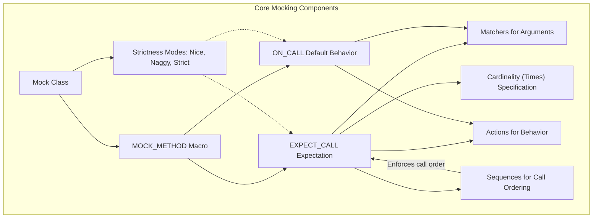

# Mocking Fundamentals

GoogleMock (gMock) provides a powerful and flexible mechanism to create mock objects in C++ tests, enabling detailed control over mock behavior and verification of interactions. This guide presents the foundational concepts behind GoogleMock's approach to mocking, explaining how mocks are designed, how users specify behaviors and expectations, and how strictness, cardinality, and matcher logic interplay to make test doubles expressive and reliable.

---

## 1. Understanding Mock Classes

### What is a Mock?
A mock object in gMock is a test double that simulates the behavior of real objects by allowing you to:

- Specify the expected interactions (method calls, arguments, call order).
- Define the behavior of these calls (return values, side effects).
- Verify that the code under test interacts correctly with collaborators.

### Creating a Mock Class
Mocks are defined using regular C++ class inheritance with the addition of the `MOCK_METHOD` macro to declare mock methods. These methods replace the implementation details with stubs that track calls and enforce expectations.

Key points:
- Mock methods must be declared in the `public` section (even if the real method is `protected` or `private`).
- `MOCK_METHOD` syntax mirrors the function signature: `MOCK_METHOD(ReturnType, MethodName, (Args...), (Specs...));`
- Common method qualifiers like `const`, `override`, and `noexcept` are supported to ensure precise mock behavior.

Example:
```cpp
class Turtle {
 public:
  virtual ~Turtle() {}
  virtual void PenUp() = 0;
  virtual void Forward(int distance) = 0;
  virtual int GetX() const = 0;
};

class MockTurtle : public Turtle {
 public:
  MOCK_METHOD(void, PenUp, (), (override));
  MOCK_METHOD(void, Forward, (int distance), (override));
  MOCK_METHOD(int, GetX, (), (const, override));
};
```

<Note>
If your method signatures include types with commas (like `std::pair<bool, int>`), wrap them in parentheses or create type aliases to prevent parsing issues in `MOCK_METHOD`.
</Note>

### Supporting Advanced Scenarios

- Overloaded methods can be mocked individually. Ensure to mock all overloads you intend to use or bring others into scope with `using`.
- Mocking non-virtual methods can be achieved by creating unrelated mock classes with the same interface and using template injection.
- Mocking class templates works identically, templated on the mocked type.

---

## 2. Specifying Behavior and Expectations

gMock lets you define how mock methods behave and how often and in which order they should be called.

### Default Behavior with `ON_CALL`
Use `ON_CALL(mock, Method(matchers))` to specify the default action for mock methods without setting expectations on when and how often the method should be invoked. It defines what happens when calls do not explicitly match expectations.

Example:
```cpp
ON_CALL(turtle, GetX()).WillByDefault(Return(10));
```

This ensures that calls to `GetX()` return 10 unless overridden by an explicit expectation.

<Info>
Use `ON_CALL` for setting up shared default behaviors typically in mock constructors or test fixtures.
</Info>

### Defining Expected Calls with `EXPECT_CALL`
Use `EXPECT_CALL(mock, Method(matchers))` to state that a method call is expected, along with optional chaining to specify detailed conditions:

```cpp
EXPECT_CALL(mock, Method(matchers))
    .With(multi_arg_matcher)  // Optional tuple-based matcher
    .Times(cardinality)       // How many times the call is expected
    .InSequence(sequences...) // Call order constraints
    .After(expectations...)   // Partial order constraints
    .WillOnce(action)         // Actions on calls (single calls)
    .WillRepeatedly(action)   // Actions after WillOnce calls exhausted
    .RetiresOnSaturation();   // Retire expectation when saturated
```

Key points:
- `Times()` accepts cardinalities: exact, ranges like `AtLeast(3)`, or `AnyNumber()`.
- Multiple `WillOnce()` clauses define sequential actions for successive calls.
- Use sequences or `After()` to impose call ordering.
- The chaining methods must be used in order; for example, `Times()` before `WillOnce()`.

Example:
```cpp
EXPECT_CALL(turtle, Forward(100))
    .Times(2)
    .WillOnce(Return())
    .WillOnce(Return())
    .RetiresOnSaturation();
```

### Balancing Verification and Flexibility

- Over-specification (too strict expectations) leads to brittle tests prone to break on internal changes.
- Under-specification weakens test value, allowing bugs to slip through.
- Use `ON_CALL` liberally to define default, common behavior.
- Use `EXPECT_CALL` thoughtfully to verify *contracts* and critical interaction.

<Check>
Only add `EXPECT_CALL` if your test explicitly requires verification that a call occurs.
</Check>

---

## 3. Matchers and Argument Matching

Matchers specify how to verify that the arguments of mock method calls meet expectations. They allow matching specific values or validating complex conditions.

- `_` is the wildcard matcher that matches anything.
- Built-in matchers like `Eq()`, `Ge()`, `NotNull()`, and `HasSubstr()` provide powerful matching.
- Composite matchers using `AllOf()`, `AnyOf()`, and `Not()` enable complex logical conditions.
- You can pass matchers as single arguments or combined as multi-argument tuple matchers.

Example:
```cpp
EXPECT_CALL(turtle, GoTo(50, _));  // X must exactly equal 50.
EXPECT_CALL(mock, Process(_, NotNull()));  // Second argument can't be null.
EXPECT_CALL(mock, SetPosition(_, _)).With(Lt());  // First arg < second.
```

---

## 4. Cardinality and Call Count Control

Cardinality controls "how often" you expect a mock method to be called:

| Cardinality      | Description                                 |
| ---------------- | -------------------------------------------|
| `Exactly(n)` or `n` | Called exactly n times.                    |
| `AtLeast(n)`     | Called at least n times.                     |
| `AtMost(n)`      | Called at most n times.                      |
| `Between(m, n)`  | Called between m and n times inclusive.     |
| `AnyNumber()`    | Called any number of times (including zero).|

By default, if no `Times()` is specified, gMock chooses:
- `Times(1)` if no `WillOnce()` or `WillRepeatedly()`.
- `Times(n)` if n `WillOnce()` actions specified and no `WillRepeatedly()`.
- `Times(AtLeast(n))` if n `WillOnce()` actions and a `WillRepeatedly()`.

Incorrect cardinalities (too many or too few calls) result in verification failures.

---

## 5. Strictness Modes: Nice, Naggy, and Strict Mocks

gMock allows you to control how it treats calls to mock methods that do not match any expectation.

- **NaggyMock** (default) prints warnings for uninteresting calls (methods without expectations) but continues.
- **NiceMock** suppresses warnings for uninteresting calls, making test output cleaner.
- **StrictMock** treats uninteresting calls as errors, failing the test immediately.

Usage:
```cpp
using ::testing::NiceMock;
using ::testing::StrictMock;

NiceMock<MockFoo> nice_mock;  // Suppresses uninteresting call warnings.
StrictMock<MockFoo> strict_mock;  // Fails on uninteresting calls.
```

<Warning>
Avoid overusing strict mocks unless verification needs are high. Strict mocks can make refactoring and general test maintenance more difficult.
</Warning>

---

## 6. Ordering Calls and Partial Ordering

### Sequences

Expectations involved in the same `Sequence` object are expected to occur in the order declared.

Example:
```cpp
Sequence seq;
EXPECT_CALL(mock, Initialize()).InSequence(seq);
EXPECT_CALL(mock, Process()).InSequence(seq);
EXPECT_CALL(mock, Finish()).InSequence(seq);
```

### Partial Orders

You can impose partial orders with `.After()` to specify that a call must happen after multiple other expectations or sets.

Example:
```cpp
Expectation init_a = EXPECT_CALL(mock, InitA());
Expectation init_b = EXPECT_CALL(mock, InitB());
EXPECT_CALL(mock, Run()).After(init_a, init_b);
```

With these mechanisms, you can specify strict, partial, or unordered call orders as needed for your tests.

---

## 7. Actions: Controlling Behavior of Mock Methods

Actions define the behavior executed when a mock method is called.

### Built-in Actions

- `Return(value)`: return the specified value.
- `ReturnRef(variable)`: return a reference.
- `ReturnPointee(pointer)`: return the value pointed to.
- `DoDefault()`: perform the default behavior.
- `Invoke(function)`: invoke an arbitrary function or callable.
- `SetArgPointee<N>(value)`: set the N-th argument (pointer) to a value.
- `SetArrayArgument<N>(begin, end)`: set an array argument.
- `DoAll(action1, action2, ...)`: perform a sequence of actions.
- `IgnoreResult(action)`: ignore return value of an action.

### Custom Actions

You can define your own action using lambdas, functors, or the `ACTION` macros.

### Chaining Actions

Multiple `WillOnce()` clauses can specify different behavior for consecutive calls; an optional `WillRepeatedly()` clause defines behavior beyond those.

Example:
```cpp
EXPECT_CALL(mock, GetValue())
    .WillOnce(Return(1))
    .WillOnce(Return(2))
    .WillRepeatedly(Return(3));
```

---

## 8. Common Pitfalls and Best Practices

- **Order and Timing**: Set all expectations and default behaviors **before** exercising code using mocks.
- **Retirement of Expectations**: Use `.RetiresOnSaturation()` to make expectations non-sticky, avoiding unexpected upper-bound violations when reusing similar expectations.
- **Match Specificity**: Be as specific as necessary to verify contract behavior but avoid over-specification that causes brittle tests.
- **Suppressing Uninteresting Call Warnings**: Prefer `NiceMock` or explicit `EXPECT_CALL` with `.Times(AnyNumber())` over suppressing warnings blindly.

<Warning>
Never set expectations on mocks after the code that uses them has run, as this leads to undefined behavior.
</Warning>

---

## 9. Summary

GoogleMock's mocking fundamentals build a bridge between your test code and external dependencies, enabling interaction-based testing with expressive, precise, and maintainable test doubles. By mastering mock class creation, use of expectations, matchers, actions, strictness modes, and call ordering, you gain full control over how code interacts with its collaborators, thus improving test quality and developer productivity.

---

## References

- [GoogleMock gMock Cookbook](https://google.github.io/googletest/gmock_cook_book.html)
- [Defining and Using Mocks](https://google.github.io/googletest/api/gmock_reference.html#defining-and-using-mocks)
- [Expectations and Cardinalities](https://google.github.io/googletest/api/gmock_reference.html#expectations-and-cardinalities)
- [Actions and Side Effects](https://google.github.io/googletest/api/gmock_reference.html#actions-and-side-effects)
- [Strictness Modes for Mocks](https://google.github.io/googletest/api/gmock_reference.html#mock-strictness-modes)
- [Matchers Reference](https://google.github.io/googletest/api/gmock_matchers.html)

---

## Practical Tips

- Design your mock interfaces carefully; mock only what is necessary.
- Use `ON_CALL` for shared default behavior and minimal `EXPECT_CALL` for verification.
- When matching overloaded functions, specify argument types or use `Const()` helper.
- Take advantage of sequences and `.RetiresOnSaturation()` to avoid brittle, order-dependent tests.
- Use `NiceMock` to suppress noisy warnings when suitable.

---

This fundamental understanding of GoogleMock equips users with the tools to write clear, robust, and maintainable tests that fully harness mocking capabilities.

---



