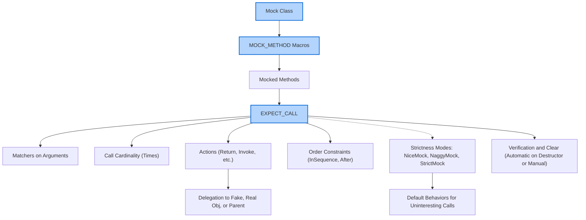

# Mocking System: Core Concepts

GoogleMock (gMock) provides a powerful and expressive framework for writing mock classes in C++, enabling developers to create flexible and deterministic tests. This guide presents the core concepts underpinning gMock’s mocking system, focusing on mock class creation, method expectations, mock actions, call cardinality, strictness modes, and default behavior control.

---

## 1. Foundations of Mocking with GoogleMock

### What Is a Mock Object?

A mock object is a test-double that implements the same interface as a real object but lets you specify how it should behave and what function calls are expected during tests. Unlike fakes, which provide lightweight working implementations, mocks focus on *interaction verification* — checking which methods were called, with what arguments, and in which order.

### Defining Mock Classes

Mock classes are usually derived from an interface or base class with virtual functions. Each method to be mocked is declared using the `MOCK_METHOD` macro, which generates the appropriate mock implementation:

```cpp
class MockFoo : public Foo {
 public:
  MOCK_METHOD(ReturnType, MethodName, (Args...), (Specs...));
};
```

- The first two parameters identify the return type and method name.
- The third parameter is the argument list (enclosed in parentheses). If the argument types include commas, wrap the type in parentheses or use type aliases.
- The fourth parameter is optional and contains qualifiers such as `const`, `override`, `noexcept`, or `Calltype` for calling conventions.

This declarative syntax allows you to quickly produce mock classes, removing tedious manual implementation.

### Mocking Overloads and Const Methods

To mock overloaded methods or methods differing by `const`-ness, declare each overload separately:

```cpp
MOCK_METHOD(int, Add, (Element x), (override));
MOCK_METHOD(int, Add, (int times, Element x), (override));

MOCK_METHOD(Bar&, GetBar, (), (override));
MOCK_METHOD(const Bar&, GetBar, (), (const, override));
```

If you do not mock all overloads, the compiler may warn about hidden functions; use `using BaseClass::MethodName;` to bring unmocked overloads into scope.

### Mocking Class Templates

You can mock class templates just as easily by specifying the template parameter in the derived mock class:

```cpp
template <typename T>
class MockStack : public StackInterface<T> {
 public:
  MOCK_METHOD(int, GetSize, (), (const, override));
  MOCK_METHOD(void, Push, (const T& x), (override));
};
```

### Mocking Non-virtual Methods

While gMock mocks virtual methods by default, it also supports mocking non-virtual methods via templates and unrelated mock classes with matching signatures. When mocking non-virtual methods, you typically templatize your code to select the concrete or mock types at compile time.

### Mocking Free Functions

Mocking global or static free functions directly is unsupported. Instead, wrap the free functions in an interface, mock the interface, and delegate calls in production code to the real functions. Alternatively, use `MockFunction` to mock `std::function`-style callbacks.

---

## 2. Setting Expectations and Actions

### The Role of Expectations

You specify expectations on how mock methods are called via `EXPECT_CALL`. Each expectation is a statement about

- Which mock method is expected to be called.
- How many times it should be called.
- What argument matchers should be used.
- What actions should produce results or side effects.

An example:

```cpp
EXPECT_CALL(mock_foo, Bar(5))
    .Times(3)
    .WillRepeatedly(Return(true));
```

This expects `Bar` to be called three times with argument `5`, returning true each time.

### Matching Function Arguments

Matchers specify which arguments are acceptable. Use `_` for arguments that you do not care about, or built-in matchers (`Eq`, `Ge`, `NotNull`, etc.) for precise constraints.

### Call Cardinalities (Times)

The `.Times()` clause controls how often a method should be called. Some built-in cardinalities include:

- `Times(Exactly(n))` (also `Times(n)`): called exactly _n_ times.
- `Times(AtLeast(n))`: called at least _n_ times.
- `Times(AtMost(n))`: called at most _n_ times.
- `Times(Between(m, n))`: called between _m_ and _n_ times.
- `Times(AnyNumber())`: any number of times (including zero).

If omitted, gMock infers the cardinality based on the number of `.WillOnce()` and `.WillRepeatedly()` clauses.

### Actions: Controlling Behavior

You can specify what the mock method does when called via actions:

- `Return(value)`: return the given value.
- `ReturnRef(ref)`: return a reference.
- `Invoke(function)`: call an existing function or lambda.
- `DoAll(...)`: chain multiple actions.
- `SetArgPointee<N>(value)`: change an output argument.

By default, for methods returning primitive types (like `int`), gMock returns 0; for methods returning `void`, it simply returns.

---

## 3. Call Ordering and Sequences

By default, the order of calls doesn't matter: any expectation that matches the call and is active will be used.

### Enforcing Strict Order

Create an `InSequence` object in a scope to require that expectations registered inside that scope must be met in order.

```cpp
{
  InSequence s;
  EXPECT_CALL(mock, Init());
  EXPECT_CALL(mock, Process());
  EXPECT_CALL(mock, Cleanup());
}
```

### Partial Ordering

Use `Sequence` objects and `.InSequence(...)` or `.After(...)` clauses to express complex partial order dependencies among expectations.

---

## 4. Controlling Behavior for Unexpected and Uninteresting Calls

### Default Behavior

Uninteresting calls are calls to mock methods without matching `EXPECT_CALL`s. By default, gMock treats them as warnings.

### Strictness Modes

You can control how uninteresting calls are handled via special wrappers:

- `NiceMock<T>`: suppress warnings for uninteresting calls.
- `NaggyMock<T>`: default mode, warn on uninteresting calls.
- `StrictMock<T>`: treat uninteresting calls as errors.

Each is a subclass of the mock class, used interchangeably.

### Managing Uninteresting Calls

If you want to ignore warnings for uninteresting calls to specific methods, write either an `EXPECT_CALL` with `.Times(AnyNumber())` or use `NiceMock`. Avoid suppressing warnings by adding unnecessary `EXPECT_CALL`s that overconstrain your tests.

---

## 5. Delegation Patterns

GoogleMock supports delegating calls for default actions to fakes, real objects, or parent classes.

### Delegating to a Fake or Real Object

Often you have a non-trivial fake or a real implementation with behaviors you want to reuse. You can delegate mock method calls to these objects by default and still assert calls are made:

```cpp
ON_CALL(mock, DoThis)
    .WillByDefault([&](Args... args) { return fake.DoThis(args...); });
```

### Delegating to a Parent Class

If you mock a concrete class that has some implemented methods, you may want certain calls to invoke the base class version to avoid infinite recursion:

```cpp
ON_CALL(obj, ConcreteMethod)
    .WillByDefault([&](Args... args) { return obj.Base::ConcreteMethod(args...); });
```

---

## 6. Verifying and Clearing Expectations

When a mock object is destructed, gMock automatically verifies that all expectations are satisfied, reporting failures otherwise.

You can also explicitly verify and clear expectations early using:

```cpp
using ::testing::Mock;
...
Mock::VerifyAndClearExpectations(&mock_obj);
Mock::VerifyAndClear(&mock_obj);  // Clear default actions also
```

### Mock Object Leaks

Leaked mock objects are not destructed, so expectations are never verified. Use `Mock::AllowLeak(&mock_obj)` to suppress leak errors when intentional.

---

## 7. Best Practices

- Use `ON_CALL` to specify general default behavior, minimizing unnecessary `EXPECT_CALL`.
- Use `EXPECT_CALL` sparingly to verify interaction points relevant to the test scenario.
- Prefer `NiceMock` in most tests for maintainability.
- Use sequences to clearly specify required call orders.
- Always set expectations before exercising the mocked object.
- Avoid mocking concrete classes directly when possible. Favor interfaces and adaptors.

---

## Summary Diagram


```

---

For further learning, see these related documentation and guides:

- [gMock Cookbook](https://google.github.io/googletest/gmock_cook_book.html): Practical recipes for advanced scenarios.
- [Mocking Reference](https://google.github.io/googletest/reference/mocking.html): Detailed API reference on mocking.
- [Using Mocks in Unit Tests](https://google.github.io/googletest/gmock_for_dummies.html#using-mocks-in-tests): Beginner-friendly introduction.
- [Setting Expectations and Actions Guide](https://google.github.io/googletest/guides/mocking-and-advanced-testing/setting-expectations-and-actions.html)

---

This page focuses specifically on the philosophy and user-centric concepts behind GoogleMock's mocking system — how to create mocks, set expectations, define actions, order and verify calls, and control strictness — to help you write robust and maintainable C++ tests.

