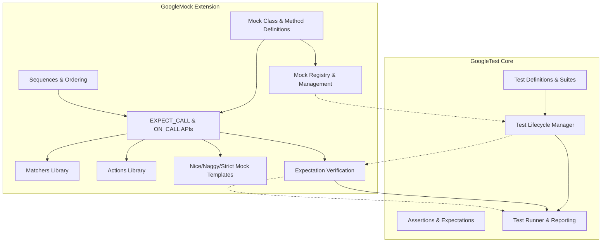

# Framework Architecture Overview

Understanding the architecture of GoogleTest and GoogleMock is fundamental to mastering how they collectively provide a powerful, flexible, and extensible environment for C++ testing and mocking. This guide focuses on the composition of the framework, highlighting the distinct yet synergistic layers of GoogleTest (the core testing framework) and GoogleMock (the mocking extension), their primary components, and their points of integration.

---

## Introduction

GoogleTest and GoogleMock together offer comprehensive functionality for writing, organizing, and executing tests, as well as defining and verifying mock behaviors. This page clarifies where these frameworks intersect and where they maintain separation, providing insight into their modular architecture. This knowledge empowers you to effectively leverage both tools, understand their boundaries, and utilize their components optimally.

---

## High-Level Composition

GoogleTest and GoogleMock are designed as **two layered frameworks**:

- **GoogleTest:** The core C++ testing framework providing test definitions, execution, assertions, fixtures, and parameterization.
- **GoogleMock:** The mocking extension built on top of GoogleTest, providing facilities to create mock objects, set expectations, define actions, and verify interactions.

While GoogleMock depends on GoogleTest, **each can be used independently**.

<Callout type="info">
It's important to recognize that mocking is an extension of testing, which is why GoogleMock requires GoogleTest, but the inverse is not true.
</Callout>

## Core Components

### GoogleTest Components

- **Test Definitions & Suites:** Macros like `TEST()`, `TEST_F()` allow users to define tests and fixtures.
- **Assertions Library:** Rich set of assertion macros (`EXPECT_EQ`, `ASSERT_TRUE`, etc.) for validating test conditions.
- **Test Lifecycle Management:** Setup/teardown hooks (`SetUp()`, `TearDown()`), test environment lifecycle, and test registration.
- **Test Execution Engine:** Runs tests, manages test reporting, filters, and execution control.

### GoogleMock Components

- **Mock Class Definitions:** Provides the `MOCK_METHOD` macro to declaratively define mock methods.
- **Expectations API:** `EXPECT_CALL` and `ON_CALL` macros allow specifying expected interactions and default behaviors.
- **Matchers:** Rich set of built-in matchers to validate argument pattern matching.
- **Actions:** Predefined and custom actions dictate how mock methods behave when invoked.
- **Strictness Controls:** `NiceMock`, `NaggyMock`, and `StrictMock` helper templates to manage uninteresting call behavior.
- **Sequences and Ordering:** Tools like `Sequence` and `InSequence` to enforce call ordering.

---

## Integration Boundaries

### Layered Dependency

- GoogleMock's headers internally include GoogleTest headers for core testing primitives.
- GoogleTest’s APIs remain cleanly independent of mocking constructs to ensure modularity.

### Build and Linkage

- The product provides separate libraries:
  - **gtest:** GoogleTest standalone.
  - **gmock:** GoogleMock relying on GoogleTest.
  - **gmock_main:** GoogleMock including a default `main()` function.

This separation allows users to:

- Use GoogleTest alone with minimal overhead.
- Integrate GoogleMock optionally where mocking is needed.

### Conceptual Separation

- Test suites and test cases are defined through GoogleTest.
- Mock objects, expectations, and behaviors are governed by GoogleMock.
- GoogleMock’s verification integrates with GoogleTest’s failure reporting and test lifecycle.

---

## How Components Work Together

The user workflow embodies this integration:

1. **Define Tests:** Use GoogleTest macros to define tests and test fixtures.
2. **Create Mock Classes:** Using GoogleMock macros, define mock classes matching interfaces.
3. **Set Expectations and Behaviors:** Via `EXPECT_CALL`, specify how mocks should behave and what calls are expected.
4. **Run Tests:** GoogleTest runs each test, managing setup, invocation, and teardown.
5. **Mock Verification:** At test completion or mock destruction, GoogleMock verifies expectations and reports failures through GoogleTest’s framework.

This layering ensures that mocking details are abstracted away within the mocking layer, keeping the core test execution clean and focused.

<Callout type="tip">
Use the GoogleMock macros only after GoogleTest initialization (`InitGoogleTest` or `InitGoogleMock`) to ensure all runtime infrastructure is correctly set up.
</Callout>

---

## Key Architectural Abstractions

### Mock Method Mockers

- Internal implementations track expectations and default actions for each mock method.
- They register themselves with a global mock registry to facilitate verification and leak detection.

### Expectation Objects

- Encapsulate constraints and behaviors to be enforced.
- Manage call counts, sequencing, and state (active, retired, saturated).

### Global Mock Registry

- Tracks all live mock objects and their mockers.
- Ensures dangling mocks are detected and expectations are verified.

### Threading and Synchronization

- GoogleTest and GoogleMock utilize internal mutexes to protect concurrent access to shared data.
- This design supports safe use of mocks and tests in multi-threaded environments.

---

## Modular Architecture Mermaid Diagram

---

## Practical Implications for Users

- GoogleTest sets the foundation for writing and organizing tests.
- GoogleMock enriches tests by enabling precise verification of interactions, invaluable for TDD and complex dependency scenarios.
- When using mocks, understand that the mock lifecycle is intertwined with test lifecycle — mocks verify expectations on destruction.
- Separating mock class definitions from test code enhances maintainability, reflecting the modular architecture.

<Callout type="warning">
Avoid mixing GoogleMock constructs without initializing GoogleTest properly. Always call `InitGoogleMock()` or `InitGoogleTest()` early in your main program to prevent undefined behavior.
</Callout>

---

## Summary

GoogleTest and GoogleMock form a layered, modular framework with clearly delineated responsibilities. GoogleTest delivers core test execution infrastructure, while GoogleMock provides rich mocking capabilities built upon this core. Understanding their composition, boundaries, and integration points empowers users to create robust, maintainable, and expressive test suites.

---

## Further Reading

To deepen your understanding, explore these related guides:

- [Core Concepts & Terminology](/overview/fundamentals-and-architecture/core-concepts-and-terminology)
- [System Architecture Overview](/overview/fundamentals-and-architecture/architecture-overview)
- [Building & Using Mocks](/guides/mocking-advanced-usage/building-mocks)
- [Test Definition & Execution API](/api-reference/core-testing-apis/test-definition-execution)
- [Mocking APIs: Expectations & Behaviors](/api-reference/mocking-apis/expectations-behaviors)

---

## Source Code References

- [`gmock.h`](googlemock/include/gmock/gmock.h) — Entry point for mocking APIs
- [`gmock-spec-builders.cc`](googlemock/src/gmock-spec-builders.cc) — Implements core expectation and action builders
- [`gmock-spec-builders_test.cc`](googlemock/test/gmock-spec-builders_test.cc) — Tests validating mocking behavior and syntax

These files embody the codebase boundaries discussed, illustrating the separation and integration of testing and mocking layers.

---

If you are new to these frameworks, begin your journey from the [What is GoogleTest?](overview/product-introduction-and-value/what-is-googletest) page before diving deeper into mocking and advanced architecture concepts.

