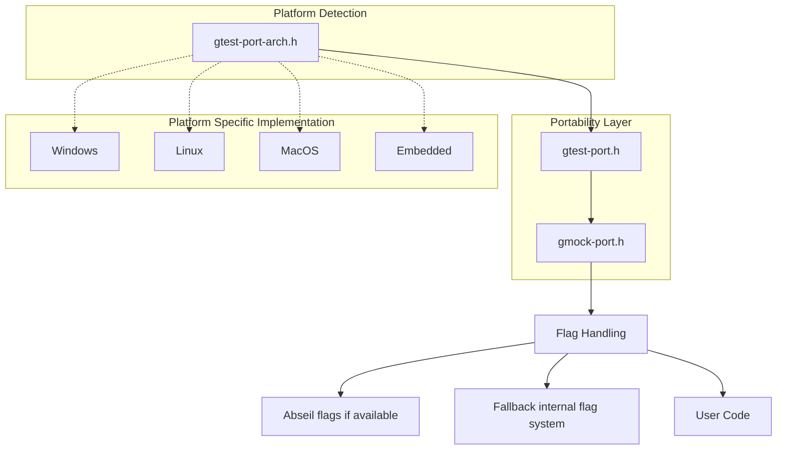

# Portability and Platform Support

Discover how GoogleTest and GoogleMock achieve seamless operation across diverse platforms and compilers through robust portability layers and configuration abstractions. This guide unpacks the role of the `port` files, explains platform detection mechanisms, and details supported environments to help you comprehend how the frameworks maintain consistent behavior everywhere.

---

## Overview

GoogleTest and GoogleMock are designed to work reliably on a broad spectrum of operating systems, compilers, and runtime environments. This wide portability is achieved by:

- Utilizing a carefully crafted set of configuration macros and utility functions.
- Abstracting platform-specific nuances into `port` header files.
- Implementing adaptive build configurations that respond to detected platform capabilities.

Understanding these portability layers is essential for users aiming to integrate GoogleTest or GoogleMock into new or custom environments, helping ensure smooth builds, execution, and feature availability.

---

## Key Components of the Portability Layer

### 1. Port Header Files

At the core of portability are `port` header files—`gtest-port.h` and `gmock-port.h`—which encapsulate environment detection and platform-specific abstractions:

- **`gtest-port.h`**: Contains foundational macros and utilities for GoogleTest, including feature detection, platform identification, threading abstractions, synchronization primitives, and compatibility fixes.
- **`gmock-port.h`**: Builds upon GoogleTest's portability layer and adds GoogleMock-specific utilities and flag handling.

These files coordinate to provide:

- **Platform Macros**: Detect operating systems (e.g., Windows, Linux, macOS, embedded platforms).
- **Feature Flags**: Determine the availability of language features such as exceptions, RTTI, threading, and file system support.
- **Synchronization Primitives**: Provide mutexes, locks, and thread-local storage adapts tailored to the platform.
- **File and Stream Utilities**: Abstract platform differences in file handling and standard stream support.


### 2. Platform Detection

GoogleTest relies on preprocessor directives and compile-time checks to identify its operating environment accurately. The detection scheme accounts for:

- Major Operating Systems: Windows variants (desktop, mobile, MinGW), Linux (including Android), macOS, BSD variants, Solaris, and others.
- Embedded and Specialized Platforms: ESP8266, ESP32, QNX, Haiku, Native Client, and more.
- Compiler Capabilities: Evaluates exception support, RTTI, C++ standard version, availability of POSIX features.

This detection influences feature enablers, conditional compilation, and behavior:

```cpp
#if defined(GTEST_OS_WINDOWS_DESKTOP)
  // Enable Windows desktop-specific features
#elif defined(GTEST_OS_LINUX)
  // Enable Linux-specific features
#else
  // Provide fallbacks for unsupported environments
#endif
```

### 3. Thread and Synchronization Abstractions

Thread safety is core to GoogleTest’s robustness. The portability layer provides:

- Thread-safe mutex and lock implementations adapted to pthreads (POSIX) or Windows critical sections.
- Thread-local storage implementations for isolated test contexts.
- Conditional compilation to disable thread support in environments lacking threading or to fall back gracefully.

### 4. Command Line Flags

GoogleMock introduces a flag system adapted for various platforms:

- When Abseil (`absl`) is available, GoogleMock leverages its flag library.
- Otherwise, it falls back to internal implementations, ensuring consistent flag handling.

This dual-mode approach guarantees that build-time and run-time configuration via flags works uniformly across supported environments.

---

## Supported Platforms

GoogleTest and GoogleMock officially support a wide range of platforms, with comprehensive integration and testing to ensure reliability. Key supported platforms include:

- **Desktop and Server Operating Systems:**
  - Windows (including Desktop, MinGW, and subsets like RT and Phone)
  - Linux and Linux derivatives (inclusive of Android).
  - macOS and iOS.
  - BSD variants (FreeBSD, NetBSD, OpenBSD, DragonFly BSD).
  - Solaris, AIX, HP-UX, z/OS.

- **Embedded and Specialized Systems:**
  - ESP8266, ESP32 microcontrollers.
  - Native Client (NaCl).
  - QNX, Haiku, GNU/Hurd.
  - Xtensa and QuRT architectures.
  - OS/2 (legacy).

Support encompasses.

- Detection and activation of appropriate feature sets.
- Platform-specific build adaptations (including threading and file system).
- Behavior normalization for exception handling, regular expressions, and I/O.

---

## Understanding the Workflow of Portability

When you build or run GoogleTest/GoogleMock:

1. **Platform Identification:** During compilation, specialized macros (defined primarily in `gtest-port-arch.h`) identify your operating system and environment.

2. **Feature Configuration:** Based on platform and compiler capabilities, GoogleTest sets internal macros indicating features such as `GTEST_HAS_EXCEPTIONS`, `GTEST_HAS_PTHREAD`, `GTEST_HAS_RTTI`, and others.

3. **Adapted Includes and Implementations:** The portability headers conditionally include appropriate headers and define platform-specific classes, such as mutexes and thread locals.

4. **Conditional API Behavior:** Depending on available features, some GoogleTest functionality might enable or disable certain modes (e.g., death tests require file system and specific platform capabilities).

5. **Flag Handling:** GoogleMock’s portability header manages flags through Abseil or fallback macros, ensuring consistent runtime behavior control.

<Tip>
To verify which features are enabled in your build environment, check the `GTEST_HAS_*` macros in the compiled object or use diagnostic tests. This insight helps you understand how GoogleTest is tailored for your platform.
</Tip>

---

## Practical Examples

### Example: Platform Detection Macros

```cpp
#ifdef GTEST_OS_WINDOWS_DESKTOP
  // Behavior specific to Windows Desktop
#elif defined(GTEST_OS_LINUX)
  // Behavior specific to Linux
#endif
```

### Example: Using Thread-Safe Mutex

```cpp
#include "gtest/internal/gtest-port.h"

::testing::internal::Mutex my_mutex;

void ThreadSafeFunction() {
  ::testing::internal::MutexLock lock(&my_mutex);
  // Critical section code here
}
```

This code is portable across platforms with native locking abstractions handled internally.

### Example: Defining and Using GoogleMock Flags

```cpp
#include "gmock/internal/gmock-port.h"

// Declare a boolean flag
GMOCK_DEFINE_bool_(enable_feature, false, "Enable special feature");

if (GMOCK_FLAG_GET(enable_feature)) {
  // Feature enabled, execute accordingly
}
```

---

## Common Pitfalls and Best Practices

- **Avoid Assuming Feature Availability:** Always check GoogleTest's feature macros if your tests depend on threading, exceptions, or RTTI.
- **Use Provided Abstractions:** Do not implement your own synchronization or platform detection; rely on provided macros and classes.
- **Understand Platform Limitations:** Embedded platforms may lack file systems or threading, affecting what tests or mock features you can use.
- **Confirm Compiler Support:** GoogleTest requires C++17 compliant compilers; use CMake configuration to enforce this.
- **Manage Flag Usage Carefully:** When integrating with Abseil flags, avoid conflicts by following GoogleMock's flag namespace conventions.

---

## Troubleshooting Portability Issues

- Ensure your build environment correctly detects your platform by reviewing compiler and toolchain settings.
- Verify that C++17 is enabled for your compiler.
- If threading or file system features are missing, check if the build disables them explicitly or if the environment lacks support.
- Consult `gtest-port.h` and `gmock-port.h` for macros that can be overridden to enable/disable certain features.

For more help, visit the [Troubleshooting Installation and Configuration](https://github.com/google/googletest/blob/main/docs/prerequisites-installation/troubleshooting.md) guide.

---

## Next Steps

- Review the [Supported Platforms & Ecosystem](../overview/introduction-and-value/supported-platforms-and-ecosystem) page to understand which platforms are fully supported and tips for less common environments.
- Explore [Integration Story](../overview/getting-started-and-integration/integration-story) for detailed information on building and linking GoogleTest and GoogleMock within various build systems.
- Consult the [System Requirements](../getting-started/prerequisites-installation/system-requirements) to verify your environment compatibility.

---

## Diagram: Portability Layer Interaction


This diagram illustrates how the portability headers coordinate platform detection, abstraction provision, and flag management to adapt GoogleTest and GoogleMock behavior dynamically.

---

## Glossary

- **Port Layer:** A collection of header files and macros that abstract platform differences.
- **Feature Macro:** A preprocessor macro indicating the presence or absence of a particular platform or language feature.
- **Thread Safety:** The guarantee that code behaves correctly during concurrent execution by multiple threads.
- **Flag:** A runtime configurable setting that can alter test behavior or framework internals.

---

For detailed API reference on portability utilities, see [Portability and Platform Utilities](../../api-reference/internal-utils-and-portability/portability-utils).

---