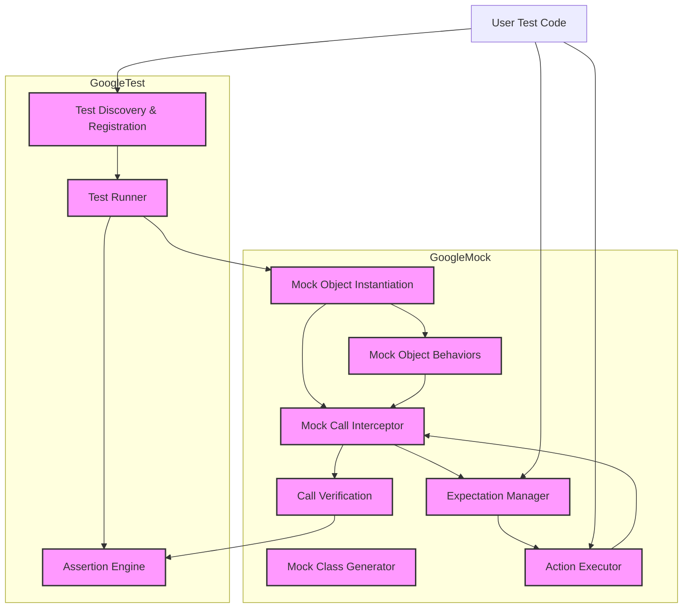

# System Architecture Overview

GoogleTest and GoogleMock seamlessly unify to offer a comprehensive C++ unit testing framework that balances efficient test discovery, execution, assertion handling, and mock management. This overview presents the high-level system architecture, explaining the key components and their interplay to deliver reliable and extensible testing workflows that empower developers with both verification and mocking capabilities.

---

## 1. Overview of the System

At its core, the testing framework harmonizes two tightly integrated modules:

- **GoogleTest:** Focuses on discovering and running tests, evaluating assertions, and reporting results.
- **GoogleMock:** Extends testing capabilities by enabling mock object creation, setting expectations on method calls, and managing mock lifecycles.

Together, they establish a powerful and flexible environment for behavior-driven development and interaction-based testing in C++.

## 2. Key Components and Their Responsibilities

### 2.1 Test Discovery and Runner

- **Test Registration:** Each test case and test suite is registered at runtime using macros such as `TEST()` and `TEST_F()`. GoogleTest maintains a registry of these tests, enabling dynamic discovery.

- **Test Runner:** Iterates through discovered test suites and test cases, executing each and capturing outcome states.

- **Assertion Engine:** Provides assertion macros and evaluations that verify expected conditions within tests, triggering failures on mismatches.

### 2.2 Mock Object Manager

- **Mock Class Generator:** Enabled by macros like `MOCK_METHOD()`, this component generates mock classes with stubbed methods callable in tests.

- **Mock Method Expectations:** `EXPECT_CALL()` and `ON_CALL()` macros set behavioral expectations and default actions on mock methods.

- **Call Monitoring & Verification:** Tracks calls made to mock methods, verifies order, argument matching, and call counts against expectations. Automatic verification occurs on mock destruction.

- **Mock Object Behaviors:** Supports niceties such as `NiceMock`, `NaggyMock` (default), and `StrictMock` to control handling of uninteresting calls—from silent ignoring to warnings or test failures.

## 3. Data Flow Through the System

The typical flow from the user's perspective progresses as follows:

1. **Test Definition:** Developers define test cases using macros, and mock classes specifying mock methods.

2. **Expectation Setup:** Within tests, users use `EXPECT_CALL()` to define expected interactions and `ON_CALL()` to specify default mock behaviors.

3. **Test Execution:** The GoogleTest runner executes test functions. When invoking mocks, GoogleMock intercepts calls.

4. **Mock Invocation Handling:** GoogleMock:
   - Matches calls against defined expectations.
   - Executes specified actions (e.g., return values, side effects).
   - Tracks call order and counts.

5. **Result Aggregation:** GoogleTest collects outcomes (assertion failures, unmet expectations) and reports results.

6. **Verification:** Upon mock destruction or explicit call to verification utilities, GoogleMock confirms all expectations have been satisfied.

## 4. Component Interaction

The collaboration and orchestration between GoogleTest and GoogleMock components create a robust testing model:

- The **Test Runner** invokes test cases compiled with mock objects.
- **Mock Objects** intercept method calls, forwarding calls to GoogleMock's framework.
- The **Expectation Engine** within GoogleMock matches calls against expectations set by the user.
- **Actions** tied to expectations are performed (returning values, invoking delegates, etc.).
- **Call Ordering and Sequencing** are enforced when specified, utilizing `Sequence` and `InSequence` objects.
- GoogleMock informs GoogleTest of expectation fulfillment or violations through assertion macros.

## 5. Architectural Principles & Design Choices

- **Separation of Concerns:** GoogleTest handles test lifecycle and assertions, while GoogleMock exclusively manages mock behaviors and verification.

- **User-Focused API:** Employs intuitive macros (`MOCK_METHOD`, `EXPECT_CALL`) to minimize boilerplate and express intent clearly.

- **Extensibility:** Custom matchers and actions allow users to tailor argument validation and return behaviors.

- **Performance Optimization:** Lazy evaluation and callback invocation ensure minimal overhead.

- **Thread Safety:** Internal mutexes guard mock state, supporting multi-threaded test scenarios.

- **Lifecycle Management:** Automatic verification and leak detection guard against unnoticed expectation violations or resource leaks.

## 6. High-Level Mermaid Diagram


```

## 7. Practical Insights for Users

- When writing tests, understand that GoogleTest orchestrates the overall test lifecycle, while GoogleMock focuses on the mocking interaction.

- Define mocks clearly using `MOCK_METHOD` to replicate interfaces.

- Specify expectations with `EXPECT_CALL` to control precise call behavior and enforce interaction correctness.

- Use `ON_CALL` for default behaviors without strict expectations.

- Consider mock object behaviors (`NiceMock`, `StrictMock`) to control sensitivity to unexpected calls.

- Design sequences and ordering constraints with `Sequence` and `InSequence` to model call order when necessary.

- Leverage verification functions to explicitly check expectations at critical points if auto-verification isn’t sufficient.

---

## Troubleshooting and Common Pitfalls

- **Uninteresting call warnings:** Understand difference between uninteresting and unexpected call. Use `NiceMock` to suppress warnings or add expectations to clarify intent.

- **Order sensitivity:** Be explicit about call order if required, using sequences to avoid brittle tests.

- **Overlapping expectations:** Remember that later `EXPECT_CALL`s take precedence, so order your expectations to reflect specificity.

- **Mock leaks:** Ensure mock objects are destroyed or marked with `Mock::AllowLeak` to avoid false positives on leak detection.

- **Move-only types:** Use supported syntax for handling move-only function arguments and return types.

---

## Summary

This architecture overview highlights how GoogleTest and GoogleMock combine into a versatile, user-friendly C++ testing framework. It maps key components involved from test definition through to execution and verification, illustrating a developer-centric flow that emphasizes clear mock definition, expectation management, and robust verification.

---

For further mastery, browse the following documentation pages:

- [Mocking Reference](docs/reference/mocking.md) — In-depth API and macro usage for mocks.
- [gMock Cookbook](docs/gmock_cook_book.md) — Practical recipes for common mocking scenarios.
- [Core Mocking APIs](api-reference/core-mocking-apis/mock-method-macros.md) — Details of defining mock methods and expectations.
- [Mock Object Behaviors](api-reference/core-mocking-apis/mock-object-behaviors.md) — Guide to Nice, Naggy, and Strict mocks.

