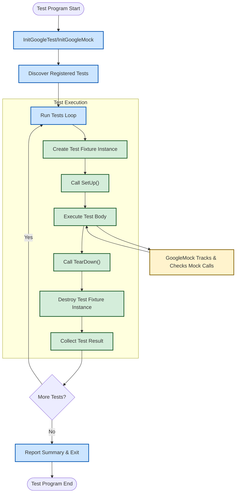

# System Architecture Overview

GoogleTest is a comprehensive C++ testing framework designed to help developers write, organize, and execute tests efficiently. This page provides a high-level overview of GoogleTest's architecture, focusing on the key components that enable test discovery, execution, and integration with GoogleMock for advanced mocking capabilities. Understanding this architecture allows you to better appreciate how GoogleTest works behind the scenes and how to leverage its features for seamless and powerful testing experiences.

---

## Core Components of GoogleTest Architecture

### 1. Test Registration and Discovery

GoogleTest automatically registers all tests as they are defined using macros such as `TEST()` and `TEST_F()`. This registration happens at static initialization time before your tests run, which means you do not have to manually list or enumerate tests.

- **Test Suites and Tests:** Tests are grouped into test suites (formerly called test cases). Each test belongs to exactly one suite.
- **Automatic Discovery:** The framework keeps an internal registry of all test suites and their tests, enabling automatic discovery.

This design lets you add new tests simply by writing test code, with no additional wiring needed to run them.

### 2. Test Execution Engine

At runtime, GoogleTest drives the execution of your tests through the `RUN_ALL_TESTS()` function:

- **Initialization:** It initializes the framework, parses command-line flags, and prepares execution.
- **Test Lifecycle:** For each test, GoogleTest creates a fresh test fixture instance (if using `TEST_F()`), calls `SetUp()`, runs the test code, and then calls `TearDown()` before destroying the fixture.
- **Failure Handling:** Tests can report *fatal* or *non-fatal* failures without crashing the runner. Fatal failures abort the current test, allowing the suite to proceed.
- **Result Aggregation:** The framework collects results at the test level, test suite level, and overall.

This lifecycle ensures isolation, repeatability, and reliable reporting.

### 3. Main Entry Point and Initialization

Though most users link with GoogleTest's `gtest_main` library, which provides a ready-made `main()` function, you can write your own entry point. The essential steps are:

1. Call `testing::InitGoogleTest(&argc, argv);` to initialize the framework and parse GoogleTest flags.
2. Call `RUN_ALL_TESTS()` to execute all registered tests.
3. Return the result code from `RUN_ALL_TESTS()` as your program's exit status.

This interface ensures standardized and predictable test execution.

### 4. GoogleMock Integration

GoogleMock (gMock) extends GoogleTest by enabling mock objects and expectation verification. It integrates smoothly with GoogleTest's architecture:

- **Header Inclusion:** Including `<gmock/gmock.h>` brings gMock into your tests seamlessly.
- **Initialization:** `testing::InitGoogleMock()` complements `InitGoogleTest()`, parsing mock-specific flags.
- **Mock Method Registration:** gMock extends classes with mocked methods using the `MOCK_METHOD` macros.
- **Expectation Management:** At runtime, gMock tracks calls to mock methods and verifies expectations on those calls.
- **Test Flow Integration:** gMock's verification is tied into GoogleTest's test lifecycle, triggering failures on unmet expectations during test teardown.

Together, GoogleTest and GoogleMock provide an expressive and powerful testing and mocking environment.

## Data Flow Overview

This flowchart presents the main flow when running GoogleTest with GoogleMock:

- The program starts and initializes the framework.
- All tests registered are discovered and enumerated.
- For each test, GoogleTest creates the test fixture, runs setup and the test body, and tears down.
- During test execution, GoogleMock monitors mock method invocations and verifies expectations.
- After all tests have run, results are reported, and the program exits.

## Test Discovery Mechanism

GoogleTest relies on static initialization techniques combined with registration helpers to keep track of tests.

- Each `TEST` or `TEST_F` macro instantiates a static object whose constructor registers the test name, suite, and function pointer.
- This registry is globally accessible by the test runner.
- Test filters and flags (passed on the command line) allow selecting subsets of tests to run.

This design avoids the need for manual test enumeration or maintenance.

## Main Entry Point Interaction

- When you link with `gtest_main`, you get a boilerplate `main()` function that initializes and runs tests.
- If custom logic is needed, write your own `main()` function but **must** call `InitGoogleTest()` and then `RUN_ALL_TESTS()`.

This ensures consistent startup, flag handling, and execution.

## GoogleMock Extending Testing Capabilities

GoogleMock enhances GoogleTest with sophisticated mocking capabilities:

- Provides macros for defining mock method implementations in mock classes.
- Allow specification of call expectations, default behaviors, call ordering, call counts, and more.
- Integrates expectation verification within the test teardown, generating failures for unmet expectations.
- Supports rich matchers and custom actions to define how mocked methods behave and respond.

This seamless extension opens up powerful interaction-based testing.

## Best Practices and Tips

- Use `RUN_ALL_TESTS()` **once** and return its result; it manages test lifecycle and results aggregation.
- Prefer linking with `gtest_main` to avoid writing boilerplate.
- Understand the difference between test registration (compile-time static registration) and test discovery (runtime enumeration), so you avoid duplicated work.
- Initialize GoogleMock before running tests if using mocks specifically.
- Organize tests into suites logically reflecting your code for easier navigation and filtering.
- Use GoogleMock features to set precise expectations on mock behavior and interaction for reliability.

## Troubleshooting Common Issues

- Forgetting to call `InitGoogleTest()` or `InitGoogleMock()` will result in flags not working as expected and tests possibly not running.
- Defining your own `main()` but omitting `RUN_ALL_TESTS()` leads to tests not executing.
- Not returning the result of `RUN_ALL_TESTS()` can cause compiler errors and broken CI checks.
- Tests registered but not executing often mean test filter settings or incorrect macro usage.

When such problems arise, verify initialization and test macros usage.

---

## Summary

GoogleTest's architecture centers around automatic test registration, an isolated and repeatable test execution lifecycle, and an extensible framework that integrates GoogleMock for mocking capabilities. The main entry point, facilitated by `gtest_main` or custom `main()`, drives initialization and orchestration of tests and mocks. Understanding these components empowers you to write, organize, and run robust C++ tests with ease.

## Further Reading

- [Writing Your First Test](../getting-started/first-test-run-validation/writing-your-first-test) to get hands-on
- [Mocking Reference](../reference/mocking.md) for details on mocks and expectations
- [API Reference - Test Cases & Fixtures](../api-reference/core-testing-api/test-case-framework) for test structuring
- [GoogleTest Primer](../docs/primer.md) for foundational concepts
- [Integration and Ecosystem Compatibility](../overview/architecture-usage-integration/integration-and-ecosystem) for platform support

---

*This page is part of the core architecture concept area of the GoogleTest documentation.*