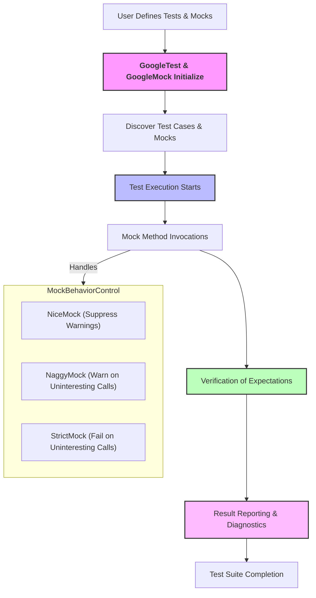

# System Overview

Welcome to the System Overview of GoogleTest and GoogleMock. This guide unpacks how these two integral components are structured and interlinked, offering a cohesive and powerful C++ testing solution. Whether you are new or experienced, understanding this architecture will help you leverage the tools effectively, create robust tests, and integrate smoothly into your development workflow.

---

## Introduction to GoogleTest and GoogleMock Integration

GoogleTest and GoogleMock are designed to function as tightly integrated units, combining to form a seamless testing framework for C++. GoogleTest provides the foundational test framework, while GoogleMock extends it by enabling mock object creation and behavior verification.

These components share namespaces, conventions, and conventions that make the combined experience intuitive and efficient.

### Key Value Points
- Unified framework covering both test definition and mocking
- Consistent syntax and macro usage for defining tests and mocks
- Automatic verification and reporting through GoogleTest's core

## Architecture and Component Structure

At a high level, GoogleTest and GoogleMock consist of the following core components:

- **Test Definition & Discovery**: Enables users to write test cases and suites using macros such as `TEST`, `TEST_F`, `TEST_P`.
- **Mock Object Generation**: Facilitated primarily by GoogleMock through macros like `MOCK_METHOD` which auto-generate mock implementations.
- **Expectation & Behavior Specification**: Allows precise control over mocked method calls, including expectations, ordering, cardinalities, and actions.
- **Test Execution Engine**: Runs declared tests, executes mocked interactions, and collects results.
- **Assertion & Verification Layer**: Part of GoogleTest, validating test correctness and expectations.
- **Result Reporting & Logging**: Communicates outcomes back to the user with diagnostic details.

## How Components Interconnect

1. **User Defines Tests and Mocks**
   - Tests are written using GoogleTest macros.
   - Mock classes are created with GoogleMock macros that instrument classes with mock methods.

2. **Test Runner Initialization**
   - The framework initializes using `InitGoogleMock()` which sets up necessary registers and default behaviors.

3. **Execution Flow**
   - Test runner executes tests.
   - When a mocked method is invoked, GoogleMock checks expectations and actions.
   - GoogleTest manages execution lifecycle and assertion results.

4. **Extensibility Points**
   - Users can define custom matchers, actions, and control strictness of mock behavior using specialized wrappers.

## Execution Flow: From Initialization to Reporting

Understanding the journey of test execution helps you predict behavior and diagnose issues.

### Step 1: Initialization
- `InitGoogleMock()` prepares the framework by parsing flags and setting up internals.

### Step 2: Test Discovery
- The framework collects all defined tests and mocks into a registry.

### Step 3: Running Tests
- Each test case executes, creating and utilizing mocks as specified.
- Mock method calls are intercepted by GoogleMock for verification.

### Step 4: Verification
- GoogleMock automatically verifies at test or mock destruction that all expectations are met.
- Users can force verification manually if needed.

### Step 5: Reporting
- GoogleTest aggregates results and reports successes, failures, and detailed diagnostics.

## Mock Strictness Wrappers: Controlling Behavior of Uninteresting Calls

GoogleMock uses three primary wrappers to govern how mocks respond to unexpected or uninteresting calls:

### NiceMock
- Suppresses warnings about calls to mock methods that have no explicit expectation.
- Ideal for reducing noise when you do not care about all mock method calls.

### NaggyMock
- The default behavior for mocks.
- Warns (but does not fail) on uninteresting calls.

### StrictMock
- Treats uninteresting calls as test failures.
- Useful for strictly verifying that only the expected calls occur.

**Usage Example:**

```cpp
using ::testing::NiceMock;
using ::testing::NaggyMock;
using ::testing::StrictMock;

class MockFoo {
 public:
   MOCK_METHOD(void, DoThis, (), ());
};

NiceMock<MockFoo> nice;
NaggyMock<MockFoo> naggy;
StrictMock<MockFoo> strict;

EXPECT_CALL(nice, DoThis());        // Suppresses warnings on uninteresting calls
EXPECT_CALL(naggy, DoThis());       // Warns on uninteresting calls (default)
EXPECT_CALL(strict, DoThis());      // Fails on uninteresting calls
```

## Key Extensibility Points

GoogleTest and GoogleMock offer features to tailor the framework to your needs:

- **Custom Matchers and Actions:** Define specific conditions and behaviors to fit your domain logic.
- **Default Behavior Configuration:** Customize default return values using `ON_CALL` and `DefaultValue<T>::Set()`.
- **Expectation Sequences and Ordering:** Use sequences and dependency clauses (`InSequence`, `After`) to control call order.
- **Mock Interface Variants:** Partial mocks, fake delegations, and mocking non-virtual methods are supported through patterns.

## Practical Tips and Best Practices

- **Always set expectations before exercising mock objects to avoid undefined behavior.**
- **Prefer to use NiceMock during early development or when uninteresting calls are expected. StrictMock helps catch unexpected calls in mature tests.**
- **Use `EXPECT_CALL` sparingly to verify only important interactions. Use `ON_CALL` for default behavior without expectations.**
- **Encapsulate complex argument constraints with matchers for readability and maintainability.**
- **Understand the difference between uninteresting and unexpected calls to fine-tune mock strictness.**

## Common Pitfalls to Avoid

- Failing to declare destructors as virtual leads to undefined behavior with mocks.
- Overly restrictive expectations cause brittle tests. Loosen expectations or split tests if needed.
- Ignoring call order when order matters can produce incorrect verification results.
- Mixing NiceMock, NaggyMock, and StrictMock with base classes or nested can produce inconsistent behavior.

## Visualization of Core Interactions



---

## Summary

This System Overview has presented the integrated architecture of GoogleTest and GoogleMock, detailing how tests and mocks coexist, and how execution flows from initialization through to reporting. Understanding the wrappers like NiceMock, NaggyMock, and StrictMock gives you precise control over mock behavior and test strictness. The guide highlighted practical aspects to maximize your success with this C++ testing solution.

---

## Further Learning and Resources

- [GoogleMock Cookbook](gmock_cook_book.md) — practical recipes for using mocks and expectations.
- [Mocking Reference](reference/mocking.md) — detailed API and macro documentation.
- [Nice, Strict, and Naggy Mocks](api-reference/mocking-apis/nice-strict-mocks.mdx) — in-depth understanding of mock strictness wrappers.
- [Specifying Expectations and Actions](guides/mocking-and-behavior-verification/specifying-expectations-and-actions.mdx) — how to control mock behavior.
- [GoogleTest Primer](overview/product-intro-value/what-is-googletest.mdx) — foundational testing knowledge.

---

For navigation within the documentation, you can also refer to the [Concepts Tab > Core Architecture > System Overview](https://google.github.io/googletest/concepts/core-architecture/system-overview.html).