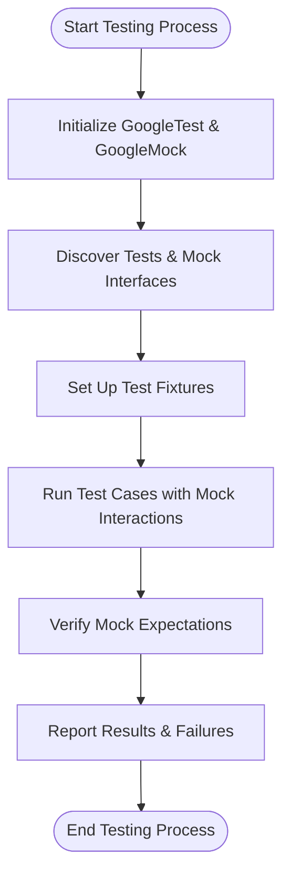

# System Overview

Gain a clear, high-level understanding of how GoogleTest and GoogleMock are architected and operate together. This guide delves into the key abstractions, the merged design of the two projects, and the resulting advantages from their unified architecture.

---

## Introduction

GoogleTest and GoogleMock form a powerful duo for C++ testing and mocking. Originally separate, these projects have been merged to deliver a cohesive framework that simplifies developing, running, and maintaining tests with mocking capabilities.

This system overview provides an essential mindset for users to grasp the key organizational elements shaping their testing workflows.

## Key Components and Their Roles

### Test Cases
- Represent individual units of verification, encapsulating test logic used to verify specific behaviors or code paths.
- Organized into test suites (previously called test cases) for grouping related tests.

### Test Fixtures
- Shared setup and teardown mechanisms for multiple tests.
- Allow resource initialization and cleanup common to a suite of tests enhancing maintainability.

### Test Runner
- Core engine that discovers, filters, and executes tests.
- Manages lifecycle hooks, initiates test execution, and aggregates results.

### Mock Classes
- Provide the ability to simulate interfaces or dependencies via `MOCK_METHOD` macros.
- Enable setting detailed expectations and behaviors on mock methods.

### Assertions and Matchers
- Allow test outcomes to be validated flexibly.
- Matchers enable expressive argument validation for mock methods.

### Integration and Execution
- Combined GoogleTest / GoogleMock initialization, such as via `testing::InitGoogleMock()`, offers seamless test execution encompassing mocks.

## Unified Architecture Advantages

- **Streamlined Workflow:** One integrated initialization and execution model simplifies test binaries.
- **Consistency:** Shared namespace and coding conventions unify user experience across testing and mocking.
- **Extensibility:** Allows users to leverage mock matchers and actions naturally alongside built-in GoogleTest assertions.
- **Comprehensive Verification:** Automatic expectation verification during teardown phases reduces boilerplate test code.

## Data Flow: Typical User Journey



This flow illustrates the user's test run lifecycle, from initialization, discovering test and mock methods, running tests while verifying mocks, and concluding with result reporting.

## How GoogleTest and GoogleMock Interact

- GoogleMock is built on top of GoogleTest’s infrastructure — it depends on GoogleTest.
- Mocks defined with GoogleMock classes integrate into GoogleTest's test cases smoothly.
- `InitGoogleMock()` is a convenient entry point that initializes both frameworks together.

## Summary of Core Abstractions

| Concept        | Definition & Purpose                                               |
|----------------|------------------------------------------------------------------|
| Test Case      | A collect of individual tests (formerly called Test Case; now mostly Test Suite) |
| Test Fixture   | Setup/teardown logic shared by tests in a test case              |
| Test Runner    | The engine that manages test execution and reporting              |
| Mock Class     | Class with methods delegated to simulated behaviors to verify interactions |
| Mock Method    | Simulated method defined with `MOCK_METHOD` macro                |
| Matcher        | Predicate used to specify expected arguments in mock calls       |
| Expectation    | Constraints and behaviors prescribed on mock method calls        |

## Notable Implementation Highlights

- GoogleMock provides declarative macros such as `MOCK_METHOD` that users put inside mock class definitions in their test code.
- `EXPECT_CALL` statements specify how mocks are expected to be called.
- At run time, GoogleTest executes tests and GoogleMock checks that these expectations are met, reporting unexpected or missing calls.

## Building and Initializing Tests

GoogleTest offers pre-defined main functions (e.g., in `gtest_main`) that users can link against. Similarly, the merged GoogleMock provides `gmock_main` with the `main()` function initializing both frameworks together.

Example main function behavior from `gmock_main.cc`:

```cpp
int main(int argc, char **argv) {
  std::cout << "Running main() from gmock_main.cc\n";
  testing::InitGoogleMock(&argc, argv);
  return RUN_ALL_TESTS();
}
```

This aligns initialization and test execution seamlessly, removing user burden.

## Value to Users

- **Simple Test Creation:** Users write tests triggered automatically without writing test harness code.
- **Powerful Mocking:** Through mock classes, users simulate dependencies and control interactions precisely.
- **Improved Debugging:** Integration of expectations and assertions surface problems immediately during tests.
- **Modular and Scalable:** System architecture supports scaling from small unit tests to complex mock-based integration tests.

## Recommendations and Best Practices

- Use `InitGoogleMock()` or link against `gmock_main` to handle startup.
- Structure tests with fixtures to maximize code reuse.
- Define mocks with `MOCK_METHOD` in `public` sections regardless of base class access.
- Set expectations with `EXPECT_CALL` before exercising code.
- Prefer `NiceMock` or `StrictMock` wrappers to control the verbosity and strictness of mock warnings.

---

<AccordionGroup title="Common Troubleshooting Tips">
<Accordion title="Test Not Discovered or Executed">
Ensure that your test functions are registered properly using `TEST` or `TEST_F` macros. Remember that GoogleTest automatically discovers these in linked binaries.
</Accordion>
<Accordion title="Mock Expectations Not Verified">
Mocks automatically verify expectations on destruction. If using heap-allocated mocks, ensure they are deleted. For early verification, use `Mock::VerifyAndClearExpectations(&mock)`.
</Accordion>
<Accordion title="Multiple main() Conflicts">
Linking both `gtest_main` and `gmock_main` can cause conflicts. Use only one entry point matching the needs, usually `gmock_main` if mocks are involved.
</Accordion>
</AccordionGroup>

---

## Further Resources
- [gMock Cookbook](https://google.github.io/googletest/gmock_cook_book.html) for practical recipes.
- [Mocking Reference](https://google.github.io/googletest/reference/mocking.html) for in-depth macro and API explanations.
- [GoogleTest Primer](https://google.github.io/googletest/primer.html) for foundational testing concepts.
- [System Architecture (with Diagram)](/overview/architecture-and-core-concepts/system-architecture) for architectural context.

---