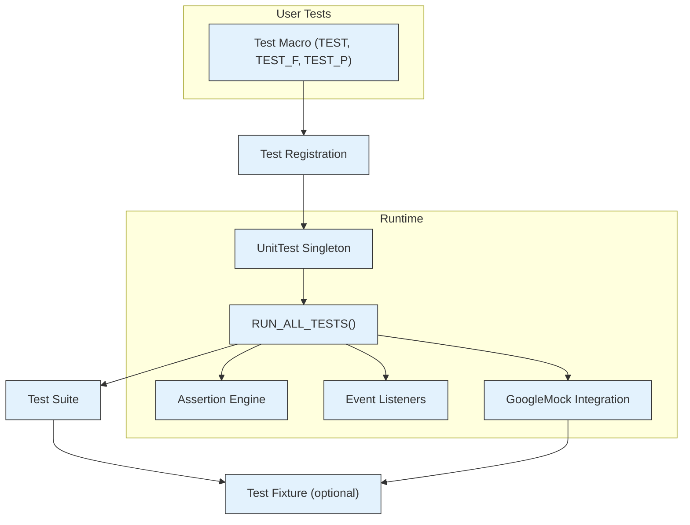

# System Overview

GoogleTest and GoogleMock are powerful frameworks designed to facilitate writing and running C++ tests and mocks efficiently and reliably. At their core, these frameworks embody principles that ensure test discovery is automatic, execution is seamless, and test results are aggregated clearly to drive quality assurance.

This document provides a comprehensive understanding of the central design principles and high-level components underpinning GoogleTest and GoogleMock. It focuses on how major elements of the framework interact, enabling developers to write effective tests and obtain insightful feedback with minimal friction.

---

## Core Design Principles

### 1. Automatic Discovery and Registration of Tests
GoogleTest automatically discovers tests defined using macros such as `TEST()`, `TEST_F()`, and `TEST_P()` without requiring explicit registration. This removes boilerplate and keeps test code clean and maintainable.

- When a test macro is used, the test is registered with the framework behind the scenes.
- Tests are organized into **test suites**, which reflect logical groupings related to the tested components.

### 2. Isolation and Independence of Test Execution
Each test runs in isolation to ensure that: 

- No test affects another's outcome.
- Tests remain independent and repeatable.
- Test fixtures are fresh instances created per test, avoiding shared mutable state unless explicitly managed.

### 3. Rich Assertions and Failure Handling
Assertions are the foundation of verifying correctness. GoogleTest provides a rich set of assertions to cover various testing needs:

- **Fatal assertions** (`ASSERT_*`) abort the current function on failure preventing further execution.
- **Non-fatal assertions** (`EXPECT_*`) record a failure but allow the test to continue.
- Custom assertions with informative messages and predicate support enable clear diagnosis of failures.

### 4. Parametrization and Type Variations
GoogleTest supports sophisticated testing patterns to maximize coverage without duplicating code:

- **Value-Parameterized Tests** run the same logic with a variety of input values.
- **Typed and Type-Parameterized Tests** apply the same tests to multiple data types.

### 5. Integration with Mocking
GoogleMock is tightly integrated with GoogleTest to support:

- Defining mock classes with declarative syntax.
- Setting expectations and behaviors using intuitive macros.
- Verifying interactions precisely without manual record/replay mechanics.

### 6. Extensibility and Customization
Developers can extend the framework through:

- Custom matchers for domain-specific assertion needs.
- Event listeners that hook into the test execution lifecycle.
- Programmatic registration of tests for dynamic or user-driven scenarios.

### 7. Scalability and Parallelism
GoogleTest supports running tests concurrently via:

- Test sharding across machines or agents.
- Rerunning flaky tests repeatedly to detect intermittent issues.

---

## High-Level Components and Interactions

The following key components work together to provide the overall testing experience:

### Test Macros and Registration
- `TEST()`, `TEST_F()`, `TEST_P()` macros define tests.
- Each test is backed by a `Test` derived class that encapsulates the test code.
- The test macros register tests into the `UnitTest` singleton's internal lists upon program initialization.

### Test Suites
- Group tests logically for organization and shared setup.
- Support shared resources through `SetUpTestSuite()` and `TearDownTestSuite()` for efficiency.

### Test Fixture
- A test class inheriting from `testing::Test` can encapsulate reusable setup and teardown logic.
- Each test method operates on a fresh fixture instance.

### Test Runner
- `RUN_ALL_TESTS()` executes all registered tests sequentially, observing parameters such as filters and repeat counts.
- Test execution calls the lifecycle hooks in sequence: fixture construction, `SetUp()`, test body, `TearDown()`, destruction.

### Event Listener API
- Users can attach custom listeners to receive notifications about test start, end, failures, and more.
- Listeners enable output customization, integration with tools, or resource tracking.

### Assertion Engine
- Assertions produce success, nonfatal failure, or fatal failure.
- Detailed failure messages and stack traces aid debugging.

### Parameterized Testing
- Value and typed tests enable running a suite multiple times with varying data or types.
- Instantiation macros bind parameter sets to test patterns.

### Mocking Framework (GoogleMock)
- Provides `MOCK_METHOD()` macro for defining mock methods.
- Controls behavior with expectations (`EXPECT_CALL`), default behaviors (`ON_CALL`), and actions.
- Integrated with GoogleTest for seamless verification and reporting.

---

## Typical User Workflow

1. **Write Tests Using Macros:** Users write tests with `TEST()`, `TEST_F()`, or `TEST_P()` depending on the testing scenario.
2. **Organize Tests in Suites:** Logical grouping into test suites facilitates shared code and maintainability.
3. **Run Tests:** Execute all or filtered tests using `RUN_ALL_TESTS()` or command-line filter flags.
4. **Analyze Results:** Examine console output, XML/JSON reports, or custom listeners to understand test outcomes.
5. **Iterate Quickly:** Leverage features like non-fatal assertions and test repeats to diagnose flaky or complex bugs.
6. **Extend and Integrate:** Add custom matchers, mocks, or event listeners to fit specific testing workflows.

---

## Example: Basic Test and Fixture

```cpp
#include <gtest/gtest.h>

// Simple test without fixture
TEST(FactorialTest, HandlesZeroInput) {
  EXPECT_EQ(Factorial(0), 1);
}

// Test fixture
class StackTest : public ::testing::Test {
 protected:
  void SetUp() override {
    stack_.push(1);
    stack_.push(2);
  }

  std::stack<int> stack_;
};

TEST_F(StackTest, HasCorrectSize) {
  EXPECT_EQ(stack_.size(), 2);
}

TEST_F(StackTest, PopsCorrectly) {
  int top = stack_.top();
  stack_.pop();
  EXPECT_EQ(top, 2);
  EXPECT_EQ(stack_.size(), 1);
}
```

---

## Diagram: High-Level Component Interaction



---

## Practical Tips and Best Practices

- **Use TEST_F for shared setup:** When multiple tests rely on common objects or state, define a fixture and use `TEST_F`.
- **Prefer EXPECT_* when possible:** This allows a test to report multiple failures in one run, providing richer feedback.
- **Name test suites and tests meaningfully:** Follow C++ naming conventions and avoid underscores in names.
- **Leverage parameterized tests:** Use `TEST_P` and `INSTANTIATE_TEST_SUITE_P` to reduce boilerplate and improve test coverage.
- **Use event listeners for custom reporting:** Attach listeners to adapt output formats or integrate with tools.
- **For mocking dependencies:** Use GoogleMock to isolate units under test and control/mock interactions.

## Common Pitfalls

- **Fatal assertions only abort current function:** Use `ASSERT_*` with care in helper functions or subroutines; the test may continue unexpectedly.
- **Thread-safety concerns in death tests:** Death tests require single-threaded context or specific handling due to process forking semantics.
- **Skipping tests:** Use `GTEST_SKIP()` properly to handle runtime preconditions.
- **Avoid fragile fixtures:** Make sure shared resources in fixtures are properly cleaned up.

---

## Additional Resources

- [GoogleTest Primer](primer.md) – Essential concepts and getting started.
- [Advanced GoogleTest Topics](advanced.md) – Deep dive into assertions, parameterized and typed tests.
- [GoogleMock for Dummies](gmock_for_dummies.md) – Introduction to mocking.
- [Event Listener API (sample9_unittest.cc)](googletest/samples/sample9_unittest.cc) – Example for customizing test output.
- [Test Registration and Structure Reference](reference/testing.md#test-registration-and-structure) – API details.

---

Understanding this system overview empowers you to write high-quality, maintainable tests and to harness the full power of GoogleTest and GoogleMock in your C++ projects. Dive deeper into individual concepts and workflows in the linked guides and references to master the framework.
