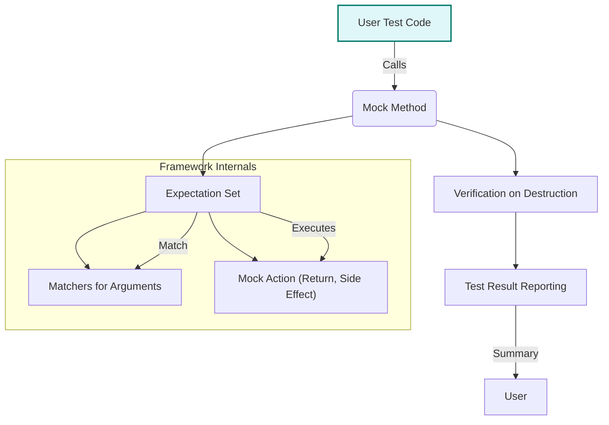

# System Overview

GoogleTest and GoogleMock have merged into a unified, seamless testing framework designed to simplify and improve your C++ unit testing experience. This page provides a comprehensive walkthrough of the combined architecture, highlighting how the core components work together and how you, as a user, interact with the system to write, run, and manage your tests effectively.

---

## 1. Unified Architecture of GoogleTest and GoogleMock

GoogleTest focuses on test execution, discovery, and assertions, while GoogleMock provides a rich framework for creating mock objects and setting expectations. Together, they form a powerful, cohesive ecosystem that supports test writing, verification, and runtime behavior control.

### 1.1 Core Components

- **Test Macros**: The primary interface for users to define tests (`TEST`, `TEST_F`, `TEST_P`, etc.). These macros register tests automatically with the framework.
- **Assertions and Matchers**: Provide expressive checks of conditions and argument matches to validate test outcomes and mock interactions.
- **Mocking Framework**: Enables creation of mock classes with the `MOCK_METHOD` macro, as well as specifying behaviors and call expectations using `EXPECT_CALL` and `ON_CALL`.
- **Test Runner**: Manages test discovery, execution lifecycle, reporting, and teardown.

Together, these components orchestrate a smooth flow from writing a test to verifying its correctness and reporting results.

### 1.2 Interaction Flow Between User Code and Testing Runtime

Users define tests using macros, create mock objects, specify expectations, and then exercise code under test. During execution, calls to mock methods and assertions are monitored and verified by the framework. It reports successes, failures, or unexpected behaviors with detailed context.

<Steps>
<Step title="Define Tests and Mocks">
Use test macros such as `TEST` and define mock classes employing `MOCK_METHOD` to simulate dependencies.
</Step>
<Step title="Set Behaviors and Expectations">
Configure mock behaviors with `ON_CALL` for default actions and `EXPECT_CALL` for expected invocations including argument matchers and call counts.
</Step>
<Step title="Run Tests via Test Runner">
Invoke the test runner that discovers all registered tests, executes them, and manages the lifecycle of your mocks and assertions.
</Step>
<Step title="Verify and Report">
GoogleTest automatically verifies expectations at mock destruction, reporting any unmet or violated expectations along with assertion outcomes.
</Step>
</Steps>

---

## 2. Test Macros and Registration

User tests, whether simple or parameterized, start with macros that register the tests with the framework. These macros integrate smoothly with mocks and assertions to provide a clear test definition.

Example:

```cpp
TEST(MyComponentTest, ReturnsExpectedValue) {
  MockDependency mock_dep;
  EXPECT_CALL(mock_dep, GetValue())
      .WillOnce(Return(42));

  MyComponent component(&mock_dep);
  EXPECT_EQ(component.Compute(), 42);
}
```

Here, `MockDependency` is a mock class with method expectations, and the test macro registers `MyComponentTest.ReturnsExpectedValue` for execution.

---

## 3. Mocking Framework Conceptual Overview

GoogleMock allows flexible and powerful mocking without writing boilerplate.

### 3.1 Defining Mock Classes

- Use `MOCK_METHOD` macros inside a class inheriting the interface or base class.
- Supports mocking virtual methods including overloaded, templated, and those with move-only arguments.

Example:

```cpp
class MockTurtle : public Turtle {
 public:
  MOCK_METHOD(void, PenUp, (), (override));
  MOCK_METHOD(void, Forward, (int distance), (override));
  MOCK_METHOD(int, GetX, (), (const, override));
};
```

### 3.2 Using Strictness Modifiers

You can define mock objects with different strictness levels:

- **NiceMock**: Suppresses warnings on unexpected calls.
- **NaggyMock** (default behavior currently): Warns on uninteresting calls.
- **StrictMock**: Treats uninteresting calls as errors.

Example:

```cpp
NiceMock<MockTurtle> nice_turtle;
StrictMock<MockTurtle> strict_turtle;
```

### 3.3 Setting Expectations and Actions

Use `EXPECT_CALL` to specify which methods should be called, with what arguments, how many times, and what actions to perform.

Chainable clauses allow fine control over matching arguments, call order, call count, and behavior:

```cpp
EXPECT_CALL(mock, DoSomething(_))
  .Times(3)
  .WillOnce(Return(true))
  .WillRepeatedly(Return(false));
```

---

## 4. Test Execution Lifecycle

### 4.1 Discovery

The test runner scans registered tests and mock definitions as they are compiled and linked into your binary (via static registration).

### 4.2 Setup

Mocks are constructed. `ON_CALL` sets default behaviors; `EXPECT_CALL` prepares expectation tracking.

### 4.3 Execution

User code runs, making calls to mocks and operating test assertions. The framework matches calls against expectations, executes actions, and tracks invocation counts.

### 4.4 Verification

On destruction of mocks or explicitly, the framework verifies all expectations were satisfied, reporting mismatches immediately or when the mock object is destructed.

### 4.5 Reporting

Test results, including assertion success/failure and mock expectation status, are printed to the console or other configured reporters.

---

## 5. Value Flow in Mocks and Assertions

Calls from user code into mocks are compared against expectations using matchers and predicate logic. The framework processes:

- Argument Matching: To determine which expectation to apply.
- Actions: The behavior to execute (return values, side-effects, delegations).
- Verification: Tracking calls made, in order, and verifying cardinalities.

This approach ensures tests are expressive, maintainable, and verify both state and interaction effectively.

---

## 6. User-Centric Best Practices

- Define mocks in the public section with the `MOCK_METHOD` macro.
- Prefer `ON_CALL` to set general behavior; reserve `EXPECT_CALL` for verifying calls.
- Use `NiceMock` to suppress warnings during development; switch to `StrictMock` for tighter error detection.
- Use sequences and ordering clauses (`InSequence`, `After`) to verify call order only when necessary.
- Use progressive disclosure: start with basic expectations, then add complexity as the test evolves.

---

## Appendix: Simplified Architecture Diagram



---

## Related Documentation

Please explore these complementary documentation pages to broaden and deepen your understanding:

- [Test Macros and Test Registration](../api-reference/core-apis/test-macros.md)
- [Assertions and Predicate Macros](../api-reference/core-apis/assertions.md)
- [Matchers](../api-reference/core-apis/matchers.md)
- [Mocking Reference](../api-reference/core-apis/mocking-basics.md)
- [Getting Started: Writing Your First Test](../guides/getting-started-testing/writing-your-first-test.md)
- [Mocking Cookbook](https://google.github.io/googletest/gmock_cook_book.html)

---

This page aims to deliver a holistic understanding of the unified GoogleTest and GoogleMock architecture, delivering user-centric clarity on test definition, mocking strategies, lifecycle, and behavior management for seamless unit test creation and execution.