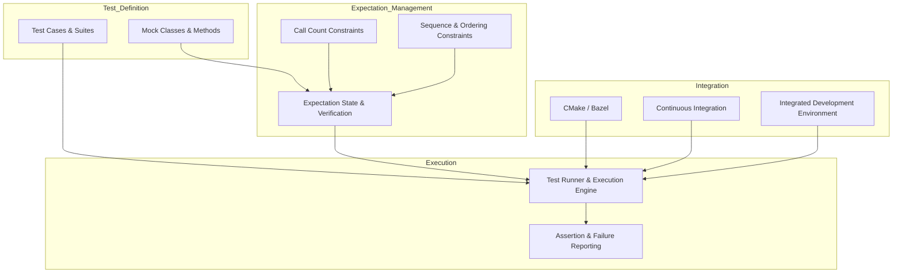

# System Overview

## Introduction

GoogleTest and GoogleMock were unified to form a powerful, scalable C++ testing framework that adapts the xUnit testing model to complex real-world software development workflows. This unified architecture brings together robust test isolation, expressive assertions, and rich mock object capabilities tailored for the intricacies of C++.

This overview introduces the key architectural principles behind this merger, explaining the rationale for the integration and high-level design choices. Understanding this architecture helps users appreciate how GoogleTest fits naturally within modern C++ development pipelines — facilitating maintainable, reliable test suites.

---

## Why Unify GoogleTest and GoogleMock?

Before unification, GoogleTest focused on test execution and assertions, while GoogleMock specialized in creating mock objects and behavioral specifications. Combining them creates a seamless testing experience without the overhead of handling separate frameworks, reducing complexity for developers.

Key reasons for the merger include:

- **Consistency:** A single framework simplifies learning, usage, and maintenance.
- **Integration:** Unified API allows smooth transition between state-based and interaction-based testing.
- **Scalability:** Centralized codebase enables consistent support for features like test discovery, parallel execution, and mocking enhancements.

The result is a testing framework that leverages the xUnit model’s strengths while empowering developers with sophisticated mocks and expectations tailored for C++.

---

## High-Level Architecture

At its core, the architecture hinges on three pillars:

### 1. **Test Discovery & Execution Model**
GoogleTest uses a test registry to discover defined test cases and test suites automatically at runtime. Each test case conforms to the xUnit execution pattern — setup, invoke test body, teardown — while providing assertion APIs to mark successes and failures.

### 2. **Mock Objects & Method Specifications**
GoogleMock adds the ability to create mock classes simulating interfaces or behaviors. Using macros like `MOCK_METHOD`, users define mock methods with clear contracts. Expectations via `EXPECT_CALL` specify how these mocks should behave, including argument matchers, call count constraints (cardinality), and call ordering.

### 3. **Expectation Management & Behavior Control**
The framework maintains expectation states that verify whether the calls made at runtime conform to the specifications. It supports:

- Strict and nice mocks controlling warning and failure handling on unanticipated calls.
- Default and specific behaviors set by `ON_CALL` and `EXPECT_CALL` respectively.
- Sequencing constructs (`InSequence`, `After`) to verify call order constraints.

All components interact cohesively to deliver accurate verification of both state and interaction behaviors.

---

## Adapting the xUnit Model to C++

GoogleTest brings the xUnit conceptual model to C++ with enhancements to accommodate C++ features and idioms:

- **Test Fixtures and Suites:** Enable sharing setup and teardown logic, reducing boilerplate.
- **Parameterized & Typed Tests:** Facilitate testing template-based code and multiple data scenarios.
- **Rich Assertions:** Support for various assertion macros, including predicate and matcher-based assertions.
- **Exception & Death Testing:** Cater to advanced verification scenarios.

The integration with GoogleMock extends this model by supporting interaction-based testing, where the focus shifts to verifying how components communicate via method calls.

---

## Integration in Development Pipelines

GoogleTest and GoogleMock fit naturally into modern development workflows:

- **Automated Builds:** Easily incorporated into CMake, Bazel, or other build systems with minimal configuration changes.
- **Continuous Integration (CI):** Compatible with popular CI tools enabling automated test execution upon code changes.
- **IDE Support:** Intuitive debugging and test navigation with major IDEs enhance developer productivity.

Its architecture supports parallel test execution and detailed failure reporting, significantly improving turnaround time and developer confidence.

---

## Practical User Flow

1. **Define Test Cases:** Users write test cases inheriting from `::testing::Test` or related classes.
2. **Create Mocks:** Using `MOCK_METHOD`, mock classes model interfaces with desired mocked methods.
3. **Set Expectations:** `EXPECT_CALL` macros specify method call counts, argument matchers, and behaviors.
4. **Run Tests:** The framework executes tests, automatically validating both outcomes and mock expectations.
5. **Receive Feedback:** On failures, detailed diagnostics pinpoint assertion errors or mock expectation mismatches.

This workflow emphasizes clarity and robustness, facilitating easier debugging and faster development cycles.

---

## Best Practices and Tips

- Ensure virtual destructors on interfaces to avoid object lifetime issues with mocks.
- Set `EXPECT_CALL` expectations *before* exercising the mock objects to allow early failure reporting.
- Use cardinalities judiciously to avoid brittle tests or false passes.
- Prefer `ON_CALL` for default behaviors and reserve `EXPECT_CALL` for verifications.
- Use sequences to enforce call order when it is critical for correctness.
- Use `NiceMock` or `StrictMock` wrappers to tune test strictness depending on the verification needs.

Keep the interface design and mocking strategy iterative and focused on clear behavioral contracts.

---

## Troubleshooting Common Issues

- **Method Not Mocked:** Ensure methods you mock are virtual; non-virtual methods require advanced techniques.
- **Uninteresting Calls Warnings:** Use `NiceMock` or explicitly declare default behaviors to suppress unwanted warnings.
- **Order of EXPECT_CALL Matters:** Be mindful of the order since newer expectations override older ones unless sequences are used.
- **Memory Leaks Detected:** Verify mock objects are properly destroyed; tools like heap checkers can assist.

Refer to the detailed guides in the documentation for remedying specific scenarios.

---

## Visualizing GoogleTest and GoogleMock Unified Architecture

This diagram shows the essential components and flow within the unified GoogleTest and GoogleMock architecture.

---

## Further Exploration

For in-depth guidance on specific topics please refer to:

- **gMock for Dummies:** Beginner-friendly guide to mocking with GoogleMock.
- **Mocking Reference:** Detailed specs and API for mock object creation and usage.
- **gMock Cookbook:** Recipes for common advanced mocking scenarios.
- **Mocking Best Practices:** Strategies to design maintainable and robust tests with mocking.
- **Integration with Build Systems & Tools:** Guidance on embedding GoogleTest/Mock in projects.

These resources provide comprehensive understanding complementary to this architecture overview.

---

*You are now equipped with a high-level understanding of the GoogleTest and GoogleMock unified architecture — empowering you to harness the full capability of C++ automated testing.*