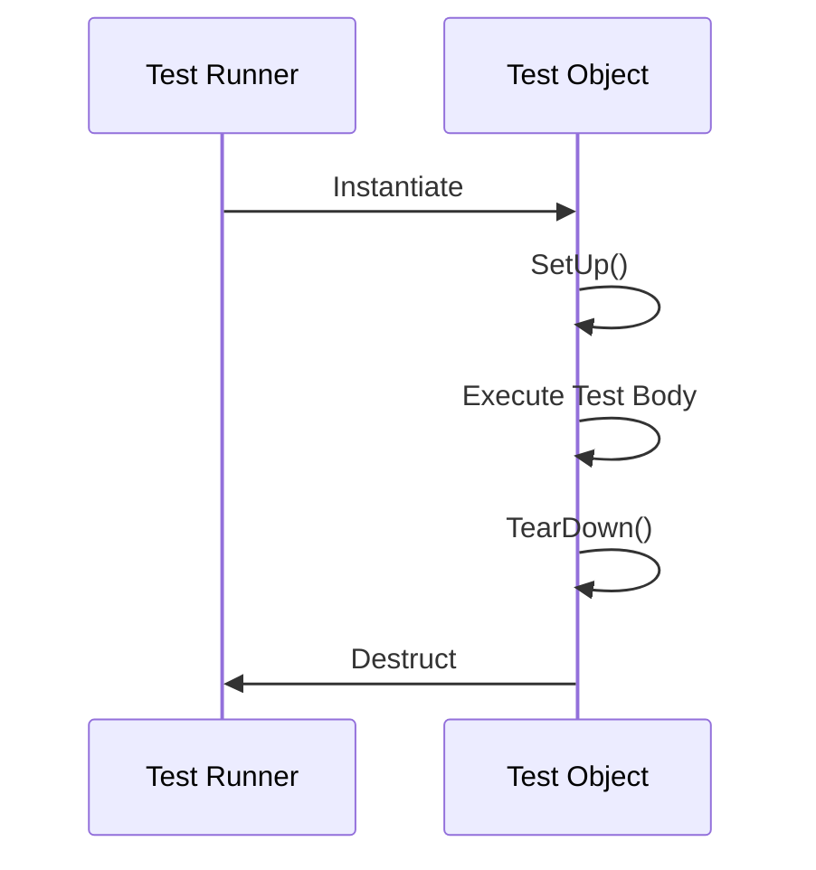
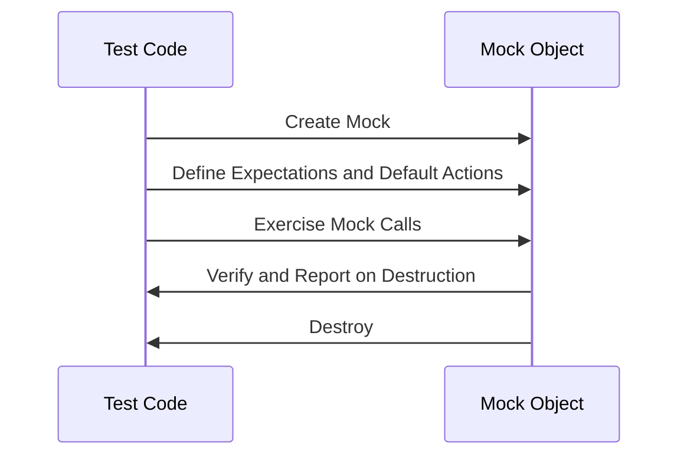

# Test and Mock Object Lifecycle

Understanding how GoogleTest and GoogleMock manage the lifecycle of test and mock objects is crucial to writing effective, reliable unit tests. This guide delves into the phases of instantiation, initialization, verification, and teardown for both test cases and mock objects, highlighting how resource management and expectation checks are handled behind the scenes.

---

## Introduction

When writing tests with GoogleTest and mocks with GoogleMock, users interact with objects that undergo a well-defined lifecycle. Proper management of this lifecycle ensures that:

- Tests run with fresh state each time to avoid cross-test contamination.
- Mock expectations are correctly set, exercised, and verified.
- Resources used in tests are initialized and cleaned up properly.

This lifecycle documentation will help you understand what happens at each stage so you can avoid common pitfalls like leaking resources, missing expectation verifications, or unexpected mock call failures.

---

## Test Object Lifecycle

At the core of a GoogleTest test case is a *test object*, an instance of the test fixture class (if any), or the test class itself.

### 1. Construction

Before each test runs, GoogleTest constructs a new test object. This fresh object ensures no leftover state from previous tests affects the current run. It means:

- Constructors should be lightweight.
- State is set up per test to ensure isolation.

```cpp
class MyTest : public ::testing::Test {
 public:
  MyTest() { /* Constructor */ }
};
```

### 2. SetUp Phase

Right after construction, if a `SetUp()` method is defined in your test fixture, it is called. This is the place to:

- Initialize test resources.
- Configure environment or shared test state.

```cpp
void SetUp() override {
  // Initialize shared state
}
```

### 3. Test Body Execution

After successful setup, GoogleTest runs the actual test code defined inside the test method. This is where your assertions and mock usage occur.

### 4. TearDown Phase

When the test body completes (either normally or after a failure), the `TearDown()` method is called if defined. Use this to:

- Release or reset resources.
- Undo any setup changes.

```cpp
void TearDown() override {
  // Clean up
}
```

### 5. Destruction

Finally, the test object is destroyed. This triggers:

- Automatic verification of test assertions if using test fixtures.
- Cleanup of any member resources.

### Summary of Test Lifecycle Flow



---

## Mock Object Lifecycle

Mock objects in GoogleMock are instrumental for verifying interactions with dependencies. Their lifecycle adds some additional complexity to ensure expectations are both checked and managed cleanly.

### 1. Creation

You create mock objects explicitly, usually on the stack or heap, prior to running the code under test.

```cpp
MockTurtle turtle;
```

### 2. Defining Expectations and Default Actions

Immediately after creation and before exercising the code, you set expectations with `EXPECT_CALL()` and default behaviors with `ON_CALL()`.

- **`EXPECT_CALL()`** asserts how many times and with what arguments methods should be called.
- **`ON_CALL()`** specifies default behavior without setting call count expectations.

```cpp
EXPECT_CALL(turtle, PenDown()).Times(1);
ON_CALL(turtle, GetX()).WillByDefault(Return(0));
```

### 3. Exercising Code

Your code invokes the mock methods following those expectations. GoogleMock tracks each invocation:

- Matches against the expectations.
- Executes specified actions or default reactions.

### 4. Verification On Mock Destruction

When a mock object is destroyed, GoogleMock automatically verifies:

- All expected calls (per `EXPECT_CALL`) were made the correct number of times.
- No unexpected calls occurred.

If verification fails, GoogleMock emits non-fatal failures with detailed diagnostic messages.

### 5. Clearing Expectations Manually

If needed, you can invoke

```cpp
Mock::VerifyAndClearExpectations(&mock_object);
```

This forces verification and clears expectations before destruction, useful if your mock is managed by code under test that may outlive the test scope.

### 6. Allowing Mock Leaks

If for some reason a mock object is deliberately leaked (not deleted), you can suppress leak detection and verification with:

```cpp
Mock::AllowLeak(&mock_object);
```

### Strictness Wrappers

GoogleMock offers wrappers to control handling of uninteresting calls:

| Wrapper Type  | Behavior on Uninteresting Calls       | Use Case                          |
| ------------- | ------------------------------------- | -------------------------------- |
| `NiceMock`    | Suppresses warnings                   | Ignores irrelevant methods       |
| `NaggyMock`   | Prints warnings (default behavior)   | Useful during development        |
| `StrictMock`  | Treats uninteresting calls as errors | Ensures tight test coverage      |

Examples:

```cpp
NiceMock<MockFoo> nice_mock;
StrictMock<MockFoo> strict_mock;
```

### Summary of Mock Lifecycle Flow



---

## Interaction Between Test and Mock Lifecycles

The test lifecycle and mock lifecycle work together seamlessly. Often, mock objects are members of test fixtures, thus their lifecycles are tied to the test object itself.

- Mocks are constructed and initialized during test fixture construction and setup.
- Expectations are defined during test setup or within test bodies.
- Verification occurs automatically during either mock object destruction or explicitly by user code.

Careful ordering ensures all expectations are set *before* the mock methods are called, as setting expectations after usage leads to undefined behavior.

---

## Practical Tips and Best Practices

- **Define expectations early.** Always set `EXPECT_CALL` before invoking the code under test to avoid surprises.

- **Use `ON_CALL` for default behavior.** Specify behavior that applies regardless of call counts without forcing expectations.

- **Manage mock object lifetime carefully.** Especially when mocks are allocated dynamically, ensure their destruction triggers verification.

- **Use strictness wrappers prudently.** `NiceMock` reduces noise, while `StrictMock` enforces correctness. Select based on test needs.

- **Use `RetiresOnSaturation()` when appropriate.** This clause allows expectations to cease matching after completion, avoiding saturation errors.

- **Explicitly verify mocks if not destructed promptly.** Use `Mock::VerifyAndClearExpectations` to catch unmet expectations early.

- **Avoid setting expectations after exercising mocks.** Doing so leads to undefined behavior and difficult-to-debug failures.

- **Mock destructors carefully.** Since destructors cannot be mocked directly, use a mock method called in the destructor to track destruction order and timing.

---

## Troubleshooting Common Lifecycle Issues

### Missing Expectation Failures

If your test passes despite unmet expectations, verify that:

- Your mock object is properly destroyed, triggering verification.
- You have not suppressed leak detection inadvertently with `AllowLeak`.
- No expectations are set after exercising the mock.

### Uninteresting Call Warnings

Warnings about uninteresting calls indicate calls to mock methods without `EXPECT_CALL` set.

- Use `NiceMock` to suppress these if you intentionally ignore these calls.
- Add a catch-all expectation with `Times(AnyNumber())` if preferred.

### Excessive Call Failures

Errors about calls exceeding expectation count may be resolved by:

- Using `RetiresOnSaturation()` to retire expectations after use.
- Adjusting `Times()` to allow more calls.

### Leaked Mocks Detected

GoogleMock warns about mocks not deleted by test end, preventing verification:

- Delete mocks explicitly when no longer needed.
- Use `Mock::AllowLeak` only if leaking is intentional.

### Expectation Ordering Issues

To enforce call order:

- Use `InSequence` block or `InSequence` clause in `EXPECT_CALL`.
- Use `After` clause to specify partial order dependencies.

Without explicit ordering, calls can happen in any order that matches expectations.

---

## Summary

GoogleTest constructs and tears down test objects for each test ensuring isolation. GoogleMock manages mock object lifetimes to automate expectation verification and clean-up. Proper coordination of their lifecycles guarantees test correctness, resource safety, and clear diagnostic reporting.

Understanding and leveraging these lifecycles helps you write robust unit tests that verify expected behavior reliably and avoid common lifecycle pitfalls.

---

## Further Reading and References

- [Using Mocks in Tests](https://google.github.io/googletest/gmock_for_dummies.html#using-mocks-in-tests) - detailed mock usage patterns.
- [Writing Mock Expectations and Actions](../guides/mocking-with-googlemock/writing-mock-expectations.mdx) - for setting precise mock expectations.
- [Mocking Strictness: Nice, Naggy, and Strict](https://google.github.io/googletest/gmock_cook_book.html#the-nice-the-strict-and-the-naggy) - explains mock warning and error levels.
- [Mock::VerifyAndClearExpectations](../api-reference/mocking-apis/defining-expectations.mdx#verification) - how to manually verify mocks.
- [Test Case and Fixture APIs](../api-reference/core-testing-apis/test-case-api.mdx) - lifecycle in context of test fixtures.

---