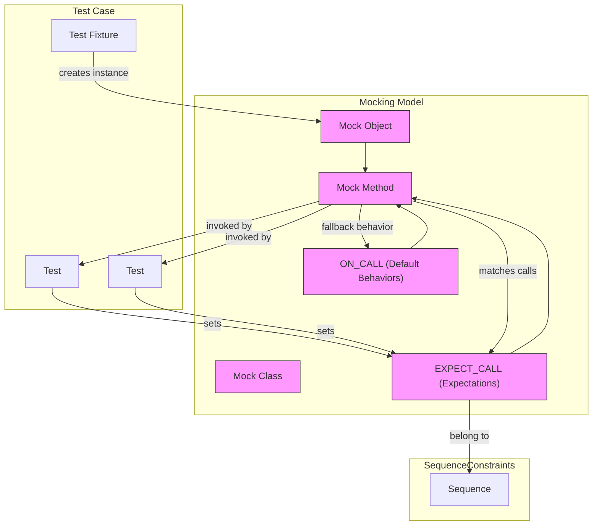

# Test Case & Mocking Model

Delve into the data model used for tests and mocks. Understand the role of test cases, test fixtures, and how mock objects are constructed, tracked, and invoked. This guide covers the key abstractions including test suites, expectations, and the lifecycle of mock methods during test execution, helping you master GoogleMock's internal modeling concepts essential for effective testing.

---

## Overview of Test Case & Mocking Model

At its core, GoogleMock models your tests and mocks using several key concepts that collectively form a precise and flexible framework for specifying, executing, and verifying test interactions. Understanding this model empowers you to design robust mocks, write resilient expectations, and interpret test behavior accurately.

### Test Cases and Fixtures

- **Test Case**: A logical grouping of related tests.
- **Test Fixture**: A specialized test case providing common setup and teardown for its tests.

GoogleMock integrates deeply with GoogleTest's test case and fixture model, allowing you to create mocks and set expectations on them within your test lifecycle.

### Mocks and Mock Objects

A **mock object** is an instance of a mock class generated via GoogleMock. It acts as a stand-in for a real object by simulating its behavior according to your defined expectations.

Mock objects are created by deriving mock classes from interfaces or base classes and defining mocked methods using the `MOCK_METHOD` macro. These mock methods record how they are called during tests, enabling verification of correct behavior.

### Test Fixtures as Containers for Mocks

Test fixtures typically hold mock objects as member variables. This leverages the setup and teardown phases to create, initialize, and destroy mocks, ensuring consistent test environments.

---

## Core Components of the Mocking Model

### Expectations

- Created using `EXPECT_CALL(mock_object, Method(matchers))`
- Define **what** methods are expected to be called
- Specify the **how many times** using cardinalities such as `Times()`, e.g., `Exactly`, `AtLeast`
- Attach **actions** indicating the return or side effect behavior, e.g. `WillOnce()`, `WillRepeatedly()`
- Can incorporate **argument matchers** (e.g., `_`, `Eq()`) to precisely match call parameters

Every expectation corresponds to an expected call. GoogleMock verifies during test execution whether actual calls match expectations.

### Default Actions vs Expectations

- **ON_CALL()** specifies default behaviors for mock methods without asserting they will be called
- **EXPECT_CALL()** combines behavior definition with mandatory call expectations

Thus, behavior for mock methods can be split between default fallback and strict tests of interactions.

### Sequences & Ordering

GoogleMock enables ordering constraints on expectations through:

- `InSequence` objects enforce strict ordering of expected calls within their scope
- `.InSequence(sequence1, sequence2, ...)` on an expectation assigns it to sequences, defining a partial ordering DAG
- `.After(previous_expectations...)` specifies that calls must occur after specific earlier calls

This design lets you express both full and partial execution order dependencies cleanly.

### Retiring Expectations

Expectations are **sticky** by default. They remain active even after their upper bound calls have been matched, causing failures on further matching calls.

To control this, `.RetiresOnSaturation()` can be used, which retires (deactivates) an expectation once its expected number of calls has been satisfied. This is useful for modeling distinct phases of test interaction.

---

## Lifecycle of Mock Methods Within Test Execution

1. **Mock Method Generation**
   - Using `MOCK_METHOD`, your mock class compiles into an object with special overridden methods that intercept calls.

2. **Expectation Setup**
   - Before exercise, `EXPECT_CALL` statements register expectations with mock methods.

3. **Default Behavior Setup**
   - Often in the test fixture setup, `ON_CALL` defines default behaviors for methods when no expectations match.

4. **Method Invocation and Matching**
   - When your test code invokes a mock method:
     - GoogleMock attempts to match the call against expectations in reverse order of declaration.
     - If an active expectation matches (arguments and ordering constraints), its action is executed.
     - If no expectations match, and the method has a default action, that is executed.
     - Otherwise, the call is *uninteresting* and routed to default behavior based on mock type ('Naggy', 'Nice', 'Strict') behavior.

5. **Expectation Verification**
   - Upon mock object destruction or explicit calls, GoogleMock verifies expectations were met, reporting failures for unmet lower bounds or excessive calls.

---

## Key Abstractions Explained

### Mock Classes and Methods

- Defined by inheriting from interfaces/base classes
- Use `MOCK_METHOD(return_type, method_name, (args...), (specifiers))`
- Accept qualifiers like `const`, `override`, `noexcept`, and calling conventions for precise signature matching

### Expectations & Matchers

- Expectations define expected call patterns, argument constraints, call count, and behavior
- Argument matchers specify how call parameters are matched, ranging from wildcards (`_`) to complex predicates

### Default Values and Actions

- GoogleMock provides built-in default return values per type
- `DefaultValue<T>` allows overridding default returned values when no explicit action is set
- Default actions set by `ON_CALL` define fallback behavior

### Mock Object Behaviors

- `NaggyMock<T>` (default): warns on uninteresting calls
- `NiceMock<T>`: suppresses warnings on uninteresting calls
- `StrictMock<T>`: errors on uninteresting calls

This lets your test enforce or relax constraints as required

---

## Working Flow: Typical User Journey

<Steps>
<Step title="Define Mock Classes">
Derive from your interfaces and define mock methods using `MOCK_METHOD`. Consider qualifiers and calling conventions carefully.
</Step>
<Step title="Create Mock Objects in Fixtures">
Instantiate mock objects as members of test fixtures, managing their lifecycle via fixture setup and teardown.
</Step>
<Step title="Set Default Behaviors with ON_CALL">
Use `ON_CALL` to define reasonable fallbacks for mock method calls that are not explicitly expected.
</Step>
<Step title="Set Expectations with EXPECT_CALL">
Declare what calls to expect in your tests. Specify argument matchers, call counts with cardinalities, sequences, and postconditions.
</Step>
<Step title="Run Tests and Exercise Code Under Test">
Execute your test inputs that interact with the mock objects.
</Step>
<Step title="Verify Expectations Automatically">
Upon test completion or mock destruction, GoogleMock checks if all expectations have been met, reporting violations.
</Step>
</Steps>

---

## Practical Tips and Best Practices

- Always put `MOCK_METHOD` in `public:` section to ensure accessibility to mocking macros
- Use `NiceMock` to reduce noise from uninteresting calls during development
- Use `StrictMock` to enforce tight control in final tests
- Specify `.RetiresOnSaturation()` to turn off sticky expectations when modeling phase-like behaviors
- Leverage sequences and `.After()` to explicitly model call order requirements
- Use `ON_CALL` for default action specifications without enforcing call counts
- Verify expectations are setup before calls to mocks

---

## Common Pitfalls and Troubleshooting

- **Binding default actions without `WillByDefault()`:** Always specify `WillByDefault` in `ON_CALL` or test failures will occur.
- **Uninteresting calls warnings:** Use `NiceMock` or add catch-all `EXPECT_CALL(...).Times(AnyNumber())` to explicitely allow.
- **Multiple expectations order sensitivity:** Remember the last declared matching expectation wins.
- **Sticky expectations leading to unexpected failures:** Use `.RetiresOnSaturation()` when needed.
- **Mock method declarations not matching base class:** Use correct qualifiers (`const`, `override`, etc.) and parenthesis wrapping for templates or complex types.

---

## Diagram: Test Case and Mock Interaction Model

---

## Related Concepts and Next Steps

This Test Case & Mocking Model forms the conceptual foundation for the following documents, which you will want to read next:

- [Mocking Reference](docs/reference/mocking.md): Detailed API for defining mocks and expectations
- [gMock Cheat Sheet](docs/gmock_cheat_sheet.md): Quick syntax guide for common mocking tasks
- [gMock Cookbook](docs/gmock_cook_book.md): Recipes on advanced mocks, matchers, and actions
- [Mock Object Behaviors](api-reference/core-mocking-apis/mock-object-behaviors.md): Details on Nice, Naggy, and Strict mocks

For understanding how all these play together in typical test author workflows, see the [Setting Up GoogleTest: Quickstart](guides/getting-started-workflows/setup-quickstart.md) and [Using gMock](guides/advanced-testing-patterns/using-gmock.md).

---

This guide should enable you to leverage GoogleMock's model expertly, writing clear, maintainable, and effective tests with mock objects that validate your code's interactions precisely and comprehensively.
