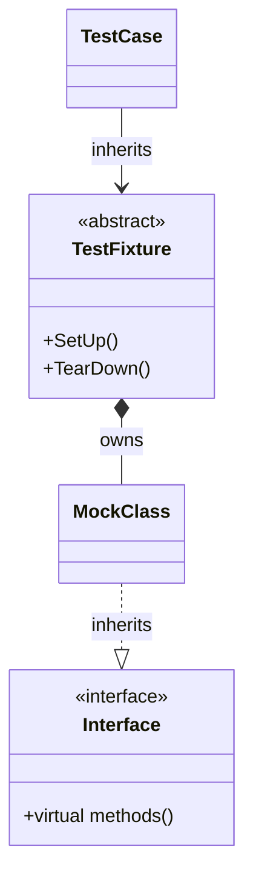

# Test Case and Mock Structure

Understanding how GoogleTest and GoogleMock organize test and mock classes is essential to writing clean, maintainable, and effective tests. This guide dives deep into the architecture and relationships of test cases and mock classes, focusing on how inheritance and macros simplify test and mock creation, and how test fixtures and mock objects work together.

---

## Structuring Test Classes in GoogleTest

At the heart of GoogleTest's testing approach is the use of **test fixtures**, which are specialized classes that group related tests under a common setup and teardown environment. Leveraging inheritance promotes reuse and cleaner organization.

### Test Fixtures and Inheritance

- A test fixture is a class deriving from ::testing::Test.
- It encapsulates common setup (`SetUp()`) and teardown (`TearDown()`) behaviors.
- Test cases are methods inside these fixtures, declared using the `TEST_F()` macro.

This structure enables you to:

- Share initialization code across related tests effortlessly.
- Maintain state shared by all tests in the fixture.
- Group tests logically, improving clarity and debugging.

### Example: Defining a Test Fixture

```cpp
class MyTestFixture : public ::testing::Test {
 protected:
  void SetUp() override {
    // Common setup code
  }

  void TearDown() override {
    // Common cleanup code
  }

  // Shared test data
  int shared_value_;
};

// Using the fixture
TEST_F(MyTestFixture, TestOne) {
  shared_value_ = 5;
  EXPECT_EQ(shared_value_, 5);
}

TEST_F(MyTestFixture, TestTwo) {
  EXPECT_EQ(shared_value_, 0);  // Starts fresh per test
}
```

## Defining Mock Classes Using GoogleMock

Mock classes simulate real components for testing purposes, making it possible to verify interactions precisely.

### Using `MOCK_METHOD` to Define Mock Methods

The core of GoogleMock is the `MOCK_METHOD` macro:

```cpp
MOCK_METHOD(return_type, method_name, (args...), (specifiers));
```

- Declares a mock method inside your mock class.
- Supports overriding const, noexcept, and other qualifiers with the fourth parameter.

### Essential Rules and Best Practices

- Mock methods must be declared `public:` regardless of base class accessibility, allowing `EXPECT_CALL` and `ON_CALL` to operate from outside the mock.
- The mocked methods must be virtual in the base interface.
- For overloaded methods, mock each overload explicitly with precise signatures.
- Wrap complex return or argument types containing commas in parentheses or use type aliases to avoid macro parsing issues.

### Example: A Complete Mock Class

```cpp
#include <gmock/gmock.h>

class Foo {
 public:
  virtual ~Foo() {}
  virtual int GetSize() const = 0;
  virtual std::string Describe(const char* name) = 0;
};

class MockFoo : public Foo {
 public:
  MOCK_METHOD(int, GetSize, (), (const, override));
  MOCK_METHOD(std::string, Describe, (const char* name), (override));
};
```

### Mocking Class Templates

GoogleMock supports templates similarly by inheriting:

```cpp
template <typename T>
class MockStack : public StackInterface<T> {
 public:
  MOCK_METHOD(int, GetSize, (), (const, override));
  MOCK_METHOD(void, Push, (const T& value), (override));
};
```

## Interaction Between Test Fixtures and Mocks

Test fixtures commonly contain mock objects as member variables to provide controlled collaborators for the code under test:

- Mock objects are constructed in the fixture's constructor or `SetUp()`.
- Expectations (`EXPECT_CALL`) are set in individual tests or in setup methods.
- `ON_CALL` is used for defining default behaviors shared by tests.
- Mock objects validate expectations automatically at destruction.

### Typical Workflow Inside a Test Fixture

1. Declare mocks as fixture members.
2. Use `ON_CALL` in `SetUp()` to provide shared default responses.
3. In test cases, use `EXPECT_CALL` to specify expected method calls.
4. Exercise the code under test.
5. Allow the test framework to verify mocks automatically at test end.

### Example:

```cpp
class WidgetTest : public ::testing::Test {
 protected:
  MockFoo mock_foo;

  void SetUp() override {
    ON_CALL(mock_foo, GetSize()).WillByDefault(Return(42));
  }
};

TEST_F(WidgetTest, UsesMock) {
  EXPECT_CALL(mock_foo, Describe("widget"))
      .WillOnce(Return("Mocked widget description"));

  Widget w(&mock_foo);
  EXPECT_EQ(w.GetDescription(), "Mocked widget description");
}
```

## Mock Object Strictness Modes

GoogleMock allows you to control the tolerance of mock objects toward unexpected calls via wrappers:

- **NaggyMock** (default): warns for uninteresting calls.
- **NiceMock**: suppresses warnings for uninteresting calls.
- **StrictMock**: treats uninteresting calls as failures.

### Usage

```cpp
using ::testing::NiceMock;
using ::testing::StrictMock;
using ::testing::NaggyMock;

NiceMock<MockFoo> nice_mock;
StrictMock<MockFoo> strict_mock;
NaggyMock<MockFoo> naggy_mock;
```

These classes inherit from your mock and change the behavior related to unexpected mock calls, helping manage test noise or enforce strict correctness.

## Using Macros: `EXPECT_CALL` and `ON_CALL`

- `EXPECT_CALL` sets expectations that a mock method must be called with specified arguments and behavior.
- `ON_CALL` defines default behavior for methods if `EXPECT_CALL` is not specified.

### Common Clauses in `EXPECT_CALL`:

- `.Times(n)`: specify the number of expected calls.
- `.WillOnce(action)`: action for the next matched call.
- `.WillRepeatedly(action)`: action for all subsequent calls.
- `.InSequence()`: enforce call order.
- `.After()`: enforce partial ordering.
- `.RetiresOnSaturation()`: disables expectation after fulfilled.

### Example:

```cpp
EXPECT_CALL(mock_foo, DoSomething(42))
    .Times(2)
    .WillOnce(Return(true))
    .WillOnce(Return(false));
```

### Writing Readable and Reliable Mocks

- Set expectations before exercising the mock.
- Use `_` matcher to ignore unimportant arguments.
- Use sequences or `.After()` to specify order.
- Specify `.RetiresOnSaturation()` for expectations that should never outlive their use.

## Common Pitfalls and Tips

- Always declare destructors in interfaces as `virtual`.
- Wrap function arguments or return types with commas in parentheses or use type aliases.
- Use `NiceMock` to reduce noise from uninteresting calls.
- Over-specifying expectations leads to brittle tests.
- Setting expectations after calling code that exercises the mock leads to undefined behavior.
- Use `ON_CALL` for shared behavior, `EXPECT_CALL` when you want to verify that calls happen.

## Summary

Organizing test cases and mocks in GoogleTest and GoogleMock involves leveraging inheritance and macros effectively. Test fixtures provide structured setup and teardown, while mocks defined using `MOCK_METHOD` macros enable precise control and verification of interactions. The combination of expectations, default actions, and strictness modes facilitates writing robust, expressive, and maintainable tests.

---

## Related Documentation and Resources

- [Declaring and Using Mocks](https://github.com/google/googletest/blob/main/api-reference/googlemock-mocking-apis/declaring-and-using-mocks.mdx) — Detailed guide on defining mock classes and methods.
- [Specifying Expectations & Actions](https://github.com/google/googletest/blob/main/api-reference/googlemock-mocking-apis/specifying-expectations-actions.mdx) — How to control mock object behavior.
- [Mocking Basics](https://github.com/google/googletest/blob/main/guides/core-testing-workflows/mocking-basics.mdx) — Step-by-step creation and use of mocks.
- [Mocking Reference](https://github.com/google/googletest/blob/main/docs/reference/mocking.md) — Comprehensive reference on mocking APIs.
- [gMock for Dummies](https://github.com/google/googletest/blob/main/docs/gmock_for_dummies.md) — Beginner-friendly introduction to mocks.
- [Legacy gMock FAQ](https://github.com/google/googletest/blob/main/docs/gmock_faq.md) — Answers to common and advanced mocking questions.

---

<Accordion title="Example: Defining a Mock and Using It">
```cpp
#include <gmock/gmock.h>

// Original interface
class Turtle {
 public:
  virtual ~Turtle() {}
  virtual void PenUp() = 0;
  virtual void PenDown() = 0;
  virtual void Forward(int distance) = 0;
  virtual int GetX() const = 0;
};

// Mock class
class MockTurtle : public Turtle {
 public:
  MOCK_METHOD(void, PenUp, (), (override));
  MOCK_METHOD(void, PenDown, (), (override));
  MOCK_METHOD(void, Forward, (int distance), (override));
  MOCK_METHOD(int, GetX, (), (const, override));
};

// Usage in a test
TEST(PainterTest, DrawsLine) {
  MockTurtle mock_turtle;

  EXPECT_CALL(mock_turtle, PenDown())
      .Times(1);

  EXPECT_CALL(mock_turtle, Forward(100))
      .Times(1);

  Painter painter(&mock_turtle);
  painter.DrawLine(100);
}
```
</Accordion>

<Note>
Remember: When defining mock methods with `MOCK_METHOD`, always place them in public sections, even if original methods are protected or private to enable support macros like `EXPECT_CALL` and `ON_CALL`.
</Note>

<Warning>
Mocking non-virtual methods is unsupported unless you specifically use advanced dependency-injection techniques. Always mock virtual methods for expected behavior.
</Warning>

## Troubleshooting Common Structure Issues

- **Issue: Tests fail because mocked methods are never called**
  - Verify that expectations are set *before* exercise code runs.
  - Ensure methods being mocked are `virtual`.
  - Use `--gmock_verbose=info` to trace calls and expectations.

- **Issue: Mock methods call real implementations instead of mock versions**
  - Confirm the base methods are declared `virtual`.
  - Ensure correct overriding with `MOCK_METHOD` and `(override)` specifier.

- **Issue: Compiling mock methods with complex types fails**
  - Wrap return and argument types having commas in extra parentheses or use type aliases.

## Best Practices

- Use `INHERITANCE` from interfaces to create mocks for clear separation.
- Define mocks alongside interfaces you own or in a dedicated `testing` folder.
- Write simple fixture setups with common `ON_CALL` default behaviors.
- Use `EXPECT_CALL` sparingly — only verify critical interactions to avoid brittle tests.
- Prefer `NiceMock` for less noise when uninteresting calls occur.

## Diagram: Simplified Relationship of Test Case and Mock Structure



<Check>
This page addresses test and mock class organization and usage. For detailed mock method and macros, consult the dedicated Mocking Reference and Declaring Mocks pages.
</Check>
