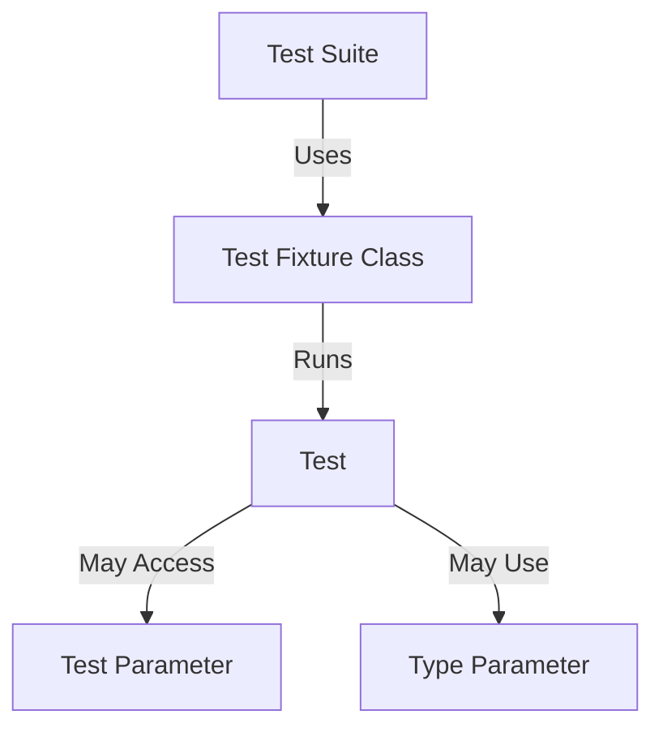

# Test Data Models: Fixtures, Parameters, and Types

GoogleTest models C++ tests in a structured, extensible way using test fixtures, parameters, and typed tests. Understanding these data models empowers you to build reusable, scalable test suites that maximize coverage while minimizing duplication and boilerplate.

---

## Test Fixtures: The Foundation of Reusable Test Data

A **test fixture** is the backbone of sharing common data and setup code across multiple tests within a test suite. Instead of repeating construction and initialization for every test, you encapsulate them in a fixture class derived from `testing::Test`.

### Purpose
- Share common objects, data, and utility functions
- Prepare consistent pre-test setup and post-test cleanup
- Promote test independence via fresh fixture instances per test

### How Fixtures Work
For each test:

1. GoogleTest creates a fresh fixture object.
2. Calls the constructor (or `SetUp()` if provided).
3. Runs the test body.
4. Calls `TearDown()` (if defined) and then destructor.

This isolation ensures that changes in one test do not leak into others.

### Example - Basic Fixture

```cpp
class QueueTest : public testing::Test {
 protected:
  QueueTest() {
    q1_.Enqueue(1);
    q2_.Enqueue(2);
    q2_.Enqueue(3);
  }

  Queue<int> q0_;
  Queue<int> q1_;
  Queue<int> q2_;
};

// Use TEST_F to access the fixture members.
TEST_F(QueueTest, IsEmptyInitially) {
  EXPECT_EQ(q0_.size(), 0);
}

TEST_F(QueueTest, DequeueWorks) {
  int* n = q0_.Dequeue();
  EXPECT_EQ(n, nullptr);

  n = q1_.Dequeue();
  ASSERT_NE(n, nullptr);
  EXPECT_EQ(*n, 1);
  EXPECT_EQ(q1_.size(), 0);
  delete n;
}
```

### Best Practices

- Use `SetUp()` and `TearDown()` for complex initialization and cleanup.
- Avoid sharing mutable static data across tests.
- Name fixtures clearly after the tested class or feature.
- Minimize test dependencies—one test should test one behavior.

<Info>
Keep in mind that GoogleTest creates a new fixture instance for each test case, so modifications in one test won’t affect others. This isolation promotes reliable, repeatable tests.
</Info>

---

## Test Parameters: Value-Parameterized Tests for Data-Driven Testing

When you want to run the same test logic across many input values, **value-parameterized tests** provide a neat, scalable solution.

### Core Concept
Define a test fixture that inherits both from `testing::Test` and `testing::WithParamInterface<T>` (or use the convenient `testing::TestWithParam<T>`). Each instance of the test gets a parameter supplied by a parameter generator.

### Writing a Parameterized Test

```cpp
class FooTest : public testing::TestWithParam<int> {
  // Usual fixture setup here
};

TEST_P(FooTest, HandlesValue) {
  int param = GetParam();
  EXPECT_TRUE(Foo(param));
}
```

### Instantiation
Associate actual data values with the test pattern using instantiation macros.

```cpp
INSTANTIATE_TEST_SUITE_P(PositiveNumbers, FooTest, testing::Values(1, 2, 3));
```

This creates three tests: `PositiveNumbers/FooTest.HandlesValue/0` through `/2`.

### Parameter Generators
- `Values(...)`: List of explicit values
- `Range(begin, end, step)`: Generates a sequence
- `Bool()`: Generates `true` and `false`
- `ValuesIn(container)`: From a container or iterator range
- `Combine(...)`: Cartesian product of multiple generators

### Use Cases
- Testing different inputs for a function
- Cross-platform or config options
- Verifying multiple implementations

### Naming Parameters
You can customize test case names via a custom name generator function to produce human-readable test identifiers.

### Tips

- Parameterize only data that affects the test behavior.
- Keep parameterized tests focused and small for readability.

<Warning>
Omitting `INSTANTIATE_TEST_SUITE_P` causes a failure at runtime — make sure to instantiate all parameterized tests!
</Warning>

---

## Typed Tests: Test Logic Over Multiple Types

Typed tests let you verify that multiple types conform to a specification without duplicating test code.

### How Typed Tests Work

1. Create a **fixture class template** parameterized on a type `T`.
2. Use `TYPED_TEST_SUITE` to associate the fixture with a set of types.
3. Write `TYPED_TEST` test definitions that use `TypeParam` to access the type under test.

Example:

```cpp
template <typename T>
class MyContainerTest : public testing::Test {
 public:
  T container;
};

using MyTypes = ::testing::Types<std::vector<int>, std::list<int>>;
TYPED_TEST_SUITE(MyContainerTest, MyTypes);

TYPED_TEST(MyContainerTest, IsEmptyInitially) {
  EXPECT_TRUE(this->container.empty());
}
```

Running this runs the test for both `vector<int>` and `list<int>`.

### Type-Parameterized Tests

A more advanced form where the test suite can be defined separately from its type list, allowing library authors to write abstract tests reusable by clients.

### Use Cases

- Testing containers, algorithms, or utilities for multiple type parameters
- Verifying that type traits or concepts hold across types

### Best Practices

- Use type-parameterized tests for interface compliance more than for data variation.
- Combine typed tests with parameterized tests to test type-parameterized code with various inputs.

---

## Modeling Test Suites and Their Relationships

GoogleTest organizes tests into **test suites** (formerly called test cases). Each suite contains tests that logically belong together, often sharing the same fixture.

- **Tests**: Individual test functions, defined with `TEST()`, `TEST_F()`, or `TEST_P()`.
- **Test Suites**: Collections of related tests, identified by the name in `TEST()`.
- **Fixtures**: Provide shared setup for tests within a suite.

This model helps running related tests together, organizing reports, and sharing fixture data.

<Check>
Test suite names and test names should be valid C++ identifiers without underscores.
</Check>

---

## Summary of Test Data Models

| Concept                 | Description                                             | User Benefit                                 |
|------------------------|---------------------------------------------------------|----------------------------------------------|
| Test Fixtures           | Classes deriving from `testing::Test` for shared setup  | Reusable context across tests with isolation |
| Value-Parameterized Tests | Tests receiving input values from a generator          | Data-driven testing with minimal code duplication |
| Typed Tests              | Templates for testing code across a variety of types    | Validating type-generic code with one test definition |
| Test Suites              | Groupings of tests sharing name and/or fixture          | Logical organization and collective setup/teardown |

---

## Troubleshooting Common Issues

- **Test runs but fixtures don’t seem to initialize**: Ensure you use `TEST_F()` for fixture-based tests, not `TEST()`.
- **Parameterized tests show no tests run**: Verify that you instantiated the tests with `INSTANTIATE_TEST_SUITE_P`.
- **Test name collisions occurring between typed and non-typed tests:** Use distinct names for typed test suites and regular test suites.
- **Fixtures' SetUp or TearDown not called**: Check spelling (`SetUp()`, not `Setup()`) and that they properly override.

---

## Additional Resources

- [GoogleTest Primer](primer.md): Learn how to write simple tests and fixtures.
- [Advanced GoogleTest Topics](advanced.md): Deep dive into parameterized, typed, and value-parameterized tests.
- [Testing Reference](reference/testing.md): API details on TEST macros, fixtures, and parameters.
- [gMock Cookbook](gmock_cook_book.md): For mocking tests that use fixtures and parameters.

---

## Diagram: Test Modeling Overview



This flowchart illustrates the relationships between test components: a suite uses a fixture that runs tests, which may be parameterized by values or templated types.

---