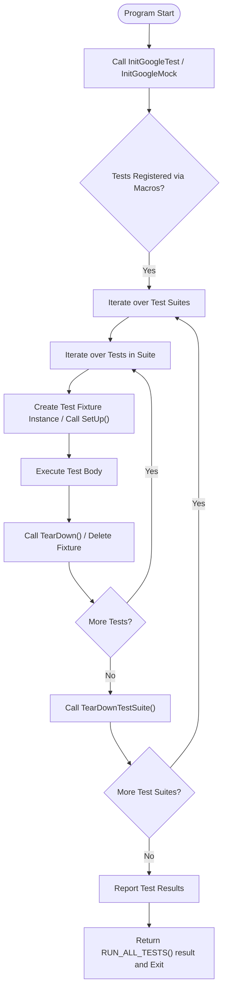

# Test Discovery and Execution Flow

GoogleTest automates the process of discovering, organizing, and running tests within your C++ codebase. This page explains how GoogleTest identifies test cases, groups them into test suites, and manages their execution lifecycle through the main entry points, leveraging the proven xUnit testing model.

---

## Test Discovery: Automatic Registration

GoogleTest uses static registration mechanisms generated by macros such as `TEST()`, `TEST_F()`, `TEST_P()`, and `TYPED_TEST()` to automatically discover test cases and suites.

- When you define a test with these macros, GoogleTest internally registers the test's metadata (e.g., test suite name, test name, source location) into a global test registry before the program execution begins.
- This static registration means you **do not** need to enumerate or explicitly list your tests anywhere in your code.

This approach saves you from manual bookkeeping, ensuring that all defined tests are collected and ready to run when your test program executes.

### Key Points

- **Test suites** represent groups of related tests identified by the first argument in `TEST()` or the test fixture class in `TEST_F()`.
- **Test cases** are individual tests within these suites, defined by the second argument in `TEST()` macros.
- Value-parameterized and typed tests have additional layers of instantiations but still participate in this automatic registration.


## Test Execution: The xUnit Model in Action

GoogleTest follows the xUnit testing architecture, running each test independently while providing detailed reporting on success and failure.

### Typical Execution Flow

1. **Initialization**
   - Your test program begins at the `main()` function.
   - GoogleTest initialization is performed by calling `testing::InitGoogleTest(&argc, argv)`, which parses any GoogleTest-specific command-line flags.

2. **Running Tests**
   - Calling `RUN_ALL_TESTS()` triggers the test runner.
   - GoogleTest iterates through all registered test suites and their contained tests.
   - For each test:
     - A fresh test fixture object (if applicable) is instantiated.
     - The fixture's `SetUpTestSuite()` is called once per suite before tests run.
     - The fixture's `SetUp()` method runs before the test.
     - The test body executes.
     - The fixture's `TearDown()` method runs after the test.
     - Finally, after all tests in a suite have run, `TearDownTestSuite()` is called once.

3. **Test Isolation and Independence**
   - Each test gets its own new fixture instance, ensuring tests do not share state that can create flakiness.
   - Failures in one test do not stop other tests from running (except if fatal assertion failures occur within a test).

4. **Result Reporting**
   - Test failures and successes are reported clearly with file names, line numbers, and descriptive messages.
   - Console output is managed by a default listener, which can be customized or replaced.
   - XML or JSON reports can be generated if specified via command-line options.

5. **Program Exit**
   - `RUN_ALL_TESTS()` returns `0` if all tests succeed, or `1` if any fail.
   - It is essential to return this value from your program's `main()`, enabling automation tools and CI pipelines to detect test outcomes.


## Main Entrypoints Provided by GoogleTest and GoogleMock

GoogleTest supplies predefined `main()` implementations to simplify running tests:

- **gtest_main library:** Provides a default `main()` that calls `InitGoogleTest` and `RUN_ALL_TESTS()`.
- **gmock_main library:** Combines GoogleMock and GoogleTest initialization, calling `InitGoogleMock`, which internally initializes GoogleTest.

If the default `main()` suits your needs, simply link with these libraries to avoid writing your own entry point.

If customization is needed, you can write a custom `main()`. It should always:

- Call `testing::InitGoogleTest(&argc, argv);`
- Call and return the value of `RUN_ALL_TESTS()`

See following typical examples:

```cpp
// Minimal main using GoogleTest only
int main(int argc, char** argv) {
  testing::InitGoogleTest(&argc, argv);
  return RUN_ALL_TESTS();
}

// Main using GoogleMock and GoogleTest
int main(int argc, char** argv) {
  testing::InitGoogleMock(&argc, argv);  // also initializes GoogleTest
  return RUN_ALL_TESTS();
}
```


## Execution Flow Diagram




## Practical Advice for Users

- **Do not write your own test registration:** Use GoogleTest macros to define tests; they auto-register for you.
- **Call the initialization function before running tests:** Always invoke `InitGoogleTest()` or `InitGoogleMock()` before `RUN_ALL_TESTS()`.
- **Check `RUN_ALL_TESTS()` return value:** Your `main()` function must return this value to make test status explicit.
- **Use provided main() libraries when possible:** This reduces boilerplate.
- **Tests should be self-contained:** Each test runs in its own fixture instance, so avoid relying on side effects from other tests.


## Troubleshooting Common Issues

- **Tests not discovered:** Ensure you have linked all object files containing test definitions; tests must all be linked in.
- **Custom main() missing init call:** Missing `InitGoogleTest()` or `InitGoogleMock()` results in tests not running or ignored flags.
- **Multiple calls to `RUN_ALL_TESTS()`:** Avoid calling `RUN_ALL_TESTS()` more than once; this can cause undefined behavior.
- **Tests failing to run on embedded platforms:** For ESP8266 or Arduino environments, main entry points are `setup()` and `loop()`, not `main()`; follow platform-specific instructions.


## Further Integration Details

GoogleTest’s test discovery ties closely with its internal test registry objects documented in the [UnitTest](../api-reference/core-testing-apis/test-definition.md#UnitTest) class.

Listeners and event hooks enable advanced scenarios like custom reporting or test listeners. These are triggered during the execution phases above.

---

## References and Links

- [GoogleTest Primer](../docs/primer.md) – Understand the basics of test writing.
- [Writing and Structuring Tests](../guides/core-testing-workflows/writing-and-structuring-tests.md) – Organize tests effectively.
- [Test Runner Initialization and Main Entrypoints](../api-reference/infrastructure-and-internals/test-runner-entrypoint.md) – Learn about main entry points including GoogleMock integration.
- [System Overview](../concepts/core-architecture/system-overview.md) – See how test discovery fits in the broader architecture.
- [RUN_ALL_TESTS() documentation](../api-reference/core-testing-apis/testing.md#RUN_ALL_TESTS) – Official API details.

---

This page ensures you confidently understand how GoogleTest automatically detects your tests and manages their execution, enabling automated, well-structured testing across your C++ projects.