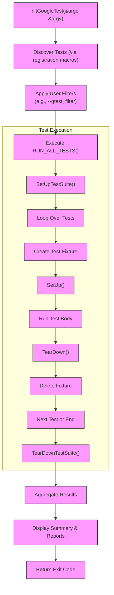

# Test Discovery & Execution Model

Discover how GoogleTest effortlessly identifies and runs your test cases to deliver clear, actionable feedback. Built on the trusted xUnit architecture, this guide walks you through the lifecycle of a test program—from test discovery, execution, to aggregation of results—ensuring you fully grasp the automated testing journey.

---

## xUnit-Based Architecture: The Backbone of GoogleTest

GoogleTest follows the familiar and battle-tested **xUnit architecture**, a standard in unit testing frameworks. This design organizes tests into **Test Suites** and individual **Test Cases**, facilitating structured, maintainable, and scalable test code.

- **Test Suites (formerly Test Cases)** group related tests sharing setup and teardown conditions.
- **Test Cases (tests)** are the individual units that GoogleTest discovers and executes.

This architecture promotes clarity: developers logically group tests based on functionality, enabling easier navigation and categorization.

> Imagine you're sorting your toolbox — all screwdrivers together, all hammers next to one another. xUnit architecture does exactly that for tests.


## Automated Test Discovery: Finding Your Tests with Precision

One of GoogleTest's core strengths is its ability to **automatically discover tests** without requiring explicit registration code. When the test executable is run, GoogleTest scans the linked test definitions generated via macros like `TEST()`, `TEST_F()`, and `TEST_P()`, aggregating them in preparation for execution.

### How Discovery Works in Practice

1. **Registration via Macros:** When you write tests using `TEST(TestSuiteName, TestName)`, GoogleTest generates static initialization code that registers these tests into the internal test registry.
2. **Test Enumeration:** Upon initialization, GoogleTest compiles an internal index of all available tests.
3. **Filtering:** Users can narrow test execution using filters in command-line flags (e.g., `--gtest_filter`) to select specific suites or tests.

### Value For You

- No manual bookkeeping needed to run individual tests.
- Flexibility to run all tests, groups, or single ones easily.
- Enables smooth Continuous Integration (CI) test execution.

<Check>
Use the `--gtest_list_tests` flag to see all discovered tests before running.
</Check>

## The Execution Lifecycle: From Initialization to Final Report

Understanding the flow of a GoogleTest executable empowers you to anticipate test behavior and customize your test environment effectively.

<Steps>
<Step title="Initialization">
GoogleTest starts by calling `::testing::InitGoogleTest(&argc, argv)`, which sets up test flags, parses command-line arguments, and prepares the test environment.
</Step>
<Step title="Test Execution">
Invoking `RUN_ALL_TESTS()` triggers the discovery engine to run all selected tests.

- For each **Test Suite**, GoogleTest calls optional global setup (`SetUpTestSuite()`).
- Creates a fresh test fixture instance for each test case.
- Calls `SetUp()` for test-level setup.
- Executes the test body.
- Calls `TearDown()` for cleanup.
- Deletes the fixture instance.
- Finally, executes the test suite teardown (`TearDownTestSuite()`).

This process ensures isolated, repeatable tests.
</Step>
<Step title="Result Aggregation">
GoogleTest collects results for each test:

- Successes
- Failures
- Skipped or disabled tests

Aggregates them and prints concise summaries to the console, including details for failures.
</Step>
<Step title="Exit">
The program returns an exit code indicating overall success or failure for integration with external build systems or CI pipelines.
</Step>
</Steps>


## Test Result Aggregation & Presentation: Transparent & Informative

GoogleTest not only runs your tests but also **aggregates results and presents them clearly**.

- **Per-Test Output:** Shows results inline, including success indicators and detailed failure diagnostics.
- **Summary:** At the end, prints the total number of tests run, passed, failed, and disabled.
- **XML/JSON Reporting:** Optionally generates machine-readable reports (`--gtest_output`) for CI consumption.


<Tip>
Use XML or JSON reports to feed into dashboards or CI summaries, enhancing traceability and monitoring.
</Tip>


## Practical Example: A Typical Test Run Flow

```shell
$ ./my_test --gtest_filter=MyFeatureTest.*
[==========] Running 3 tests from 1 test suite.
[ RUN      ] MyFeatureTest.TestCaseOne
[       OK ] MyFeatureTest.TestCaseOne (0 ms)
[ RUN      ] MyFeatureTest.TestCaseTwo
/path/my_test.cc:42: Failure
Expected equality of these values:
  result
  expected_value
[  FAILED  ] MyFeatureTest.TestCaseTwo (1 ms)
[ RUN      ] MyFeatureTest.TestCaseThree
[       OK ] MyFeatureTest.TestCaseThree (0 ms)
[==========] 3 tests from 1 test suite ran. (1 ms total)
[  PASSED  ] 2 tests.
[  FAILED  ] 1 test, listed below:
[  FAILED  ] MyFeatureTest.TestCaseTwo

```

Here GoogleTest:

1. Runs all tests matching `MyFeatureTest.*`.
2. Prints test-by-test results with timings.
3. Provides detailed failure info for debugging.
4. Summarizes the overall run outcome.


## Common Pitfalls & Troubleshooting

<AccordionGroup title="Test Discovery & Execution Troubleshooting">
<Accordion title="Tests Not Running or Found">
- Ensure tests are linked into the executable.
- Confirm the registration macros `TEST`, `TEST_F` are used correctly.
- Use `--gtest_list_tests` to view discovered tests.
- Verify that filters (`--gtest_filter`) are not excluding your tests unintentionally.
</Accordion>
<Accordion title="Order of Execution Issues">
- GoogleTest does not guarantee order between test suites.
- Use `InSequence` or sequenced expectations within mocks for order control.
- Avoid dependencies between tests to maintain isolation.
</Accordion>
<Accordion title="Unexpected Exit or No Output">
- Confirm `RUN_ALL_TESTS()` return value is used in `main()`.
- Ensure `InitGoogleTest()` is called before running tests.
- Check for environment or flag misconfiguration.
- Enable verbose output with `--gtest_print_time=1` or similar.
</Accordion>
</AccordionGroup>


## Summary

GoogleTest automates the heavy lifting of identifying, executing, and reporting on your tests with a robust xUnit-based lifecycle. Its architecture both streamlines writing tests and ensures reliability during test runs, while rich reporting options support debugging and integration.

---

## Further Learning

To deepen your understanding and practical skills, explore:

- [System Architecture](overview/architecture-and-concepts/system-architecture) — to see how core components link to discovery and execution.
- [Test Lifecycle and Main Entry Point](api-reference/core-mocking-api/test-lifecycle-main) — for detailed function calls to initiate testing.
- [Writing and Running Your First Test](getting-started/configuration-validation/write-and-run-first-test) — to learn practical test creation and execution.
- [Mocking Framework Architecture](concepts/core-architecture/mock-architecture) — for integrating mocks into your tests.

These provide hands-on guidance aligned with the conceptual flow explained here.

---

## Diagram: Test Discovery & Execution Flow




