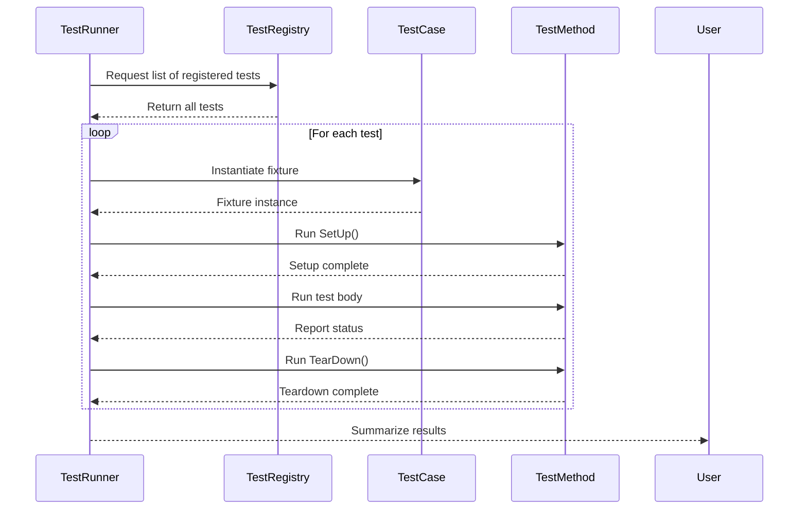

# Test Discovery and Execution

Understand the mechanisms by which tests are automatically discovered, registered, and executed. Explore the main entry points and how GoogleTest eliminates manual test registration, ensuring a frictionless testing workflow.

---

## Overview of Test Discovery

GoogleTest is designed to provide seamless test discovery and execution so that users can focus on writing tests instead of managing how they run. This capability removes any need for manual registration of tests, enabling a smooth, effortless workflow.

### How Tests Are Discovered

When you write tests using GoogleTest macros such as `TEST()` or `TEST_F()`, behind the scenes, the framework automatically registers each test case and test suite at program initialization time. This is achieved through static initializers inside the macros that create global test descriptors.

This means every test you write is implicitly registered with the global test runner without any additional code or configuration. As you build and run your test binary, the test runner knows exactly which tests exist.

<Tip>
This strategy enables a complete and accurate collection of all tests in a binary, so when executed, `RUN_ALL_TESTS()` runs them all.
</Tip>

---

## Test Registration Mechanics

### The Role of Test Macros

- `TEST(TestSuiteName, TestName)`: Defines a simple, independent test function.
- `TEST_F(TestFixture, TestName)`: Defines a test that uses a test fixture class for shared setup/teardown.

Each of these macros:

- Creates an instance of a helper class that registers the test with the framework.
- Stores metadata including the test suite name, test name, and pointers to setup, execution, and teardown functions.

### Key Points

- **Static Initialization**: The magic happens at static initialization time, before main runs.
- **No Manual Lists Needed**: Users don't maintain explicit arrays or lists of tests.
- **Unique Identification**: Each test is uniquely identified by a combination of its test suite and test name.

---

## Main Entry Point for Test Execution

The typical entry point for a GoogleTest program is a `main()` function that:

1. Calls `testing::InitGoogleTest(&argc, argv);` to initialize GoogleTest internals and parse command-line flags.
2. Calls `RUN_ALL_TESTS()` which triggers the test runner to execute all registered tests.

GoogleMock builds on top of GoogleTest and provides `testing::InitGoogleMock()` which initializes both GoogleTest and GoogleMock in one call.

### Sample `main()`

```cpp
#include "gtest/gtest.h"

int main(int argc, char** argv) {
  testing::InitGoogleTest(&argc, argv);  // Parses flags and initializes
  return RUN_ALL_TESTS();               // Runs all registered tests
}
```

### gMock `main()` Usage

```cpp
#include "gmock/gmock.h"

int main(int argc, char** argv) {
  testing::InitGoogleMock(&argc, argv);  // Initializes GoogleTest & GoogleMock
  return RUN_ALL_TESTS();                // Runs tests
}
```

This eliminates the need to manually invoke test registration or invocation.

<Note>
Linking with the `gtest_main` or `gmock_main` libraries provides a default `main()` implementation so you often do not need to write your own.
</Note>

---

## Running Tests with Fine-grained Control

GoogleTest supports command-line flags processed during initialization to customize test runs:

- **`--gtest_filter`**: Run specific tests using wildcards.
- **`--gtest_repeat`**: Repeat tests multiple times.
- **`--gtest_shuffle`**: Execute tests in random order to detect ordering dependencies.

This flexibility allows developers to easily select or isolate tests at runtime without changing code.

---

## How GoogleTest Ensures Correct Test Execution

### Isolation and Independence

Each test runs independently with its own fresh fixture instance. Tests are never run in parallel by default within the same process, ensuring isolation and simplifying debug.

### Automatic Verification

GoogleTest automatically verifies test results, failures, and assertions. The framework tracks which tests pass, fail, or crash, and reports summary information.

### Ordering

Tests are executed in registration order by default. You can enforce ordering constraints or randomized order using GoogleTest's features when required.

---

## Lifecycle of a Test Run



This flow ensures that each test runs in a controlled, reproducible environment.

---

## How this fits with GoogleMock

Tests that use mocks benefit from the seamless test discovery and execution provided by GoogleTest. Mock classes registered in the test binaries via macros can be used in tests that automatically run as part of the GoogleTest harness.

---

## Troubleshooting and Tips

- **Tests Not Running?** Ensure `RUN_ALL_TESTS()` is called in `main()`.
- **Test Filtering Not Working?** Verify command line arguments are correctly passed.
- **Undefined Behavior if Expectation Set Late:** Always set `EXPECT_CALL`s before exercising code.

---

## Summary

With GoogleTest, test registration and execution is fully automated using static test registration and the `RUN_ALL_TESTS()` function. Test developers need only write test definitions; the framework handles discovery, proper isolation, ordering, and reporting.

This architecture enables a robust, scalable, and user-friendly testing experience.

---

## See Also

- [GoogleTest Primer](primer.md) — Introductory guide to writing tests
- [gMock for Dummies](gmock_for_dummies.md) — Beginner's guide to mocking
- [Mocking Reference](reference/mocking.md) — Details on mocking APIs and macros
- [Test and Fixture Macros](api-reference/core-testing-api/test-macros.md) — Macro reference
- [Test Execution and Configuration](api-reference/core-testing-api/test-execution.md) — Runtime flags and Execution
- [gMock Cookbook](gmock_cook_book.md) — Practical mocking recipes

---

## Additional Resources

- GoogleTest and GoogleMock Official Repositories: https://github.com/google/googletest
- Detailed Architecture and Concepts Overview in related docs
- Community and FAQ pages for common issues and advanced tips

---