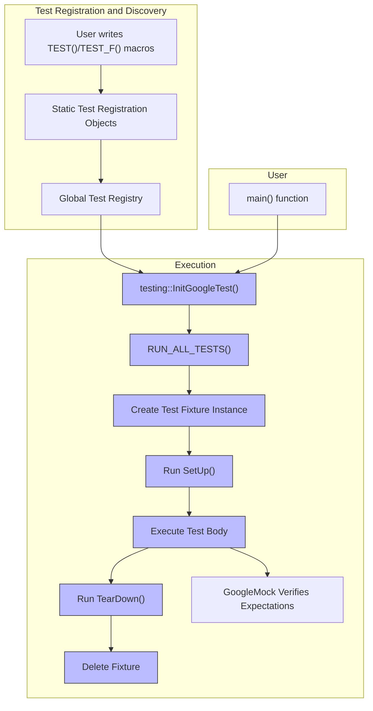

# Test Discovery and Execution Model

GoogleTest provides a powerful and intuitive model that automates how tests are registered, discovered, and run. Understanding this model will empower you to write, organize, and execute tests efficiently and predictably. This guide unpacks the key concepts behind GoogleTest’s test registration system, how test fixtures integrate into the execution flow, and the seamless cooperation between GoogleTest and GoogleMock during test suite runs.

---

## 1. Automatic Test Registration

GoogleTest simplifies test management by automatically registering all tests at runtime initialization.

### How it Works

- When you write tests using the `TEST` or `TEST_F` macros, these macros create special static objects that:
  - Register the test cases and test names into a global test registry.
  - Provide factories to create test instances on demand.

- This automatic registration eliminates the need to manually enumerate test functions or suites.

### User Impact

- You simply write your tests anywhere in your source code; GoogleTest discovers them automatically.
- Test discovery happens before the `main()` function runs.
- You can query tests, select specific ones by name or pattern, and filter which tests to run without modifying your test code.

### Example

```cpp
TEST(FactorialTest, HandlesZeroInput) {
  EXPECT_EQ(Factorial(0), 1);
}
```

This test is automatically registered and ready to be executed within any test run.

---

## 2. Test Fixtures and Their Role

Test fixtures group related tests together by sharing common setup and teardown code.

### Key Concepts

- A **test fixture** is a subclass of `testing::Test`.
- The fixture defines shared data members and setup/teardown logic:
  - SetUp() — runs before every test in the fixture.
  - TearDown() — runs after every test.
- Each test in the fixture runs with a *new* fixture instance, ensuring isolation.

### Benefits

- Avoids repetition of setup code in multiple tests.
- Keeps tests independent, avoiding side-effects.
- Enables sharing of common resources with controlled lifetimes.

### Usage Example

```cpp
class QueueTest : public testing::Test {
 protected:
  void SetUp() override {
    q_.Enqueue(1);
  }

  Queue<int> q_;
};

TEST_F(QueueTest, IsNotEmptyInitially) {
  EXPECT_FALSE(q_.IsEmpty());
}
```

Here, the test `IsNotEmptyInitially` runs after `SetUp()` has enqueued an element.

---

## 3. Test Execution Flow

Once tests are registered, GoogleTest manages the entire execution lifecycle.

### Initialization

- The initialization function `testing::InitGoogleTest()` (or `testing::InitGoogleMock()`) parses command-line arguments and configures test execution.
- It collects all registered tests into an organized structure ready for execution.

### Running Tests

- `RUN_ALL_TESTS()` executes all registered tests, one after another.
- For each test:
  1. A fresh test fixture instance is created.
  2. `SetUp()` is called.
  3. The test body (as defined in your `TEST` or `TEST_F`) is executed.
  4. `TearDown()` is called.
  5. The fixture instance is deleted.

- After all tests have been run, a summary of failures and successes is printed.

### Controlling Execution

- You can run specific tests using test filters with the `--gtest_filter` argument.
- Test ordering and repetition can also be controlled via flags.

---

## 4. Interplay Between GoogleTest and GoogleMock

GoogleMock extends GoogleTest by enabling mock objects that facilitate interaction testing.

### Key Points

- GoogleMock is integrated as an extension and uses GoogleTest’s test execution framework.
- When you include mocks in your tests, expectations are set on mock methods using `EXPECT_CALL` before exercising the code under test.
- GoogleMock automatically verifies these expectations at the end of each test, producing informative error messages if expectations are unmet.

### Registration and Execution

- Mock objects are created and destroyed during the test execution lifecycle, ensuring clean state.
- Any `EXPECT_CALL` failures cause the enclosing test to fail immediately or at teardown, depending on the failure cause.

### Example Workflow

```cpp
class MockTurtle : public Turtle {
 public:
  MOCK_METHOD(void, PenDown, (), (override));
};

TEST(PainterTest, UsesTurtle) {
  MockTurtle turtle;
  EXPECT_CALL(turtle, PenDown()).Times(AtLeast(1));

  Painter painter(&turtle);
  painter.DrawCircle(0, 0, 10);
}
```

In this example:

- The test registers an expectation for `PenDown`.
- GoogleMock verifies that the expectation is satisfied inside the test run.

---

## 5. Common Tips and Best Practices

- **Write tests with clear, descriptive suite and test names** to help with filtering and identification.
- **Use test fixtures to avoid duplication** and provide clean setup/teardown.
- **Set expectations on mocks before exercising tested code**; setting expectations afterwards is undefined behavior.
- **Avoid overly rigid expectations.** Use the right cardinality (e.g., `Times(AnyNumber())`) when appropriate to avoid brittle tests.
- **Harness `--gtest_filter` to selectively run subsets of tests during development.**
- **Initialization with `InitGoogleMock` or `InitGoogleTest` is mandatory** before running tests.

---

## 6. Troubleshooting Common Issues

| Issue | Cause | Solution |
| --- | --- | --- |
| Tests not found or executed | Missing or improper `InitGoogleTest()` call | Make sure `testing::InitGoogleTest(&argc, argv)` is called in main before `RUN_ALL_TESTS()` |
| Test fixtures shared state corruption | Shared mutable state in fixture | Use fresh objects per test; use `SetUp()`/`TearDown()` to reset |
| Mocks failing with unexpected calls | Expectations missing or mismatched | Review `EXPECT_CALL` usage and matchers; add catch-all expectations if needed |
| Tests run but no results shown | Failing to check return of `RUN_ALL_TESTS()` | Return the output of `RUN_ALL_TESTS()` from main to get correct exit status |

---

## 7. Visualizing the Test Discovery and Execution Architecture



---

## Additional Resources

- [GoogleTest Primer](https://google.github.io/googletest/primer.html) — Learn core GoogleTest concepts.
- [Mocking Reference](https://google.github.io/googletest/reference/mocking.html) — Comprehensive guide to GoogleMock.
- [gMock for Dummies](https://google.github.io/googletest/gmock_for_dummies.html) — Step-by-step beginner's guide to mocking.
- [GoogleMock Cheat Sheet](https://google.github.io/googletest/gmock_cheat_sheet.html) — Quick reference for macros and syntax.
- [GoogleMock Cookbook](https://google.github.io/googletest/gmock_cook_book.html) — Advanced mocking recipes and patterns.

---

Understanding this test discovery and execution model is crucial for effective test design and leveraging the full power of GoogleTest and GoogleMock. With these concepts, you can write well-organized, maintainable, and precise C++ tests that integrate smoothly into your development workflow.
