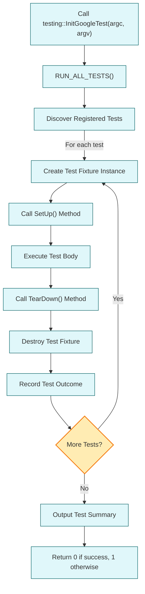

# Test Discovery & Execution Model

GoogleTest simplifies the process of testing C++ code by automatically discovering test cases, organizing them into suites, and managing their execution and reporting. This model revolves around well-defined macros, naming conventions, and lifecycle flows that take test definitions from source code all the way through to test results. Understanding this core test execution model empowers you to design, write, and structure tests that run efficiently and reliably.

---

## 1. Automatic Test Discovery

GoogleTest eliminates the need for manual test enumeration by automatically detecting tests based on macro usage and naming standards within your source files.

### How Tests Are Defined
- Tests are declared using the `TEST()` and `TEST_F()` macros.
- Each `TEST()` macro defines an independent test under a named *test suite*.
- The `TEST_F()` macro builds on test fixtures, allowing tests to share setup and teardown logic.

### Naming Conventions
- The first argument to these macros specifies the Test Suite name.
- The second argument specifies the Test name.
- Both names must follow valid C++ identifiers, avoiding underscores or special characters.

### What GoogleTest Does
- At compilation, macros register the tests with GoogleTest's internal registry.
- When `RUN_ALL_TESTS()` is called, GoogleTest queries this registry to know exactly which tests exist.

<Tip>
GoogleTest isolates each test by creating fresh fixture objects per test invocation, ensuring tests do not interfere with each other and can be run in any order.
</Tip>

## 2. Test Suite Management

Tests that relate logically are grouped into *test suites* (formerly known as test cases). This hierarchical grouping helps organize tests and share fixtures.

### Fixtures and Shared Setup
- A fixture class derives from `testing::Test`.
- Initialization is done using the `SetUp()` method; cleanup happens with `TearDown()`.
- Multiple `TEST_F()` tests use the same fixture class, running independently on fresh fixture instances.

### Benefits of Test Suites
- Grouping tests mirrors the structure of production code, improving maintainability.
- Suites allow selective running of groups of tests through test filtering.

## 3. Test Execution Lifecycle

Once tests are discovered, GoogleTest orchestrates their execution through a defined lifecycle to ensure comprehensive and proper test runs.

### Execution Flow
<Steps>
<Step title="Test Program Initialization">
Users initialize GoogleTest by calling `testing::InitGoogleTest(&argc, argv)` in `main()`. This configures test flags and parses command line options.
</Step>
<Step title="Running Tests">
Calling `RUN_ALL_TESTS()` triggers GoogleTest to run every registered test.
</Step>
<Step title="Test Setup">
Before each test, GoogleTest:
- Constructs a fresh test fixture instance.
- Invokes `SetUp()` on the fixture.
</Step>
<Step title="Test Execution">
The test body itself runs, executing assertions and test code.
</Step>
<Step title="Test Tear-Down">
GoogleTest calls the fixture’s `TearDown()` to release resources.
Then it destructs the test fixture.
</Step>
<Step title="Test Result Recording">
GoogleTest records the outcome (success, nonfatal failures, fatal failures) of each test.
</Step>
<Step title="Iteration Completion">
The process repeats for every registered test.
</Step>
<Step title="Final Reporting">
After all tests complete, GoogleTest summarizes test results.
`RUN_ALL_TESTS()` returns 0 on success or 1 if any test failed.
</Step>
</Steps>

### Handling Failures
- **Fatal Failures:** Abort the current test immediately.
- **Nonfatal Failures:** Report failure and continue test execution.

### Test Filtering
CLI flags like `--gtest_filter` enable running specific subsets of tests (by suite, name, or patterns).

<Tip>
Always check the return code of `RUN_ALL_TESTS()` in your `main()` to detect overall test success or failure.
</Tip>

## 4. Reporting and Output

GoogleTest reports test results clearly, displaying information about passed tests, failures with details, and summaries.

### Output Formats
- Tests print to standard output with details like the file and line of failed assertions.
- Options exist to output results in XML for CI system integration.

### Failure Information
- Each failure includes:
  - Test suite and test name
  - Source file and line number
  - Custom failure messages provided by the test

## 5. Mental Model for Designing Tests

Understanding how tests are discovered and executed helps you write better tests:

### Design with Isolation
Tests are run independently, so avoid shared mutable state unless explicitly handled.

### Use Fixtures for Repeated Setup
For grouping tests that require common setup, define a fixture class rather than duplicating code.

### Meaningful Names
Name test suites and tests to clearly reflect the feature or behavior under test.

### Apply Test Filters
Run tests selectively during development using filters, speeding up debugging.

### Expect Single Responsibility
Each test should verify a specific behavior or scenario.

<Tip>
Avoid side effects between tests. Use fresh fixtures and prefer `ASSERT_*` when further testing does not make sense after failure.
</Tip>

## 6. Additional Notes on GoogleMock Integration

Since GoogleMock is bundled with GoogleTest, mock tests participate fully in the discovery and execution lifecycle.

- Mock test classes use the same macros (`TEST_F()`, etc.) and run during `RUN_ALL_TESTS()`.
- Expectations and mock behaviors defined in setup or tests are verified automatically as part of the flow.

## 7. Troubleshooting Common Issues

### Tests Not Discovered or Running
- Verify use of GoogleTest macros (`TEST()`, `TEST_F()`), not plain functions.
- Confirm naming conventions are followed.
- Check that test files are linked into the test binary.

### Tests Running Unexpectedly or Excessively
- Use filters to narrow tests.
- Avoid duplicate test registrations.

### Setup / Teardown Not Running
- Use correctly spelled `SetUp()` and `TearDown()` methods.
- Derive fixture classes from `testing::Test`.

### Handling Fatal Failures
- Use `ASSERT_*` only when continuing test logic makes no sense.
- Otherwise prefer `EXPECT_*` to report multiple issues.

## 8. Visualizing the Test Discovery & Execution Flow

---

## Summary
This page details how GoogleTest automatically discovers test cases defined via macros and conventions, organizes them into suites with optional fixtures, runs each test with fresh setup/teardown handling, and reports outcomes clearly. The essence of the test discovery and execution model ensures your tests are isolated, repeatable, and easy to scale. By mastering this mental model, you will design robust, maintainable test suites that efficiently verify your code.

For advanced usage and integration, such as mocking behaviors using GoogleMock or running parameterized tests, refer to related concept pages and guides within the documentation.

---

## Recommended Next Steps
- [GoogleTest Primer](primer.md) — Learn how to write simple tests and understand foundational concepts.
- [Mocking & Mock Object Fundamentals](concepts/core-architecture/mocking-concepts) — Extend your tests with mocks.
- [Test Macros and Fixtures](api-reference/core-testing-api/test-macros-and-fixtures) — Deep dive into test definitions and fixture usage.
- [Running Your Tests](getting-started/first-test-run/run-tests) — Practical guidance to execute and filter tests.

---

## References
- [GoogleTest User's Guide](docs/index.md)
- [gMock for Dummies](https://google.github.io/googletest/gmock_for_dummies.html)
- [GoogleTest FAQ](docs/faq.md)

---

## Quick Tips
- Always return the value of `RUN_ALL_TESTS()` in your `main` function.
- Use fixtures to share setup for related tests but remember each test runs on a fresh fixture instance.
- Utilize test filters for efficient debugging.
- Write clear, descriptive test and suite names to ease test maintenance.
- Check failure messages and line numbers to quickly locate issues during test failures.

