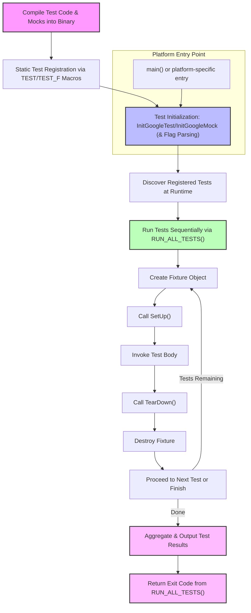

# Test Discovery and Execution Flow

GoogleTest and GoogleMock employ an automatic and seamless workflow to discover, execute, and report on tests within your compiled test binaries. This guide walks you through the lifecycle of test discovery and execution — from binary compilation to result reporting — highlighting extension points such as platform-specific hooks and custom main routines.

---

## Overview of the Test Execution Workflow

When you build and run tests with GoogleTest and GoogleMock, the framework manages the entire process from detecting available tests to executing them in isolation and reporting outcomes. This automation frees you from manual test enumeration and orchestrates a robust and extensible testing lifecycle.

### Key Stages in the Workflow

1. **Compilation of Test Binaries:**
   Your test code, including tests, fixtures, mocks, and main entry points, is compiled into executable binaries. These binaries contain all discovered tests via macros like `TEST()` and `TEST_F()` that register themselves statically during compilation.

2. **Test Discovery:**
   At runtime, GoogleTest automatically discovers all registered tests. This is enabled by internal global registries that track tests defined across compilation units. This discovery occurs transparently when the test binary starts.

3. **Initialization via `InitGoogleTest` / `InitGoogleMock`:**
   Before running tests, you invoke `testing::InitGoogleTest(&argc, argv)` or `testing::InitGoogleMock(&argc, argv)` to perform initialization. This includes:
   - Parsing testing-specific command-line arguments.
   - Configuring environment variables and flags.
   - Setting up internal state for test running and output formatting.

4. **Test Execution via `RUN_ALL_TESTS()`:**
   Calling `RUN_ALL_TESTS()` triggers the framework to run every registered test sequentially. For each test:
   - A fresh test fixture is created and set up.
   - The test body is invoked.
   - Teardown routines run.
   - Results (success, failure, fatal/nonfatal, etc.) are recorded.

5. **Result Reporting:**
   After all tests run, the framework outputs a comprehensive report, including passed tests, failed tests with failure details, execution timings, and summary statistics.

6. **Exit Code:**
   Your test binary’s `main()` function returns the result of `RUN_ALL_TESTS()`, which is `0` on success and non-zero on failure, enabling integration with CI systems.

---

## Detailed Workflow

### 1. Compilation & Test Registration

- Using GoogleTest macros such as `TEST()` or `TEST_F()`, tests automatically register themselves into the framework’s internal data structures.
- Similarly, mock definitions in GoogleMock leverage macros and that register expectations and behaviors.

### 2. `main()` Function and Initialization

- **Default Main Implementations:**
  -`gtest_main` and `gmock_main` libraries provide an off-the-shelf `main()` function for running tests.
  - `gmock_main.cc` shows the default: it calls `testing::InitGoogleMock(&argc, argv)`, then `RUN_ALL_TESTS()`, handling platform nuances.

- **Platform-Specific Hooks:**
  - On constrained platforms like Arduino (ESP8266, ESP32, NRF52), the entry points shift to `setup()` and `loop()`, where `InitGoogleTest()` or `InitGoogleMock()` are invoked and tests run repeatedly via `RUN_ALL_TESTS()`.

- **Command-Line Parsing:**
  - During initialization, GoogleMock and GoogleTest parse and remove their own flags (e.g., `--gmock_verbose=info`) from `argv`, so user-defined flags remain intact.

### 3. Test Discovery Mechanism

- Tests registered at compile-time are stored in global registries.
- When initialized, GoogleTest introspects these to build an internal test list.
- This discovery supports parameterized tests, typed tests, and fixtures transparently.

### 4. Running Tests

- `RUN_ALL_TESTS()` executes all tests sequentially in the order discovered.
- For each test:
  - A new fixture object is created.
  - `SetUp()` is invoked.
  - The test body runs.
  - `TearDown()` is called.
  - Fixture memory is reclaimed.

- Fatal failures abort the current test only, continuing with others.
- Non-fatal failures are recorded but allow tests to proceed.

### 5. Reporting Results

- After all tests complete, GoogleTest produces detailed console output.
- Information includes test case names, test names, counts of passed/failed tests, and summaries.
- Integration with XML output and other formats is possible via flags and listeners.

### 6. Exit and Cleanup

- The return code from `RUN_ALL_TESTS()` indicates success or failure.
- Global test environments and resources are torn down appropriately.

---

## Customization and Extension Points

GoogleTest and GoogleMock allow users to adapt the test discovery and execution flow to specific needs:

### Custom `main()` Functions

While most users rely on provided `gtest_main` or `gmock_main` libraries, you may:
- Write your own `main()` to perform extra setup or teardown.
- Call `InitGoogleTest()` or `InitGoogleMock()` explicitly with command-line arguments.
- Control the invocation of `RUN_ALL_TESTS()` carefully to fit advanced workflows.

### Platform-Adapted Entry Points

For platforms lacking a standard `main()`, such as embedded environments:
- Use platform-specific hooks like `setup()` and `loop()` to initialize and run tests respectively.
- `gmock_main.cc` demonstrates this for ESP8266, ESP32, and NRF52 under Arduino.

### Command-Line Argument Handling

- GoogleMock filters out known flags starting with `--gmock_` to manage its verbosity and behavior.
- Unrecognized flags are passed on, enabling coexistence with other tools.

### Global Test Environments

- Before tests run, users can add global environments for setup and teardown.
- This extension point enables customization of the test environment.

---

## Practical Tips

- **Use Provided `gmock_main` When Possible:**
Link against `gmock_main` to avoid writing your own entry point.

- **Always Call Initialization Before Running Tests:**
Failing to call `InitGoogleTest()` or `InitGoogleMock()` can lead to flags not being parsed and tests not running correctly.

- **Return `RUN_ALL_TESTS()` From `main()`:**
Make sure your program’s main returns the result so CI systems detect failures.

- **For Embedded Environments, Follow Platform Pattern:**
Use the Arduino-style `setup()` and `loop()` as in `gmock_main.cc` to integrate properly.

- **Pass Command-Line Arguments Intact:**
Unless you have a reason, avoid modifying argc/argv before passing to `InitGoogleTest` to ensure proper flag parsing.

- **Avoid Calling `RUN_ALL_TESTS()` Multiple Times:**
This is unsupported and can cause incorrect results or undefined behavior.

---

## Example: Typical `main()` Using GoogleMock

```c++
#include "gmock/gmock.h"

int main(int argc, char** argv) {
  testing::InitGoogleMock(&argc, argv);
  return RUN_ALL_TESTS();
}
```

This function will automatically discover all registered tests, parse flags, execute tests, and return an appropriate exit code.

---

## Diagram: Test Discovery and Execution Flow



---

## Troubleshooting Common Issues

### Tests Are Not Discovered or Run

- Confirm that your tests are registered via `TEST()`, `TEST_F()`, or `TEST_P()`. Tests defined dynamically or in separate compilation units may not be linked correctly.
- Ensure you call `testing::InitGoogleTest()` or `testing::InitGoogleMock()` before `RUN_ALL_TESTS()`.
- Check that your binary links with `gtest_main` or `gmock_main` or includes a proper `main()`.

### Command-Line Flags Seem Ignored

- Verify that you pass `argc` and `argv` pointers to `InitGoogleTest()`/`InitGoogleMock()`.
- Make sure your test binary isn't swallowing or modifying the command-line arguments before initialization.

### Weird Behavior on Embedded or Unsupported Platforms

- Use platform-specific hooks as demonstrated in `gmock_main.cc` for ESP8266 / ESP32 / NRF52.
- Confirm your environment matches the platform macros used in the framework.

---

## Additional Resources

- [GoogleTest Primer](https://github.com/google/googletest/blob/main/docs/primer.md) for fundamentals of tests and fixtures.
- [GoogleMock README](https://github.com/google/googletest/blob/main/googlemock/README.md) for an overview of mocking capabilities.
- [Integration Points](https://github.com/google/googletest/blob/main/overview/integration-platforms/integration-points.mdx) for build and CI integration.
- [Test Framework Fundamentals](https://github.com/google/googletest/blob/main/concepts/core-architecture/test-framework-overview.mdx) for architectural context.
- Source file [gmock_main.cc](https://github.com/google/googletest/blob/main/googlemock/src/gmock_main.cc) for reference implementation of the main entry.

---

With this understanding of the test discovery and execution flow, you can confidently set up your GoogleTest and GoogleMock test environments, customize your entry points where needed, and diagnose any issues that arise during test runs. The framework’s automation of discovery, execution, and reporting ensures a reliable foundation for your continuous integration and quality assurance workflows.
