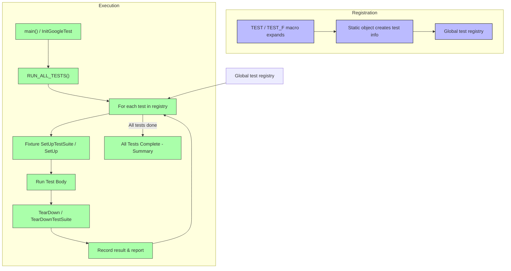

# Test Discovery & Execution Flow

Understanding how GoogleTest automatically discovers and executes tests is key to leveraging its full potential. This guide walks you through the journey of a test from definition to execution, explaining key phases like registration, running, setup and teardown, and reporting. You will learn how tests are organized and run, how the framework hooks into main entry points, and what happens under the hood to provide accurate test outcomes.

---

## 1. Test Registration and Discovery

GoogleTest automates finding and registering tests without requiring users to manually list them. When you define a test with macros like `TEST` or `TEST_F`, GoogleTest internally registers that test in a global registry.

- **Test Suites and Test Cases**: Tests are grouped into test suites (named by the user) which helps logical grouping and selective running.
- **Static Registration**: Registration occurs statically before main execution, using static variables initialized by test macros.
- **Discovery Mechanism**: The test runner queries this registry to enumerate all available tests.

**Example:**

```cpp
TEST(MathTests, Addition) {
  EXPECT_EQ(1 + 1, 2);
}
```

This macro registers a test named `Addition` in the test suite `MathTests`.


## 2. Main Entry Points for Running Tests

GoogleTest provides default implementations of `main()` which initialize the framework and invoke the test runner. Alternatively, users can write custom entry points if needed.

- **Default Main Usage:** Including `gtest_main` in your build enables linking against a pre-defined main that calls `RUN_ALL_TESTS()` after initialization.
- **Custom Main:** Users can call `::testing::InitGoogleTest(&argc, argv);` manually before running tests, which also integrates command line flag parsing.

### Typical Default Main Function Flow:
```cpp
int main(int argc, char **argv) {
  ::testing::InitGoogleTest(&argc, argv);
  return RUN_ALL_TESTS();
}
```


## 3. Test Execution Lifecycle

Once tests are discovered, the framework executes them according to the following user-centric flow:

### a) Setup Phase
- If the test uses fixtures (`TEST_F`), the framework runs `SetUpTestSuite()` once per suite (if defined), followed by `SetUp()` before each test.

### b) Test Body Invocation
- The test body runs. Within it, assertions and expectations validate your code’s correctness.

### c) Teardown Phase
- `TearDown()` is called after each test.
- If defined, `TearDownTestSuite()` runs once after all tests in the suite have finished.

### d) Reporting
- Successes and failures are recorded.
- After all tests, GoogleTest generates a detailed summary report highlighting passes, failures, and runtime metrics.


## 4. Test Runner Operation

The central test runner drives the execution by:

- Accessing the test registry to collect tests.
- Respecting filters from command line flags to run subsets.
- Running tests sequentially or in parallel (as configured).
- Supporting event listeners to customize reporting or test flow.


## 5. Handling Failures and Assertions

During test execution:

- GoogleTest monitors assertion results.
- Failures may abort test body execution depending on assertion types (fatal vs nonfatal).
- The framework aggregates failure causes for final reporting.


## 6. Internals of Registration and Execution Flow

While the user ideally needs not care about internal implementation, understanding the flow helps troubleshoot:

- Each `TEST` macro expands to static construction of a test info object.
- The global registry maintains all test suite and test case metadata.
- `RUN_ALL_TESTS()` iterates through this registry invoking individual test runners.




## 7. Selective Test Execution

Users can filter which tests to run using command-line flags:

- `--gtest_filter=TestSuiteName.TestName`
- Supports glob-style wildcards, e.g. `--gtest_filter=MathTests.*`

This allows running focused tests quickly without running the entire suite.


## 8. Setup and Teardown Scenarios

GoogleTest supports:

- Per-test setup/teardown (`SetUp()`, `TearDown()` in fixtures).
- Per-suite setup/teardown (`SetUpTestSuite()`, `TearDownTestSuite()`).
- Global environment setup via `::testing::Environment` subclass.

This lets users prepare and clean environment efficiently.


## 9. Reporting and Result Output

After test execution, GoogleTest:

- Prints human-readable summaries of runs, successes, failures.
- Provides detailed failure messages with stack traces and locations.
- Supports output in XML for integration with CI and dashboards.


## 10. Troubleshooting Common Flow Issues

- Ensure tests register by including the proper macros (`TEST`, `TEST_F`).
- Verify `InitGoogleTest()` is called before running tests.
- Check filters that might exclude all tests unintentionally.
- Use verbose flags (`--gtest_verbose`) for detailed diagnostics.


## Summary

Understanding the test discovery and execution flow helps you ensure your tests are registered, run, and reported correctly with GoogleTest. This knowledge empowers you to write better tests, know how to invoke and filter them, and interpret outcomes efficiently.


---

## Related Documentation

- [Test Definitions and Execution](https://github.com/google/googletest/blob/main/docs/api-reference/core-api/test-definitions.mdx)
- [Main Functions and Initialization](https://github.com/google/googletest/blob/main/docs/api-reference/integration-advanced/main-entry-points.mdx)
- [Writing & Running Your First Test](https://github.com/google/googletest/blob/main/docs/guides/writing-tests/getting-started-basic-tests.mdx)
- [Running and Configuring Tests](https://github.com/google/googletest/blob/main/docs/guides/writing-tests/running-and-configuring-tests.mdx)


---

## Practical Tips

- Always call `::testing::InitGoogleTest(&argc, argv);` before running tests if you choose custom `main()`.
- Use test filters to speed up your test cycle.
- Employ fixtures to manage setup and teardown cleanly.
- Take advantage of GoogleTest event listeners to integrate with external CI systems or logs.


---

This page is part of the [Core Architecture & Workflow](https://github.com/google/googletest/tree/main/docs/concepts/core-architecture) concepts section and complements the guides on [Test Case and Suite Structure](https://github.com/google/googletest/blob/main/docs/concepts/core-architecture/test-case-structure.mdx) and [Assertion and Failure Model](https://github.com/google/googletest/blob/main/docs/concepts/core-architecture/test-assertion-model.mdx).