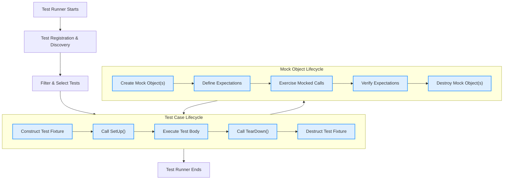

# Test and Mock Lifecycle

Explore the lifecycle of test cases, test fixtures, and mock objects within GoogleTest and GoogleMock. This page helps you understand how test and mock objects are constructed, initialized, discovered by the test runner, executed, and cleaned up — ensuring your tests are robust, isolated, and maintainable.

---

## Overview of Lifecycle Concepts

In GoogleTest and GoogleMock, managing the lifecycle of tests and mocks is fundamental to reliable automated testing. Each test case and mock object undergoes a well-defined sequence of creation, execution, and destruction. This management guarantees test isolation and proper resource handling.

Key lifecycle entities include:

- **Test Case and Test Fixture Objects**: Representations of tests and shared state.
- **Mock Objects**: Objects with behavior configured to simulate dependencies.
- **Test Runner**: The engine that discovers and executes tests.

Understanding the lifecycle empowers you to write clean tests, efficiently share resources, and avoid common pitfalls such as state leakage or unexpected interactions.

---

## Test Case and Fixture Object Lifecycle

GoogleTest employs a disciplined pattern for the lifetime of test fixtures, ensuring each test runs on a fresh environment:

1. **Object Construction**
   - For every test in a test suite, GoogleTest constructs a *new* instance of the test fixture class.
   - Construction typically runs the test fixture's default constructor.

2. **Setup**
   - Immediately after construction, `SetUp()` is called.
   - This is where you prepare t
he test environment, allocate resources, or initialize members.

3. **Test Execution**
   - The actual test code (`TEST_F` or `TEST_P`) runs on this fresh fixture instance.

4. **Teardown**
   - After test completion, `TearDown()` is called to release resources or undo setup.

5. **Object Destruction**
   - Finally, the fixture object is destructed and memory is freed.

This cycle repeats for each test, guaranteeing complete isolation between tests and preventing side effects from leaking across test boundaries.

<Note>
Because GoogleTest recreates fixture objects per test, **do not assume any stored state lasts between tests**. Use static members or `SetUpTestSuite()` / `TearDownTestSuite()` for shared test-suite resources.
</Note>

### Example

```cpp
class MyTest : public ::testing::Test {
 protected:
  MyTest() { /* Constructor called before each test */ }
  void SetUp() override { /* Prepare per-test environment */ }
  void TearDown() override { /* Clean up per-test environment */ }
  ~MyTest() override { /* Destructor called after each test */ }

  // Fixture members ...
};

TEST_F(MyTest, TestOne) {
  /* Test code here */
}

TEST_F(MyTest, TestTwo) {
  /* Separate test code, same pattern */
}
```

Each test runs independently with a new `MyTest` instance.

---

## Test Suite-Level Resource Management

Sometimes allocating or cleaning up resources on every test can be expensive or unnecessary. GoogleTest supports *test suite-level* setup and teardown to share resources across tests within the same suite:

- `static void SetUpTestSuite()` is called **once** before any test in the test suite runs.
- `static void TearDownTestSuite()` is called **once** after all tests in the suite have run.

Use these for:

- Opening shared database connections.
- Initializing expensive fixtures.

Remember:

- These must be **static** members of your fixture class.
- Tests still run on separate fixture instances.
- Order of test execution is undefined; tests must not depend on each other's side effects.

### Sample Usage

```cpp
class ExpensiveResourceTest : public ::testing::Test {
 protected:
  static void SetUpTestSuite() {
    shared_resource = new Resource();
  }

  static void TearDownTestSuite() {
    delete shared_resource;
    shared_resource = nullptr;
  }

  void SetUp() override {
    // Possible per-test initialization
  }

  static Resource* shared_resource;
};

Resource* ExpensiveResourceTest::shared_resource = nullptr;

TEST_F(ExpensiveResourceTest, TestOne) {
  ASSERT_TRUE(shared_resource->IsAvailable());
}
```

---

## Test Discovery and Registration

The GoogleTest framework automatically discovers tests and fixtures through macro expansions like `TEST()`, `TEST_F()`, `TEST_P()`, and typed test macros. 

The process involves:

- **Registration**: At program start (static initialization), all tests are registered in the framework's global test registry.
- **Filtering**: Before execution, user filters (`--gtest_filter`) select tests.
- **Execution Scheduling**: Tests are run in an order that respects dependencies like death tests running first.

Dynamic registration APIs (`RegisterTest()`) also allow programmatic registration if needed.

<Info>
Each registered test holds metadata including suite name, test name, source location, fixture class, and parameterization info.
</Info>

---

## Mock Object Lifecycle

Mocks in GoogleMock are test doubles created to simulate and verify interactions with dependencies.

Key points about mock lifecycle:

- **Creation**: Typically, mock objects are members of the test fixture or local variables within tests, and are constructed either during fixture construction or inside `SetUp()`.

- **Behavior Setup**: Expectations (`EXPECT_CALL`, `ON_CALL`) are defined on mock objects to specify the anticipated interactions.

- **Usage**: Subject code invokes methods on mock objects during test execution.

- **Verification**: GoogleMock automatically verifies expectations at the end of the test.

- **Destruction**: Mock objects are destroyed during fixture teardown or test end, cleaning up any allocated resources.

### Best Practices

- Declare mocks as members in fixture classes to reuse setup.
- Define expectations in the test body or `SetUp` as needed.
- Do not share mocks across tests unless carefully managing state.
- Use `NiceMock`, `NaggyMock`, or `StrictMock` to control uninteresting calls.

---

## Managing Setup and Teardown with Constructors and Virtual Methods

You may wonder whether to use fixture constructors/destructors or `SetUp()`/`TearDown()`.

Guidelines:

- **Prefer Constructors and Destructors** for simple initialization and cleanup that cannot fail or generate test failures.
- **Use `SetUp()` and `TearDown()` for code that:
  - Needs to handle failures gracefully (e.g., assertion failures).
  - Requires virtual dispatch (overridable in derived fixtures).
  - Must avoid exceptions in destructors or constructors.

GoogleTest creates a brand-new fixture object for each test, so constructors and destructors are called frequently — keep them efficient.

<Warning>
Avoid using fatal GoogleTest assertions inside constructors and destructors. Instead, use `SetUp()` and `TearDown()`.
</Warning>

---

## Advanced Lifecycle Considerations

### Death Tests

Tests that expect your program to terminate fall under death tests and require special handling:

- Typically run in a separate process.
- Must not rely on side effects to persist to parent process.
- Are run before other tests (suites named `*DeathTest` run first).

### Parameterized Tests

- Parameterized fixture instances are created with different parameters, each following the same lifecycle pattern.
- Per-parameter data setup and cleanup happens within fixture lifecycle.

### Typed and Type-Parameterized Tests

- Typed fixtures instantiate once per type.
- Lifecycle is similar but constructed per test, per type.

---

## Troubleshooting Common Lifecycle Problems

- **Tests sharing state** between instances: Avoid global variables; use static members or external shared resources carefully.
- **Test fixtures not running `SetUp()` or `TearDown()`**: Check that the method names are spelled correctly (`SetUp()`, not `Setup()`), and that they override the base class properly.
- **Mocks unexpectedly retained between tests**: Confirm mocks are destroyed with fixture and not shared accidentally.
- **Skipping tests unexpectedly**: May be due to calls to `GTEST_SKIP()` in setup or test body.

---

## Summary

The lifecycle of tests and mocks in GoogleTest/GoogleMock is carefully managed to ensure test isolation, reliable execution, and resource cleanliness. Every test runs with a fresh fixture object; shared environments are managed at the test suite or global level. Mock objects follow a similar lifecycle tied to the fixture. Mastering these lifecycle concepts enables writing robust and maintainable tests.

---

## See Also

- [Basic Configuration and Setup](../getting-started/setup-usage-validation/basic-configuration.md)
- [Test Discovery and Execution](../api-reference/gtest-core-apis/test-discovery-execution.md)
- [Test Fixtures Overview](../overview/core_concepts_and_architecture/key_concepts_and_terminology.md#test-fixtures)
- [Using Assertions and Matchers](../guides/core-testing-workflows/using-assertions-and-matchers.md)
- [Test Doubles with GoogleMock](../guides/core-testing-workflows/test-doubles-with-googlemock.md)
- [GoogleMock Mocking API](../api-reference/gmock-apis/mocking-api.md)

---

## References

- GoogleTest Primer: https://google.github.io/googletest/primer.html
- GoogleMock for Dummies: https://google.github.io/googletest/gmock_for_dummies.html
- GoogleTest FAQ: https://google.github.io/googletest/faq.html

---

## Diagram: Test and Mock Lifecycle Overview


