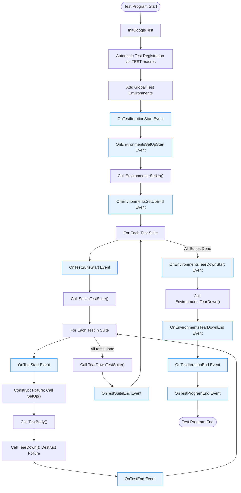

# Test Discovery & Execution Lifecycle

Understanding how GoogleTest automatically discovers, registers, and executes tests is fundamental to mastering the framework and effectively designing your test suites. This page covers the lifecycle of tests from discovery through execution, detailing how test fixtures, suites, environments, and results integrate seamlessly.

---

## Overview of Test Discovery

GoogleTest supports automatic discovery of tests through macros such as `TEST`, `TEST_F`, and `TEST_P`. When you write tests using these macros, the framework internally registers each test with a global registry before any tests are run. This automatic registration removes the need for developers to manually enumerate tests.

Each test is grouped into a *test suite* (previously called a *test case*), which is either implicitly or explicitly defined by your test fixture or test macro usage. Within a suite, individual `TestInfo` instances represent each test.

### Test Macros and Registration

- `TEST(TestSuiteName, TestName)`: Defines a simple test in a named suite.
- `TEST_F(TestFixtureName, TestName)`: Defines a test that uses a fixture class providing setup and teardown and shared data.
- `TEST_P(TestFixtureName, TestName)`: Defines a parameterized test, requiring instantiation via `INSTANTIATE_TEST_SUITE_P`.

Each test macro usage is backed by a dynamic registration facilitated by `RegisterTest`. This mechanism creates test objects and maintains their metadata, including source location, parameters (if any), and associated fixture type.

The following snippet illustrates dynamic test registration:

```cpp
template <typename Factory>
TestInfo* RegisterTest(const char* test_suite_name, const char* test_name,
                       const char* type_param, const char* value_param,
                       const char* file, int line, Factory factory);
```

This method ensures that your test is registered and linked to its fixture and suite before execution.


## Test Initialization and Execution Flow

GoogleTest coordinates a structured lifecycle to run all registered tests:

1. **Global Environment Setup**
   - Registered global environments (`::testing::Environment`) are set up via their `SetUp()` methods.
   - Environments provide resource initialization and cleanup boundaries across multiple suites.

2. **Test Suite Setup**
   - For each suite with eligible tests, `SetUpTestSuite()` is called before any tests in the suite run.
   - This prepares shared resources across tests within the suite.

3. **Test Fixture Setup and Test Execution**
   - For each individual test:
     - A fresh test fixture object is constructed.
     - `SetUp()` is called on the fixture to prepare the per-test environment.
     - The test body (`TestBody()`) executes the test logic.
     - `TearDown()` is called to clean up after the test.
     - The fixture object is destructed.
   
4. **Test Suite Tear-Down**
   - After all tests in a suite execute, `TearDownTestSuite()` is called.

5. **Global Environment Tear-Down**
   - Registered environments have their `TearDown()` called, in reverse order of setup.

6. **Result Aggregation**
   - Test outcomes are recorded as `TestResult` instances associated with each `TestInfo`.
   - Suite-level aggregated results reflect overall passing/failing.
   - The global `UnitTest` singleton collates comprehensive results.


## Test Fixtures, Suites, and Environments Integration

### Test Fixtures

Fixtures (`testing::Test` subclasses) are the recommended way to share and reuse data or resources among multiple related tests. Each test in a fixture gets a fresh instance, ensuring isolation and independence.

Fixtures can implement:

- `SetUpTestSuite()` / `TearDownTestSuite()` for suite-level resource management
- `SetUp()` / `TearDown()` for per-test resource management

### Test Suites

Test suites group multiple tests that share a common fixture or purpose. They allow for collective setup and teardown as well as aggregated reporting.

Suites provide methods to query:

- Number of tests (total, run, skipped, failed)
- Status (passed or failed)
- Duration and timestamps

### Environments

Global environments are instantiated before any tests run and torn down after all tests finish. You can define setup and teardown logic that is costly or external to the test suites, such as initializing databases or external services.

To create a global environment, subclass `testing::Environment`:

```cpp
class MyEnvironment : public testing::Environment {
 public:
  void SetUp() override {
    // global setup code
  }
  void TearDown() override {
    // global cleanup code
  }
};
```

Add it before `RUN_ALL_TESTS()`:

```cpp
testing::AddGlobalTestEnvironment(new MyEnvironment);
```


## Result Aggregation and Reporting

GoogleTest associates results at multiple levels:

- **TestPartResult:** Individual assertion outcomes.
- **TestResult:** Aggregates assertions within a single test.
- **TestInfo:** Metadata and result for individual tests.
- **TestSuite:** Aggregates results of all tests within.
- **UnitTest:** Aggregates across all suites in the test program.

Each layer offers access to:

- Counts of successes, failures, skips
- Timestamps and elapsed time
- Properties recorded by `RecordProperty()`
- Detailed failure messages and source locations

This model allows nuanced reporting, filtering, and handling of test results, including XML and JSON output generation.


## Event Listener Lifecycle Integration

GoogleTest exposes an event listener interface through `testing::TestEventListener` that hooks into the lifecycle:

- Program start/end
- Iteration start/end (if repeating tests)
- Environment setup/teardown
- Test suite start/end
- Test start/end
- Individual assertion results

Users can implement and register listeners to customize output or automate additional behavior during test execution.


## Bringing It All Together: User Test Execution Flow

To illustrate, here is an example typical user journey:

<Steps>
<Step title="Write Tests">
Use `TEST()`, `TEST_F()`, or `TEST_P()` macros to define tests with or without fixtures.
</Step>
<Step title="Register Global Environments">
If needed, register global `Environment` objects for setup/cleanup.
</Step>
<Step title="Initialize Framework">
Call `testing::InitGoogleTest(&argc, argv);` in your `main()` before running tests.
</Step>
<Step title="Run Tests">
Invoke `RUN_ALL_TESTS()` which triggers the discovery and execution lifecycle.
</Step>
<Step title="Inspect Results">
Examine console output, XML/JSON reports, or use reflection API (`UnitTest::GetInstance()`) programmatically.
</Step>
</Steps>


## Practical Tips

- **Unique Naming:** Avoid underscores in test suite and test names to prevent conflicts.
- **Test Isolation:** Do not rely on shared mutable state across tests; use fixtures or environments.
- **Fixture Lifetimes:** Understand that each test has its own fixture instance.
- **Parameterized Tests:** Use `TEST_P` and `INSTANTIATE_TEST_SUITE_P` to run test logic with different inputs.
- **Custom Setup:** Use `SetUpTestSuite` and global environments for costly initialization.
- **Event Listeners:** Extend with event listeners to customize logging and reporting.
- **Return Value:** Always return the result of `RUN_ALL_TESTS()` from `main()` to correctly indicate success.


## Troubleshooting

- If no tests run, ensure tests are properly registered with supported macros.
- Verify that fixture classes have default constructors if used with `TEST_F`.
- Watch for name collisions or underscores causing registration issues.
- Use `--gtest_list_tests` command-line flag to see discovered tests.
- If tests are skipped unexpectedly, check filters and shard settings.


## Lifecycle Mermaid Diagram



---

## See Also

- [Testing Reference: Test Macros & Registration](https://google.github.io/googletest/reference/testing.html)
- [GoogleTest Primer: Basic Concepts](https://google.github.io/googletest/primer.html#basic-concepts)
- [Advanced Topics: Value and Type-Parameterized Tests](https://google.github.io/googletest/advanced.html#value-parameterized-tests)
- [Global Setup and Tear-Down Guide](https://google.github.io/googletest/advanced.html#global-set-up-and-tear-down)
- [Test Event Listener API](https://google.github.io/googletest/reference/testing.html#TestEventListener)

---

Embracing this lifecycle will help you design clean, efficient, and well-structured tests utilizing GoogleTest's full capabilities.