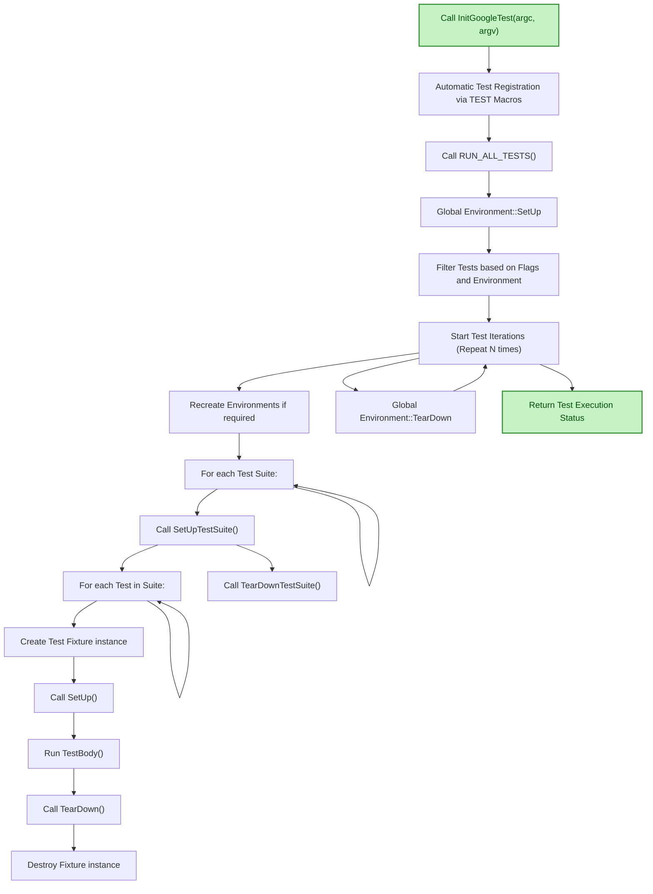

# Test Discovery and Execution Lifecycle

GoogleTest is designed to automatically discover and execute tests within your test program. This seamless flow frees you from manual test registration, enabling you to scale from simple single-test projects to highly complex test suites without any extra management overhead.

This guide explains how GoogleTest discovers tests, the role of registration macros and test suites, and how the test execution orchestration works internally to help you write effective and scalable test programs.

---

## How GoogleTest Discovers Tests

At the heart of GoogleTest’s power is its automatic test discovery mechanism. When you write tests using macros like `TEST()`, `TEST_F()`, or `TEST_P()`, you don’t need to manually register them. Instead, the macros cause your tests to be registered globally, in a way GoogleTest collects before any tests run.

The key points:

- **Registration Macros**: Each test macro expands to code that creates a `TestInfo` object describing the test.
- **Global Registry**: These `TestInfo` objects are automatically added to the singleton `UnitTest` instance.
- **Test Suites**: Related tests are grouped into test suites (`TestSuite`), identified by their suite name (e.g., `FactorialTest`).

This design eliminates boilerplate and human error from manual enumeration of tests. You simply write your tests anywhere in the linked code, and GoogleTest finds them all at runtime.

### Example: Defining Tests

```cpp
TEST(FactorialTest, HandlesZeroInput) {
  EXPECT_EQ(Factorial(0), 1);
}

TEST_F(MyFixture, DoesSomething) {
  EXPECT_TRUE(SomeFunction());
}
```

Each such test is registered immediately before `main()` is run. This registration uses internal macros and factory classes to record the test name, location, and fixture types.

## Registration Workflow and Core Macros

Under the hood, GoogleTest uses the following mechanisms:

- **`MakeAndRegisterTestInfo`:** This internal function creates a `TestInfo` instance for each test and registers it with the global `UnitTest` singleton.
- **Factories:** Invocation of factories creates fresh test fixture instances for running the test body.
- **Suite Setup/TearDown:** Suite-level setup and teardown callbacks (`SetUpTestSuite()` and `TearDownTestSuite()`) are associated per test fixture type.

The user-facing test macros implicitly call this registration, requiring no extra user action beyond writing test functions.

## Test Suites and Test Organization

Tests naturally group into **test suites** (previously called test cases). GoogleTest uses suites to:

- Collect logically related tests, often sharing common fixture code.
- Provide hooks for suite-level setup and teardown.
- Enable filtering at the suite level via command-line flags.

The suite name is the first parameter of `TEST()` or the fixture class name in `TEST_F()`.

## How Tests Are Executed

Once `RUN_ALL_TESTS()` is called (usually in `main()`), the GoogleTest framework:

1. **Initializes Environments:** Calls `SetUp()` on all registered global environments (defined by subclassing `::testing::Environment`).
2. **Filters Tests:** Using provided flags and environment variables, tests are filtered for execution.
3. **Runs Test Iterations:** Test programs can run multiple iterations depending on the `--gtest_repeat` flag. For each iteration:
   - Environments may be recreated based on `--gtest_recreate_environments_when_repeating`.
   - Test suites are iterated over—suite setup hooks are invoked once before any tests in the suite run.
   - Each test in the suite runs on its own fresh fixture instance:
     - Fixture is constructed.
     - `SetUp()` is called.
     - `TestBody()` runs (the test logic).
     - `TearDown()` is called.
     - Fixture is destructed.
   - Suite teardown hooks are called after all tests complete.
4. **Environments are torn down** after all iterations finish.
5. **Returns Status:** The overall test result is returned from `RUN_ALL_TESTS()`.

### Support for Parallelism and Sharding

GoogleTest supports advanced execution patterns, like sharding tests across multiple machines, via environment variables controlling which tests should run on which shard.

### Event Listeners

Throughout execution, GoogleTest fires event notifications (`OnTestStart()`, `OnTestEnd()`, etc.) to event listeners, allowing tools and custom reporters to track progress or modify output.

## Practical Guidance for Users

- Writing tests with macros like `TEST()`, `TEST_F()`, and `TEST_P()` automatically registers them and includes them in discovery.
- You do not need to manage test registration.
- Use `RUN_ALL_TESTS()` in `main()` after `InitGoogleTest()` to execute all registered tests.
- Use flags such as `--gtest_filter`, `--gtest_repeat`, and `--gtest_shuffle` to control execution scope, repetition, and order.
- Understand the lifecycle hooks `SetUpTestSuite()` and `TearDownTestSuite()` for managing shared resources.
- Add global environments via `AddGlobalTestEnvironment()` to perform setup/teardown for the whole test program.

---

## Visualization: GoogleTest Test Discovery and Execution Flow



---

## Troubleshooting Tips

- Ensure `InitGoogleTest()` is called before `RUN_ALL_TESTS()`; otherwise tests won't run.
- Avoid ignoring the return value of `RUN_ALL_TESTS()`, as it indicates overall success.
- When defining parameterized or typed tests, make sure instantiations are done to activate them.
- Use `--gtest_list_tests` to verify which tests are discovered.
- For flaky tests, use `--gtest_repeat` and `--gtest_shuffle` to detect order dependencies.

## Best Practices

- Leverage automatic discovery by writing tests using official macros.
- Use test suites and fixtures to group related tests and shared setups.
- Use global environments sparingly to initialize heavy resources.
- Control test filtering and execution order with command-line flags for iterative development.
- Extend test execution monitoring via event listeners if needing custom reporting or resource tracking.

---

This lifecycle and discovery architecture provides a scalable and user-friendly testing experience. By writing targeted tests and relying on automatic discovery and orchestration, you can focus on testing logic rather than test management.

## Related Documentation

- [Writing Your First Test](../getting-started/first-test-and-validation/writing-your-first-test.md) - How to write tests and use macros.
- [Running Tests](../getting-started/first-test-and-validation/running-tests.md) - Running and controlling test execution.
- [Global Setup and Tear-Down](../advanced.md#global-set-up-and-tear-down) - Managing environments.
- [Event Listener API](../advanced.md#extending-google-test-by-handling-test-events) - For custom test progress handling.
- [Parameterized and Typed Tests](../concepts/advanced-testing-patterns/parameterized-tests.md) - Advanced test definition and instantiation.
- [Feature Overview and System Architecture](../overview/architecture-features-integration/architecture-diagram.md) - Visual and conceptual overview.


