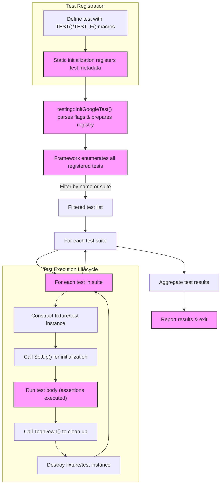

# Test Discovery and Lifecycle

GoogleTest is designed to simplify C++ testing by automating the discovery and management of tests throughout their lifecycle. This guide uncovers how GoogleTest automatically locates your test cases, organizes them into suites, controls their execution, and ensures an orderly flow from setup to teardown. Understanding this core mechanism allows you to write maintainable, effective tests that fit naturally within the xUnit testing framework pattern.

---

## Automatic Test Discovery

### How GoogleTest Finds Your Tests

GoogleTest eliminates manual test registration. Instead, tests defined using the `TEST()` and `TEST_F()` macros are automatically discovered at runtime thanks to internal registration mechanisms.

- When you write a test using `TEST(TestSuiteName, TestName)`, GoogleTest registers this test with the framework during static initialization.
- This registration includes metadata such as the test suite name, test name, and pointers to the test code.
- At runtime, GoogleTest queries this registry to build a full list of test suites and tests available to run.

### Benefits of Automatic Discovery

- You never need to enumerate tests or maintain a list manually.
- Tests scattered across multiple files and modules are aggregated seamlessly.
- The framework enables filtering of tests by name or suite via command-line flags.

<Info>
Tip: Use meaningful and consistent `TestSuiteName` and `TestName` identifiers. This improves test discovery by humans and tooling, and leverages GoogleTest’s filtering capabilities effectively.
</Info>

---

## Test Suites and Test Cases

### Understanding the Terminology

GoogleTest’s naming conventions have evolved but generally align with xUnit nomenclature:

- **Test Case** (legacy term) and **Test Suite** (preferred modern term) refer to a collection of related tests.
- A **Test** is an individual unit of verification that exercises some code path or function behavior.

Example:

```cpp
TEST(MathTest, HandlesZeroInput) {
  EXPECT_EQ(Factorial(0), 1);
}

TEST(MathTest, HandlesPositiveInput) {
  EXPECT_EQ(Factorial(1), 1);
  EXPECT_EQ(Factorial(2), 2);
}
```

The above defines two tests in the `MathTest` test suite.

### Structuring Tests with Fixtures

Use `TEST_F()` when multiple tests share the same setup and teardown logic:

```cpp
class QueueTest : public ::testing::Test {
 protected:
  void SetUp() override {
    // Initialize shared state
  }
  void TearDown() override {
    // Cleanup code
  }

  Queue<int> queue_;
};

TEST_F(QueueTest, IsEmptyInitially) {
  EXPECT_EQ(queue_.size(), 0);
}

TEST_F(QueueTest, EnqueueAddsElements) {
  queue_.Enqueue(5);
  EXPECT_EQ(queue_.size(), 1);
}
```

The test framework creates a fresh fixture instance for each test, ensuring isolation.

---

## Lifecycle of a Test

GoogleTest manages tests following an xUnit-inspired lifecycle, which you control through fixture classes.

1. **Construction:** Create a new instance of the test fixture or test class.
2. **Setup:** Execute `SetUp()` to prepare the environment.
3. **Test Body:** Run the user-defined test code.
4. **Teardown:** Execute `TearDown()` to release resources.
5. **Destruction:** Destroy the test fixture instance.

This lifecycle guarantees that tests do not interfere with each other, and resources are properly cleaned up.

<Steps>
<Step title="Test Fixture Setup">
The framework calls `SetUp()` to initialize state or dependencies before each test.
</Step>
<Step title="Test Execution">
Runs the body of your test that contains assertions and verification logic.
</Step>
<Step title="Test Fixture Teardown">
Calls `TearDown()` to clean up resources or reset state.
</Step>
</Steps>

---

## Organizing Comprehensive Test Coverage

### Group Related Tests

Tests should be grouped logically by behavior or component, using suites to reflect production code structure. This makes tests easier to understand, maintain, and run selectively.

### Use Setup and Fixtures to Share State

Use shared setup to avoid duplication and ensure consistent test initialization.

### Leverage Naming Conventions and Filtering

Name your tests clearly to allow running subsets via GoogleTest’s `--gtest_filter` flag. For example:

```bash
test_binary --gtest_filter=MathTest.*
```

Runs all tests in the `MathTest` suite.

### Run and Debug Tests Independently

GoogleTest allows isolating and debugging single tests, speeding development and reducing flakiness.

---

## Test Execution Flow

When running your tests, GoogleTest follows this user-centric flow:

1. **Initialization:** Calls `testing::InitGoogleTest()` to prepare the framework, parse command-line flags, and register test metadata.
2. **Test Enumeration:** Lists all discovered tests in suites, allowing filtering.
3. **Execution:** Each test suite and its tests run one-by-one with fixture setup and teardown.
4. **Result Aggregation:** Results from each test are collected.
5. **Reporting:** Presents human-readable summary output and optionally machine-readable reports (XML/JSON).

<Info>
GoogleTest handles failures gracefully by isolating test failures without aborting the entire test run.
</Info>

---

## How This Fits Into Your Testing Workflow

By understanding the discovery and lifecycle:

- You write tests without worrying about manual registration.
- You can confidently share fixtures knowing each test is isolated.
- You gain insight into how to group tests for clarity and effectiveness.
- You can leverage GoogleTest’s command-line flags to run targeted tests, speeding up development and debugging.

---

## Practical Tips and Common Pitfalls

- **Avoid Shared State Between Tests:** Each test runs with fresh fixtures; avoid static mutable state to keep tests independent.
- **Use `SetUp()` and `TearDown()` Wisely:** Only perform necessary initialization and cleanup here to maintain performance.
- **Filter Your Tests:** Use `--gtest_filter` to run only relevant tests during development.
- **Keep Test Names Descriptive:** Clearly name suites and tests to reflect their purpose.
- **Don’t Overload Tests:** One logical assertion per test results in better reporting.

---

## Diagram: GoogleTest Test Discovery and Lifecycle



---

## Troubleshooting and FAQs

<AccordionGroup title="Common Questions on Test Discovery and Lifecycle">
<Accordion title="Why aren’t my tests being discovered?">
Ensure that your tests use the `TEST()` or `TEST_F()` macros and that the test files are linked into the test executable. Also, confirm `testing::InitGoogleTest()` is called in your main program.
</Accordion>
<Accordion title="How does GoogleTest isolate tests?">
GoogleTest creates a new instance of the test fixture class for each test, running `SetUp()` and `TearDown()` around every test. This ensures no state leaks between tests.
</Accordion>
<Accordion title="Can I run a single test?">
Yes. Use the `--gtest_filter=TestSuiteName.TestName` flag to run a specific test, enabling faster iteration.
</Accordion>
<Accordion title="What if I want shared setup across multiple tests?">
Use test fixtures (`TEST_F()`) and initialize common resources in `SetUp()`. Remember that each test still receives a fresh fixture instance.
</Accordion>
</AccordionGroup>

---

## Summary

The Test Discovery and Lifecycle page reveals how GoogleTest automatically finds, registers, and executes your tests within a consistent lifecycle pattern. By using clear naming, fixtures, and test macros, GoogleTest empowers you to write reliable, maintainable C++ tests that run seamlessly across platforms with minimal setup overhead.

For more details, explore the Primer for writing tests, the Mocking Reference for using mocks, and the Test Suite Configuration guide for running selective tests.

---

## Related Resources

- [GoogleTest Primer: Writing Your First Test](https://google.github.io/googletest/primer.html)
- [Mocking Basics with GoogleMock](https://google.github.io/googletest/gmock_for_dummies.html)
- [Running and Configuring Tests](https://google.github.io/googletest/running_tests.html)
- [Test Case & Assertion API Reference](https://google.github.io/googletest/reference/assertions.html)

---

## Next Steps

- Write your first tests using `TEST()` and `TEST_F()`.
- Use fixtures to share common test state.
- Explore advanced test filtering and running strategies.
- Integrate mocking to test components in isolation.


<Source url="https://github.com/google/googletest" branch="main" paths={[{"path": "docs/primer.md", "range": "1-242"}, {"path": "docs/reference/mocking.md", "range": "1-330"}]} />
<Source url="https://github.com/google/googletest" branch="main" paths={[{"path": "googlemock/test/gmock_output_test_.cc", "range": "1-226"}]} />

